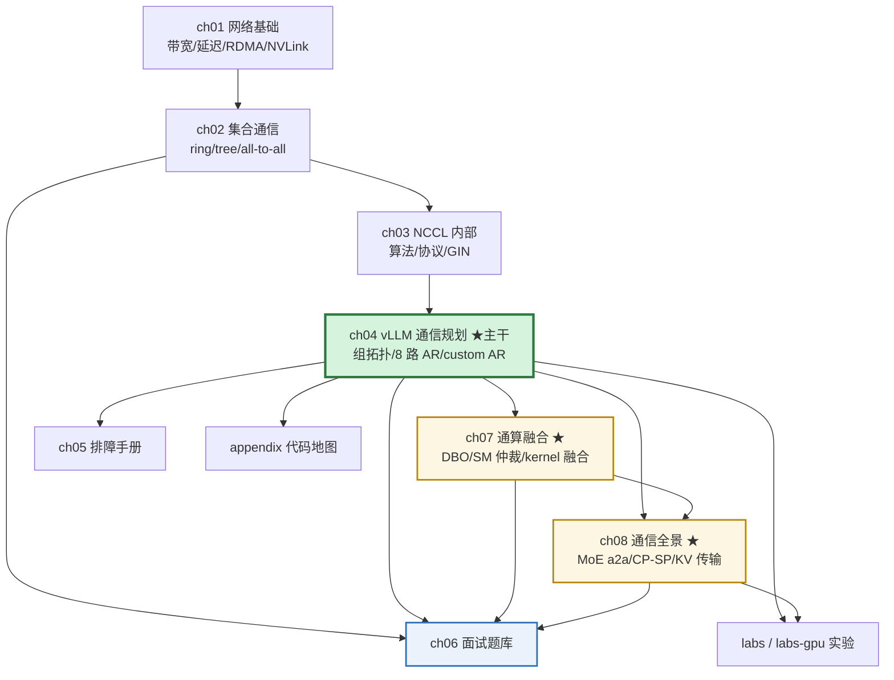
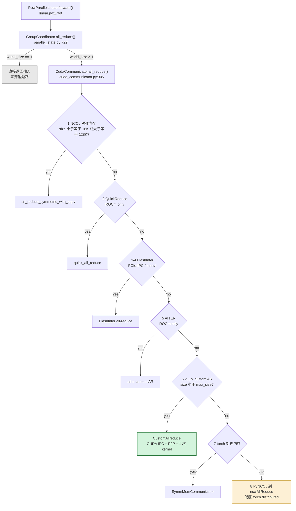

# 基本网络 + NCCL 在 AI Infra 的完整教学（校招等级）

> 用 **vLLM 源码里的真实实体** 讲透「网络 → 集合通信 → NCCL → vLLM 的通信规划 → 排障 → 面试」。
> 所有代码引用都写成 `文件路径:行号`，可以直接在仓库里跳过去核对。

---

## 0. 这份材料是什么

**目标读者**：准备 AI Infra / 推理框架 / 分布式系统方向校招面试的同学。
前置假设：会 Python，懂一点 PyTorch 的 `torch.distributed`，**不需要**网络或 HPC 背景。

**它解决的痛点**：网上讲 NCCL 的资料要么是 NVIDIA 官方文档（工程细节多、缺推理框架视角），
要么是分布式训练论文（算法多、缺工程落地）。而面试官真正问的是：

> 「TP=8 的时候通信到底走了什么？为什么 vLLM 不直接用 NCCL 的 all-reduce，要自己写一个 custom all-reduce？
> MoE 的 all-to-all 和 TP 的 all-reduce 有什么区别？NCCL 卡住了你怎么查？」

这份材料用 vLLM 这个**真实、可读、工业级**的代码库，把这些问题逐个钉死。

**核心方法论 —— 三层映射：**

| 层 | 关心什么 | 本材料对应章节 |
|---|---|---|
| 硬件/网络层 | 线、卡、协议：PCIe / NVLink / InfiniBand / RoCE | ch01 |
| 通信语义层 | 集合操作（all-reduce、all-to-all…）与算法复杂度 | ch02 |
| 库与框架层 | NCCL 怎么实现；vLLM 怎么选、怎么调、怎么绕开它 | ch03、ch04 |

面试的加分项几乎全是**跨层**的：能把「TP 每层两次 all-reduce」翻译成「每 token 每层 2×hidden×2 bytes
的环形流量」，再翻译成「所以 TP≥8 必须上 NVLink，跨机必须看 IB 带宽」，这才是 infra 岗要的人。

---

## 1. 文件导航

| 文件 | 内容 | 建议投入 |
|---|---|---|
| [`ch01-networking-basics.md`](ch01-networking-basics.md) | 网络基础：带宽/延迟、TCP vs RDMA、IB vs RoCE、NVLink/NVSwitch、GPUDirect、拓扑与带宽计算 | 4h |
| [`ch02-collectives.md`](ch02-collectives.md) | 集合通信语义 + 算法：ring/tree all-reduce、all-gather、reduce-scatter、all-to-all、α-β 模型、带宽公式推导 | 4h |
| [`ch03-nccl-internals.md`](ch03-nccl-internals.md) | NCCL 内部：channel、算法与协议选择、topology detection、SHARP、symmetric memory、GIN、常用环境变量 | 5h |
| [`ch04-vllm-distributed.md`](ch04-vllm-distributed.md) | **主干章节**：vLLM 的并行组拓扑、`GroupCoordinator`、pynccl、custom all-reduce、DP/EP 的 all-to-all、控制面、权重传输 | 8h |
| [`ch05-debugging-runbook.md`](ch05-debugging-runbook.md) | 排障手册：hang、NCCL error、带宽不达标、多网卡选错、P2P 失败 | 3h |
| [`ch06-interview-bank.md`](ch06-interview-bank.md) | 校招面试题库（**已扩充到 53 题**）：基础 / 进阶 / MoE / 通算融合 / 新维度 / 系统设计 / 追问链 / 易错点 | 8h |
| [`ch07-comm-compute-fusion.md`](ch07-comm-compute-fusion.md) | **通算融合**：依赖链分析、DBO 双线程 ping-pong、SM 仲裁、`previous_event`、CUDA Graph 适配、kernel 级融合、SP 的算子替换 | 6h |
| [`ch08-advanced-networking.md`](ch08-advanced-networking.md) | **通信全景**：MoE all-to-all 全拆解（wire format / 专家坐标系 / 量化约束）、CP/SP（DCP/PCP）、KV 传输与 PD 分离、权重同步、训练 vs 推理 | 8h |
| [`appendix-code-tour.md`](appendix-code-tour.md) | vLLM 网络相关代码地图 + 六条读数路径 + 环境变量索引 + 可迁移的设计模式 | 2h |
| [`appendix-single-gpu.md`](appendix-single-gpu.md) | **附录 E：网络之外的半壁江山** —— PagedAttention / FlashAttention / continuous batching / 量化 / 投机解码 / prefix caching / 指标体系 / OOM。**面推理框架岗必读** | 6h |
| [`labs.md`](labs.md) | 14 个概念实验：无 GPU / 单卡 / 多卡三档 | 4h |
| [`labs-gpu.md`](labs-gpu.md) | **★ 租机多卡实验手册**：按预算分档（2–4 卡 / 8 卡 / 跨机）、一键脚本、成本估算、避坑清单、结果模板 | 租机前必读 |
| [`cheatsheet.md`](cheatsheet.md) | **速查卡（打印版）**：单位换算、延迟量级、公式、8 路选择链、MoE/DBO/CP-SP 要点、反直觉事实清单 | 面试前 10 分钟 |

### 可执行脚本（都可直接跑）

| 脚本 | 用途 | 需要 |
|---|---|---|
| [`provision_rented_gpu.py`](provision_rented_gpu.py) | **上机第一件事**：硬件/版本自检 + 特性可用性对照 + 建议实验套餐 + 2 卡冒烟 | 无 |
| [`allreduce_bench.py`](allreduce_bench.py) | ★ 多卡 all-reduce 扫描（大小 × 算法 × 后端）→ CSV | torch + ≥2 卡 |
| [`verify_collectives.py`](verify_collectives.py) | 集合通信正确性验证 + 并行组拓扑打印 | torch + ≥2 卡 |
| [`run_labs.py`](run_labs.py) | ★ **一键跑套餐 + 汇总 SUMMARY.md + 打包拉走** | 无 |
| [`verify_citations.py`](verify_citations.py) | 校验 63 条精确定位的 `path:line`（自动定位 vLLM checkout） | 无 |
| [`check_ch06_citations.py`](check_ch06_citations.py) | 校验 ch06 的 200+ 条简写引用 | 无 |
| [`make_figures.py`](make_figures.py) | 生成量化图表（如 α-β 带宽曲线）到 `figures/` | 无 |
| [`check_diagrams.py`](check_diagrams.py) | **校验所有 mermaid 图能渲染**（防止 GitHub 上显示成错误框） | node + mermaid-cli |
| [`check_figures.py`](check_figures.py) | 校验 SVG 图的合法性（XML well-formed + 无元素跑出画布） | 无 |

### 图与表格的说明

本文档有 **16+ 张 mermaid 图 + 1 张量化 SVG 图**。它们都是**文本**（不是二进制图片），
所以可以 diff、可以改、不依赖外部图床：

| 图类型 | 用途 | 在哪 |
|---|---|---|
| `flowchart` | 决策链、架构关系 | README、ch01、ch03、ch04、ch05、ch08 |
| `sequenceDiagram` | 时序/交互（IPC 交换、DBO 接力、DCP 通信） | ch04、ch07、ch08 |
| `gantt` | 时间线重叠对比（DBO 的核心） | ch07 |
| SVG（`make_figures.py` 生成） | 量化曲线（α-β 带宽模型） | ch01 |

**渲染兼容性**：mermaid 在 GitHub、VS Code（装 Markdown Preview Mermaid 插件）、
Typora、Obsidian 里都能直接渲染。**如果你的阅读器不支持 mermaid**，
图会显示为代码块 —— 内容仍然可读，但建议换一个支持的工具。

**改了图之后记得验证**（否则可能得到一个渲染失败的框）：

```bash
npm install -g @mermaid-js/mermaid-cli     # 一次性
python check_diagrams.py                   # 校验全部 mermaid 图
python make_figures.py && python check_figures.py   # 重新生成并校验 SVG
```

**租机三步走**：

```bash
python provision_rented_gpu.py     # 1. 上机自检，知道能跑什么
python run_labs.py all             # 2. 跑（或 core / run a2 a5）
python run_labs.py collect         # 3. 汇总打包，拉回本地 —— 别忘了这步！
```


**最短路径（距面试 3 天）**：ch02 → ch03 → ch04 → ch08 → **附录 E** → ch06。
**完整路径**：按顺序读，每章末尾做「自检题」，不会的回头看。
**只有 2 小时**：README → ch02 §2.3 → ch04 §4.4 → ch06 第六部分（易错点）。
**只有 1 天**：**附录 E §E.1/E.3/E.7** → ch02 → ch04 §4.4/§4.6 → ch07 §7.2 → ch08 §8.1 → ch06。
**面推理框架岗（vLLM/SGLang 类）**：**附录 E 优先** → ch04 → ch08 §8.1 → ch06。
**面分布式/通信岗**：ch01 → ch02 → ch03 → ch04 → ch07 → ch06（附录 E 只需 §E.1 理解动机）。
**时间充裕 / 想拿强 offer**：全读，重点是**附录 E**、ch07 和 ch08 —— 这三块最能把你和别人区分开。

**各章的依赖关系**（哪章需要先读哪章）：



**如果时间不够，按这个顺序砍**（从最该砍的开始）：

```
可以先跳过 → ch05（排障手册，用到时再查）
           → appendix（当索引查，不必通读）
           → labs（没 GPU 就先跳过）
必须读     → ch02 §2.3、ch04 §4.4、ch06 第六部分（易错点）
最有价值   → ch07 §7.2（DBO）、ch08 §8.1（MoE a2a）—— 这两块最能把你和别人区分开
```


---

## 1.1 先验证材料的可信度（1 分钟）

本材料引用了大量 `文件:行号`。**代码会变，所以这个检查是必做的第一步**：

```bash
python net-nccl-tutorial/verify_citations.py
```

在写作时的 checkout 上，结果是：

```
63/63 exact, 0 moved, 0 unresolved
```

脚本会区分三种情况：`OK`（精确命中）、`MOVED`（符号在附近，报告新行号）、
`GONE`（找不到 —— 说明代码结构变了，需要你重新定位）。
**它是幂等的、只读的，可以随时重跑。**


---

## 2. 一张图先建立全局坐标系

```
        ┌─────────────────────────── 你写的模型代码 ───────────────────────────┐
        │  vllm/model_executor/layers/linear.py                                │
        │    RowParallelLinear.forward()  ── tensor_model_parallel_all_reduce() │
        └───────────────────────────────┬──────────────────────────────────────┘
                                        │  (Python 函数调用)
        ┌───────────────────────────────▼──────────────────────────────────────┐
        │  vllm/distributed/communication_op.py        ← 语义层：TP 的 all-reduce │
        │  vllm/distributed/parallel_state.py          ← 进程组拓扑 + 通信算子分发 │
        │    GroupCoordinator.all_reduce()                                      │
        └───────────────────────────────┬──────────────────────────────────────┘
                                        │
        ┌───────────────────────────────▼──────────────────────────────────────┐
        │  vllm/distributed/device_communicators/cuda_communicator.py           │
        │    CudaCommunicator.all_reduce()  ← 8 路后端选择（本材料的重点）        │
        └───┬─────────┬──────────┬──────────┬──────────┬───────────┬───────────┘
            │         │          │          │          │           │
     ┌──────▼──┐ ┌────▼────┐ ┌───▼────┐ ┌───▼─────┐ ┌──▼──────┐ ┌──▼────────┐
     │ pynccl  │ │ custom  │ │ quick  │ │ flashin │ │ symm_mem│ │ torch.dist│
     │ (NCCL   │ │ all-red │ │ all-red│ │ fer AR  │ │ (NCCL   │ │ fallback  │
     │  绑定)   │ │ (P2P)   │ │ (ROCm) │ │         │ │ 对称内存)│ │           │
     └────┬────┘ └────┬────┘ └───┬────┘ └────┬────┘ └────┬────┘ └─────┬─────┘
          │           │          │           │           │            │
          └───────────┴──────────┴───────────┴───────────┴────────────┘
                                        │
        ┌───────────────────────────────▼──────────────────────────────────────┐
        │  libnccl.so.2 / librccl.so.1        ← 本材料 ch03                     │
        │  NVLink / PCIe P2P / InfiniBand Verbs / RoCE / SHARP                 │
        └───────────────────────────────┬──────────────────────────────────────┘
                                        │
        ┌───────────────────────────────▼──────────────────────────────────────┐
        │  硬件：NVLink/NVSwitch、PCIe Switch、IB HCA、网线、交换机              │
        └──────────────────────────────────────────────────────────────────────┘
```

（图上每一层的文件名都会在 ch04 / appendix 里给出精确行号。）

### 2.1 最关键的一张图：一次 all-reduce 会走哪条路

上面是「静态分层」，这张是**运行时决策**，是 ch04 §4.4 的浓缩版：



**读这张图的三个要点**：

1. **决策依据是「输入张量的大小 / dtype / 硬件」** —— 这些在所有 rank 上结论相同，
   所以不会出现「部分 rank 走 A、部分走 B」的死锁（见 ch05 §5.0 的「三一致」）。
2. **custom AR（绿色）是 decode 的主力**，但有硬上限：
   H100 上 TP=8 只有 **256 KiB**，超了就回退 NCCL。
3. **NCCL 是兜底而不是首选** —— 这和「vLLM 就是调 NCCL」的直觉相反，
   正是这份材料想纠正的认知之一。

> ⚠️ 启动日志打印的后端顺序**不是**这个优先级
> （`_log_all_reduce_backend_selection` 自己声明了只是「可能的子集」）。
> **以代码为准，不以日志为准。**

---

## 3. 关于本材料中的代码引用

- 基线：本仓库 checkout（`git log -1` 见下），路径均相对仓库根目录。
- 引用格式：`` `vllm/distributed/parallel_state.py:1911` `` 表示该文件的第 1911 行。
- vLLM 迭代很快，**行号会漂移，符号名（函数/类）相对稳定**。核对时优先用符号名搜索：

```powershell
# Windows PowerShell
Select-String -Path vllm/distributed/parallel_state.py -Pattern 'def initialize_model_parallel'
```

```bash
# Linux/macOS
grep -n "def initialize_model_parallel" vllm/distributed/parallel_state.py
```

- 只讲**事实**：凡是「vLLM 实际上是这样做的」，都能给出行号；凡是「面试常考但我没在代码里验证」的，
  会明确标注为「经验/常识」。

### 3.1 租机/换版本前先对齐行号

本教程的引用基于**写作时的一个 vLLM checkout**。换了版本后第一件事是校验：

```bash
python verify_citations.py     # 63/63 才说明行号对得上
```

| 结果 | 含义 | 怎么办 |
|---|---|---|
| 全部 `OK` | 行号对得上 | 直接按教程跳转 |
| 有 `MOVED` | 符号还在，位置变了 | 脚本会给出**新行号**，按新行号看 |
| 有 `GONE` | 该处结构改动较大 | 用**符号名**搜索（脚本末尾会提示命令）；教程的结论通常仍成立，但行号不能直接信 |

**建议**：要么租机时装和教程接近的 vLLM 版本，要么就用教程的结论去解释你
**在新版本上**测到的现象 —— **后者其实更有价值**（面试里可以说「我在 x.y 上复现了教程说的现象，
但发现 z 变了」）。

---

## 4. 需求覆盖对照（这份材料是否讲全了）

| 原始需求 | 落在哪里 | 具体内容 |
|---|---|---|
| **基本网络** | ch01 | 带宽/延迟/口径换算、α-β 模型、延迟量级表、OSI 定位、PCIe + P2P、NVLink/NVSwitch/NVL72、IB 代际与无损网络、RoCE/PFC/ECN、GPUDirect RDMA、`nvidia-smi topo -m` 解读、拓扑图 |
| **NCCL 在 AI Infra** | ch02 + ch03 | 8 个集合操作语义、ring/tree/recursive-halving 三族算法、成本表、all-to-all 专项、α-β 定量模型；NCCL 的 comm/channel/算法/协议、topology detection、SHARP/NVLS、symmetric memory、GIN/Device API、版本要求对照表、环境变量表、能力边界 |
| **通讯 / 网络在 AI Infra 的更多内容**（第 2 项改进） | **ch07 + ch08** | **① MoE all-to-all 全拆解**：数据流、token permute、三套专家坐标系、routing tables、wire format 逐后端对比、量化×通信的 3 条约束、尺寸/对齐约束；**② 通算融合**：依赖链分析、DBO 双线程 ping-pong、SM 仲裁、`previous_event`、CUDA Graph 适配、kernel 级融合、SP 的算子替换；**③ 更多通信形态**：Sequence Parallel、Context Parallel（DCP/PCP）、KV 传输与 PD 分离、权重同步、训练 vs 推理、通信趋势 |
| **完整教学** | 全 14 个文件 | 概念 → 公式 → 代码 → 排障 → 面试 → 实验，每章有自检题，ch06 + 附录 E 两套题库，labs 有 14 个分级实验 |
| **校招等级** | ch06 + 每章难度标注 | `[基础]/[进阶]/[系统]` 分级；附「面试前 30 分钟速查」；系统设计题给了完整答题框架而非答案 |
| **用 vLLM 源码实体** | ch04 + ch07 + ch08 + appendix | **63 条引用全部经脚本校验（63/63 exact）**；覆盖 `GroupCoordinator` / 8 路 all-reduce 选择链 / `CustomAllreduce` gate 链 / pynccl / 对称内存四层实现 / 9 个 all-to-all manager / EPLB 独立组 / 控制面 `MessageQueue` / 权重传输 / **`UBatchContext` 与 SM 仲裁** / **`FusedMoEPrepareAndFinalize` 的 wire format** / **SP pattern 匹配** / **DCP 通信与 `KVCacheLayout`** |
| **更多面试题**（第 1 项改进） | ch06 | 在原 20 题基础上**大幅扩充**：新增进阶网络与硬件、MoE 通信与 EP 进阶、通算融合/重叠、新维度与传输层等部分，并新增多条追问链 |
| **更多可用 GPU 的 lab**（第 3 项改进） | **labs-gpu.md + 4 个脚本** | 按预算分档（2–4 卡 / 8 卡 NVLink / 跨机）、成本估算、可直接粘贴的命令、`provision_rented_gpu.py` 上机自检、`allreduce_bench.py` all-reduce 扫描出 CSV、`verify_collectives.py` 正确性验证、`run_labs.py` 一键跑套餐+汇总+打包、避坑清单、结果模板 |
| **「还缺什么知识？」的补全** | **appendix-single-gpu.md（附录 E）** | PagedAttention/分页 KV、FlashAttention 与 attention 后端、continuous batching 与调度、chunked prefill、量化、投机解码、prefix caching、TTFT/TPOT/ITL/goodput 指标体系、OOM 三类分诊、CUDA Graph/torch.compile、容错弹性，**外加 26 道自检题** |

### 4.0 覆盖范围的诚实说明：这份材料原来只覆盖了一半

**「AI Infra / 推理框架 / 分布式系统」这个方向，知识面大致是两大块：**

| 视角 | 核心问题 | 本材料 |
|---|---|---|
| **多卡视角**：分布式与网络 | 「多卡怎么通信、怎么切分、怎么重叠」 | ✅ ch01–ch08 + labs 覆盖充分 |
| **单卡视角**：引擎与单请求性能 | 「单个请求为什么慢、显存怎么管、指标怎么看」 | ⚠️ **初版几乎没覆盖 → 已由附录 E 补上** |

**为什么必须补**：面试官问「你了解 vLLM 吗」时，**第一问大概率是
「PagedAttention 解决了什么问题」**，而不是「NCCL 怎么选 ring 还是 tree」。
原因很直接 —— **大部分推理框架的开源贡献和线上问题发生在单卡这一侧。**

**附录 E §E.11 给了按岗位的优先级清单**：
- 面**推理框架**（vLLM/SGLang 类）→ 附录 E 优先，ch03（NCCL 细节）权重不高
- 面**分布式/通信/集群** → ch01–ch04 + ch07 是主战场，附录 E 只需理解动机
- 面**模型优化** → 附录 E 的量化 + FlashAttention
- 面**平台/SRE** → 附录 E 的指标体系 + OOM + ch05 排障


## 4.1 本次相比初版新增了什么

| 新增 | 内容 |
|---|---|
| **ch07-comm-compute-fusion.md**（新，~940 行） | 通算融合：五种打破依赖链的思路、DBO 双线程/双 stream ping-pong、`_cpu_yield` 的正确性证明、四个切换原语、`recv_hook` 控制反转、完整准入清单（14 条）、SM 仲裁与 `max_sms_used` 差异表、ROCm 的两处特殊处理、`previous_event`、CUDA Graph 适配、SP/kernel 级融合、三个根本障碍 |
| **ch08-advanced-networking.md**（新，~1080 行） | MoE all-to-all 完整拆解（含 wire format 逐后端对比表、三套专家坐标系、量化×通信三规则、2 的幂取整的 cicc storm 理由）、Sequence Parallel（**「SP 本身不提性能」的关键结论**）、Context Parallel（DCP vs PCP）、KV 传输与 PD 分离（**「不提升吞吐」**）、权重同步、训练 vs 推理对比、通信趋势 |
| **ch06 面试题库扩充** | 新增多个部分、数十道题与追问链 |
| **labs.md +3 个实验** | Lab 11 DBO 重叠实测、Lab 12 MoE 流量拆解、Lab 13 PD 分离纸面算账（**无需 GPU**） |
| **appendix 扩充** | 新增「通算融合」「进阶通信形态」代码地图、路径 5/6 读数路线、DBO/CP/SP/KV 环境变量索引 |
| **verify_citations.py 增强** | 引用从 34 → 63 条；**新增自动定位 vLLM checkout 的能力**（教程与源码不在同一仓库时也能跑） |

**明确的边界**（诚实说明，避免误导）：

- ch03 的 3.1–3.3、3.6、3.7 是 **NCCL 通用知识**（公开文档/论文级别），不是从 vLLM 源码读出的；
  从 3.4 起有 vLLM 的源码证据（`ncclCommProperties` 结构体、GIN 检查、版本常量等）。
- ch07 的 §7.0「浪费有多大」用的是**量级估算**（且文中已注明是极端小 batch 的示例），
  不是实测数据；真实的通信占比必须自己 profile（`labs.md` Lab 10）。
- 本材料中的**延迟/带宽数字是量级估算**，用于建立直觉和答题框架，
  **不是精确 benchmark**。真正的数字必须在你自己的硬件上测（见 `labs.md` Lab 3/4）。
- 关于「NCCL 内部如何选算法/协议」的细节，本材料给出的是**行为层面的准确描述**
  （小消息延迟主导、大消息带宽主导、协议三档），
  但 NCCL 的具体启发式规则没有公开且逐版本变化 —— **不要把「小消息必用 tree」当定理背**。
- 关于 `deep_ep` / `nixl_ep` 等**外部可选依赖的内部实现**（如 handle 的内部张量布局），
  本材料**没有覆盖** —— 这些包不在 vLLM 仓库里。凡是涉及它们的地方，
  只描述 vLLM 侧如何使用返回值/句柄。
- §8.3.5 列出的几个代码缺陷（HF3FS 的 dead config、失败被当成功等）是**在本次写作的
  checkout 上核对过的事实**，但不代表上游最新状态 —— 上游可能已修复。**请以你手上的代码为准。**
- 代码引用的验证范围：本材料写作时 `verify_citations.py` 的 **63 条**核心引用全部精确命中。
  其余散落在正文里的引用（约 150+ 条）是逐条人工核对的，
  但**没有全部进脚本**；如果你发现某条对不上，用符号名重新搜索即可。

