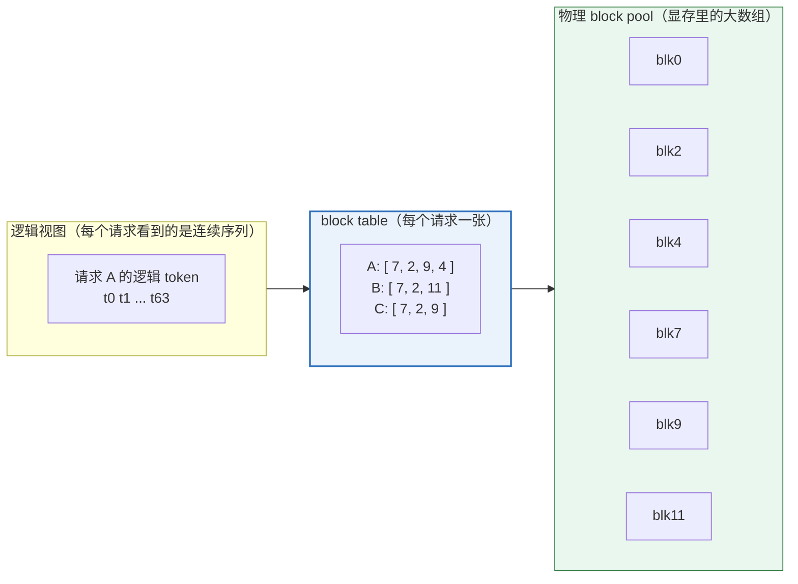
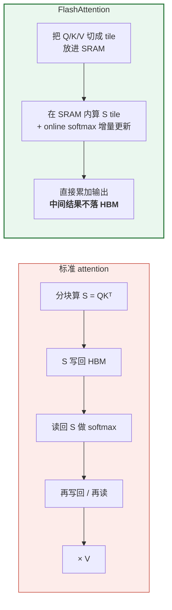
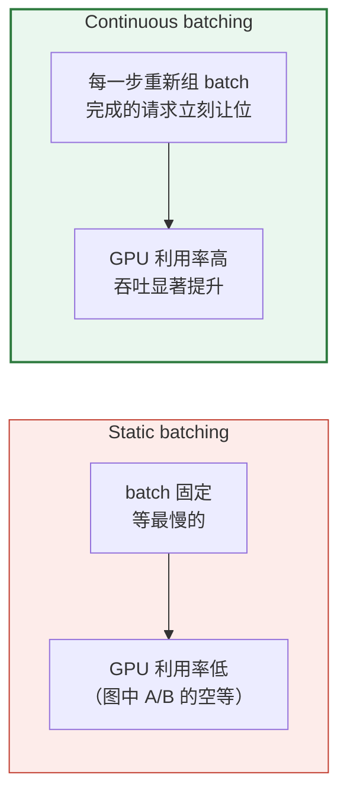
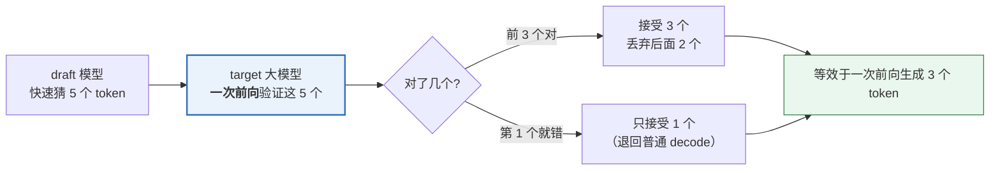
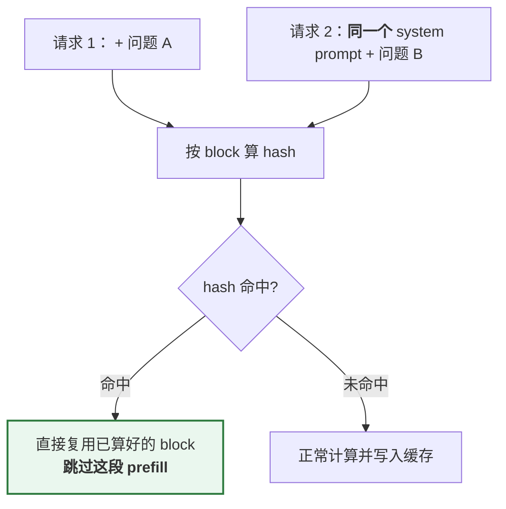
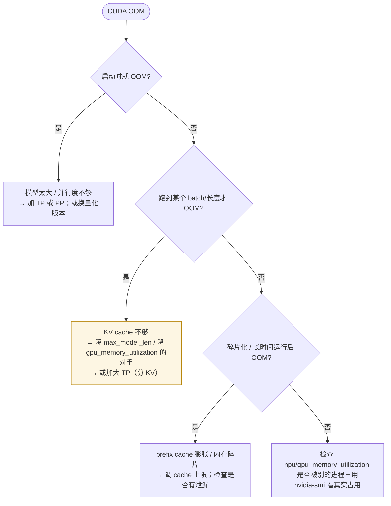
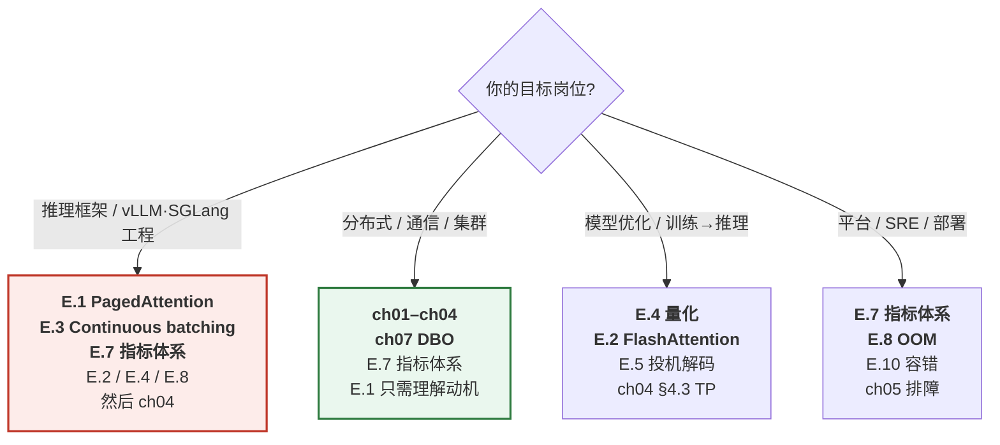

# 附录 E　单卡推理性能与调度：网络之外的半壁江山

> ## ⚠️ 先说一个诚实的判断
>
> 这份材料原生的主轴是**网络 / NCCL / 分布式**。
> 如果你面的是**「AI Infra / 推理框架 / 分布式系统」**方向的校招，
> 那么**本附录覆盖的内容，在面试里出现的频率和 ch01–ch08 一样高，甚至更高。**
>
> 原因很直接：**大部分推理框架的开源贡献和线上问题，发生在单卡这一侧。**
> 面试官问「你了解 vLLM 吗」，最可能的第一问是
> **「PagedAttention 解决了什么问题」**，而不是「NCCL 怎么选 ring 还是 tree」。
>
> 本附录就是把这个缺口补上。**它不是 ch01–ch08 的替代，而是配对的另一半。**

---

## E.0 一张图：面试知识的全貌 + 本材料的覆盖情况

```mermaid
flowchart TB
    ROOT(["推理框架 / AI Infra 校招面试"])

    ROOT --> A["A. 单卡推理性能<br/>（附录 E 覆盖）"]
    ROOT --> B["B. 分布式与网络<br/>（ch01–ch08 覆盖）✅"]
    ROOT --> C["C. 工程与运维<br/>（附录 E 部分覆盖）"]

    A --> A1["PagedAttention / KV 分页管理 ★★★"]
    A --> A2["FlashAttention / attention kernel ★★★"]
    A --> A3["Continuous batching / 调度 ★★★"]
    A --> A4["量化（FP8/INT4/GPTQ/AWQ）★★★"]
    A --> A5["投机解码（EAGLE/Medusa/n-gram）★★"]
    A --> A6["Prefix caching ★★"]
    A --> A7["Chunked prefill ★★"]
    A --> A8["显存管理 / OOM ★★"]
    A --> A9["CUDA Graph / torch.compile ★★"]

    B --> B1["TP / PP / DP / EP ✅"]
    B --> B2["集合通信 / NCCL ✅"]
    B --> B3["MoE all-to-all ✅"]
    B --> B4["通算融合 / DBO ✅"]
    B --> B5["KV 传输 / PD 分离 ✅"]
    B --> B6["CP / SP ✅"]

    C --> C1["指标体系 TTFT/TPOT/吞吐 ★★★"]
    C --> C2["可观测性 / 监控 ★★"]
    C --> C3["容错 / 弹性 ★"]
    C --> C4["成本与部署形态 ★★"]

    style B fill:#d4f4dd,stroke:#2d7a3e,stroke-width:2px
    style A fill:#fdecea,stroke:#c0392b,stroke-width:2px
    style A1 fill:#ffd9d4,stroke:#c0392b
    style A2 fill:#ffd9d4,stroke:#c0392b
    style A3 fill:#ffd9d4,stroke:#c0392b
    style A4 fill:#ffd9d4,stroke:#c0392b
    style C1 fill:#fdf6e3,stroke:#b8860b
```



**★ 数量 = 面试出现频率的经验估计。**

**如果你的目标岗位偏「分布式 / 通信」**（比如做集群、做网络、做集合通信），
ch01–ch08 就是主战场，附录 E 只要会「解释清楚 A1/A2/A3 的动机」即可。

**如果你的目标岗位是「推理框架」**（vLLM/SGLang/TRT-LLM 这类），
**附录 E 是必读，而且优先级高于 ch03**（NCCL 内部细节在大多数推理岗面试里权重不高）。

---

## E.1 PagedAttention：推理框架面试的第一问

### E.1.1 它要解决的问题（必须先讲这个）

**朴素做法**：每个请求预分配一块**连续的、按 max_len 大小**的 KV cache。

```
请求 A（max_len=4096，实际只用了 200）：[■■□□□□□□□□□□□□□□□□□□□□]  ← 浪费 95%
请求 B（max_len=8192，实际用了 300）：[■■■□□□□□□□□□□□□□□□□□□□□□□□]
```

三个致命问题：

| 问题 | 后果 |
|---|---|
| **内部碎片**（预留了但没用） | 显存利用率可能只有 20–40% → 能并发的请求数少 → 吞吐低 |
| **外部碎片**（请求结束后留下的空洞） | 无法保证新请求拿到连续的 max_len 空间 → 要么拒绝、要么做昂贵的整理 |
| **无法共享** | 同一个 prompt 的多个采样（n>1）、或系统提示词，KV 被重复存 N 份 |

### E.1.2 核心思想：把操作系统的虚拟内存搬过来

这才是「Paged」这个名字的来源 —— **完全对应 OS 的虚拟内存 + 分页**：

| OS 概念 | vLLM 对应 | 解决什么 |
|---|---|---|
| 页（page） | **block**（默认 16 个 token 一组） | 细粒度分配，消除内部碎片 |
| 页表（page table） | **block table**（逻辑块 → 物理块） | 逻辑连续、物理可不连续 → 消除外部碎片 |
| 写时复制（COW） | 共享前缀的 block，写时才复制 | 多个请求共享 prompt 的 KV |
| 按需分页 | 按需分配 block（用多少给多少） | 不预分配 max_len |



**注意图中 A 和 B/C 的 block table 前两项都是 `[7, 2]`** ——
这就是**共享前缀**：同一个 system prompt 的 KV 只存一份，多个请求的 block table 指向它。
**存储开销从 O(请求数 × 前缀长度) 降到 O(前缀长度)。**

### E.1.3 工程代价（面试加分点：主动说代价）

| 代价 | 说明 |
|---|---|
| **attention kernel 要改写** | 不能再假设 KV 连续 → 必须按 block table 做 gather（这正是 FlashAttention + paged KV 的难点） |
| **block size 是权衡参数** | 太小 → block table 变大、kernel 效率低；太大 → 内部碎片回升。**默认 16** |
| **需要 block 管理器** | 分配/回收/COW/淘汰，本身有 CPU 开销 |
| **前缀共享要处理引用计数** | 谁在用这个 block？什么时候能释放？（= OS 的引用计数） |

**在代码里的位置**（vLLM V1）：

| 组件 | 文件 | 职责 |
|---|---|---|
| block 池 | `vllm/v1/core/block_pool.py` | 物理 block 的分配/回收 |
| KV cache 管理 | `vllm/v1/core/kv_cache_manager.py` | 请求 ↔ block 的映射、前缀缓存协调 |
| 单类型管理器 | `vllm/v1/core/single_type_kv_cache_manager.py` | 不同 attention 类型（full/MLA/SWA）的 block 管理 |
| 数据结构/工具 | `vllm/v1/core/kv_cache_utils.py` | block hash、前缀缓存键 |
| 指标 | `vllm/v1/core/kv_cache_metrics.py` | 命中率/使用率 |

**面试话术**：
> 「PagedAttention 的本质不是一个新的 attention 算法，而是**把 KV cache 的管理方式
> 从『连续预分配』改成『分页按需分配』**，这一点和操作系统的虚拟内存是一一对应的 ——
> block 对应页，block table 对应页表，共享前缀对应 COW。
> 它换来的是显存利用率从 ~30% 提到 ~90%+，直接决定并发数和吞吐。
> 代价是 attention kernel 必须支持按 block table gather，以及一套 block 管理器的开销。」

---

## E.2 FlashAttention：为什么它快（且不只关于 IO）

### E.2.1 一句话回答

> **FlashAttention 不是「近似算法」，它是精确的。它快的唯一原因是：减少了
> HBM ↔ SRAM 之间的读写次数（IO-aware），而不是减少了计算量。**

**标准 attention 的显存问题**：`S = QKᵀ` 是 `[seq, seq]`，
seq=8192 时 fp16 需要 `8192×8192×2 = 128 MB`（**每个 head**）。
必须写回 HBM 再读出来做 softmax —— **HBM 带宽成为瓶颈**。

**FlashAttention 的做法（tiling + online softmax）**：



**online softmax 是数学核心**：softmax 需要全局最大值（数值稳定）和全局分母，
但分块计算时不知道后面的块。FlashAttention 用「运行中的 max 和 sum」增量修正，
**数学上等价于一次算完**，所以结果是精确的。

**面试追问链**（很常见）：
```
Q: FlashAttention 为什么快？        → 减少 HBM IO，不是减少 FLOPs
 └→ Q: 那它减少了多少 FLOPs？       → 没减少（精确算法），甚至略增
     └→ Q: 那为什么还更快？          → attention 是 memory-bound，不是 compute-bound
         └→ Q: 怎么判断一个 kernel 是 memory-bound 还是 compute-bound？
              → 看 arithmetic intensity（FLOPs/Byte）vs 硬件的 ridge point
```

### E.2.2 vLLM 里的 attention 后端

vLLM 把 attention 做成**可插拔后端**（`vllm/v1/attention/backends/`）：

| 后端 | 说明 |
|---|---|
| `flash_attn.py` | FlashAttention（主力） |
| `flashinfer.py` | FlashInfer（含 TRT-LLM kernel） |
| `triton_attn.py` | Triton 实现（可读性好，便于改） |
| `flex_attention.py` | PyTorch FlexAttention |
| `mla/*` | MLA（DeepSeek 系）专用 |
| `mamba*.py` / `gdn_attn.py` / `linear_attn.py` | 线性注意力 / SSM 混合模型 |
| `rocm_*.py` | AMD 平台 |

**面试点**：**「为什么要多后端？」** —— 因为 attention 是**最吃硬件特性的热点**，
不同 GPU 代际/厂商/序列长度/dtype 的最优 kernel 不同。
这和 ch04 讲的「all-reduce 为什么有 8 路后端」是**同一个设计哲学**（分档 + 实测阈值）。

---

## E.3 Continuous Batching 与调度

### E.3.1 为什么需要它（对比 static batching）

**Static batching（老做法）**：攒够 N 个请求 → 一起跑 → **等最长的那个结束** → 再收下一批。

```
请求 A（输出 10 token）: ████░░░░░░░░░░░░░░░░  ← 早就算完了，空等
请求 B（输出 20 token）: ████████████████████
请求 C（输出 200 token）: ████████████████████████████████████████
                          ↑ 这一批的门票被 C 决定了；A/B 的算力全浪费
```

**Continuous batching（inflight batching）**：**每个 decode step 都重新组 batch** ——
A 算完立刻腾出位置给新请求 D。



**面试必答的数字感**：continuous batching 相比 static batching 常能带来
**数倍的吞吐提升**（在输出长度方差大的真实负载下）。**这是推理引擎最核心的一层优化。**

### E.3.2 vLLM 的调度器做什么

`vllm/v1/core/sched/scheduler.py`（主调度逻辑）+ `request_queue.py`（优先级队列）。

每个 step 要决定：
1. **哪些请求进入这一步**（prefill 优先？decode 优先？）
2. **每个请求算多少 token**（decode 一般 1 个；prefill 可以切块 → chunked prefill）
3. **显存够不够**（block 分配失败 → 抢占 / 排队）
4. **要不要抢占**（`preemption`）—— 显存不足时把某些请求的 KV 释放掉

**抢占（preemption）的两种策略**（面试常问）：

| 策略 | 做法 | 代价 |
|---|---|---|
| **Recompute** | 释放 KV，之后重新算 prefill | 浪费算力（重算），但省显存 |
| **Swap** | 把 KV 换出到 CPU 内存，之后换回来 | 走 PCIe，慢，但不用重算 |

**这又是一次「用计算换显存」还是「用带宽换显存」的权衡** ——
和 ch07 里 `q-replicate` 用冗余计算换通信是同一类思维。

### E.3.3 Chunked Prefill：为什么它和 PD 分离解决同一个问题

**问题**：一个 8000 token 的长 prefill 会把 GPU 占住很久，期间**所有 decode 请求被卡住**
→ 尾延迟（p99 ITP/TPOT）尖刺。

**Chunked prefill**：把长 prefill **切成小块**，和 decode 请求**混在同一个 batch 里**跑。

```
不做 chunked：  [====长 prefill====][d][d][d]         ← decode 等了整个 prefill
做 chunked：    [p][d][p][d][p][d][p][d]              ← decode 持续被服务
```

**和 PD 分离的关系**（这个对比是 ch08 §8.3.1 的延伸，很有面试价值）：

| | Chunked prefill | PD 分离 |
|---|---|---|
| 层次 | **单实例内**的调度优化 | **多实例**的部署架构 |
| 代价 | 几乎为零（改调度逻辑） | 需要 KV 传输 + 复杂部署 |
| 效果 | 显著削平尾延迟 | 更彻底（两类负载物理隔离） |
| 建议顺序 | **先试这个** | 不够再上 |

**面试话术**：
> 「chunked prefill 和 PD 分离解决的是**同一个问题** —— prefill 顶住 decode 造成的尾延迟。
> chunked prefill 是单实例内的调度手段，代价几乎为零；
> PD 分离是架构手段，更彻底但要付 KV 传输的代价。
> **所以工程上正确的顺序是先调 chunked prefill 的 chunk size，不够再上 PD 分离。**
> 官方文档也是这个态度 —— 它说 PD 分离是『更可靠地控制尾 ITL』的方式，
> 因为『chunk size 很难调对』。」

---

## E.4 量化：面试必问，但很多人只背名词

### E.4.1 一张表建立框架

| 方案 | 位宽 | 权重量化 | 激活量化 | 典型精度损失 | vLLM 支持 |
|---|---|---|---|---|---|
| **FP8 (W8A8)** | 8 | ✅ | ✅ | 很小 | ✅ 主力（Hopper+ 原生支持） |
| **INT8 (W8A8)** | 8 | ✅ | ✅ | 小 | ✅ |
| **W4A16 (GPTQ/AWQ)** | 4 | ✅ | ❌（激活 fp16） | 中 | ✅ |
| **INT4 (W4A16)** | 4 | ✅ | ❌ | 中 | ✅ |
| **NVFP4 / MXFP4** | 4 | ✅ | ✅ | 中（Blackwell 友好） | ✅ |
| **KV cache 量化** | 8/4 | — | — | 影响长上下文质量 | ✅（fp8 KV） |

**关键区分（面试常踩）**：

- **W8A8 / W4A16 的命名 = 「权重位宽 + 激活位宽」**。`W4A16` 表示权重 4 bit、激活 16 bit。
- **只量化权重**（W4A16）省的是**显存**和**权重读取带宽**；
  **量化激活**（W8A8）还能省**计算**（用整数/FP8 tensor core）。
- **decode 阶段是 memory-bound**（每步只算 1 个 token 但要读全部权重）
  → **W4A16 对 decode 的加速比 prefill 更明显**。
  这是「为什么低比特量化在推理侧特别有用」的核心原因。

### E.4.2 量化和 distributed 的交互（这份材料的独特视角）

**这是 ch08 §8.1.7 已经讲过的，这里串起来**：
**量化方案的选择不只受 kernel 支持影响，还受通信库支持影响。**

| 约束 | 来源 |
|---|---|
| DeepEP 只支持 fp8 block scale 直接传，其它格式要传 bf16 再量化 | 通信库 |
| scale 的 swizzle 必须推迟到 A2A 之后（否则改变形状破坏 kernel 假设） | 通信库 |
| low-latency kernel 不支持 per-token scale | 通信库 |
| `hidden % 128 == 0`（fp8 block）/ `% 16`（nvfp4 scale 元素数） | kernel 分块 |

**面试话术**：
> 「做量化时要同时看三侧的约束：**模型精度、kernel 支持、通信库支持**。
> 很多论文里的量化方案在分布式部署时会卡在通信那一步 ——
> 比如 per-token scale 在 DeepEP 的 low-latency kernel 上直接不被接受。」

---

## E.5 投机解码（Speculative Decoding）

### E.5.1 为什么有效（用「memory-bound」解释）

decode 每步只生成 1 个 token，但要把**全部权重读一遍** → **memory-bound，算力闲着**。

**投机解码**：先用一个**便宜的小模型**（draft）猜 k 个 token，
再用**大模型一次并行验证**这 k 个。



**为什么「验证 k 个」几乎不比「生成 1 个」贵**：
因为大模型的前向是 memory-bound —— **读一遍权重**的代价是固定的，
多算几个 token 的**额外计算**几乎不影响时间。**这是投机解码能成立的物理基础。**

**关键指标：接受率（acceptance rate）**。
接受率低 → 白跑 draft + 白算验证 → **比不用还慢**。
所以投机解码**不是无条件加速**，取决于 draft 模型和 target 模型的一致性。

### E.5.2 vLLM 里的实现

`vllm/v1/spec_decode/`：

| 方法 | 思路 | 特点 |
|---|---|---|
| `ngram_proposer.py` | 用 n-gram 从 prompt 里找重复片段 | **不需要额外模型**，对代码/摘要类任务很有效 |
| `eagle.py` | EAGLE：用 target 模型的 hidden state 训练小头 | 当前主流 |
| `medusa.py` | Medusa：在 target 上加多个解码头 | 需要训练 |
| `draft_model.py` | 独立的小 draft 模型 | 最简单 |
| `suffix_decoding.py` | 后缀匹配 | 类似 n-gram |

**面试点**：**n-gram 方案不需要训练任何东西**，所以在「模型还没适配好」时是性价比最高的起点。
**能说出这一点，说明你考虑过落地成本，而不只是背 SOTA 名字。**

### E.5.3 投机解码与分布式的交互（这份材料的独特视角）

ch07 §7.3.3 的 DBO 准入清单里有一条：
**「V2 model runner 不支持 DBO + 投机解码」**。

**为什么**：投机解码让「每个请求每步要处理的 token 数」变成**动态的**
（接受 1 个还是 5 个 token 取决于验证结果），
而 DBO 要把 batch **按 token 数均分**成两个 ubatch —— **两者天然冲突**。

**面试话术**：
> 「投机解码制造了**动态的 token 数**，而 DBO / CUDA Graph 都要求
> **形状可预测**。所以这些优化之间是互相排斥的，不能简单叠加。
> **每加一层优化，就少掉一些其他优化的空间** —— 这是推理框架工程的核心现实。」

---

## E.6 Prefix Caching：和 PagedAttention 是同一套机制

**问题**：多轮对话 / few-shot / RAG 场景里，**大量请求共享相同的前缀**。
不缓存就要把相同的前缀重新算一遍 prefill。

**做法**：**用 block 的 hash 做键，缓存已经算好的 block**。
命中就直接复用那些 block，跳过对应的 prefill 计算。

**和 PagedAttention 的关系**：**同一套基础机制**。
PagedAttention 让 KV 以 block 为粒度管理 → 那么「按 block 复用」就是自然的延伸。



**面试追问**：
- **「缓存会不会占满显存？」** → 会。所以缓存的 block 是**可淘汰的**（LRU 类策略），
  且必须有引用计数保证「正在被用的 block 不被淘汰」。
- **「什么场景收益最大？」** → 前缀长且重复率高：多轮对话、固定 system prompt、RAG。
  **短 prompt 或高度多样的 prompt 几乎没收益。**
- **「代价是什么？」** → hash 计算（CPU）+ 缓存管理开销 + 显存被缓存占用。
  **长 prompt 才划算。**

---

## E.7 指标体系：面试官判断你「有没有做过线上」的分水岭

### E.7.1 必须能精确定义的四个指标

| 指标 | 全称 | 定义 | 关注什么 |
|---|---|---|---|
| **TTFT** | Time To First Token | 从请求到达到**第一个 token 产出**的时间 | **prefill + 排队** |
| **TPOT** | Time Per Output Token | 首 token 之后，**每个输出 token**的平均时间 | **decode 速度** |
| **ITL** | Inter-Token Latency | 相邻两个 token 之间的时间（TPOT 的逐次版本） | 流式体验的**平滑度** |
| **吞吐** | Throughput | 单位时间产出的 token 数 / 请求数 | 成本效率 |

**四个最容易答错的点（都是面试高频陷阱）**：

1. **TTFT 和 TPOT 由不同阶段决定** ——
   → 这就是**为什么 PD 分离能「解耦 TTFT 和 ITL」**（ch08 §8.3.1）。
2. **TPOT ≠ ITL** —— TPOT 是**平均值**，ITL 关注**逐次的抖动**。
   **SLA 通常约束 ITL 的 p99，而不是平均值。**
3. **吞吐和延迟是对立的** —— batch 越大吞吐越高，但每个请求的 TPOT 越差。
   **所以「吞吐」必须绑定 SLO 一起说**，孤立地说吞吐没有意义。
4. **Goodput** —— **满足 SLO 的有效吞吐**。
   比裸吞吐更有意义：把 batch 加大到延迟超标，吞吐涨了但 goodput 掉了。

**面试话术**：
> 「评价推理服务要**先问 SLO**。
> 如果 SLO 是 p99 TTFT < 500ms，那优化重点在 prefill 和排队（chunked prefill、PD 分离）；
> 如果 SLO 是 p99 ITL < 50ms，重点在 decode 的通信和 kernel（custom AR、DBO）。
> **脱离 SLO 谈吞吐是没有意义的 —— 把 batch 拉爆能让吞吐数字很漂亮，
> 但 goodput 会掉。**」

### E.7.2 vLLM 暴露的指标

| 位置 | 内容 |
|---|---|
| `vllm/v1/metrics/loggers.py` | 日志型指标（周期性打印） |
| `vllm/v1/metrics/prometheus.py` | Prometheus 指标（生产监控用） |
| `vllm/v1/metrics/stats.py` | 统计结构定义 |
| `vllm/v1/metrics/perf.py` | 性能相关指标 |

**面试点**：**上线前必须确认你监控的是哪几个指标**。
最小集合：`TTFT`、`TPOT`/`ITL`、`running/waiting 队列长度`、`KV cache 使用率`、
`preemption 次数`、`GPU 利用率`。**队列长度和抢占数往往比延迟更早暴露问题。**

---

## E.8 显存管理与 OOM：最实操的一节

### E.8.1 显存都花在哪了

```
总显存 = 权重 + KV cache + 激活/临时 + CUDA Graph + 通信 buffer + 框架开销
         ↑        ↑          ↑            ↑             ↑
       固定     可变★       随 batch     capture 时     |
                可调                      固定        对称内存/custom AR 的预注册 buffer
```

**vLLM 的 `--gpu-memory-utilization`（默认 `0.92`，见 `vllm/config/cache.py`）控制「能用多少」**，
剩下的由 vLLM 在启动时算：**先给权重，再用剩余空间按这个比例给 KV cache**。

**启动日志里那两行就是答案**（ch05 Lab 2 讲过）：
```
GPU KV cache size: 643,232 tokens
Maximum concurrency for 40,960 tokens per request: 15.70x
```
→ **第二行就是「你的显存能支撑多少并发」**，直接决定吞吐上限。
（算法就是 `KV cache 容量 ÷ 单请求最大长度`，所以它同时受 `max_model_len` 影响。）

### E.8.2 OOM 的常见原因与排查顺序



**面试话术（体现实操）**：
> 「OOM 第一步不是调参数，而是分清**三类**：启动就 OOM（权重放不下）、
> 跑到一定 batch 才 OOM（KV 不够）、长时间运行后 OOM（碎片或泄漏）。
> 三类的解法完全不同 —— 第一类加并行度，第二类降 max_model_len 或加 TP
> （TP 会**切分 KV**，不只是切权重），第三类查 prefix cache 和泄漏。」

**一个容易答错的点**：**TP 同时切分权重和 KV cache**。
KV cache 是按 **KV head 维**切分的（每张卡只存自己那些 KV head 的缓存，
见 `vllm/v1/kv_cache_interface.py` 的 `FullAttentionSpec.num_kv_heads` 是**每 rank** 的值）。
所以「显存不够」时加 TP 是有效的 —— 但代价是每层多两次 all-reduce（ch01 §1.8）。

---

## E.9 CUDA Graph 与 torch.compile

这两块 ch07 都涉及了（CUDA Graph 与 DBO 的冲突、torch.compile 的自定义 op 约束），
这里只补**面试会单独问的部分**。

### E.9.1 CUDA Graph：省的是什么

**省的是 kernel launch 开销**（每次 3–10 μs，ch01 §1.2 的表）。
decode 一步可能发几百个 kernel → **launch 开销能占 decode 时间的相当一部分**。
CUDA Graph 把整个序列 capture 成一张图，replay 时**一次 launch 搞定**。

| 收益 | 约束（面试重点） |
|---|---|
| 消除 per-kernel launch 开销 | **形状必须固定** → 不同 batch size 要各 capture 一张 |
| 减少 CPU 侧的提交开销 | **显存地址必须固定** → 通信 buffer 要预注册（ch04 §4.4.4） |
| 让 CPU 有时间做别的事（调度/采样） | **capture 期间不能做同步/建连** → pynccl 的存在理由 |

**面试话术**：
> 「CUDA Graph 在**小 batch decode** 上收益最大，因为那时 launch 开销占比最高；
> **大 batch prefill 上收益小**（计算时间长，launch 开销被淹没）。
> 这就是为什么 vLLM 的 graph 策略通常只覆盖 decode，以及为什么
> `--enforce-eager` 是排障时的第一手段 —— **关掉它就能区分『graph 相关的问题』和『计算/通信的问题』**。」

### E.9.2 torch.compile 在推理框架里的作用

**它不是一个优化，而是一个「优化平台」**：把模型图编译出来，
才能做**图级别的融合**（ch07 §7.6 的 SP/AsyncTP 就是编译期 pass）。

**面试点**：**为什么推理框架要引入编译器？**
→ 因为手工融合只能覆盖已知模式（比如 all-reduce + RMSNorm），
**编译器能自动发现并改写更多模式**，而且能跟着模型结构变化自动适配。
**代价**：编译时间、动态形状支持、和 CUDA Graph 的交互复杂度。

---

## E.10 容错与弹性（分布式岗会问，单机岗较少）

| 话题 | 要点 | vLLM 里的位置 |
|---|---|---|
| **故障检测** | 怎么发现某个 rank 挂了？ | NCCL timeout / watchdog |
| **弹性 EP** | rank 动态加入/退出后，专家映射怎么迁移 | `vllm/distributed/elastic_ep/` |
| **权重更新** | RL 场景 trainer → inference 的权重同步 | ch08 §8.4（`weight_transfer/`） |
| **优雅降级** | KV 传输失败时的策略（重算 vs 报错） | `kv_load_failure_policy`（ch08 §8.3） |
| **故障转移** | 请求级重试、实例替换 | 部署层（K8s） |

**面试话术**：
> 「容错设计要区分『**能重算**』和『**不能重算**』。
> KV cache 丢了可以重算（代价是算力），但已经生成的 token 不能撤回，
> 所以故障恢复的语义是**请求级重试**而不是**中间状态恢复**。
> vLLM 的 `kv_load_failure_policy` 就是把这个选择暴露给用户：
> `recompute` 保可用性、`fail` 保确定性 —— **默认是 `fail`**，
> 因为静默重算会让延迟不可预测。」

---

## E.11 各岗位的优先级清单（怎么用这份附录）



**一句话总结**：
> **ch01–ch08 让你能回答「多卡怎么通信」；
> 附录 E 让你能回答「单个请求为什么慢」。
> 面试官通常两者都会问 —— 先问 E，再问 B。**

---

## E.12 本章自检题

**PagedAttention / KV**
1. 朴素 KV 分配的三个问题是什么？分别对应 PagedAttention 的哪个设计？
2. block table 的作用是什么？和 OS 页表怎么对应？
3. 前缀共享靠什么实现？为什么需要引用计数？
4. block size 设小/设大各有什么代价？默认是多少？
5. PagedAttention 的代价是什么（说出至少两点）？

**Attention kernel**
6. FlashAttention 是近似算法吗？它快的根本原因是什么？
7. online softmax 解决的是什么问题？
8. 怎么判断一个 kernel 是 memory-bound 还是 compute-bound？
9. 为什么 vLLM 要有多个 attention 后端？

**调度**
10. Continuous batching 相比 static batching 的关键区别是什么？
11. 抢占的两种策略各有什么代价？分别适合什么场景？
12. Chunked prefill 解决什么问题？和 PD 分离是什么关系？应该先试哪个？
13. **TP 会不会切分 KV cache？**（这题容易答错——会）

**量化 / 投机**
14. `W4A16` 这个命名是什么意思？它省的是显存还是计算？
15. 为什么低比特量化对 **decode** 的加速比 prefill 更明显？
16. 投机解码为什么能加速？（用 memory-bound 解释）
17. 什么情况下投机解码会**变慢**？
18. 为什么 n-gram 方案在落地时性价比高？
19. 投机解码和 DBO 为什么冲突？

**指标 / 运维**
20. TTFT、TPOT、ITL 分别由哪个阶段决定？
21. TPOT 和 ITL 的区别是什么？SLA 该约束哪个？
22. 为什么「吞吐」必须绑定 SLO 说？goodput 是什么？
23. OOM 分哪三类？各自的解法是什么？
24. `Maximum concurrency` 那行日志是怎么算出来的？

**综合**
25. 「加 TP」为什么能缓解显存不足？代价是什么？
26. 一个 decode 请求变慢了，你怎么区分是「通信问题」还是「kernel 问题」？
    （提示：这是 ch05 §5.1 决策树和 E.7 指标的交汇点）

---

**写完这份附录后，本材料的知识地图才算完整**：
- **ch01–ch08 + labs**：分布式与网络（多卡视角）
- **附录 E（本文件）**：单卡性能与调度（单请求视角）
- **ch06 + 附录 E.12**：两套题库合起来覆盖面试主线
