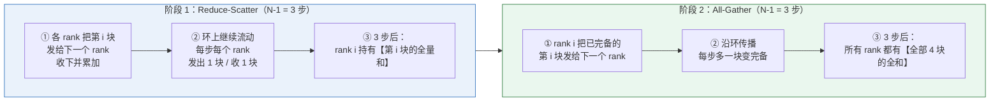
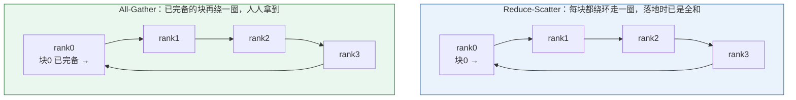
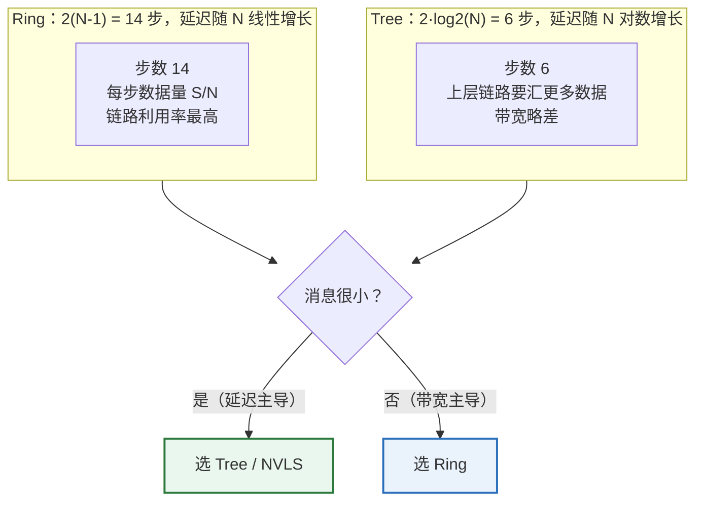

# 第 2 章　集合通信：语义 + 算法 + 定量模型

> 本章目标：把「通信量」变成「通信时间」。
> 读完你应该能：手推 ring all-reduce 的流量、解释为什么 NCCL 要同时实现 ring 和 tree、
> 说清 all-to-all 和 all-reduce 的本质区别。

---

## 2.1 先把 8 个集合操作钉死

这是面试白板题的基础。**关键记忆法**：问自己两件事 ——
① 每个 rank 的输入是否相同？② 每个 rank 的输出是否相同？

| 操作 | 英文 | Python (torch.distributed) | 语义 | 输入/输出大小关系 |
|---|---|---|---|---|
| 广播 | broadcast | `broadcast(tensor, src)` | root 的数据发给所有 rank | 出 = 入 |
| 规约 | reduce | `reduce(tensor, dst, op)` | 所有 rank 的数据按 op 合并，只给 dst | 出 = 入（仅 dst 有意义） |
| 全规约 | all-reduce | `all_reduce(tensor, op)` | 合并结果给**所有** rank | 出 = 入 |
| 收集 | gather | `gather(tensor, dst)` | 每个 rank 把自己那份给 dst | 出 = N × 入 |
| 分发 | scatter | `scatter(tensor, src)` | root 把 N 份分给每个 rank | 出 = 入 / N |
| 全收集 | all-gather | `all_gather_into_tensor(out, in)` | gather 的结果**广播**给所有 rank | 出 = N × 入 |
| 规约分发 | reduce-scatter | `reduce_scatter_tensor(out, in)` | 先按 op 合并，再把结果**切成 N 份**分发 | 出 = 入 / N |
| 全交换 | all-to-all | `all_to_all_single(out, in)` | 每个 rank 把自己切成的 N 份，第 i 份发给 rank i | 出 = 入 |

（上表 `N` = world size。）

**最容易搞混的三对，面试高频：**

1. **`reduce` vs `all-reduce`**：前者结果只落在 dst（省带宽），后者人人都有（贵但要用于 TP）。
2. **`scatter` vs `all-gather`**：互为逆操作；`reduce` + `scatter` ≈ `all-reduce` 的一种分解方式。
3. **`all-gather` vs `all-to-all`**：这是**最大的一个坑**。
   - `all-gather`：**所有人拿到所有人的全部数据**（数据量 ×N）。
   - `all-to-all`：**每个人只拿到属于自己的那一份**（数据量不变，只是重新分布）。
   - 具体到 MoE：token 只需要送到「持有它选中专家」的 rank，不需要所有人都看到所有 token。
     所以 all-to-all 天然比 all-gather 省。

---

## 2.2 定量模型：α-β 与「步数 × 消息大小」

任何集合操作的时间都能拆成：

```
T = (顺序步数) × α + (每 rank 搬运字节数) / BW_effective
      └── 延迟项 ──┘   └───────── 带宽项 ─────────┘
```

- **α（latency）**：一次通信的固定开销。包括 kernel 启动、协议处理、网络往返。
  实际工程里 α 约 1–5 μs（NVLink 更小，IB 更大）。
- **BW_effective**：有效带宽。注意它不等于线速——并发不足、协议开销、拓扑不对称都会打折。
- **顺序步数**：算法决定了要串行几轮。这决定了 α 前面的系数，**是小消息场景的决定因素**。

**做题的标准流程**（背下来）：

1. 确定算法（ring / tree / recursive doubling / direct）。
2. 算**顺序步数** → 乘 α。
3. 算**每个 rank 的搬运量** → 除带宽。
4. 比较大小，看哪项主导，据此回答优化方向。

---

## 2.3 all-reduce 的三大算法族

### 2.3.1 Ring All-Reduce —— 带宽最优，延迟线性

**核心思想**：把数据切成 N 份，让数据块沿环流动，每个 rank 只和左右邻居说话。
分两个阶段：

```
阶段 1：Reduce-Scatter（N-1 步）
  每步：rank i 把「某一块」的局部和发给 rank i+1，并接收上一块的部分和累加。
  结果：rank i 持有第 i 块的全量和。

阶段 2：All-Gather（N-1 步）
  每步：rank i 把「已知全和的那一块」沿环传播。
  结果：所有 rank 拿到全量的全和。

总步数 = 2(N-1)
每 rank 总搬运量 = 2 × (N-1)/N × S    （S = tensor 字节数）
```

**把两个阶段画出来**（以 N=4、数据切成 4 块 A/B/C/D 为例）：



**「环上流动」的逐块示意**（N=4，块编号 0–3）：



> **注意两个阶段的方向虽然都沿环，但「语义」不同**：
> 阶段 1 传的是**部分和**（越传越完整），阶段 2 传的是**已完备的结果**（只做复制）。
> 面试里被问「ring all-reduce 两个阶段分别传什么」，这是标准答案。

**时间模型**：

```
T_ring ≈ 2(N-1) × α + 2 × (N-1)/N × S / BW
```

**两个必须记住的结论**：

1. **带宽项**：`2(N-1)/N → 2`（N 大时）。
   即 **每个 rank 搬运量 ≈ 2S**（一个 S 用于规约，一个 S 用于扩散）。
   这就是「all-reduce 的成本是 2 倍数据量」这个说法的来源。
2. **延迟项**：`2(N-1)` 随 N **线性增长**。
   当 S 很小时（α 项主导），ring 会非常吃亏。**这就是 tree 存在的理由**。

**为什么 ring 是「带宽最优」**：它把每条链路的利用率做到最大，没有 rank 闲着，
且不需要交换机做多播。在 N 很大、S 很大时，ring 是首选。

### 2.3.2 Tree All-Reduce —— 延迟最优，带宽次优

**核心思想**：用树结构把「N 个 rank 的规约」变成 log 层的两阶段：

```
阶段 1：Reduce（向上）：叶子把自己的数据发给父节点并累加  → log N 步
阶段 2：Broadcast（向下）：根把结果沿树下发给所有人        → log N 步

总步数 = 2 log₂ N
```

**时间模型**：

```
T_tree ≈ 2 log₂(N) × α + (≈ 2S) / BW     （N 大时带宽项同样趋近 2S）
```

**对比（这是面试最爱考的对比）**：

| | Ring | Tree |
|---|---|---|
| 顺序步数 | 2(N−1) | 2 log₂ N |
| 每 rank 搬运量（N 大） | ≈ 2S | ≈ 2S（与 ring 同阶） |
| 小消息 | 差（步数多） | **好** |
| 大消息 | **好** | 略差（树上层链路拥挤） |
| 实现难度 | 低 | 中 |

**把两个算法的「步数」画在一起对比**（N=8）：



**N=8 时的步数对比**：ring 14 步 vs tree 6 步。若 α=3 μs，仅延迟项就差 `(14-6)×3 = 24 μs`。
对一个每次 all-reduce 只有 16 KiB 的 decode 场景（纯传输仅约 0.06 μs），**ring 完全不可接受**。


> 这解释了 NCCL 的默认行为：**小消息走 tree（NVLS/tree），大消息走 ring**。
> 详见 ch03 的算法选择逻辑。

### 2.3.3 Recursive Doubling / Halving-Doubling —— log 步数 + 带宽最优

**核心思想**：第 k 轮，rank 与「距离 2^k」的伙伴交换自己还缺的那一半数据。

- 每轮每 rank 发送/接收 `S/2` 大小（因为要交换的是还没归约的部分）。
- 共 `log₂ N` 轮 → **带宽项 ≈ S**（比 ring 的 2S 还好一倍！），延迟项 `log₂ N`。

**为什么不是所有情况都用它？**

1. **只在 N 是 2 的幂时完美**，否则要做 padding 或退化处理。
2. **通信模式是全交换式（all-to-all 模式）**：要求任意两个 rank 之间都能直接通信。
   在 ring 拓扑的网络里（比如 IB 的胖树之外的拓扑）或者 rank 分布跨节点时，这个假设不成立。
   ring 算法的通信模式只要求「相邻能通」，对拓扑友好得多。
3. 实现复杂，且对**非 2 的幂 world size** 不友好（`tp_size=3`、`tp_size=6` 是真实存在的配置）。

**面试加分**：能说出「recursive halving-doubling 带宽最优但有 2 的幂约束和全交换通信模式约束，
所以 NCCL 主要用 ring 和 tree」就已经超过大多数候选人。

---

## 2.4 其他集合操作的成本表（背这一张表就够）

设 `S` = 每个 rank 的输入字节数，`N` = world size。

| 操作 | 每 rank 搬运量 | 顺序步数 (ring 实现) | 备注 |
|---|---|---|---|
| broadcast | `S` | N−1 | tree 实现只需 log N 步 |
| reduce | `(N-1)/N × S` | N−1 | |
| all-reduce | `2(N-1)/N × S` | 2(N−1) | ring；tree 为 2log N 步 |
| gather（到 dst） | `(N-1)/N × S`（dst 收 N 份） | — | dst 是瓶颈 |
| scatter（从 src） | `(N-1)/N × S` | — | |
| all-gather | `(N-1)/N × S_total` | N−1 | `S_total` = 收集后的总大小 |
| reduce-scatter | `(N-1)/N × S` | N−1 | `S` = 输入总大小 |
| all-to-all | `≈ (N-1)/N × S` | 1（全交换并发） | 实际受对端队列和交换机拥塞影响 |

**记忆锚点**：

- 所有操作的带宽项都是 `(N-1)/N × 数据类型总大小` 的量级 —— `(N-1)/N` 趋近 1。
- 差别在**步数**（延迟项）和**是否需要多播**。
- **all-reduce = reduce-scatter + all-gather**，这是最有用的一条分解（Dual 关系）：
  `T(all-reduce) ≈ T(reduce-scatter) + T(all-gather)`。
  大量优化技巧都基于这个分解（比如 ZeRO 的通信、TP 的 AG/RS 融合）。

---

## 2.5 all-to-all 专项：MoE 的通信形态

### 2.5.1 语义回顾

`all_to_all_single(out, in)`：把 `in` 沿某维切成 N 份，第 i 份发给 rank i；
同时从 rank i 收到第 i 份放到 `out` 的第 i 段。

```
rank0: [A0 A1 A2 A3]           rank0 收到: [A0 B0 C0 D0]
rank1: [B0 B1 B2 B3]    ==>    rank1 收到: [A1 B1 C1 D1]
rank2: [C0 C1 C2 C3]           rank2 收到: [A2 B2 C2 D2]
rank3: [D0 D1 D2 D3]           rank3 收到: [A3 B3 C3 D3]
```

（注意：每个 rank 的**总数据量不变**，只是「分布」变了。这是它和 all-gather 的根本区别。）

### 2.5.2 在 MoE 里的两个阶段

以 vLLM 的 EP 为例（对应 `vllm/distributed/device_communicators/all2all.py` 的
`dispatch` / `combine` 接口，详见 ch04）：

```
                     ┌─────────── EP rank 0 ───────────┐
 本地 batch  ──► router ──► topk_ids: 每个 token 选哪 k 个专家
                     │
                     ▼
   ┌─────────── dispatch（all-to-all）───────────┐
   │  每个 token 的 hidden_state 发到「持有所选专家的 rank」│
   └──────────────────┬──────────────────────────┘
                      ▼
       本地专家 GEMM（只算本 rank 上的专家）
                      │
                      ▼
   ┌─────────── combine（all-to-all，反向）────────┐
   │  把专家输出按 token 送回原 rank，乘 routing 权重求和 │
   └───────────────────────────────────────────────┘
```

**关键工程量（面试常被追问）**：

1. **变长消息**：每个 rank 发给不同对端的数据量**不一样**（取决于 token 选了多少个该 rank 的专家）。
   → 需要交换「大小元信息」（vLLM 通过 all-gather 传 `sizes`，见 ch04 的 `_get_sizes`）。
2. **token 置换（permute）**：token 在 rank 之间乱序，需要记录「谁去了哪」的索引，
   combine 阶段才能还原顺序。这个索引是 MoE kernel 的核心数据结构。
3. **负载不均（straggler）**：某个专家热门 → 持它的 rank 变慢 → 整个 EP 组等它。
   这就是 **EPLB（Expert Parallelism Load Balancer）** 存在的原因（`vllm/distributed/eplb/`）。
4. **必须可重叠**：all-to-all 的通信量不小，且是「通信-计算-通信」三段串行。
   DeepEP 的 normal/low-latency 两种模式就是为「和计算重叠」设计的（ch04）。

### 2.5.3 对比：TP 的 all-reduce vs EP 的 all-to-all

| 维度 | TP（all-reduce） | EP（all-to-all） |
|---|---|---|
| 通信对象 | 所有 TP rank | 只有「持有目标专家」的 rank |
| 通信量 | 每层 2 次 × (2S) ≈ 4S | 每层 1 次 dispatch + 1 次 combine |
| 与 S 的关系 | 与 hidden 成正比，**与 expert 数无关** | 与 topk / expert 分布有关 |
| 扩展性 | N 越大越贵（`2(N-1)/N S`） | 主要贵在**负载不均**和**跨机带宽** |
| 典型范围 | 机内（NVLink 域） | 可跨机（IB），配合 DP |
| 通信库 | NCCL（all-reduce） | DeepEP / NIXL / FlashInfer / NCCL AG-RS |

**面试题**：「为什么 MoE 模型（DeepSeek-V3）能用 EP 扩展到几百张卡，而 dense 模型用 TP 只能到 8 张？」
→ 因为 EP 的通信量由**路由稀疏性**决定（每 token 只去 topk 个专家），不随 EP size 线性增长；
而 TP 的 all-reduce 是**全局**的，N 越大延迟项越大且每层两次。EP 的代价转移到「负载均衡」和
「all-to-all 的跨机带宽」上，这两者更容易用工程手段（EPLB、DeepEP）解决。

---

## 2.6 从集合操作到 vLLM：一一对应

这张表是本章与 ch04 的接口，**建议默写**：

| vLLM 里的并行方式 | 用的集合操作 | 代码实体 |
|---|---|---|
| TP：`ColumnParallelLinear` | 默认无通信；`gather_output=True` 时 all-gather | `linear.py:606` |
| TP：`RowParallelLinear` | **all-reduce**（每层 1 次） | `linear.py:1768-1769` |
| TP：sequence parallel / 部分场景 | all-gather / reduce-scatter | `communication_op.py:17-28` |
| PP：层间传 activation | **send/recv（P2P）**，不是集合操作 | `GroupCoordinator.send/recv`，`parallel_state.py:1366-1380` |
| DP attention：同步各 DP rank 的 token 数 | all-gather（变长 → all_gatherv） | `AgRsAll2AllManager.dispatch_router_logits`，`all2all.py:70-99` |
| EP：MoE 分发/回收 | **all-to-all**（或 AG+RS 近似） | `all2all.py:101-151`（`dispatch`/`combine`） |
| 权重加载（PP 场景） | broadcast | `GroupCoordinator.broadcast_tensor_dict`，`parallel_state.py:972` |
| DP 之间的样本路由 / 控制面 | 字节级 broadcast（走 shm + zmq） | `shm_broadcast.py`，`MessageQueue` |
| EPLB 重平衡专家分布 | 自定义 pynccl 通信 | `vllm/distributed/eplb/eplb_communicator.py` |

**注意最后两行的区别**：控制面（谁处理哪个请求、配置下发）**不应该走 NCCL/GPU**，
vLLM 用的是共享内存 + ZeroMQ（`shm_broadcast.py`）。这是一个重要的架构原则：

> **数据面走 NCCL/RDMA，控制面走 CPU/socket。** 把控制面塞进 NCCL 会引入 GPU 同步和死锁风险。

---

## 2.7 手算练习（做完这 5 题，面试这一块就稳了）

**题 1**：N=8，S=1 MiB，α=3 μs，NVLink 单向 BW=450 GB/s。
分别算 ring 和 tree 的 all-reduce 时间，指出哪个更快、为什么。

<details>
<summary>答案</summary>

```
Ring: 步数 2(8-1)=14 → 延迟 14×3 = 42 μs
      流量 2×(7/8)×1 MiB = 1.75 MiB → 1.75/450e3 s = 3.9 μs
      T_ring ≈ 42 + 3.9 = 45.9 μs   ← 延迟绝对主导！

Tree: 步数 2log₂8 = 6 → 延迟 6×3 = 18 μs
      流量 ≈ 2×1 MiB = 2 MiB → 4.4 μs
      T_tree ≈ 18 + 4.4 = 22.4 μs
```
**Tree 快一倍**，因为延迟主导。（现实中 NCCL 的 ring 用多 channel 并发，α 项不是简单乘 14；
但方向性结论不变。）
</details>

**题 2**：同上，但 S=128 MiB（预填充阶段的大 batch）。

<details>
<summary>答案</summary>

```
Ring: 42 μs + 2×(7/8)×128 MiB/450e3 = 42 + 498 = 540 μs
Tree: 18 μs + 2×128 MiB/450e3 = 18 + 569 = 587 μs
```
**Ring 反超**，因为带宽项主导（且 tree 的上层链路会拥塞，实际比这还差）。
→ 这就是「小消息 tree、大消息 ring」的定量依据。
</details>

**题 3**：TP=8 且跨机（IB NDR 50 GB/s 单向，α=5 μs），S=16 KiB，每层 2 次 all-reduce，共 80 层。
算总通信时间，并回答「能否接受」。

<details>
<summary>答案</summary>

```
单次：T ≈ 14×5 μs + 2×(7/8)×16 KiB/50e3 B/μs
         = 70 μs + 0.56 μs ≈ 70.6 μs   ← 延迟几乎全部
每层 2 次 → 141 μs；80 层 → 11.3 ms
```
**完全不能接受**：decode 一步才几十 μs 量级。跨机 TP 的致命问题不是带宽而是**延迟×步数**。
→ vLLM 的解法：跨机用 PP 或 DP/EP；机内用自定义 all-reduce 把 α 压到亚 μs 级（ch04）。
</details>

**题 4**：为什么 `reduce-scatter + all-gather` 的组合常被用来替代 all-reduce？

<details>
<summary>答案</summary>

二者带宽项相同（`(N-1)/N S` 各一次），但**中间结果可以立即被消费**：
- reduce-scatter 的输出是「本 rank 负责的那一份」，可以直接送进后续计算（如 ZeRO 的参数分片、
  序列并行的输入分片）；
- all-gather 可以在需要时再发起，与计算重叠。
all-reduce 则是一个不能拆的黑盒：必须等全部完成。此外 reduce-scatter 的输出**更小**（S/N），
给后续 kernel 省显存和带宽。vLLM 的 sequence parallel 路径和
`tensor_model_parallel_reduce_scatter`（`communication_op.py:24-28`）就是为此存在。
</details>

**题 5**：MoE 每层 all-to-all 的流量，为什么不能简单用 `2 × topk × H` 估算上界就给结论？

<details>
<summary>答案</summary>

因为 **all-to-all 的实际流量取决于路由分布，不是最坏情况**：
- 若 token 均匀分布到各 rank → 每个 rank 发 `N-1/N` 的量，接近上界；
- 若 token 高度集中（热点专家）→ 少数 rank 成为瓶颈（**straggler**），
  通信时间由**最慢的那个 rank** 决定，而不是总量；
- 更关键：all-to-all 是「通信-计算-通信」串行结构，**中间的计算（专家 GEMM）可能才是瓶颈**，
  通信可以藏在计算后面（DeepEP 的 low-latency 模式就是干这个）。
所以正确说法是：「估算流量得到上界，但真正决定 EP 性能的是**负载均衡**和**通信计算重叠度**」。
</details>

---

## 2.8 本章自检题

1. 写出 all-reduce 的 ring 算法两个阶段的名字，以及每阶段的步数。
2. `2(N-1)/N × S` 里的「2」代表什么？
3. tree all-reduce 的步数是多少？为什么它不总是更快？
4. all-gather 和 all-to-all 的输出大小分别是输入的几倍？
5. `all_reduce` 的别名关系：它等于哪两个操作的组合？
6. 为什么说「控制面不该走 NCCL」？vLLM 用什么替代？
7. （手算）N=4，S=2 MiB，α=2 μs，BW=200 GB/s：ring 与 tree 的 all-reduce 时间各是多少？
   （参考：ring = `6×2 + 2×0.75×2MiB/200e3 = 12 + 15.7 = 27.7 μs`;
   tree = `4×2 + 2×2MiB/200e3 = 8 + 21 = 29 μs`，基本打平——这正是 crossover 点附近。）

**下一章**：[`ch03-nccl-internals.md`](ch03-nccl-internals.md) —— NCCL 怎么把这些算法变成产品。
