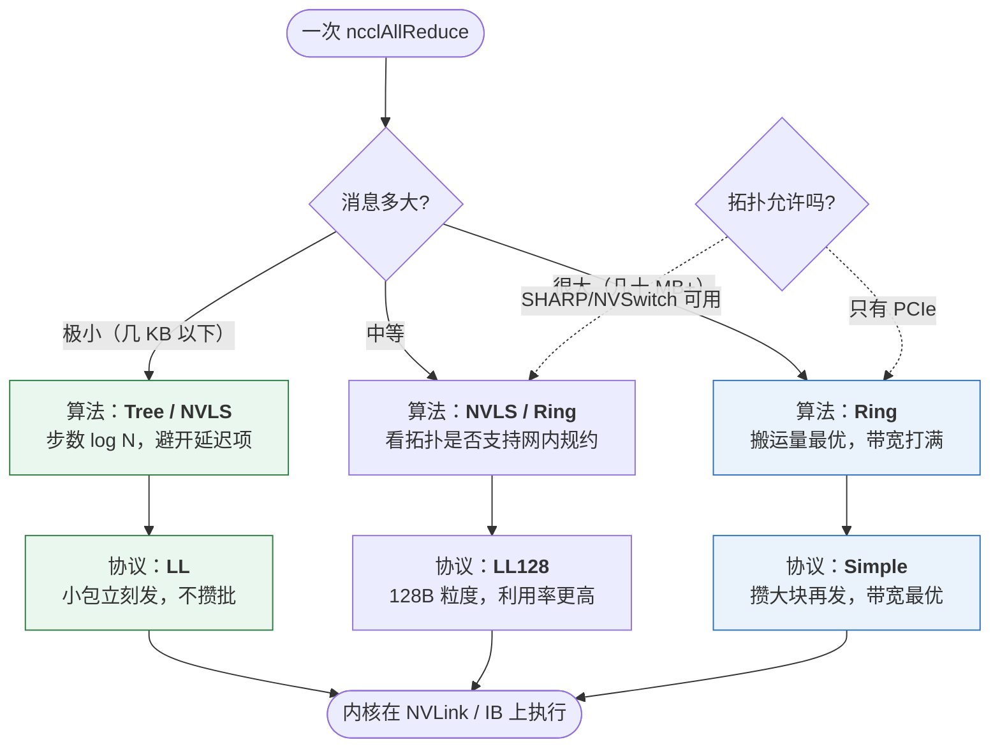

# 第 3 章　NCCL 内部：一个集合操作是怎么变成 GPU 上的数据流的

> 本章目标：能画出「`ncclAllReduce` 调用 → ring/tree 算法 → channel → NVLink/IB → 完成」的全链路，
> 并说清 NCCL 做每个决策的依据。最后给出可操作的环境变量表。

> **阅读提示**：本章 3.1–3.6 是 NCCL 的通用事实（公开文档/论文级别）；
> 3.4 的「结构体视角」、3.7–3.9 有 vLLM 源码证据，行号可直接核对。

---

## 3.1 NCCL 是什么，不是什么

**是**：NVIDIA 的集合通信库（Collective Communications Library），一个 `libnccl.so.2`。
提供 `ncclAllReduce` / `ncclAllGather` / `ncclSend` 等 C API，向下自动选择：
传输（NVLink / PCIe P2P / IB verbs / RoCE / socket）、算法（ring / tree / …）、协议（LL/LL128/Simple）、
并发度（channel 数）。

**不是**：

- 不是协议。它同时用多种底层传输。
- 不是「只在单机」或「只在多机」。单机多卡、多机多卡、单进程多卡（一个进程管多张卡）都支持。
- 不等于 `torch.distributed`。PyTorch 的 `ProcessGroupNCCL` 是**对 NCCL 的封装**，
  而 vLLM 的 **pynccl 是绕开 PyTorch 直接调用 NCCL**（原因见 ch04）。

### 核心概念

| 概念 | 含义 |
|---|---|
| **rank** | 一个参与者在 communicator 里的编号（0..N-1）。**和进程不一定一一对应** |
| **communicator（comm）** | 一组 rank + 它们之间的连接集合。一次通信的「会话」 |
| **ncclUniqueId** | 128 字节的「房间号+密码」，rank 0 生成，分发给其他 rank 用于建立连接 |
| **channel** | 一个通信**流**（stream）。数据被切成多份分到不同 channel 并行传输 → 提高带宽利用 |
| **algorithm** | ring / tree / CollNet / NVLS / PAT |
| **protocol** | LL（low-latency）/ LL128 / Simple —— 影响每步的延迟与带宽的权衡 |
| **ncclCommInitRank** | 每个 rank 用它 + uniqueId 初始化 |
| **ncclGroupStart/End** | 把多个通信操作打包，让它们并发（本质是「批量下发、一次同步」） |

**面试点：`ncclGroupStart/End` 为什么重要？**
它把 N 个独立的 P2P 操作变成一个「并发批次」，避免每个操作都串行等待。
vLLM 的 `all_gatherv` 实现就用了这个模式：把「从每个 rank 收一个变长片段」拆成 N 次
`ncclBroadcast`，用 group 包起来并发执行（`vllm/distributed/device_communicators/pynccl.py:313-326`）。

---

## 3.2 拓扑发现（topology detection）：NCCL 怎么知道谁挨着谁

NCCL 初始化时会主动探测：

1. **NVML / CUDA 驱动**：哪些 GPU、它们之间的 NVLink 连接情况。
2. **PCIe 拓扑**：`/sys/bus/pci`、`nvidia-smi topo` 同款信息，判断 GPU↔GPU、GPU↔NIC 的距离
   （PIX / PXB / PHB / SYS）。
3. **网络设备**：遍历 RDMA 设备（`/sys/class/infiniband/*`）、网口，用
   `NCCL_SOCKET_IFNAME` / `NCCL_IB_HCA` 过滤。
4. **NIC–GPU 亲和**：判断哪张网卡离哪张 GPU 近（同一 PCIe Switch / 同 NUMA），
   决定哪个 rank 用哪张网卡。**选错会明显掉带宽**。

据此 NCCL 构建一张**带权图（topology graph）**，然后：

- 决定 ring 的**节点顺序**（把"近"的卡排在一起）。
- 决定哪些 rank 之间用 NVLink、哪些走网络。
- 在有多张网卡时做**流量分摊（rail-optimized）**。

> **这解释了一个经典问题**：「为什么我手动写的 P2P all-reduce 比 NCCL 慢？」
> 因为 NCCL 已经按拓扑选好了路径，而手写代码通常假设所有对等连接等价。

**vLLM 里的对应物**：vLLM 不会自己去探测 PCIe 拓扑做路径规划（那是 NCCL 的事），
但它确实需要**判断是否"全互联"**来决定用不用自定义 all-reduce：

```python
# vllm/distributed/device_communicators/custom_all_reduce.py
fully_connected = current_platform.is_fully_connected(physical_device_ids)   # :235
if same_node and world_size > 2 and not fully_connected:                      # :236
    # → 禁用自定义 all-reduce（非全互联时 P2P 路径不可预测）
```

---

## 3.3 算法与协议：NCCL 的核心决策

### 3.3.1 算法（algorithm）

| 算法 | 适用 | 特征 |
|---|---|---|
| **Ring** | 大消息；跨机 | 带宽最优（每 rank ≈ 2S），步数 2(N−1) |
| **Tree** | 小消息；跨机 | 延迟最优（步数 2log N），带宽次优 |
| **CollNet** | 支持 SHARP 的交换机 | 把规约卸载到交换机，减少网络流量 |
| **NVLS**（NVLink SHARP） | NVLink 域内 | 用 NVSwitch 做**网内规约/多播**，避免 GPU 往返 |
| **PAT** | 特定 all-gather 场景 | 并行聚合树 |

### 3.3.2 协议（protocol）—— 延迟与带宽的三档权衡

| 协议 | 语义 | 何时用 |
|---|---|---|
| **LL**（Low Latency） | 小包立刻发，不攒批 | 极小消息（几 KB 以下）、延迟敏感 |
| **LL128** | 128 字节粒度，利用率更高（在 NVLink 上常用） | 中等消息 |
| **Simple** | 攒够大块再发，带宽利用率最高 | 大消息（几百 KB 以上） |

**核心 tradeoff**：LL 用**更多、更小的包**换低延迟；Simple 用**更少的、更大的包**换高带宽。
这正是「延迟 vs 带宽」在实现层的体现。

### 3.3.3 决策与覆盖

NCCL 会基于「消息大小 + world size + 拓扑 + 是否可用 SHARP」自动选择算法和协议。
可用环境变量**强制覆盖**（调试/实验用）：

- `NCCL_ALGO=Ring|Tree|CollNetDirect|CollNetChain|NVLS|PAT`（新版本里逐步被 `NCCL_ALGO` 的
  名称集合取代，旧名 `NCCL_PROTO` 控制协议）
- `NCCL_PROTO=LL|LL128|Simple`
- `NCCL_MIN_NCHANNELS` / `NCCL_MAX_NCHANNELS`：控制并发 channel 数

> ⚠️ **面试提醒**：不要背「NCCL 小消息用 tree」就完事。准确的表述是：
> 「NCCL 按消息大小和拓扑在 ring/tree/NVLS 间选择；小消息用步数更少的算法（tree/NVLS）以避开
> 延迟项，大消息用带宽更优的算法（ring），并用协议（LL/LL128/Simple）在同一算法内继续调整
> 延迟-带宽权衡。」

**把两层决策画成一张图**（算法层 + 协议层，这是面试里最容易只答一半的地方）：



**读图要点**：

| 层 | 决定什么 | 权衡 |
|---|---|---|
| **算法层** | 数据在 rank 之间怎么走（ring / tree / NVLS） | **步数**（延迟）vs **搬运量**（带宽） |
| **协议层** | 每个包多大、什么时候发（LL / LL128 / Simple） | **包的个数**（延迟）vs **单包效率**（带宽） |

**两层都在调同一个 tradeoff，但粒度不同** —— 所以「小消息用 tree」只是第一层，
完整的答案必须包含第二层。图中虚线框（拓扑是否允许）是第二个决策输入：
**没有 NVSwitch 就没有 NVLS**，所以拓扑会直接改变算法候选集。

---

## 3.4 从 NCCL 的结构体反推它内部关心什么（vLLM 提供的独特视角）

vLLM 为了探测 **GIN（GPU-Initiated Networking）** 支持情况，用 ctypes 声明了 NCCL 的
`ncclCommProperties` 结构体。这个结构体等于一份「NCCL 认为重要的能力清单」，非常有教学价值：

```python
# vllm/distributed/device_communicators/pynccl_wrapper.py:66-87（字段顺序即内存布局）
class ncclCommProperties(ctypes.Structure):
    _fields_ = [
        ("size", c_size_t), ("magic", c_uint), ("version", c_uint),
        ("rank", c_int), ("nRanks", c_int),
        ("cudaDev", c_int), ("nvmlDev", c_int),
        ("deviceApiSupport", c_bool),      # ← 是否支持 Device API（网内通信指令下发）
        ("multimemSupport", c_bool),       # ← 是否支持 multimem（NVLink SHARP 多播）
        ("ginType", c_int),                # ← GPU-Initiated Networking 类型
        ("nLsaTeams", c_int),              # ← LSA（Load/Store Accessible）team 数
        ("hostRmaSupport", c_bool),        # ← host 侧 RMA 支持
        ("railedGinType", c_int),
        ("commHash", c_uint64),
        ("ginMinStride", c_int), ("ginConnectionType", c_int),
        ("ginSupport", c_bool * 64),
        ("devCommRuntimeVersionSize", c_size_t),
    ]
```

逐条翻译成「为什么 AI Infra 要在乎」：

| 字段 | 含义 | 为什么重要 |
|---|---|---|
| `multimemSupport` | NVLink SHARP 的 multimem 指令支持 | 一次写就能广播/规约到多个 GPU，**省掉 N-1 次网络往返** |
| `ginType` / `ginSupport` | GPU 直接发起网络操作（GPU-Initiated Networking） | 让 GPU kernel 内部直接发 IB 包，**通信不再需要 CPU 参与、可与计算细粒度重叠**。DeepEP v2 强依赖它 |
| `deviceApiSupport` | Device API：在 kernel 内调用 NCCL 通信 | 是「通信-计算融合」的基础 |
| `nLsaTeams` | Load/Store Accessible 的团队划分 | 决定哪些对端可以用**普通 load/store 指令**直接访问（比任何消息传递都快） |
| `hostRmaSupport` | host 侧远程内存访问 | CPU 侧零拷贝访问对端内存 |

**vLLM 怎么用它**：`vllm/utils/nccl.py:86-129` 的 `query_nccl_gin_type()` 会取出通信器的
`_comm_ptr`，调用 `ncclCommQueryProperties`，返回 `props.ginType`。然后
`vllm/distributed/device_communicators/all2all.py:1043-1064` 用它做**硬性准入检查**：

```python
# all2all.py:1052-1064
gin_type = query_nccl_gin_type(group)
if gin_type is None:
    raise RuntimeError("DeepEPv2 communicator properties query failed; ...")
if gin_type == 0:
    raise RuntimeError(
        "DeepEPv2 requires NCCL GIN (GPU-Initiated Networking). "
        "This usually means IBGDA-capable InfiniBand NICs or drivers are not available. ..."
    )
```

**这是本章最有价值的一段**：它告诉你 2024+ 的 AI Infra 趋势 ——
**通信正在从「CPU 下发的消息传递」转向「GPU 自己发起的网内计算」**（NVLink SHARP、GIN、Device API）。
面试里能主动提到这个趋势，是明显的加分项。

注意 `all2all.py:1046-1050` 的工程细节：因为 `ProcessGroupNCCL` **懒创建通信器**，
vLLM 必须先做一次 `all_reduce` 探针，再查询属性，否则会拿到空的 comm 指针：

```python
probe = torch.zeros(1, device="cuda")
torch.distributed.all_reduce(probe, group=group)   # 强制创建 communicator
gin_type = query_nccl_gin_type(group)
```

---

## 3.5 Symmetric Memory（对称内存）—— 下一代集合通信的基石

### 3.5.1 问题

传统集合通信：数据在 GPU A 的私有显存里，要走消息传递（send/recv 或 RDMA）才能到 GPU B。
每次都要「打包-传输-解包」，延迟高、CPU/GPU 都要参与。

### 3.5.2 对称内存的思路

让**所有 rank 用相同的虚拟地址、相同的布局**分配一块缓冲区。于是：

- 每个 rank 都知道对端缓冲区的地址（`base + offset`）。
- 可以直接用 **load/store / memcpy** 操作对端内存，不需要消息传递。
- 硬件（NVLink SHARP / multimem）可以在网内完成规约或广播。

### 3.5.3 vLLM 的实现链（完整可追溯）

这是「一个抽象如何落地」的绝佳案例，四层：

**第 1 层：自定义 CUDA 分配器**
`vllm/distributed/device_communicators/pynccl_allocator.py` 用 `torch.utils.cpp_extension.load_inline`
编译一个极小的 C++ 垫片：

```cpp
// pynccl_allocator.py:25-34（内联源码）
void* nccl_alloc_plug(size_t size, int device, void* stream) {
    void* ptr;
    ncclResult_t err = ncclMemAlloc(&ptr, size);   // ← 必须用 NCCL 的分配器
    return ptr;
}
void nccl_free_plug(void* ptr, size_t size, int device, void* stream) {
    ncclResult_t err = ncclMemFree(ptr);
}
```

**为什么必须用 `ncclMemAlloc`**：只有 NCCL 分配的内存才能被注册为 NCCL window、才能参与 NVLS
多播。这是**强制约束**，不是优化选择。

链接时要找 `nccl.h`，vLLM 为此提供了搜索逻辑：`vllm/utils/nccl.py:39-83`
（`VLLM_NCCL_INCLUDE_PATH` → `nvidia.nccl` pip 包的 `include/` 目录）。

**第 2 层：把它接进 PyTorch 的分配体系**

```python
CUDAPluggableAllocator(f"{out_dir}/nccl_allocator.so", "nccl_alloc_plug", "nccl_free_plug")
_mem_pool = torch.cuda.MemPool(_allocator)      # pynccl_allocator.py:91-96, 110-116
```

**第 3 层：上下文管理器 —— 在池子里分配，然后注册为 window**

```python
# pynccl_allocator.py:133-198 nccl_symm_mem_context
with nccl_symm_mem_context(pynccl_comm):
    buf = torch.empty(...)      # 落在这个 MemPool 里
    pynccl_comm.all_reduce(buf) # 走 NVLS 路径
```

`__exit__` 里做关键的一步（`pynccl_allocator.py:186-196`）：

```python
_cached_pool_snapshot = _pool.snapshot()
comm_key = bytes(self.pynccl_comm.unique_id.internal)     # 按 communicator 去重
for segment in ...:
    self.pynccl_comm.register_comm_window_raw(segment["address"], segment["total_size"])
```

**第 4 层：进入 NCCL 的 window API**（`pynccl.py:539-551` → `pynccl_wrapper.py:632-644`）

```python
ncclCommWindowRegister(comm, ptr, tensor.numel() * tensor.element_size(), 1)
```

### 3.5.4 重要的工程约束（这些细节能体现你真的读过代码）

| 约束 | 证据 | 含义 |
|---|---|---|
| NCCL ≥ **2.27.3** | `pynccl_allocator.py:166-168` `assert nccl_version >= 22703` | window API 是新特性 |
| torch ≥ **2.8.0** | `pynccl_allocator.py:145` | 需要 `torch.cuda.MemPool` 的成熟实现 |
| 必须 CUDA（不支持 ROCm） | `pynccl_allocator.py:70-72` | 编译期就短路 |
| 和 **CUDA Graph** 冲突需特殊处理 | `pynccl_allocator.py:169-174` `_cuda_endAllocateToPool` / `:197` `_cuda_beginAllocateCurrentThreadToPool` | Graph 捕获期间要"暂停"graph memory pool 才能用对称内存 |
| 编译失败会**静默降级** | `pynccl_allocator.py:98-107` 打 warning 后 `_nccl_allocator_failed_to_compile = True` | 找不到 `nccl.h` 时不会崩，只是退化成普通路径 |
| 默认**关闭** | `envs.VLLM_USE_NCCL_SYMM_MEM` 默认 `0`（`vllm/envs.py:2017-2019`, `:292`） | 需要显式开启 |

**面试题**：「对称内存和自定义 all-reduce 谁快？」
→ 看消息大小，vLLM 有明确的**分档策略**（`all_reduce_utils.py`）：

```python
NCCL_SYMM_MEM_ALL_REDUCE_CONFIG = {
    "min_world_size": 4,
    "custom_ar_preferred_ranges": {
        4: (16 * KiB, 512 * KiB),   # custom_AR 在 16K–512K 区间胜出
        8: (16 * KiB, 128 * KiB),   # 8 卡时 16K–128K 区间胜出
    },
    "always_use_above_world_size": 8,   # world_size > 8 一律用对称内存
}
```

配套的 docstring（`all_reduce_utils.py` 中 `should_nccl_symm_mem_allreduce`）解释了原因：

> 小张量（≤16K）：对称内存延迟低于自定义 all-reduce；
> 大张量（8 卡 ≥128K，4 卡 ≥512K）：对称内存带宽更好；
> **中段**：自定义 all-reduce 的 P2P 方式开销低于对称内存的 copy-in/copy-out 模式。

**这是「为什么需要多种 all-reduce 实现」的最终答案**：不同大小区间的最优路径不同，
没有任何单一实现能在全区间取胜。

---

## 3.6 常用 NCCL 环境变量（运维与排障的核心武器）

### 3.6.1 网络选择（多网卡/多 HCA 环境必调）

| 变量 | 作用 | 示例 |
|---|---|---|
| `NCCL_SOCKET_IFNAME` | 选**控制面/bootstrap** 用的网口 | `=eth0` 或 `=^docker0,lo`（排除法） |
| `NCCL_IB_HCA` | 选 **RDMA 数据面**用的 HCA | `=mlx5_0,mlx5_1` 或 `=^mlx5_bond` |
| `NCCL_IB_GID_INDEX` | RoCEv2 选哪个 GID（v1/v2、哪个 VLAN） | `=3` |
| `NCCL_SOCKET_FAMILY` | IPv4/IPv6 | `=AF_INET` |
| `NCCL_IB_DISABLE` | 禁用 IB（强制走 socket，排障用） | `=1` |
| `NCCL_NET_GDR_LEVEL` | GPUDirect RDMA 的使用门槛 | `=PHB` / `=SYS` |
| `NCCL_CROSS_NIC` | 是否允许跨 NIC 通信 | `=0/1/2` |

**vLLM 的官方文档也指向这些变量**（`docs/serving/distributed_troubleshooting.md`）：

> "If you need additional environment variables for communication configuration, append them to
> `examples/ray_serving/run_cluster.sh`, for example `-e NCCL_SOCKET_IFNAME=eth0`."

**重要机制**：vLLM 用 Ray 时会**自动把这些变量传播到 worker**——
`vllm/ray/ray_env.py:37-44` 的 `DEFAULT_ENV_VAR_PREFIXES` 包含 `"NCCL_"` 和 `"UCX_"`：

```python
DEFAULT_ENV_VAR_PREFIXES: set[str] = {
    "VLLM_", "FLASH_ATTENTION_", "LMCACHE_", "NCCL_", "UCX_", "HF_", "HUGGING_FACE_",
}
```

所以**在 driver 上 export `NCCL_IB_HCA=...` 就能覆盖所有 Ray worker**。
（这也是 `docs/serving/distributed_troubleshooting.md` 强调「在集群创建时注入环境变量，
而不是只在本机 shell」的原因。）

### 3.6.2 调试

| 变量 | 作用 |
|---|---|
| `NCCL_DEBUG=INFO` | 打印拓扑探测、选中的算法/协议/传输、每 channel 的带宽估计。**排障第一步** |
| `NCCL_DEBUG=WARN` | 只打警告（生产可留） |
| `NCCL_DEBUG_SUBSYS=INIT,NET,GRAPH,TUNING` | 只打某个子系统，避免刷屏 |
| `NCCL_DEBUG_FILE=/path/nccl.%h.%p.log` | 输出到文件（`%h` 主机名，`%p` pid），多机排障必备 |
| `NCCL_DEBUG_TIMESTAMP_LEVELS` | 带时间戳/级别 |
| `NCCL_TOPO_DUMP_FILE` | 把**探测到的**拓扑图 **dump 出来**成 XML | 
| `NCCL_GRAPH_DUMP_FILE` | 把**搜索到的**通信图 dump 成 XML（看 NCCL 最终选了哪些路径） |

> ⚠️ **一对容易混的变量**（面试小陷阱）：
> - `NCCL_TOPO_DUMP_FILE` / `NCCL_GRAPH_DUMP_FILE` 是 **dump（写出）**，用于事后分析；
>   配合 `ncclTopoVisual` / `ncclGraphVisual` 可以画成图。
> - `NCCL_TOPO_FILE` / `NCCL_GRAPH_FILE` 是 **load（读入）**，用于**覆盖** NCCL 自己的探测结果
>   （调试/绕过探测 bug 时才用，不是常规手段）。
>
> **日常检查拓扑用 `nvidia-smi topo -m`（人眼核对）就够；要深挖 NCCL 的决策才 dump。**

### 3.6.3 性能调优

| 变量 | 作用 |
|---|---|
| `NCCL_ALGO` | 强制算法：`Ring`,`Tree`,`NVLS`,`CollNetChain`,`CollNetDirect`,`PAT` |
| `NCCL_PROTO` | 强制协议：`LL`,`LL128`,`Simple` |
| `NCCL_MIN_NCHANNELS` / `NCCL_MAX_NCHANNELS` | channel 数（并发度）。channel 越多，小消息延迟可能越差、大消息带宽越好 |
| `NCCL_BUFFSIZE` | 每 channel 缓冲大小（默认通常 4 MiB）。跨机大消息可加大 |
| `NCCL_NTHREADS` | 每 block 的线程数 |
| `NCCL_NSOCKS_PERTHREAD` / `NCCL_SOCKET_NTHREADS` | socket 传输的并行度（无 RDMA 时重要） |
| `NCCL_IB_QPS_PER_CONNECTION` | 每连接的 QP 数（多 QP 可提升带宽） |
| `NCCL_IB_TIMEOUT` / `NCCL_IB_RETRY_CNT` | IB 超时/重试，**大集群排障常调** |
| `NCCL_P2P_LEVEL` | P2P 使用门槛（`NVL`/`PIX`/`PXB`/`PHB`/`SYS`），调低可避免慢路径 |
| `NCCL_P2P_DISABLE` | 禁用 P2P（排障 false-sharing/ hang 问题） |
| `NCCL_SHM_DISABLE` | 禁用共享内存传输（排障用） |

### 3.6.4 与 vLLM 自身变量的区别（别搞混）

| 变量 | 归属 | 作用 |
|---|---|---|
| `NCCL_*` | NCCL 自己读 | 网络/算法/调试 |
| `VLLM_NCCL_SO_PATH` | vLLM | 覆盖 `libnccl.so.2` 路径（`vllm/utils/nccl.py:23`） |
| `VLLM_NCCL_INCLUDE_PATH` | vLLM | 编译对称内存垫片时找 `nccl.h`（`vllm/envs.py:2021`） |
| `VLLM_USE_NCCL_SYMM_MEM` | vLLM | 开关对称内存（默认 0） |
| `VLLM_DISABLE_PYNCCL` | vLLM | 禁用 pynccl（`vllm/envs.py:1238-1240`），强制走 torch.distributed |
| `VLLM_ALLREDUCE_USE_SYMM_MEM` | vLLM | 开关 **torch** 对称内存 all-reduce（默认 1，`vllm/envs.py:1888-1890`） |
| `VLLM_ALLREDUCE_USE_FLASHINFER` | vLLM | 开关 FlashInfer all-reduce（默认 1，`vllm/envs.py:1892-1894`） |

---

## 3.7 NCCL 的传输层：一份对照表

NCCL 支持多种传输，vLLM 的代码里能间接看到它们的影子：

| 传输 | 触发条件 | 特征 | vLLM 相关实体 |
|---|---|---|---|
| **NVLink（P2P）** | 同一 NVLink 域 | 最快，硬件直连 | custom all-reduce 也走这条路 |
| **PCIe（P2P）** | 同机有 P2P 能力 | 次快 | `gpu_p2p_access_check`（`all_reduce_utils.py`） |
| **NVLS / multimem** | NVSwitch + 对称内存 | 网内规约/多播 | `VLLM_USE_NCCL_SYMM_MEM` |
| **IB verbs** | 有 IB HCA | RDMA，主流跨机 | DeepEP / NIXL 也用它 |
| **RoCE** | 有 RoCE HCA | 以太网上的 RDMA | 需要 PFC/ECN |
| **socket（TCP）** | 兜底 / bootstrap | 最慢 | 控制面用（vLLM 另有 shm+zmq 方案） |
| **SHM（共享内存）** | 同机进程间 | 快，但占 host 内存 | `NCCL_SHM_DISABLE` 可关 |

---

## 3.8 版本演进与「什么时候需要升级 NCCL」

从 vLLM 代码里可以直接读出 NCCL 的版本要求（这是一份很实用的对照表）：

| 能力 | 需要的 NCCL 版本 | 证据 |
|---|---|---|
| 基础集合通信 | 任意 | — |
| `ncclCommWindowRegister`（对称内存） | **≥ 2.27.03** | `pynccl_wrapper.py:415-416` 的 warning 文案 |
| 对称内存的完整支持 | **≥ 2.27.3**（raw 版本 `22703`） | `pynccl_allocator.py:166-168` |
| `ncclCommSuspend` / `ncclCommResume` | **≥ 2.29.7** | `pynccl.py:557-563` 的 `warning_once` 文案 |
| `ncclCommQueryProperties` | **≥ 2.29**（更老版本是可选的） | `pynccl_wrapper.py:424-426` |
| DeepEP v2（GIN 路径） | **≥ 2.30.4**（raw `23004`） | `vllm/utils/import_utils.py:456` `DEEPEP_V2_MIN_NCCL_VERSION_RAW = 23004` |
| vLLM 声明的结构体布局 | **2.31.2** | `pynccl_wrapper.py:63` `NCCL_COMM_PROPERTIES_LAYOUT_VERSION = 23102` |

**注意一个真实的坑**：PyTorch 自带的 NCCL 往往比最新版旧。所以
`docs/serving/expert_parallel_deployment.md` 明确写了：

> "The `deepep_v2` backend requires NCCL >= 2.30.4. **PyTorch ships an older NCCL**,
> so you must upgrade it before building or running DeepEP."

**面试题**：「你怎么知道该用哪个 NCCL 版本？」
→ ① 看框架的硬性要求（如上表）；② `python -c "import torch; print(torch.cuda.nccl.version())"`
看 PyTorch 编进去的；③ vLLM 会在首次初始化 pynccl 时打印 `vLLM is using nccl==X.Y.Z`
（`pynccl.py:117-120`）；④ `VLLM_NCCL_SO_PATH` 可以指向自己装的 NCCL 而不重装 PyTorch。

---

## 3.9 NCCL 的能力边界（什么时候必须绕开它）

这个清单直接对应 ch04 里 vLLM 为什么要自研这么多个 all-reduce/all-to-all 实现：

| 限制 | 后果 | vLLM 的应对 |
|---|---|---|
| **启动开销大**（建连、拓扑探测、channel 创建） | 小消息每次都有 μs 级固定成本 | **custom all-reduce**（P2P + CUDA Graph） |
| **不能在 CUDA Graph 捕获期间初始化** | capture 时报错或卡住 | **pynccl**（绕开 `torch.distributed` 的 CUDA API 调用）* |
| **all-to-all 不是一等公民**（长期缺 `ncclAllToAll`，需用 Send/Recv 拼） | MoE 场景效率低 | **DeepEP / NIXL / FlashInfer / AG-RS** 多后端 |
| **跨机小消息延迟下不来** | 跨机 TP 不可行 | 架构上用 PP/DP 替代跨机 TP |
| **规约必须经 GPU** | 网络被浪费 | **SHARP / NVLS**（网内规约）；对称内存 |
| **控制面不适合用它** | 死锁风险、GPU 同步 | vLLM 用 **shm + ZeroMQ** 做控制面 |

\* **这是 pynccl 存在的第一原因**，代码注释写得很直接
（`vllm/distributed/device_communicators/pynccl_wrapper.py:4-12` 附近的文件头注释）：
cupy 在 comm init 时会卡住，`torch.distributed` 会调用 CUDA Graph 捕获期间被禁止的 CUDA API，
所以 vLLM 选择用 ctypes 直接 `dlopen` NCCL。

---

## 3.10 本章自检题

1. 画出 `ncclAllReduce` 从调用到完成的 5 个层次。
2. `ncclUniqueId` 多大？谁生成？怎么分发？（vLLM 里怎么分发的？）
3. NCCL 的三种 protocol 是什么？各自的 tradeoff？
4. 为什么「小消息 tree、大消息 ring」？
5. `ncclGroupStart/End` 解决什么问题？vLLM 里哪个函数用了它？
6. 对称内存为什么必须用 `ncclMemAlloc` 分配？（提示：window 注册的前置条件）
7. `multimemSupport` 和 `ginType` 分别代表什么能力？为什么 2024 年后的推理框架开始依赖它们？
8. 多网卡机器上 NCCL 走错网卡，你改哪个变量？如果是 RoCE 还可能要改哪个？
9. 列出 vLLM 因为 NCCL 的哪两个限制而自研了替代实现。

**下一章**：[`ch04-vllm-distributed.md`](ch04-vllm-distributed.md) —— 把本章的能力与限制，
落到 vLLM 真实的 8 路 all-reduce 选择链和 6 种 all-to-all 后端上。
