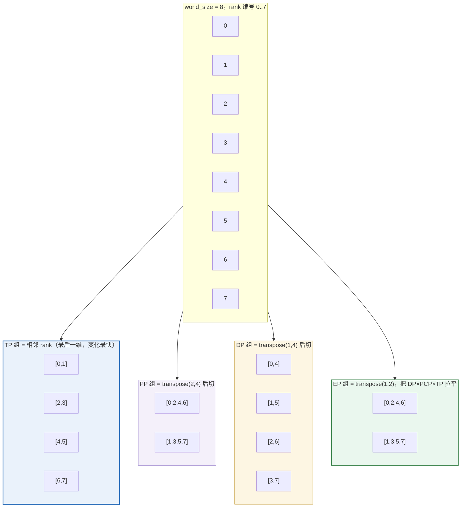
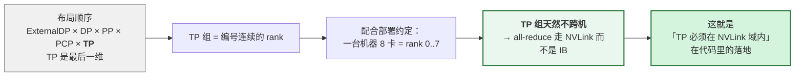
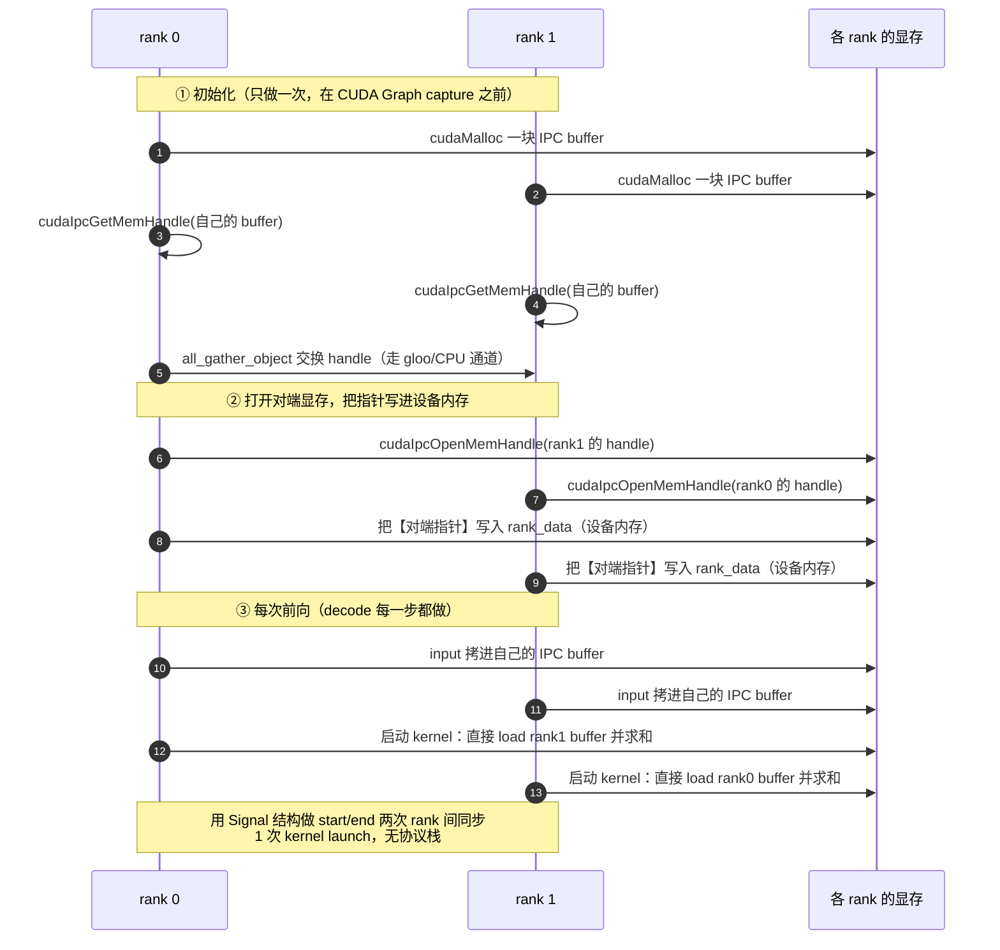

# 第 4 章　vLLM × NCCL：真实代码里的通信规划

> 本章是主干。目标：能画出 vLLM 从「模型代码调用一次 all-reduce」到「NVLink/IB 上跑数据」的**完整链路**，
> 并解释**每一个选择为什么是这样**。
>
> **阅读方式**：每节都有 `文件:行号` 引用。建议边读边在仓库里跳转核对。
> 行号可能随版本漂移，**符号名（类/函数）稳定**，用符号名搜索即可。

---

## 4.0 先看 vLLM 要解决的四类通信问题

| # | 问题 | 需求特征 | vLLM 的选择 |
|---|---|---|---|
| 1 | **TP 的 all-reduce** | 每层都做、消息小（16–32 KiB）、延迟敏感、**延迟必须亚 μs 级** | 自研 **custom all-reduce**（P2P + CUDA Graph）+ 对称内存 + FlashInfer 多档 |
| 2 | **PP 的 P2P 传 activation** | 点对点、量小、频率低 | `send`/`recv`（**不是**集合操作） |
| 3 | **EP 的 all-to-all** | 变长消息、负载不均、要能和计算重叠 | **6 种后端**可选（DeepEP/NIXL/FlashInfer/MoRI/AG-RS） |
| 4 | **控制面**（谁处理哪个请求、配置下发、权重更新） | 字节级、不能碰 GPU、不能死锁 | **共享内存 + ZeroMQ**（`shm_broadcast.py`）/ StatelessProcessGroup |

**一句话总结 vLLM 的通信哲学**：

> **数据面把 NCCL 用到极致，但在 NCCL 不够快的地方毫不犹豫地绕开它；
> 控制面完全不碰 NCCL。**

---

## 4.1 并行组拓扑：一张「8 卡为什么这么分组」的图

### 4.1.1 布局顺序

`vllm/distributed/parallel_state.py:1977` 给出了全局布局：

```python
# the layout order is: ExternalDP x DP x PP x PCP x TP
all_ranks = torch.arange(world_size).reshape(
    -1, data_parallel_size, pipeline_model_parallel_size,
    prefill_context_model_parallel_size, tensor_model_parallel_size,
)   # parallel_state.py:1986-1992
```

**读法**：把 0..world_size-1 按这个形状 reshape，**最后一维（TP）变化最快**。
所以 **TP 组永远是相邻的 rank** —— 这是刻意的：

> `parallel_state.py:1936-1939`（`initialize_model_parallel` 的 docstring）：
> *"Note that for efficiency, the caller should make sure adjacent ranks are on the same
> DGX box. For example if we are using 2 DGX-1 boxes with a total of 16 GPUs, rank 0 to 7
> belong to the first box and ranks 8 to 15 belong to the second box."*

**这就是第 1 章「TP 必须在 NVLink 域内」在代码里的落地**：vLLM 用 rank 编号的**低位**表示 TP，
配合「一个节点 8 卡 = rank 0..7」的部署约定，TP 组天然不跨机。

### 4.1.2 每种组怎么切出来：transpose + reshape 技巧

核心技巧：**想按某个维度分组，就把那个维度 transpose 到最后一维，再 reshape 成 2D，然后 unbind。**

| 组 | 代码 | 含义 |
|---|---|---|
| **TP** | `all_ranks.view(-1, TP).unbind(0)` (`:1997`) | 最后一维直接切 |
| **PP** | `all_ranks.transpose(2, 4).reshape(-1, PP).unbind(0)` (`:2051`) | 把 PP 维换到最后 |
| **DP** | `all_ranks.transpose(1, 4).reshape(-1, DP).unbind(0)` (`:2068`) | 把 DP 维换到最后 |
| **EP** | `all_ranks.transpose(1, 2).reshape(-1, DP*PCP*TP).unbind(0)` (`:2087-2096`) | **把 DP 和 PP 换位**，于是 (DP, PCP, TP) 三个维度被拉平成一个 EP 组 |
| **DCP/PCP** | `transpose(3,4)` / `transpose(1,2)` (`:2032`, `:2039`) | 同上 |

**关键洞察（EP 那行）**：`EP_SIZE = DP × PCP × TP`。
`transpose(1, 2)` 把 DP 维和 PP 维交换，reshape 后每个 EP 组 = 同一个 PP 阶段内的所有
(DP, PCP, TP) 组合。

**为什么 EP 要跨 DP 和 TP？**
- 专家权重需要尽可能分散到更多 GPU 上（EP 的核心价值）；
- 同一个 PP 阶段内的 GPU 才是「同时活跃」的（PP 是串行的流水线），所以 EP 组不能跨 PP。

> `vllm/distributed/device_communicators/base_device_communicator.py:47` 的注释印证了这一点：
> `# all2all lives in ep group, which is merged from dp and tp group`

**EP 组只在 MoE 模型上创建**（`parallel_state.py:2086`）：

```python
if config.model_config is None or config.model_config.is_moe:
    ...  # 创建 _EP
# If no EP group needed, _EP remains None
```

**EPLB 组是独立创建的**，注释解释了原因（`parallel_state.py:2117-2120`）：

> *"Create EPLB group with the same ranks as EP if EPLB is enabled. This is a separate process
> group to isolate EPLB communications from MoE forward pass collectives and prevent deadlocks
> when using torch.distributed in execution with torch.distributed in EPLB."*

**这是一个可以直接用在面试里的设计原则**：**功能不同的通信流要隔离到不同的 process group**，
避免「重平衡的 all-reduce」和「前向的 all-to-all」互相阻塞。

### 4.1.3 一个具体例子（TP=2, PP=2, DP=2, 共 8 卡）

```
world_size = 8，布局 [DP, PP, PCP, TP] = [2, 2, 1, 2]

all_ranks = arange(8).reshape(2, 2, 2, 1, 2)
  rank 0 1 | 2 3 | 4 5 | 6 7   ← 按最后一维（TP）成对

TP 组（view(-1,2)）：  [0,1] [2,3] [4,5] [6,7]              ← 4 个，相邻
PP 组（transpose(2,4)）：[0,2,4,6] [1,3,5,7]                ← 2 个
DP 组（transpose(1,4)）：[0,4] [1,5] [2,6] [3,7]            ← 4 个
EP 组（transpose(1,2) → reshape(-1, DP*PCP*TP=4)）：
                        [0,2,4,6] [1,3,5,7]                 ← 2 个，各 4 卡
```

**注意 EP 组和 PP 组在这里恰好重合（都是 [0,2,4,6]）** —— 这不是巧合：
两者的含义都是「同一个 DP 内的所有非 PP 维度」。

**这张图是上面那个 reshape 的可视化**（同一个 8 卡例子，看四种组如何交叉切割）：



**为什么 TP 必须是相邻 rank**（这是全篇最关键的设计约束）：



反过来看：**EP 组跨 DP×TP**，所以它**可以跨机**（这也正是 EP 能扩展到多节点的原因）。
**一个布局顺序，同时解释了「TP 为什么不能跨机」和「EP 为什么能」。**


---

## 4.2 `GroupCoordinator`：vLLM 对通信的抽象层

（`vllm/distributed/parallel_state.py:421`）

### 4.2.1 为什么需要它（类 docstring，`:422-429`）

> *"PyTorch ProcessGroup wrapper for a group of processes. PyTorch ProcessGroup is bound to
> one specific communication backend, e.g. NCCL, Gloo, MPI, etc. GroupCoordinator takes charge
> of all the communication operations among the processes in the group. **It manages both CPU
> and device communication.**"*

**核心设计：每个组有两个 ProcessGroup**（`:444-445`）：

```python
cpu_group: ProcessGroup      # 走 gloo，用于 CPU 侧协调
device_group: ProcessGroup   # 走 nccl，用于 GPU 集合通信
```

创建代码（`:496-513`）：

```python
device_group = torch.distributed.new_group(ranks, backend=torch_distributed_backend, ...)
# a group with `gloo` backend, to allow direct coordination between
# processes through the CPU.
with suppress_stdout():
    cpu_group = torch.distributed.new_group(ranks, backend="gloo", ...)
```

**为什么必须有两个？** 这是理解 vLLM 通信架构的关键：

| 场景 | 用哪个组 | 原因 |
|---|---|---|
| 传 tensor（all-reduce / all-gather） | `device_group`（NCCL） | 走 GPU 直连，快 |
| 传 Python 对象（元数据、配置、形状） | `cpu_group`（gloo） | 不需要 GPU，且**NCCL 不支持任意对象** |
| 交换 NCCL unique_id | `cpu_group`（gloo） | **鸡生蛋问题**：NCCL 还没建好，只能用 CPU 通道交换 |
| 同步 waiting（barrier） | `cpu_group` | 避免 GPU 空转 |

**「鸡生蛋」这一条特别值得记**：pynccl 初始化时要先把 rank 0 的 `ncclUniqueId` 发给其他 rank，
而这件事**不能**用 NCCL 做。vLLM 的解法（`pynccl.py:126-134`）：

```python
torch.ByteTensor(list(self.unique_id.internal))     # 128 字节
ranks = dist.get_process_group_ranks(group)
dist.broadcast(tensor, src=ranks[0], group=group)   # 走 gloo！
```

**面试题**：「NCCL 通信器怎么初始化的？第一个字节是怎么传的？」
→ `ncclGetUniqueId()` 生成 128 字节 uniqueId，通过 **gloo**（或 StatelessProcessGroup 的
socket broadcast）分发，然后每个 rank 用它调 `ncclCommInitRank`。**引导通道不能是 NCCL 自己。**

### 4.2.2 设备通信器的委派

`GroupCoordinator` 自己不实现通信，而是委派给**平台相关的 `DeviceCommunicatorBase`**
（`:544-554`）：

```python
if use_device_communicator and self.world_size > 1:
    device_comm_cls = resolve_obj_by_qualname(
        current_platform.get_device_communicator_cls()
    )
    self.device_communicator = device_comm_cls(
        cpu_group=self.cpu_group, device=self.device,
        device_group=self.device_group, unique_name=self.unique_name,
        use_all2all=use_all2all,
    )
```

**这是 vLLM 支持多硬件后端（CUDA/ROCm/XPU/CPU/TPU）的关键抽象**：
`CudaCommunicator` / `XpuCommunicator` / `CpuCommunicator` 各自实现。

**注意 `unique_name` 的作用**：它是「这个组是谁」的身份标识，后面用来判断
「这个组是不是 TP 组」（因为只有 TP 组才配用 custom all-reduce）。
生成逻辑在 `_get_unique_name`（`:141-145`），格式是 `"tp:0"`、`"ep:1"` 这样。

### 4.2.3 通信方法的两个「套路」

**套路 1：world_size == 1 直接返回**（几乎每个方法开头都有）：

```python
def all_reduce(self, input_: torch.Tensor) -> torch.Tensor:
    # Bypass the function if we are using only 1 GPU.
    if self.world_size == 1:
        return input_                      # parallel_state.py:737-739
```

→ **单卡零开销**。这是一个贯穿全代码库的模式（`all_gather` 的 `:753-755`、`reduce_scatter`、
`broadcast_tensor_dict` 等）。面试里问「vLLM 单卡有通信开销吗」→ 没有，全部短路。

**套路 2：自定义 op 分发**（为了 `torch.compile`）：

```python
def all_reduce(self, input_: torch.Tensor) -> torch.Tensor:
    ...
    if self.use_custom_op_call:
        return torch.ops.vllm.all_reduce(input_, group_name=self.unique_name)
    else:
        return self._all_reduce_out_place(input_)          # :741-744
```

docstring 解释了三个约束（`:723-736`，**这段值得原样读**）：

> *"We need this because Dynamo does not support passing an arbitrary object (`self` in this
> case) to a custom op. We need to pass the group name as a string, and then look up the group
> coordinator from the group name, dispatch the all-reduce operation to the group coordinator.
> **In addition, PyTorch custom ops do not support mutation or returning a new tensor in the
> same op. So we always make the all-reduce operation out-of-place.**"*

**这是一个非常真实的工程约束**：`torch.compile` 的自定义 op 不能原地修改输入。
所以 vLLM 的 all-reduce 是 **out-of-place**（多分配一次显存，但换来可编译）。

---

## 4.3 TP 在模型代码里长什么样

### 4.3.1 `RowParallelLinear`：all-reduce 的源头

（`vllm/model_executor/layers/linear.py:1750-1776`）

```python
def forward(self, input_):
    if self.input_is_parallel:
        input_parallel = input_
    else:
        # 输入是完整的，需要按 TP 切成片（每卡算自己那份）
        split_input = split_tensor_along_last_dim(input_, num_partitions=self.tp_size)
        input_parallel = split_input[self.tp_rank].contiguous()

    # Only fuse bias add into GEMM for rank 0 (this ensures that
    # bias will not get added more than once in TP>1 case)
    bias_ = None if (self.tp_rank > 0 or self.skip_bias_add) else self.bias
    output_parallel = self.quant_method.apply(self, input_parallel, bias_)

    if self.reduce_results and self.tp_size > 1:
        output = tensor_model_parallel_all_reduce(output_parallel)   # ← 通信在这里
    else:
        output = output_parallel
```

**并行的数学原理**（这是面试白板题）：

```
Row-parallel:   Y = X · W           W 按「输入维」切成 W_i
  每张卡算：     Y_i = X_i · W_i     （部分和！不是最终结果）
  必须 all-reduce：Y = Σ_i Y_i

Column-parallel: Y = X · W          W 按「输出维」切成 W_i
  每张卡算：     Y_i = X · W_i       （结果就是最终结果的一部分）
  不需要通信（除非下一层需要完整输入 → all-gather）
```

**关键**：**row-parallel 产生「部分和」，所以必须 all-reduce；column-parallel 产生「切片」，所以不需要。**
这解释了 `linear.py:1769` 的 all-reduce 和 `linear.py:606` 的 all-gather（仅当 `gather_output=True`）。

**为什么这样切pair？** 因为两个 column-parallel 可以连在一起不用通信
（QKV 投影 → attention → o_proj 是 row-parallel），一对 column+row 每层**只需一次 all-reduce**。
标准 transformer 有两对（attention 的 o_proj、MLP 的 down_proj），所以是**每层 2 次 all-reduce**
—— 这正是第 1 章手算用的数字。

### 4.3.2 `reduce_results` 与 bias 的坑

```python
bias_ = None if (self.tp_rank > 0 or self.skip_bias_add) else self.bias
```

**为什么 bias 只在 rank 0 加？** 因为 bias 会被加上 `tp_size` 次（每个 rank 的 GEMM 都加一次），
all-reduce 是求和 → bias 被放大 tp_size 倍。所以只在 rank 0 加。
（另一个方案是加 `bias/tp_size`，vLLM 选了前者。）

**面试题**：「TP 下 bias 怎么处理？」→ 上面这段。这是典型的「读代码才知道」的细节。

### 4.3.3 语义层：`communication_op.py`

`vllm/distributed/communication_op.py` 只有 43 行，是一层**语义别名**：

```python
def tensor_model_parallel_all_reduce(input_):
    """All-reduce the input tensor across model parallel group."""
    return get_tp_group().all_reduce(input_)
```

> ⚠️ **一个容易踩的坑**：在当前的 vLLM 里，`tensor_model_parallel_all_reduce` 这样的函数
> **几乎只在这一个文件里定义，模型代码已经大量改用 `get_tp_group().all_reduce(...)` 直接调用**。
> 所以 grep `tensor_model_parallel_all_reduce` 只能找到 `communication_op.py`，
> 不要因此以为 TP 通信没了 —— 它只是换了调用风格。

---

## 4.4 【本节核心】一次 all-reduce 的完整旅程：8 路后端选择链

这是全章最有价值的一节。**面试问「vLLM 的 all-reduce 怎么实现的」，答案就是这条链。**

### 4.4.1 入口：`CudaCommunicator.all_reduce`

（`vllm/distributed/device_communicators/cuda_communicator.py:305-377`）

按代码的**实际执行顺序**（第一个匹配就返回）：

| # | 后端 | 判据 | 行号 |
|---|---|---|---|
| 1 | **NCCL 对称内存**（NVLS） | `should_nccl_symm_mem_allreduce(world_size, input_)` | 315-322 |
| 2 | **QuickReduce**（ROCm） | `qr_comm.should_quick_allreduce(input_)` | 323-331 |
| 3 | **FlashInfer PCIe IPC** | `fi_pcie_ipc_ar_comm.should_use(input_)` | 332-334 |
| 4 | **FlashInfer**（mnnvl/trtllm） | `use_fi_ar`（`should_use_fi_ar`） | 335-339 |
| 5 | **AITER custom**（ROCm） | `aiter_ar_comm.should_custom_ar(input_)` | 340-348 |
| 6 | **vLLM custom all-reduce** | `ca_comm.should_custom_ar(input_)` | 349-357 |
| 7 | **torch 对称内存** | `symm_mem_comm.should_use_symm_mem(input_)` | 358-362 |
| 8 | **PyNCCL** | 兜底 | 363-377 |
| 8b | **`torch.distributed`** | pynccl 不可用或返回 None | 364-367, 370-377 |

**⚠️ 一个真实的陷阱**（值得在面试里提，显示你真的读过代码）：
启动日志函数 `_log_all_reduce_backend_selection`（`:233-252`）打印的顺序是
`FLASHINFER_PCIE_IPC, FLASHINFER, NCCL_SYMM_MEM, QUICK_REDUCE, ...`，
**与实际 dispatch 顺序不同**。它的 docstring 自己也说明了这只是「可能的子集，不是顺序」（`:234-241`）。
**不要用日志顺序推断优先级。**

### 4.4.2 构造期（哪些后端会被创建）

（`:50-161`）

```python
if "tp" not in unique_name:
    # custom allreduce or torch symm mem can be used only by tp
    use_custom_allreduce = False
    use_torch_symm_mem = False
    ...                                    # :50-56
else:
    use_custom_allreduce = _ENABLE_CUSTOM_ALL_REDUCE          # :60
    use_torch_symm_mem = envs.VLLM_ALLREDUCE_USE_SYMM_MEM     # :61
    # FlashInfer all-reduce does not provide a fixed reduction order.
    use_flashinfer_allreduce = (
        envs.VLLM_ALLREDUCE_USE_FLASHINFER and not envs.VLLM_BATCH_INVARIANT
    )                                                          # :62-65
```

**三条重要规则**：

1. **只有 TP 组能用这些高级 all-reduce**（`:50-51` 注释）。因为其它组（DP/EP/PP）的
   消息特征不同，且这些实现都假设「同一批 GPU 反复做同样大小的 all-reduce」。
2. **`VLLM_BATCH_INVARIANT` 会禁用 FlashInfer** —— 理由写在注释里：
   *"FlashInfer all-reduce does not provide a fixed reduction order."*
   **这是一个极好的例子说明「性能 vs 可复现性」的取舍**：
   浮点加法不满足结合律，`(a+b)+c ≠ a+(b+c)`，所以改变规约顺序会改变结果。
   需要 bitwise 可复现（batch invariance）时，必须放弃最快的实现。
   同理 `symm_mem.py:114` 和 `all_reduce_utils.py:136` 也检查这个变量。
3. **AITER 会替代 vLLM 自己的 custom AR**（`cuda_communicator.py:141-149` 的
   `use_custom_allreduce and self.aiter_ar_comm is None`），而 QuickReduce 是
   **补充**（ROCm 上两者都建）。

### 4.4.3 为什么需要 7 种实现？—— 按「消息大小 × 硬件」分档

这是理解整套设计的钥匙。看 `all_reduce_utils.py` 里的**调优表**：

**custom all-reduce 的最大适用大小**（`CUSTOM_ALL_REDUCE_MAX_SIZES`，`all_reduce_utils.py:31-56`）：

| 设备算力 | TP=2 | TP=4 | TP=6 | TP=8 |
|---|---|---|---|---|
| 9.0（H100/H200） | 64 MiB | 32 MiB | 512 KiB | **256 KiB** |
| 10.0（B200） | 2 MiB | 2 MiB | 1 MiB | 1 MiB |
| 10.3（B300） | 4 MiB | 4 MiB | 8 MiB | 4 MiB |

**读出来的信息**：
- H100 上 TP=8 只有 256 KiB 的适用范围！**超过就回退到 NCCL**。
- 这解释了为什么 **decode 阶段（小消息）必须用 custom AR，而 prefill（大消息）用 NCCL**。
- B200 的适用范围反而更小（2 MiB → 说明 NCCL 在新硬件上相对更强，或者 custom AR 的
  优势区间变了）。**这张表是实测调出来的，代码注释说 "based on H100 and GB200 benchmarks"。**

**对称内存 vs custom AR 的分档**（`NCCL_SYMM_MEM_ALL_REDUCE_CONFIG`，`all_reduce_utils.py:109-118`）：

```python
{
    "min_world_size": 4,
    "custom_ar_preferred_ranges": {
        4: (16 * KiB, 512 * KiB),   # TP=4 时，16K–512K 用 custom AR
        8: (16 * KiB, 128 * KiB),   # TP=8 时，16K–128K 用 custom AR
    },
    "always_use_above_world_size": 8,   # >8 卡一律用对称内存
}
```

配套 docstring（`should_nccl_symm_mem_allreduce`）：

> *"Based on H100 and GB200 benchmarks, NCCL symm_mem is preferred for:*
> *- Small tensors (≤16K): Lower latency than custom_AR*
> *- Large tensors (≥128K for 8 GPUs, ≥512K for 4 GPUs): Better bandwidth*
> *Custom_AR is preferred for mid-range sizes where its P2P approach has lower overhead than
> the symm_mem copy-in/copy-out pattern."*

**结论（面试可直接用）**：

> vLLM 的 all-reduce 不是一个实现，而是**按「消息大小 × world size × GPU 架构」分档的
> 一组实现 + 实测调优的切换阈值**。原因是不同区间的最优路径不同：
> 极小消息看**延迟**（对称内存的固定开销更低），中段看**额外拷贝开销**（custom AR 的
> 直接 P2P 不需要 copy-in/copy-out），大消息看**带宽**（对称内存的 NVLS 多播更好）。

### 4.4.4 vLLM custom all-reduce 深入：为什么它能比 NCCL 快

#### 硬件机制：CUDA IPC + P2P

（`custom_all_reduce.py:579-598`）

```python
@staticmethod
def create_shared_buffer(size_in_bytes, group=None, uncached=False) -> list[int]:
    pointer = ops.allocate_shared_buffer_and_handle(size_in_bytes)   # C++ 侧 cudaMalloc
    handle = ops.get_shared_buffer_handle(pointer)
    handles = [None] * dist.get_world_size(group)
    dist.all_gather_object(handles, handle, group)                    # 交换 IPC handle
    ipc_ptrs = []
    for i in handles:
        if i is None: continue
        if isinstance(i, int):
            ipc_ptrs.append(i)
        else:
            ipc_ptrs.append(ops.open_mem_handle(i))                   # cudaIpcOpenMemHandle
    return ipc_ptrs
```

C++ 侧（`csrc/libtorch_stable/custom_all_reduce.cu` 附近）用
`cudaIpcGetMemHandle` / `cudaIpcOpenMemHandle(..., cudaIpcMemLazyEnablePeerAccess)`。

**核心思想**：
1. 每个 rank 分配一块显存，通过 IPC handle 交换。
2. 每个 rank 打开**所有对端**的 handle，得到一组「对端显存指针」。
3. 把这些指针**写进设备内存**（`rank_data`），kernel 里直接 `ptrs[i][offset]` 读写对端显存。
4. 用一个轻量的信号量（`Signal{start[36][16], end[36][16]}`，见 `csrc/custom_collective_common.cuh`）
   做 rank 间同步。

**为什么快**：
- **没有 NCCL 的协议栈开销**：不需要建连、不需要 channel 调度、不需要协议协商。
- **一次 kernel launch 完成**：one-shot 算法下，每个 block 直接读所有 rank 的数据并求和。
- **可以在 CUDA Graph 里捕获**：kernel 参数（对端指针）在 capture 时已固定。

**把「谁在什么时候做了什么」画成时序图**（这是理解它为什么需要 IPC 的关键）：



**三个设计要点（图里能看出来）**：

| 观察 | 为什么这么做 |
|---|---|
| **handle 交换走 CPU 通道**（`all_gather_object`） | 此时 NCCL 通信器还没建好；而且 handle 是 Python 对象（「鸡生蛋」问题，见 §4.2.1） |
| **对端指针要写进设备内存**（`rank_data`） | CUDA Graph 要求 kernel 参数在 capture 时固定，不能每次当参数传 |
| **需要 Signal 做两次同步**（start/end） | 直读对端显存必须保证「对方已经写完、还没覆盖」 |

> 第 2 点就是 `custom_all_reduce.py:281-284` 那段注释说的：
> *"Each registered tuple contains at most 16 addresses. Allocating 8MB is enough for
> 65536 such tuples. The largest model uses fewer than 10000 registered tuples."*
> —— **8 MiB 的 rank_data 是按「最多 16 个地址 × 65536 组」倒推出来的。**

#### CUDA Graph 的适配（这是最巧的部分）

docstring（`custom_all_reduce.py:270-271`）：

> *"This is a pre-registered IPC buffer. In eager mode, input tensors are first copied into
> this buffer before the operation is performed"*

以及 `csrc/custom_all_reduce.cuh` 附近的注释解释为什么需要 `rank_data`：

> *"For cuda graph to work, all kernel arguments must be fixed during graph capture time.
> However, the peer pointers are not known during graph capture time. ... 1. Graph capture.
> 2. Each rank obtains the IPC handles ... 3. (In Python) all gather the IPC handles.
> 4. Obtain the peer pointers by opening the IPC handles, and store them in the rank data
> array at corresponding positions."*

**流程**（`custom_all_reduce.py:371-391`）：
1. `capture()` context manager 开始。
2. Graph 捕获时，all-reduce 的输入先 **copy 进预注册的 IPC buffer**（因为 kernel 参数必须固定，
   不能指向任意输入张量）。
3. `register_graph_buffers()` 记录所有用到的 buffer 地址。
4. 后续 replay graph 时，kernel 读的永远是同一组地址。

**代价**：eager 模式下有一次 `cudaMemcpy`。注释解释了为什么可接受（`:454-456`）：

> *"Note: outside of cuda graph context, custom allreduce incurs a cost of cudaMemcpy, which
> should be small (<=1% of overall latency) compared to the performance gain of using custom kernels"*

#### 启用条件（完整的 gate 链）

（`custom_all_reduce.py:107-259`，**面试问「custom AR 什么时候生效」就答这个**）

| # | 条件 | 行号 | 不满足的后果 |
|---|---|---|---|
| 1 | `ops.meta_size()` 可调用（C++ 扩展已编译） | 21-26, 158-165 | 禁用（非 GPU 环境常见） |
| 2 | `dist.get_backend(group) != NCCL` | 169-171 | assert 失败 |
| 3 | `world_size == 1` → 返回 | 179-181 | 不需要 |
| 4 | `world_size in [2, 4, 6, 8, 16]` | 108, 183-191 | 禁用 |
| 5 | 跨机时需支持 MNNVL | 200-205 | 禁用 |
| 6 | **`world_size > 2` 时必须 `fully_connected`（NVLink 全互联）** | 236-242 | 禁用 |
| 7 | 同机时必须 P2P 可用 | 247-257 | 禁用 |

第 6 条的代码 + 注释（`:416-417`）：

```python
# for 4 or more non NVLink-capable GPUs, custom allreduce provides
# little performance improvement over NCCL.
if self.world_size == 2 or self.fully_connected:
    return inp_size < self.max_size
return False
```

**注意 `world_size == 2` 是特例**：两卡直连（哪怕是 PCIe）也能获益，所以不要求全互联。
4 卡以上如果不是 NVLink 全互联（比如 PCIe-only 的机器），收益不如 NCCL，直接不用。

**P2P 检查有两套**（这是个容易搞混的点）：

| 检查 | 位置 | 性质 |
|---|---|---|
| `fully_connected`（NVML/XGMI 拓扑） | `current_platform.is_fully_connected(physical_device_ids)`，`:235` | **硬件拓扑**检查 |
| `_can_p2p` / `gpu_p2p_access_check` | `:87-101` → `all_reduce_utils.py:345` | **软件/驱动**检查（真实 IPC 传数据） |

`all_reduce_utils.py` 里那个真实 P2P 测试的 docstring 非常值得一读（`:249-278`）：

> *"Usually, checking if P2P access is enabled can be done by `torch.cuda.can_device_access_peer`.
> However, sometimes the driver might be broken, and it returns `True` even if P2P access is not
> actually possible. ... Therefore, we have to perform a real P2P access to check if it is
> actually possible. ... **The most time-consuming part is the process creation. To avoid
> creating processes for every pair of GPUs, we use batched testing.** We create two processes
> for testing all pairs of GPUs in batch. The trick is to reset the device after each test
> (which is not available in PyTorch)."*

而且结果会**缓存到文件**（`${VLLM_CACHE_ROOT}/gpu_p2p_access_cache_for_<key>.json`）：

> *"why do we need this cache? ... if we test it every time, it will be very slow, because we
> need to create N * N * 2 processes ... the cache file is generated by the master process if
> it does not exist. then all the processes can read the cache file."*

**面试题**：「为什么 P2P 检测要这么麻烦？」
→ 因为 ① 驱动可能撒谎（535 系列驱动有 bug）；② 不用真数据测就不可靠；
③ 而真测要起进程，成本高，所以用「批量测 + 结果落盘缓存」。这是一个典型的
**「正确性 vs 性能」工程权衡**。

另有一个逃生舱（`VLLM_SKIP_P2P_CHECK`，默认 **1** = 跳过真测）：
`envs.py:1205-1210` 的注释说如果 custom AR 导致 hang，可以设 `VLLM_SKIP_P2P_CHECK=0`
来强制做真检测。

#### one-shot vs two-shot：算法选择在 C++ 里

（`csrc/custom_all_reduce.cuh:288-323`）

```
world_size == 2                                  → one-shot
fully_connected and world_size <= 4 and bytes < 512 KiB  → one-shot
fully_connected and world_size <= 8 and bytes < 256 KiB  → one-shot
否则                                              → two-shot
```

- **one-shot**：每个 block 直接读所有 rank 的对应数据，寄存器里规约 → **最少步数，但每个 block 要读 N 份数据**（N 大时显存带宽爆炸）。
- **two-shot**：先 reduce-scatter 再 all-gather → **两次 kernel，但每次只搬 1/N**。

**这和第 2 章的 ring vs tree 是同一个 tradeoff**：小消息用步数少的（one-shot），
大消息用搬运量少的（two-shot）。**只是在 GPU 内部用「block 直读对端显存」替代了「沿环传递」。**

C++ 里还有一句关于 block 数的注释（`csrc/custom_all_reduce.cuh` 附近）：

> *"Using 36 blocks give the best or close to the best runtime on the devices I tried: A100,
> A10, A30, T4, V100. You'll notice that NCCL kernels also only take a small amount of SMs.
> Not quite sure the underlying reason, but my guess is that too many SMs will cause contention
> on NVLink bus."*

→ `kMaxBlocks = 36`。**这是「通信 kernel 不该占满 SM」这一直觉的实证来源**，
也是后面 DBO（Dual-Batch Overlap）要给通信预留 SM 的原因。

### 4.4.5 CUDA Graph 的通信适配

`GroupCoordinator.graph_capture`（`parallel_state.py:669-720`）在捕获 graph 时，
把所有需要特殊处理的通信后端都「进入 capture 模式」：

```python
if self.device_communicator is not None:
    ca_comm = self.device_communicator.ca_comm
    if ca_comm is not None:
        maybe_ca_context = ca_comm.capture()
    if isinstance(self.device_communicator, CudaCommunicator):
        fi_pcie_ipc_ar_comm = self.device_communicator.fi_pcie_ipc_ar_comm
        if fi_pcie_ipc_ar_comm is not None:
            maybe_fi_pcie_ipc_context = fi_pcie_ipc_ar_comm.capture()
    ...
with (torch.cuda.stream(stream), maybe_ca_context, ...):
    yield graph_capture_context
```

**为什么每个后端都有自己的 `capture()`**：因为它们各自有需要「预热/固定地址」的资源
（custom AR 的 IPC buffer、FlashInfer PCIe IPC 的 workspace）。
**面试题**：「CUDA Graph 和通信有什么冲突？」
→ ① kernel 参数必须固定 → 通信 buffer 地址必须预注册；
② 捕获期间不能做同步/建连（NCCL 的 lazy init 会炸）→ 这正是 pynccl 存在的理由；
③ 通信 kernel 的 SM 占用要固定，否则 replay 时行为不一致。

---

## 4.5 PP：点对点，不是集合通信

PP 的通信是 **send/recv**（`GroupCoordinator.send` / `recv`，`parallel_state.py:1366-1380`），
以及传 dict 的 `send_tensor_dict` / `recv_tensor_dict`（`:1068`, `:1233`）。

**为什么 PP 用 P2P 而不是集合操作**：PP 是链式依赖（rank i 的输出给 rank i+1），
只有相邻两卡通信。用 all-reduce 是巨大的浪费。

**一个容易被忽略的优化**（`:1054-1066`）：

```python
def _should_use_all_gather(self):
    ...
```

vLLM 在 PP 的首/末 rank 之间传数据时，会判断用 **all-gather 还是 send/recv**：
当组很小且数据布局合适时，all-gather 的固定开销可能更低。
**这是「集合操作 vs 点对点」不是绝对对立的证据** —— 具体取决于规模和实现开销。

**PP 的 send/recv 有 Python 对象序列化**（`send_object` / `recv_object`，`:882-944`），
用于传元数据（tensor shapes、dtype）。**注意这些走的是 CPU 通道**（gloo / 共享内存）。

---

## 4.6 DP attention 与 EP：all-to-all 的真实形态

### 4.6.1 两组 different 通信需求

vLLM 的 MoE 部署里有两件不同的事：

| 需求 | 机制 | 代码 |
|---|---|---|
| **DP attention**：各 DP rank 的 batch 大小不同，需要凑齐才能做 MoE | 用 all-gather 把 token 收集起来 | `AgRsAll2AllManager.dispatch_router_logits`（`all2all.py:70-99`） |
| **EP MoE**：token 要送到持有其专家的 rank | all-to-all（dispatch/combine） | `all2all.py:101-151` |

### 4.6.2 基类给出的「全貌」

（`vllm/distributed/device_communicators/base_device_communicator.py:47`）

```python
# all2all lives in ep group, which is merged from dp and tp group
self.dp_group = get_dp_group()
self.tp_group = get_tp_group()
# no self.ep_group since self.ep_group is still in construction
# when we create this object
```

**注意这个「构造中」的注释**：EP 组的 `GroupCoordinator` 正在构造时，
它的 `device_communicator`（也就是 `All2AllManager`）就被创建了，
所以不能在构造期调 `get_ep_group()`。**这是初始化顺序的经典问题**，
解法是延迟获取（用 `cpu_group.rank()`/`size()` 拿 rank 和 world size，`:55-56`）。

**另一个重要属性：`internode`**（`:58-65`）：

```python
# all2all communication often has separate implementations for
# intra-node and inter-node communication
if tcp_store_group is None:
    self.internode = not all(in_the_same_node_as(cpu_group, source_rank=0))
else:
    self.internode = not all(in_the_same_node_as(tcp_store_group, source_rank=0))
```

**为什么 all-to-all 特别关心「是否跨机」**：因为 DeepEP 等库有完全不同的 intra-node kernel
（走 NVLink）和 inter-node kernel（走 RDMA）。这是在**运行时探测**的，不是配置项。

### 4.6.3 AgRs：NCCL 兜底路径的实现细节

`AgRsAll2AllManager`（`all2all.py:44`）的 docstring：

> *"An implementation of all2all communication based on all-gather (dispatch) and
> reduce-scatter (combine)."*

**这是默认后端**（`ParallelConfig.all2all_backend` 默认 `"allgather_reducescatter"`，
`vllm/config/parallel.py:197`），因为它在任何 EP+DP 配置下都能工作。

**通信组的选择**（`all2all.py:53-58`）：

```python
def _get_comm_group(self, is_sequence_parallel: bool) -> Any:
    if is_sequence_parallel:
        return get_ep_group()
    if self.dp_world_size > 1:
        return get_dp_group()
    return get_pcp_group()
```

**关键：变长消息的处理**（`:60-68`）：

```python
def _get_sizes(self, num_local_tokens: int, comm_group: Any) -> list[int]:
    if self.dp_world_size == 1:
        return [num_local_tokens] * comm_group.world_size
    dp_metadata = get_forward_context().dp_metadata
    assert dp_metadata is not None
    sizes = dp_metadata.get_chunk_sizes_across_dp_rank()
    assert sizes is not None
    return sizes
```

**「每个 rank 的 token 数不同」这个信息从哪来？**
→ 走 **CPU 组**的 `all_reduce`（DP 组是 CPU tensor 的 all-reduce），
存进 `DPMetadata.num_tokens_across_dp_cpu`，再在 forward 时读出来。
（`vllm/v1/worker/gpu/dp_utils.py` + `vllm/forward_context.py` 的 `get_chunk_sizes_across_dp_rank`。）

**然后 all-gather 是「变长」的**（`GroupCoordinator.all_gatherv`，`parallel_state.py:772-780`
→ `PyNcclCommunicator.all_gatherv`，`pynccl.py:293-326`）。
**注意它不是 `ncclAllGather`**，而是：

```python
ncclGroupStart()
for i, size in enumerate(sizes):
    ncclBroadcast(recvbuff=dst_slice, sendbuff=input_tensor, count=..., root=i, ...)
ncclGroupEnd()
```

**为什么用 N 次 broadcast 拼 all-gatherv**：
① NCCL 没有原生的变长 all-gather；
② 用 `ncclGroupStart/End` 把 N 个操作**并发下发**，避免逐个同步（这就是第 3 章讲的 group 语义）；
③ 每次 broadcast 的 root 不同 → 等价于「每个 rank 播自己的那份」。

**这是一段可以写进简历的代码设计**：用 group 语义把「无原生支持的变长集合通信」
退化成 N 个可并发的定长操作。

**sizes 的信息在哪个时刻同步？** 通过 DP metadata（CPU 侧），
**不是**在 all-to-all 内部再交换 —— 这避免了「为了交换元数据而做一次通信」的额外延迟。

### 4.6.4 6 种 all-to-all 后端

选择逻辑是 `CudaCommunicator.__init__` 里的一段 **if/elif 链**
（`cuda_communicator.py:163-225`），由 `ParallelConfig.all2all_backend` 驱动：

| backend 值 | 类 | 实现库 | 传输 | 行号 |
|---|---|---|---|---|
| `allgather_reducescatter` / `naive` | `AgRsAll2AllManager` | NCCL（via pynccl） | NVLink / IB | 164-169 |
| `deepep_high_throughput` | `DeepEPHTAll2AllManager` | DeepEP HT kernels | NVLink + RDMA | 170-175 |
| `deepep_low_latency` | `DeepEPLLAll2AllManager` | DeepEP LL kernels | **RDMA** | 176-181 |
| `mori_high_throughput` / `mori_low_latency` | `MoriAll2AllManager` | MoRI | ROCm gfx942/950 | 182-190 |
| `deepep_v2` | `DeepEPV2All2AllManager` | DeepEP v2 ElasticBuffer | **NCCL GIN** | 191-198 |
| `nixl_ep` | `NixlEPAll2AllManager` | NIXL | RDMA | 199-204 |
| `flashinfer_nvlink_two_sided` | `FlashInferNVLinkTwoSidedManager` | FlashInfer/TRT-LLM | MNNVL | 205-219 |
| `flashinfer_nvlink_one_sided` | `FlashInferNVLinkOneSidedManager` | FlashInfer/TRT-LLM | MNNVL | 220-223 |
| 其它 | — | — | `raise ValueError` | 224-225 |

**面试要点**：
1. **没有自动选择**！没有基于设备能力的注册表或启发式 —— 完全由用户配置决定
   （`--all2all-backend`），不合法就报错。**这是一个有意的设计选择**：all-to-all 后端的
   性能极度依赖硬件和负载，自动选错比让用户显式选更危险。
2. **`use_all2all` 的门控**（`vllm/config/parallel.py:722-727`）：
   ```python
   return (self.data_parallel_size > 1
           or self.use_sequence_parallel_moe
           or (self.enable_expert_parallel and self.prefill_context_parallel_size > 1))
   ```
3. **只有 EP 组才有 all2all manager**（`base_device_communicator.py:214`）：
   ```python
   self.is_ep_communicator = unique_name.split(":")[0] == "ep"
   self.use_all2all = self.is_ep_communicator and use_all2all
   ```

### 4.6.5 DeepEP 的两种模式（HT vs LL）—— MoE 通信的核心权衡

代码里最清楚的一段对比（`all2all.py:210-269` vs `:271-374`）：

| 维度 | High Throughput (HT) | Low Latency (LL) |
|---|---|---|
| `low_latency_mode` | `False`（`:239`） | `True`（`:321`） |
| 适用阶段 | **prefill**（大 batch） | **decode**（小 batch） |
| 布局 | continuous layout（连续） | masked layout（掩码） |
| CUDA Graph | 不支持 | **支持** |
| `num_qps_per_rank` | `num_sms // 2` = **10**（`:226`） | `num_local_experts`（`:306`） |
| RDMA buffer | `VLLM_DEEPEP_BUFFER_SIZE_MB`（默认 1024 MB）**固定**（`:225`） | `deep_ep.Buffer.get_low_latency_rdma_size_hint(...)` **按需计算**（`:307-312`） |
| SM 占用 | `num_sms = 20`（`:171`） | **0**（`:345-347` 注释：“DeepEP LL uses RDMA so no SMs are used for communication”） |
| `allow_nvlink_for_low_latency_mode` | — | `True`（`:323`） |

**这两行是本节的精华**：

```python
# all2all.py:345-347
# DeepEP LL uses RDMA so no SMs are used for communication
def max_sms_used(self) -> int | None:
    return 0
```

**为什么 LL 模式不用 SM 是巨大的优势**：
- 通信 kernel 不占 SM → **计算和通信真正可以并行**（不是时间片轮转，是物理并行）；
- 这也是 decode 阶段能「通信藏在计算后面」的硬件基础。

**而 HT 模式用 20 个 SM**（`:169-171`）：

> *"This is the DeepEP default. Stick to it till we can establish reasonable defaults based on
> profiling."*

**HT 模式为什么要占 SM**：prefill 阶段计算量大、batch 大，通信量大，
用 SM 做数据搬运（拷贝到 RDMA buffer）比纯 RDMA 更能打满带宽。
**代价是 SM 被占用就不能算 GEMM** —— 这在 prefill 阶段可以接受（计算本来就是瓶颈）。

**面试题**：「DeepEP 的 HT 和 LL 怎么选？」
→ **看阶段**：prefill 用 HT（大消息、要带宽、可以牺牲 SM），
decode 用 LL（小消息、要延迟、必须不占 SM 才能重叠）。
vLLM 把它们做成两个**不同的 backend 选项**而不是自动切换，
是因为一个部署通常同时服务 prefill 和 decode（chunked prefill），
用户需要根据自己的负载比例决定。

### 4.6.6 DeepEP v2 与 NCCL GIN：下一代通信

（`all2all.py:1005-1092`）

```python
class DeepEPV2All2AllManager(All2AllManagerBase):
    """
    All2All communication based on DeepEP v2 ElasticBuffer (unified API).
    Uses NCCL Gin backend with analytical SM calculation.
    """
```

**它和前两代的关键区别**：

1. **统一 API**：不再分 HT/LL 两个 buffer 类，一个 `ElasticBuffer` 内部处理。
2. **依赖 NCCL GIN**（GPU-Initiated Networking）—— 这是第 3 章讲的 `ginType`。
3. **SM 数是「解析计算」的**（`get_theoretical_num_sms`，`:1079-1082`），不是硬编码。
4. **`num_experts` 只用来算 SM**，不传进 buffer（`:1069`）。

**硬性准入检查**（`:1043-1064`）—— 这段值得完整读：

```python
def _check_gin_support(self, group) -> None:
    from vllm.utils.nccl import query_nccl_gin_type

    # ProcessGroupNCCL creates communicators lazily. Initialize this exact
    # group before querying so a null comm pointer is not mistaken for
    # missing GIN support.
    probe = torch.zeros(1, device="cuda")
    torch.distributed.all_reduce(probe, group=group)

    gin_type = query_nccl_gin_type(group)
    if gin_type is None:
        raise RuntimeError(
            "DeepEPv2 communicator properties query failed; "
            "networking capability could not be determined."
        )
    if gin_type == 0:
        raise RuntimeError(
            "DeepEPv2 requires NCCL GIN (GPU-Initiated Networking). "
            "This usually means IBGDA-capable InfiniBand NICs or drivers "
            "are not available. See tools/ep_kernels/README.md for "
            "requirements."
        )
```

**三个可讲的工程点**：
1. **懒创建的坑**：`ProcessGroupNCCL` 不会在建组时立刻创建 NCCL communicator，
   所以要先做一次 dummy all-reduce 强制创建，否则 `_comm_ptr()` 返回 0
   （`vllm/utils/nccl.py:99-100` 检查 `if comm_ptr == 0: return None`）。
   **这是一个非常真实的分布式调试经验**：查询一个「还没初始化」的对象会得到误导性的结果。
2. **快速失败（fail fast）**：GIN 不可用直接 `RuntimeError`，而不是偷偷降级。
   理由：DeepEP v2 的性能完全依赖 GIN，降级后还不如用 v1，不如让用户知道。
3. **错误信息里有可操作指引**（"See tools/ep_kernels/README.md for requirements"）。
   **好的错误信息也是工程质量的一部分。**

### 4.6.7 MoE 层怎么调用这些后端

MoE 的通信入口是 **`get_ep_all2all_manager()`**（`vllm/model_executor/layers/fused_moe/all2all_utils.py:107-120`）：

```python
def get_ep_all2all_manager(eep_stage: bool = False) -> Any:
    ...
    all2all_manager = device_communicator.all2all_manager
    assert all2all_manager is not None
    return all2all_manager
```

然后 `maybe_make_prepare_finalize()`（`:165`）根据**层配置**选一个 `PrepareAndFinalize` 实现，
把「通信」和「专家 GEMM」拆成两个可插拔的部分。这是 vLLM MoE 的模块化设计：
**通信后端（怎么传）× 专家 kernel（怎么算）** 是两个正交的选择。

**hidden size 的向上取整**（`:123-162`）：不同 backend 有不同对齐要求：

```python
def maybe_roundup_layer_hidden_size(hidden_size, act_dtype, moe_parallel_config):
    if moe_parallel_config.use_deepep_ht_kernels:
        hidden_size = DeepEPHTPrepareAndFinalize.maybe_roundup_layer_hidden_size(...)
    if moe_parallel_config.use_deepep_ll_kernels:
        hidden_size = DeepEPLLPrepareAndFinalize.maybe_roundup_layer_hidden_size(hidden_size)
    ...
```

**为什么 LL 只能处理特定 hidden size**（`prepare_finalize/deepep_ll.py:57-61`）：

```python
SUPPORTED_HIDDEN_SIZES = [2048, 2560, 3072, 4096, 5120, 6144, 7168, 8192]
```
> *"DeepEP low-latency kernels are compiled only for certain specific hidden sizes"*

**这是一个重要的现实约束**：为了极致性能，kernel 会针对特定尺寸**编译期特化**（JIT/AOT），
代价是只支持一个离散集合。vLLM 的处理是**向上取整到最近的受支持尺寸**
（`maybe_roundup_layer_hidden_size`），多出来的维度填零。
**面试题**：「为什么大模型的 hidden size 常是 7168、8192 这种数？」
→ 一部分原因就是底层 kernel 的特化支持集合。

---

## 4.7 控制面：为什么不走 NCCL

### 4.7.1 `MessageQueue`：共享内存广播

（`vllm/distributed/device_communicators/shm_broadcast.py`）

TD 组会创建一个 `mq_broadcaster`（`parallel_state.py:559-562`）：

```python
if use_message_queue_broadcaster and self.world_size > 1:
    self.mq_broadcaster = MessageQueue.create_from_process_group(
        self.cpu_group, 1 << 22, 6        # 4 MiB per chunk, 6 chunks
    )
```

`1 << 22` = **4 MiB** 每块，6 块（环形缓冲）。实现是
`ShmRingBuffer`（`:250-370`）：用 `multiprocessing.shared_memory` 建环形缓冲 +
ZeroMQ 做**通知**（`SpinCondition`，`:112-221`）。

**为什么用「共享内存 + ZMQ 通知」而不是直接用一个 socket 传数据**：
- 数据量大时（比如传 token 的元数据数组），共享内存是**零拷贝**的；
- 但纯自旋等待共享内存会浪费 CPU（`SpinCondition` 的注释说：
  *"this notification is done over a zmq socket"*，让等待方能 `poll` 而不是忙等）；
- ZMQ 的 `PUB/SUB` + `CONFLATE` 用来做「醒来」信号，不传数据本身。

**这是「数据面/控制面分离」的教科书实现**：
**共享内存负责搬数据，socket 负责叫醒对方。**

### 4.7.2 引导（bootstrap）：`StatelessProcessGroup`

（`vllm/distributed/utils.py`）

vLLM 有一个**不依赖 `torch.distributed`** 的轻量进程组，用于：
- 权重传输（trainer ↔ inference，两边可能用不同的框架）
- NIXL EP 的初始化
- 弹性 EP 的协调

它能做 `broadcast_obj`（`pynccl.py:133-134` 用到）——即在 NCCL 建好之前交换 uniqueId。

**为什么需要它**：`torch.distributed` 的 `init_process_group` 是**一次性全局**的，
而 vLLM 需要「在已有 torch 进程组之外再建一个临时组」（比如给权重传输用，
或给 Elastic EP 用）。**这是「不要把所有通信都塞进一个全局 ProcessGroup」的实践。**

### 4.7.3 DP 的端口管理

（`vllm/config/parallel.py:600-613`）

```python
def get_next_dp_init_port(self) -> int:
    """
    We might need to initialize process groups in multiple
    processes that is related to data parallelism,
    e.g. both in the worker and in the engine, which
    can live in different processes. To avoid port conflicts, we
    pop a new port from the prepared port list each time we need to
    initialize a new process group related to data parallelism.
    """
    if self._data_parallel_master_port_list:
        answer = self._data_parallel_master_port_list.pop()
    else:
        answer = self.data_parallel_master_port
        self.data_parallel_master_port += 1      # 递增，避免冲突
    return answer
```

默认端口：`data_parallel_master_port = 29500`（`:147`），`master_port = 29501`（`:282`）。
**注意 `master_port` 的语义**（`:281`）：*"only used for torch distributed inference when
distributed_executor_backend is mp"*。

**这解释了一个常见报错**：多进程各自尝试用同一个 port 初始化 → `Address already in use`。
vLLM 的解法是**递增分配**。**面试题**：「DP 部署时端口冲突怎么排查？」
→ 看 `data_parallel_master_port` / `VLLM_PORT`，注意引擎和 worker 进程都要建组。

### 4.7.4 NCCL 环境变量在 vLLM 里的传播

**Ray 路径会自动传播**（`vllm/ray/ray_env.py:37-44`）：

```python
DEFAULT_ENV_VAR_PREFIXES: set[str] = {
    "VLLM_", "FLASH_ATTENTION_", "LMCACHE_", "NCCL_", "UCX_", "HF_", "HUGGING_FACE_",
}
```

**机制**：`get_env_vars_to_copy()` 把所有匹配前缀的环境变量从 driver 复制到 Ray actor。
所以 **在 driver 上 `export NCCL_IB_HCA=...` 就能覆盖所有 worker**。

**vLLM 也会主动设置 NCCL 变量**（在需要确定性时）：
`vllm/model_executor/determinism/batch_invariant.py` 在 batch invariance 模式下
**强制设置**一组 NCCL 环境变量（`NCCL_ALGO=allreduce:tree`、`NCCL_PROTO=Simple`、
`NCCL_NVLS_ENABLE=0` 等），目的是让规约顺序**固定**。

**面试题**：「怎么保证推理结果可复现？」
→ 这是完整答案：① 关掉 custom AR（`disable_custom_all_reduce`）；
② 关掉对称内存和 FlashInfer AR（`VLLM_ALLREDUCE_USE_SYMM_MEM=0` 等）；
③ 强制 NCCL 用 tree + Simple 协议；
④ 关闭 attention 的 batch-dependent kernel。**浮点求和顺序决定结果，所以「确定性」和「最快」是互斥的。**

---

## 4.8 权重传输：NCCL 的另一个用法

（`vllm/distributed/weight_transfer/nccl_engine.py` + `docs/training/weight_transfer/nccl.md`）

RL 训练场景：trainer 训练完 → 把新权重复制给 inference 引擎。
vLLM 用 **NCCL broadcast** 做这件事。

**关键设计（来自文档，`:11-19`）**：
1. trainer 和所有 inference worker 加入**同一个** NCCL 进程组（用 `StatelessProcessGroup`）；
   trainer 是 rank 0，worker 从 `rank_offset`（1）开始。
2. trainer **broadcast** 权重给所有 worker（一次给所有，不是点对点循环）。
3. 可选 **packed tensor broadcasting**：把多个小 tensor 打包成大 buffer 再广播，
   配 double/triple buffering + CUDA stream 重叠。

**为什么用 broadcast 而不是逐个 send**：broadcast 是**一棵树/N 次并发的集合操作**，
trainer 只发一次（逻辑上），NCCL 内部负责复制到所有 worker。
**逐个 send 会让 trainer 的网卡成为瓶颈（N 倍出口流量）。**

**参数**（`:76-89`）：

| 字段 | 默认 | 说明 |
|---|---|---|
| `master_address` / `master_port` | — | 会合地址 |
| `world_size` | — | trainer + 所有 worker |
| `rank` | — | 0 是发送方 |
| `packed` | `True` | 是否打包 |
| `packed_buffer_size_bytes` | **1 GiB** | 打包缓冲大小 |
| `packed_num_buffers` | `2` | 轮转 buffer 数（双缓冲） |

**内存代价**（文档 `:104-107`）：
> *"The rotating buffers are live for the whole transfer: `packed_buffer_size_bytes *
> packed_num_buffers` on each side (2 GiB at the defaults)."*

**pynccl 在这里的独特价值**：`PyNcclCommunicator.from_unique_id_bytes`
（`pynccl.py:163-217`）允许**不加入任何进程组**的 peer 直接参与 NCCL 通信。docstring：

> *"for peers that cannot join a `StatelessProcessGroup`/TCPStore (e.g. torch-free JAX trainer);
> no barrier → all ranks must enter init concurrently or `ncclCommInitRank` hangs; the
> one-element warm-up all_reduce is a collective, so a foreign peer must issue a matching
> one-element all_reduce or all ranks deadlock."*

**这是一份极好的「无 barrier 初始化」的风险说明**（`:176-184`）：
- 没有 barrier → 必须所有 rank 同时进入初始化，否则 hang；
- warm-up all-reduce 是集合操作 → 外部 peer 必须**也做一次**匹配的操作，否则死锁。

**面试题**：「两个不同框架（trainer 用 JAX，inference 用 vLLM）怎么直接用 NCCL 通信？」
→ ① 交换 128 字节 uniqueId（走 socket/HTTP，不走 NCCL）；
② 双方各自 `ncclCommInitRank`；
③ 双方必须对「操作序列」达成一致（包括 vLLM 内部的 warm-up all-reduce）。
**第 ③ 点是最容易踩的坑：NCCL 是「隐式合约」，双方的操作必须严格对齐。**

---

## 4.9 完整链路复盘：一次 `RowParallelLinear` 的 all-reduce

把全章串起来。假设：TP=8，单机，H100，bf16，decode 阶段，batch=1，hidden=8192。

```
① 模型代码
   vllm/model_executor/layers/linear.py:1769
   output = tensor_model_parallel_all_reduce(output_parallel)
        │  张量：shape [1, 8192], bf16 → 16 KiB
        ▼
② 语义层
   vllm/distributed/communication_op.py:14
   return get_tp_group().all_reduce(input_)
        ▼
③ GroupCoordinator
   vllm/distributed/parallel_state.py:722-744
   - world_size == 8 ≠ 1       → 继续（:738）
   - use_custom_op_call?       → 取决于平台（:741）
   - 调 device_communicator.all_reduce(input_)   （:749）
        ▼
④ CudaCommunicator.all_reduce
   vllm/distributed/device_communicators/cuda_communicator.py:305
   - ① should_nccl_symm_mem_allreduce(8, 16KiB)?
        world_size=8 ≥ min_world_size=4 ✓
        16 KiB 落在 custom_ar_preferred_ranges[8] = (16KiB, 128KiB) 内
        → 返回 False（这个区间 custom AR 更快）        （all_reduce_utils.py:146-154）
   - ② qr_comm?  ROCm 才有 → None
   - ③ fi_pcie_ipc?  默认关闭（VLLM_ALLREDUCE_USE_FLASHINFER_PCIE_IPC=0）
   - ④ use_fi_ar?  FlashInfer AR 的 should_use_fi_ar 检查形状/大小
        → 若不满足（如 num_tokens 超 workspace）则跳过
   - ⑤ aiter? ROCm 才有
   - ⑥ ca_comm.should_custom_ar(16 KiB)?
        world_size=8 ≤ 8 ✓                    （custom_all_reduce.py:406）
        dtype bf16 ∈ {fp32,fp16,bf16} ✓       （:408）
        16384 % 16 == 0 ✓                     （:410-413）
        is_weak_contiguous ✓                  （:414）
        world_size=8 且 fully_connected ✓ → 16384 < max_size？
          H100 (9.0) 的 max_size = min(8192*1024, CUSTOM_ALL_REDUCE_MAX_SIZES["9.0"][8]=256KiB)
          ——注意：只有当 symm_mem_enabled 且未禁用时才会被 clamp（:206-220）
          无论哪种，16 KiB 都远小于上限 ✓
        → 进入 custom_all_reduce()                （:349-357）
        ▼
⑤ CustomAllreduce.custom_all_reduce
   vllm/distributed/device_communicators/custom_all_reduce.py:441
   - CUDA Graph 捕获中？ → registered=True（:447-448）
   - 否则               → 先把 input copy 进预注册 IPC buffer（:454-457）
        ▼
⑥ C++ kernel
   csrc/libtorch_stable/custom_all_reduce.cu 的 all_reduce
   → C++ 内部按 (world_size, bytes, fully_connected) 选 one-shot/two-shot
     world_size=8, 16 KiB < 256 KiB → one-shot
        ▼
⑦ 硬件
   每个 block 用 rank_data 里的对端指针（NVLink P2P 地址）
   直接 load 其它 7 个 rank 的 IPC buffer，寄存器里求和
   → 通过 Signal 结构做 start/end 两次 rank 间同步
        ▼
⑧ 返回 output（out-of-place，新张量）
```

**如果第 ④ 步的 custom AR 判定失败**（比如消息 1 MiB 超过 TP=8 的 256 KiB 上限）：
→ 落到第 ⑧ 层 **PyNCCL**（`:363-369`），调 `ncclAllReduce`，
由 NCCL 自己选 ring/tree、NVLink/IB、协议。

**这张链路图就是本章的全部价值**：
它把「vLLM 用 NCCL」这句空话，变成了 8 个可核对的具体步骤 + 每一步的判据 + 每一步的行号。

---

## 4.10 本章自检题

1. 画出 vLLM 的布局顺序，并说明为什么 TP 是最后一维。
2. `EP_SIZE` 等于哪几个维度的乘积？为什么 EP 组不能跨 PP？
3. `GroupCoordinator` 为什么要维护 `cpu_group` 和 `device_group` 两个组？各举两个用途。
4. pynccl 初始化时 uniqueId 怎么传？为什么不能用 NCCL 传？
5. `RowParallelLinear` 和 `ColumnParallelLinear` 哪个需要 all-reduce？为什么？
6. TP 下 bias 为什么只在 rank 0 加？
7. 写出 `CudaCommunicator.all_reduce` 的 8 层 dispatch 顺序。
8. 为什么 H100 上 TP=8 的 custom all-reduce 只在 256 KiB 以内有效？超过会怎样？
9. `VLLM_BATCH_INVARIANT` 会禁用哪些通信优化？为什么？
10. vLLM custom all-reduce 为什么能在 CUDA Graph 里工作？代价是什么？
11. `AgRsAll2AllManager` 的 dispatch 为什么用 N 次 `ncclBroadcast` 而不是 `ncclAllGather`？
12. DeepEP LL 模式为什么「不占 SM」很重要？
13. `DeepEPV2All2AllManager` 为什么要先做一次 dummy `all_reduce` 才查询 GIN？
14. 控制面为什么用共享内存 + ZMQ 而不是 NCCL？各自的角色是什么？
15. 权重传输为什么用 broadcast 而不是循环 send？

**下一章**：[`ch05-debugging-runbook.md`](ch05-debugging-runbook.md) —— 出问题时怎么查。
