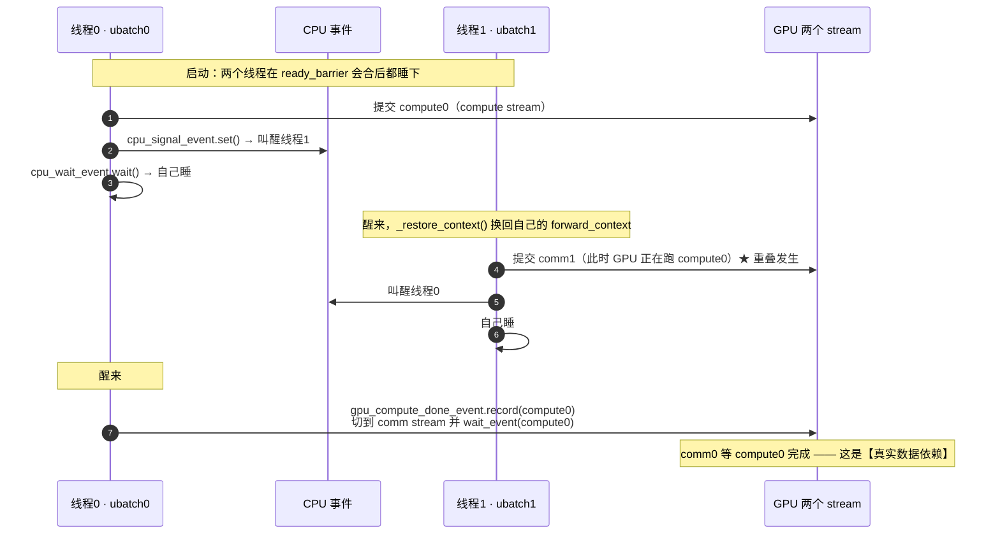

# 第 7 章　通算融合：让通信藏进计算里

> **本章解决的核心问题**：decode 阶段通信占比 20–40%（第 1 章算过），
> 而 GPU 在通信时**计算单元是闲着的**。怎么把这个浪费捡回来？
>
> 这是 2024–2026 年推理框架最有价值的一块工程。面试里能讲清 DBO 的候选人非常少。

---

## 7.0 先算清「浪费」有多大，才知道值不值得做

用第 1 章的数字：TP=8、hidden=8192、bf16、80 层、batch=1（decode）。

```
计算时间：假设一层 GEMM 约 8 μs，80 层 → 640 μs
通信时间：每层 2 次 all-reduce，每次约 4 μs → 80×8 = 640 μs   ← 竟然一样多！
```

（这是**极端小 batch** 的估算，用来说明量级，不是实测。）

**关键观察**：通信和计算在时间轴上**先后发生**，而不是并行。
如果能把通信和计算重叠，理论上 TPOT 可以接近减半。

**为什么天然不能重叠**？因为**数据依赖**：

```
第 L 层的 down_proj  → all-reduce（必须等 GEMM 算完）  → 第 L+1 层的输入
                        ↑ 通信依赖计算
第 L+1 层的 GEMM      → 必须等 all-reduce 完成
                        ↑ 计算依赖通信
```

**这是一条严格的串行链。** 通算融合的本质就是**打破这条链**。

---

## 7.1 打破依赖链的五种思路（面试答题框架）

| # | 思路 | 怎么做 | vLLM 里的实体 |
|---|---|---|---|
| 1 | **切开 batch，交替推进** | 把 batch 切成两份，A 算的时候 B 通信 | **DBO / microbatching**（§7.2） |
| 2 | **把通信融进 kernel** | 一个 kernel 里既做 GEMM 又做通信 | `scaled_matmul_reduce_scatter`、all-reduce+RMSNorm |
| 3 | **换更省的通信模式** | 用 reduce-scatter + all-gather 替代 all-reduce，中间结果可立即消费 | Sequence Parallel（§8.2） |
| 4 | **让通信不占计算资源** | 通信完全由网卡/拷贝引擎做，不用 SM | **DeepEP LL 模式**（`max_sms_used() = 0`） |
| 5 | **拆分阶段到不同机器** | prefill 和 decode 放不同节点，各自是计算密集 | PD 分离（§8.4） |

**面试加分**：能把这五种**并列**说出来，而不是只知道 DBO。
它们解决的是同一个问题（打破串行链），但代价和适用场景完全不同：

| 思路 | 收益 | 代价 | 适用 |
|---|---|---|---|
| 1 切 batch | 高（真并行） | 实现复杂、SM 争抢、latency 可能变差 | 大 batch decode |
| 2 融 kernel | 中（省 launch + 省一次读写） | 只对特定算子对有效 | 固定结构（RMSNorm 跟在 AR 后） |
| 3 换通信模式 | 中（省一半带宽） | 需要模型结构配合 | 有 norm 的地方（几乎都有） |
| 4 不占 SM | 高 | 需要特定硬件/库（RDMA） | MoE decode |
| 5 PD 分离 | 高（各自最优） | 需要 KV 传输、部署复杂 | 大规模服务 |

---

## 7.2 DBO：vLLM 的招牌通算重叠机制

> 📄 **vLLM 有一份专门的设计文档**：`docs/design/dbo.md`。强烈建议对照阅读 ——
> 它给出了 DBO 的**精确重叠时间线**（见 §7.2.8）。面试里能引用设计文档是强信号。

### 7.2.1 核心思想（用代码的原话）

`docs/design/dbo.md:5`（Motivation）：

> *"The core motivation of the DBO system in vLLM is to **overlap the sparse all-to-all
> communication in the MoE layer with the surrounding computation**. This system currently
> only targets **DP+EP deployments**."*

`docs/design/dbo.md:9`（Introduction）：

> *"The Dual Batch Overlap system works by **splitting the batch in the model runner, creating
> two worker threads, and then running the model on each of these worker threads**. When DBO is
> enabled, **yield points within the `FusedMoEModularKernel`** allow the two CPU worker threads
> (also called UBatch threads) to **ping-pong** between each other so that when one is running
> compute, the other is waiting on communication."*

**⚠️ 一个必须纠正的常见误解**：
DBO **不是**为了重叠 TP 的 all-reduce，而是为了重叠 **MoE 层的 all-to-all（dispatch/combine）**。
代码里所有 `dbo_yield` / `dbo_maybe_run_recv_hook` 调用点都在
`FusedMoEModularKernel.forward` 里（`docs/design/dbo.md:78` 明确说明：

> *"The current implementation has all `dbo_yield` and `dbo_maybe_run_recv_hook` calls in the
> `FusedMoEModularKernel.forward` method."*）

**这句话本身就是面试的一个高质量答案**：
> 「DBO 的设计目标很具体 —— **只重叠 MoE 的 all-to-all**。
> 因为 all-to-all 是「通信-计算-通信」三段串行结构，中间那段专家 GEMM 是天然的
> 可重叠窗口；而 TP 的 all-reduce 是严格的数据依赖链，没法这样切。」

### 7.2.2 为什么需要「两个线程」而不是「一个线程 + 两个 stream」

这是理解 DBO 的关键，也是面试的区分点。

**如果只有一个线程**：
```
线程：发 compute kernel A → 发 comm kernel A → 发 compute kernel B → ...
```
GPU 上是「compute A → comm A → compute B → comm B」**严格串行**（stream 内部的顺序），
跨 stream 也无法重叠，因为**同一个线程按顺序提交**，而且 comm A 依赖 compute A 的结果。

**两个线程的价值**：
```
线程0（ubatch 0）：提交 compute0 ... 让出CPU ...
线程1（ubatch 1）：... 提交 comm1（此时 GPU 正在跑 compute0！）
线程0：... 回来提交 comm0（此时 GPU 正在跑 compute1 或 comm1）...
```
→ **Python 层面的交错提交，让 GPU 的 compute stream 和 comm stream 真正并行。**

**关键前提**：ubatch 0 和 ubatch 1 是**独立的请求子集**，彼此没有数据依赖。
所以「ubatch 1 的通信」和「ubatch 0 的计算」可以安全重叠。

**画成时间线最清楚**（左＝单线程的串行，右＝DBO 的双线程交错）：

```mermaid
gantt
    title 单线程：通信与计算严格串行（无重叠）
    dateFormat X
    axisFormat %s
    section compute stream
    compute0        :a1, 0, 3
    compute1        :a2, 6, 9
    section comm stream
    comm0           :b1, 3, 6
    comm1           :b2, 9, 12
```

```mermaid
gantt
    title DBO：ubatch1 的通信藏在 ubatch0 的计算后面（真并行）
    dateFormat X
    axisFormat %s
    section compute stream
    compute0        :a1, 0, 4
    compute1        :a2, 7, 11
    section comm stream
    comm0           :b1, 4, 7
    comm1           :b2, 4, 7
```





**对比结论**（把两张图叠起来看）：

| | 单线程 | DBO |
|---|---|---|
| 总时间 | 12 个单位 | **11 个单位** |
| GPU 通信单元的空闲 | 计算期间通信链路闲着 | **通信与计算重叠** |
| 关键 | comm 依赖同一 ubatch 的 compute | ubatch1 的 comm 依赖 ubatch1 的 compute，**与 ubatch0 无关** |

> ⚠️ 上图是为了看清重叠关系而画的**示意**（把时间片离散化了）。
> vLLM 真实的重叠时间线（含 shared expert、MLA 等阶段）见
> `docs/design/dbo.md:15-28` 那段注释 —— 里面有 `A0/A1/D/C/S` 的精确排布，
> 值得对照着看。

**真实排布长什么样**（`docs/design/dbo.md` 原文注释，下标 0/1 = ubatch id）：

```
Schedule notation legend:
   S  = Shared expert
   A0 = MLA qkv proj
   A1 = Core attn + out proj + MoE gate
   D  = Dispatch
   C  = Combine

Comp: |-A0₀-A1₀-||-MLP₁-||-S₁-MLP₀-||-S₀-A0₁-A1₁-|
Comm: |----D₁---||--D₀--||----C₁---||-----C₀-----|
Order: D₁ send, A0₀, A1₀, D₁ recv, D₀ send, MLP₁, D₀ recv,
       C₁ send, S₁, MLP₀, C₁ recv, C₀ send, S₀, A0₁, A1₁, C₀ recv
```

**读懂这段排布的关键**：观察 `D₁ send` 出现在 `A0₀/A1₀` **之前**，
而 `D₁ recv` 出现在它们**之后** —— 即**「先发起、后用结果」**，
把这个通信的空档用另一个 ubatch 的计算填满了。
**这正是「异步 prepare/finalize」存在的原因**（§7.3.3 准入清单里的第 5 条会回到这一点）。

### 7.2.2b ping-pong 的「接力棒」是怎么传的

两个线程靠 **两套事件**交替传递控制权 —— 一套在 CPU 侧（`threading.Event`），
一套在 GPU 侧（`torch.cuda.Event`）：



**图里最容易忽略的一点**：`threading.Event` 是**阻塞等待**，不是自旋。
`ubatching.py:94-105` 的 `_cpu_yield` 用 `wait()` 让线程真正睡眠 ——
**如果改成自旋，两个线程会争 GIL、浪费 CPU，反而拖慢调度。**
（对比：`shm_broadcast.py` 的 `SpinCondition` 是另一种选择，用 ZMQ 通知来避免忙等。）

### 7.2.3 线程与 stream 的映射

`make_ubatch_contexts`（`vllm/v1/worker/ubatching.py:202-241`）：

```python
assert num_micro_batches > 1, "num_micro_batches must be greater than 1"   # :211
_NUM_UBATCHES = num_micro_batches                                          # :213
```

每个 `UBatchContext` 持有（`:25-49`）：

| 字段 | 作用 |
|---|---|
| `id` | ubatch 编号（0/1） |
| `comm_stream` | **共享**的通信 stream |
| `compute_stream` | **共享**的计算 stream |
| `forward_context` | 每个 ubatch 有**自己的** forward context（关键！） |
| `cpu_wait_event` / `cpu_signal_event` | **线程间**的 CPU 级握手（`threading.Event`） |
| `gpu_comm_done_event` / `gpu_compute_done_event` | **stream 间**的 GPU 级握手（`torch.Event`） |
| `current_stream` | 当前这个 ubatch 正在用哪个 stream |

**注意两个 ubatch 共享同一对 stream，但各有自己的 forward_context。**
这一点非常重要：**同一个 stream 上的 kernel 顺序执行，所以不会冲突；
但 Python 侧的 `forward_context` 是全局变量，必须按 ubatch 切换**（见下面的 `_restore_context`）。

### 7.2.4 「同一时刻只有一个线程在跑」——`_cpu_yield` 的设计

```python
def _cpu_yield(self):
    # It is critical for correctness that only one thread is running
    # at a time. These asserts just make sure that this is the only
    # thread running before waking the other one up and going to sleep
    assert forward_context._forward_context == self.forward_context   # :98
    assert current_stream() == self.current_stream                    # :99
    assert not self.cpu_wait_event.is_set()                           # :100

    self.cpu_signal_event.set()      # 叫醒对方
    self.cpu_wait_event.wait()       # 自己睡
    self.cpu_wait_event.clear()
    self._restore_context()          # 恢复自己的 forward_context
```

**这段是 DBO 最精妙的地方**，三个 assert 不是防御性编程，而是**正确性证明**：

1. `forward_context._forward_context == self.forward_context` ——
   确认此刻没有另一个线程改乱了全局 forward context。
2. `current_stream() == self.current_stream` ——
   确认 CUDA 的当前 stream 没有被别的线程切走（`torch.cuda.set_stream` 是**线程本地**的，
   但如果代码有 bug 就会错乱）。
3. `not self.cpu_wait_event.is_set()` —— 确认自己不是被重复唤醒（防丢信号/重复进入）。

**为什么必须「只有一个线程在跑」**：
- `torch.cuda.set_stream` 是线程本地的，但 `forward_context` 是**全局变量**；
- 两个线程同时跑 Python 会**争 GIL**，交错顺序不确定 → 提交到 GPU 的顺序不确定 → 死锁。

**所以 DBO 不是「真并行」，而是「严格交替 + GPU 侧并行」**：
CPU 侧串行交替（保证提交顺序确定），GPU 侧两个 stream 并行（真正的重叠来源）。
**这个「CPU 串行换 GPU 并行」的表述是面试满分答案。**

### 7.2.5 四个切换原语：什么时候「只切 stream」，什么时候「同步等」

```python
def switch_to_comm(self):          # 只换 stream，不等
    self.update_stream(self.comm_stream)

def switch_to_compute(self):       # 只换 stream，不等
    self.update_stream(self.compute_stream)

def switch_to_comm_sync(self):     # 换 stream + 等计算完成
    self._signal_compute_done()
    self.update_stream(self.comm_stream)
    self._wait_compute_done()

def switch_to_compute_sync(self):  # 换 stream + 等通信完成
    self._signal_comm_done()
    self.update_stream(self.compute_stream)
    self._wait_comm_done()
```

底层是两个 `torch.Event`（`:82-92`）：

```python
def _signal_comm_done(self):     self.gpu_comm_done_event.record(self.comm_stream)
def _signal_compute_done(self):  self.gpu_compute_done_event.record(self.compute_stream)
def _wait_compute_done(self):    self.comm_stream.wait_event(self.gpu_compute_done_event)
def _wait_comm_done(self):       self.compute_stream.wait_event(self.gpu_comm_done_event)
```

**语义对照表**：

| 原语 | 语义 | 什么时候用 |
|---|---|---|
| `switch_to_comm/compute` | **纯切换**：后续 kernel 发到另一个 stream，不建立依赖 | 我要在另一个 stream 上发**独立**工作 |
| `switch_to_comm_sync` | **切换 + 让 comm 等我的 compute** | comm 需要 compute 的产出（真实数据依赖） |
| `switch_to_compute_sync` | **切换 + 让 compute 等我的 comm** | compute 需要 comm 的产出 |

`yield_` 与 `yield_and_switch_*` 的区别（`:128-147`）：

```python
def yield_(self):
    self.current_stream = current_stream()   # 记住当前 stream
    self._cpu_yield()                        # 让给别人跑
    self.update_stream(self.current_stream)  # 回来后恢复（因为 set_stream 是线程本地的）

def yield_and_switch_from_compute_to_comm(self):
    assert current_stream() == self.compute_stream
    self._signal_compute_done()      # 告诉 comm：我的计算到这儿了
    self._cpu_yield()                # 让另一个线程跑
    assert self.current_stream == self.compute_stream   # 让出前的状态
    self.update_stream(self.comm_stream)                # 回来后切到 comm
    self._wait_compute_done()        # 我的 comm 要等我的 compute
```

**`yield_and_switch_from_compute_to_comm` 就是 DBO 的核心动作**：
「我在 compute stream 上算完了这一段 → 标记事件 → 让出 CPU 让另一个 ubatch 跑 →
我回来后在 comm stream 上发通信，且这个通信等我的计算完成」。

**这样 GPU 上就形成了**：
```
compute0 ──────►  comm0
      compute1 ──────►  comm1
      ↑ 与 compute0 重叠的是 comm1（由另一个线程发起）
```

### 7.2.6 `recv_hook`：把「接收」推迟到最合适的时刻

```python
def dbo_register_recv_hook(recv_hook):
    if len(_THREAD_ID_TO_CONTEXT) > 0:
        ctx_idx = _THREAD_ID_TO_CONTEXT[threading.get_ident()]
        next_ctx = _CURRENT_CONTEXTS[(ctx_idx + 1) % _NUM_UBATCHES]
        next_ctx.recv_hook = recv_hook        # 注册到「另一个」ubatch 上
```

**为什么要把 hook 注册到对方**：DeepEP 的 low-latency 模式是「发送后返回一个 hook，
调用 hook 才真正完成接收」。如果我们立刻调用它，就阻塞了；
如果注册给另一个 ubatch，会在**对方 yield 或 exit 时**被调用（`maybe_run_recv_hook`，`:123-126`），
从而把接收动作推到「合适的时机」。

**这是一个很聪明的解耦**：通信库要求「你必须在某个时刻调用 hook」，
而调度器希望「这个时刻由我决定」→ 用回调注册实现控制反转。

`__exit__` 里也会调用它（`:69`）：

```python
def __exit__(self, exc_type, exc_val, exc_tb):
    _CURRENT_CONTEXTS[self.id] = None
    del _THREAD_ID_TO_CONTEXT[threading.get_ident()]
    self.maybe_run_recv_hook()      # 退出前确保 hook 被调用
    self.cpu_signal_event.set()     # 叫醒对方
    ...
```

### 7.2.7 「零开销」的设计：`dbo_enabled()`

```python
def dbo_enabled() -> bool:
    return len(_THREAD_ID_TO_CONTEXT) > 0       # :150-151
```

所有 `dbo_*` 函数都是通过 `_register_ubatch_function` 包装的（`:160-167`）：

```python
def wrapper(*args, **kwargs):
    if len(_THREAD_ID_TO_CONTEXT) > 0:       # 不在 ubatch 上下文里就什么都不做
        ctx_idx = _THREAD_ID_TO_CONTEXT[threading.get_ident()]
        ctx = _CURRENT_CONTEXTS[ctx_idx]
        func(ctx, *args, **kwargs)
```

**关键**：`_cpu_yield` 会把当前线程的 id 从字典里删掉吗？不会 ——
但 `__exit__` 会（`:68`）。而 `_cpu_yield` 是「sleep 等到被唤醒」，
这期间**对方线程进来会写自己的条目**，但**当前线程的条目还在**。

**所以严格来说**：`dbo_enabled()` 在 yield 期间**仍然是 True**。
真正的「零开销」体现在**不使用 DBO 时**（`_THREAD_ID_TO_CONTEXT` 为空）：

> MoE 层的代码可以**无条件**调用 `dbo_yield()` / `dbo_maybe_run_recv_hook()`，
> 不开 DBO 时它们是空函数，**没有分支判断的成本**。

**这是一个很好用的设计模式**：**把「是否启用」的决策集中到 wrapper，让调用点无分支**。
面试里可以称为「策略模式 / 空对象模式在热路径上的应用」。

---

## 7.3 DBO 的准入条件：什么时候它会被悄悄关掉

（`vllm/v1/worker/ubatch_utils.py` + `vllm/config/parallel.py`）

### 7.3.1 配置开关

| 字段 | 默认 | 含义 | 位置 |
|---|---|---|---|
| `enable_dbo` | `False` | 开 DBO | `vllm/config/parallel.py:220` |
| `ubatch_size` | `0` | 手动指定 ubatch 数（>1 才生效） | `:222` |
| `dbo_decode_token_threshold` | **32** | 纯 decode batch 超过这个 token 数才切 | `:225` |
| `dbo_prefill_token_threshold` | **512** | 含 prefill 的 batch 超过这个才切 | `:230`（带 `# TODO(lucas): tune`） |

```python
@property
def use_ubatching(self) -> bool:
    return self.enable_dbo or self.ubatch_size > 1          # :585-586

@property
def num_ubatches(self) -> int:
    return 2 if self.enable_dbo else self.ubatch_size        # :589-590
```

**注意 `enable_dbo` 硬编码为 2 个 ubatch**，而 `ubatch_size` 可以指定更多。
代码里也留了注释（`ubatching.py:15`）：

```python
# Here we hardcode the number of microbatches to 2 for default.
_NUM_UBATCHES: int = 2
```

**为什么硬编码 2**：因为 ping-pong 只有在 2 个 ubatch 时最自然
（A 算的时候 B 通信），3 个以上会引入更复杂的调度和 SM 争抢，
收益递减而复杂度陡增。**这是一个「工程上够用就好」的典型决策。**

### 7.3.2 逐批决策：为什么需要阈值

```python
def check_ubatch_thresholds(config, num_tokens, uniform_decode) -> bool:
    if not config.use_ubatching:
        return False
    if uniform_decode:
        return num_tokens >= config.dbo_decode_token_threshold    # 默认 32
    else:
        return num_tokens >= config.dbo_prefill_token_threshold   # 默认 512
```

**为什么小 batch 不切**：
- token 太少 → 每个 ubatch 的计算量太小 → **kernel launch 开销占比过高**；
- 切一刀本身有成本（元数据切分、SM 仲裁切换、同步事件）；
- **小 batch 时通信本来就是小头**（第 1 章：batch 越小通信占比越高，
  但绝对通信量也小，且 launch 开销主导）。

**配置校验**（`vllm/config/parallel.py:1068-1077`）：
阈值必须 ≥ ubatch 数，否则报错：

> *"A batch below one token per microbatch cannot be split, so the thresholds have to keep it
> out rather than the split having to cope."*

```python
raise ValueError(
    "dbo_decode_token_threshold and dbo_prefill_token_threshold must "
    f"be at least the number of microbatches ({self.num_ubatches})."
)
```

### 7.3.3 完整准入清单（面试可以直接背这张表）

DBO 的准入条件**分散在多处**（代码里**没有**一个叫 `validate_ubatching` 的函数），
这是它调优起来比较绕的原因：

| # | 条件 | 不满足的后果 | 位置 |
|---|---|---|---|
| 1 | `--enable-dbo` 或 `--ubatch-size > 1` | 不启用 | `config/parallel.py:585-586` |
| 2 | 两个阈值都 ≥ `num_ubatches` | **报 ValueError** | `config/parallel.py:1068-1077` |
| 3 | **`data_parallel_size > 1`** | 静默不切 | `v1/worker/dp_utils.py:208-210` |
| 4 | **`--enable-expert-parallel`** | 没有 EP 组就没有 all2all manager → 无法做 SM 控制 | `v1/worker/ubatch_utils.py:101` |
| 5 | **`--all2all-backend ∈ {deepep_low_latency, deepep_high_throughput, nixl_ep}`** | **assert 失败** | `config/vllm.py:1744-1757` |
| 6 | 本步 token 数 ≥ 对应阈值 | 这一步不切（**逐批决策**） | `ubatch_utils.py:141-149` |
| 7 | **所有 DP rank 都同意**（一次 all-reduce 投票） | 全都不切 | `v1/worker/dp_utils.py:62-79` |
| 8 | 没有 rank 会切出空的尾 ubatch | 中止 ubatching | `ubatch_utils.py:130-133` |
| 9 | 不切裂 prefix cache 的读写者 | 否决这一步 | `v1/worker/gpu_model_runner.py:3995-4019` |
| 10 | 不是 GDN/linear attention 的投机解码路径 | assert | `gpu_model_runner.py:2570-2572` |
| 11 | cascade attention 关闭 | 自动关闭 | `config/vllm.py:1759-1761` |
| 12 | 不是 CPU 平台 | 自动关闭 + warning | `platforms/cpu.py:283-286` |
| 13 | 不是 elastic EP | RuntimeError | `elastic_ep/elastic_execute.py:407-408` |
| 14 | V2 model runner：无 LoRA / 无投机 / PP=1 / 无 CP / 非多模态 / 非混合模型 / 无 CUDA Graph | ValueError | `config/vllm.py:2739-2778` |

**第 7 条（DP 投票）值得单独讲**（`v1/worker/dp_utils.py:62-79`）：

```python
should_ubatch = bool(torch.all(tensor[2] == 1).item())
```

docstring：*"Either all ranks run with microbatching or none of them do."*

**为什么必须全体一致**：因为 **MoE 的 all-to-all 是集合操作** ——
如果 rank A 切了、rank B 没切，两者的通信次数/形状不匹配 → **死锁**。
（这就是第 5 章讲的「三一致」原则里的第 1 条：成员集合必须一致。）

**实现细节**：这个投票通过一次 **DP 组的 all-reduce** 完成，
而这次 all-reduce 走 NCCL 还是 gloo 由 `disable_nccl_for_dp_synchronization` 控制
（async scheduling 下默认用 gloo，因为 engine 进程可能没有 CUDA 设备）。

**第 5 条（后端限制）的官方说明**（`docs/design/dbo.md:37`）：

> *"Currently, DBO is only supported with DeepEP, so DeepEP must be installed and the
> `--all2all-backend` argument must be set to `deepep_low_latency` if your workload is
> primarily decode requests, or `deepep_high_throughput` if your workload is primarily
> prefill requests."*

**注意代码允许三个后端（含 `nixl_ep`），文档只提了 DeepEP** ——
代码比文档新。**这也是一个「文档滞后」的真实例子**，
面试里可以指出「我以代码为准」。

### 7.3.4 一个完整的启动命令（来自设计文档）

```bash
vllm serve deepseek-ai/DeepSeek-V2-Lite --trust-remote-code \
    --data-parallel-size 2 \
    --enable-expert-parallel \
    --enable-dbo \
    --all2all-backend deepep_low_latency
```

（`docs/design/dbo.md:44`）

**注意设计文档还提了一句**：*"there must be at least two GPUs visible in `CUDA_VISIBLE_DEVICES`"* ——
因为 DP ≥ 2 且要 EP。

### 7.3.5 batch 怎么切：`maybe_create_ubatch_slices`

（`ubatch_utils.py:166-217`）

```python
if split_point is None:
    split_point = int(num_tokens_padded) // num_ubatches     # :178
token_split_points = [split_point * i for i in range(1, num_ubatches)]
...
cu_num_tokens = np.zeros(len(num_scheduled_tokens) + 1, dtype=np.int32)
np.cumsum(num_scheduled_tokens, dtype=np.int32, out=cu_num_tokens[1:])   # :184-185

for end_token in all_points:                                 # :193
    token_slice = slice(start_token, end_token)
    # Start at the request that contains the start_token...
    req_start = int(np.searchsorted(cu_num_tokens, start_token, side="right") - 1)  # :201
    req_stop = int(np.searchsorted(cu_num_tokens, end_token, side="left"))          # :204
    req_slice = slice(req_start, req_stop)
    ubatch_slices.append(UBatchSlice(req_slice, token_slice))
```

**关键事实：按 token 数均分，不是按请求数均分。**
所以**一个请求可能横跨两个 ubatch**（长 prefill 会被切开）。

`UBatchSlice` 同时记录 `request_slice` 和 `token_slice`，`is_empty()` 判断是否为空（`:20-33`）。

### 7.3.6 切开之后 attention metadata 也要重新切

（`ubatch_utils.py:237-368`）

这是 DBO 里最繁琐的部分。`_make_metadata_with_slice` 要处理两种「跨切片」情况：

```python
splits_first_request = first_tok > start_locs[first_req]           # :266
splits_last_request  = last_tok < start_locs[last_req + 1] - 1     # :267
```

- `splits_first_request`：这个切片的第一段是**上一个切片的延续** → 要减掉跳过的 token；
- `splits_last_request`：这个切片的最后一段**延续到下一个切片** → 要把 `seq_lens[-1]` 减掉。

**注意 `:310` 的注释和 `clone()`**：

```python
# Make sure we don't modify the seq_lens tensors
#  (not cudagraph compatible)
seq_lens = seq_lens.clone()
seq_lens[-1] -= tokens_skipped
```

**为什么要 clone**：如果原地改，会污染其他 ubatch 的 metadata，
而且**原地修改张量在 CUDA Graph 下不兼容**。

另一处 `:224-230` 的 docstring 也很关键：

```python
def slice_query_start_locs(query_start_loc, request_slice):
    """
    Creates a new query_start_loc that corresponds to the requests in request_slice.

    Note: This function creates a new tensor to hold the new query_start_locs.
    This will break cudagraph compatibility.
    """
```

**→ 「DP/DBO 的元数据切分和 CUDA Graph 天然冲突」**，
这就是为什么 DBO 和 CUDA Graph 的组合需要 `gpu_ubatch_wrapper.py` 里那套
**按 ubatch 分别 capture graph** 的机制（见 §7.5）。

### 7.3.5 空 ubatch 的处理

```python
def is_last_ubatch_empty(orig_num_tokens, padded_num_tokens, num_ubatches) -> bool:
    return (padded_num_tokens // num_ubatches) * (num_ubatches - 1) >= orig_num_tokens
```

**为什么会有空 ubatch**：因为 padding + 均分可能让第二个 ubatch 完全没有真实 token。
`_pad_out_ubatch_slices`（`:154-163`）会把最后一个切片补齐到 padding 后的总数。

**工程含义**：DBO 的实现必须处理「切出来一半是空的」这种边界情况 ——
**这是「均分策略」的必然代价**。（面试里可以提：更聪明的切法是按计算量而非 token 数切，
但那样需要预估每个请求的计算成本，复杂度更高。）

---

## 7.4 SM 仲裁：DBO 最难也最有意思的部分

### 7.4.1 问题：重叠了，但资源在打架

重叠的前提是「计算和通信能同时跑」。但如果**通信 kernel 和计算 kernel 抢 SM**，
结果不是重叠，而是**两个都变慢**（时间片轮转）。

**解法**：**显式切分 SM** —— 给通信留 N 个 SM，剩下的给计算。

```python
class SMControlContextManager:
    """
    Context manager for controlling SM (Streaming Multiprocessor)
    allocation. Upon entering the context, it sets the number of SMs
    allocated for communication and computation to comm_sms and
    total_sms - comm_sms respectively. Upon exiting, it restores the
    allocation to use all available SMs (i.e. total_sms).
    """
    def __init__(self, comm_sms, set_comm_sms, set_compute_sms):
        assert current_platform.is_cuda() or current_platform.is_rocm(), (
            "SM/CU control is supported on CUDA and ROCm platforms"
        )
        device = torch.accelerator.current_device_index()
        total_sms = num_compute_units(device)
        assert comm_sms < total_sms
        self.compute_sms = total_sms - comm_sms
        ...

    def __enter__(self):
        self.set_comm_sms(self.comm_sms)
        self.set_compute_sms(self.compute_sms)

    def __exit__(self, exc_type, exc_value, traceback):
        self.set_comm_sms(self.total_sms)      # 退出时还给全部
        self.set_compute_sms(self.total_sms)
```

（`vllm/v1/worker/ubatch_utils.py:39-81`）

**两个关键设计**：
1. **`__exit__` 恢复全部 SM** —— 不能永久占用，否则影响非 DBO 路径。
   **这是一个好的 context manager 设计范例。**
2. **`assert comm_sms < total_sms`** —— 不能把所有 SM 都给通信，否则计算没法跑。

### 7.4.2 为什么只有 DeepEP HT 和 DeepGEMM 支持

```python
def create_sm_control_context(parallel_config) -> SMControlContextManager:
    """Reserve SMs for communication kernels while microbatches overlap."""
    comm_sms: int = envs.VLLM_DBO_COMM_SMS                    # 默认 20
    rocm_deepep_ht_dbo = (
        current_platform.is_rocm()
        and parallel_config.enable_dbo
        and parallel_config.all2all_backend == "deepep_high_throughput"
    )
    if rocm_deepep_ht_dbo:
        # On ROCm, reserving CUs for DeepEP HT communication under DBO
        # corrupts DP+EP generation accuracy. Keep the backend active, but
        # leave all CUs visible to the compute and communication kernels.
        comm_sms = 0                                           # :98

    set_comm_sms = lambda sms: None
    if parallel_config.enable_expert_parallel:
        # Currently only DeepEP highthroughput supports SM control so this
        # only affects that case.
        ep_group = get_ep_group()
        ...
        max_sms_used = all2all_manager.max_sms_used()
        if max_sms_used is not None:
            comm_sms = min(comm_sms, max_sms_used)             # :113
        if comm_sms > 0 and all2all_manager is not None:
            set_comm_sms = lambda sms: all2all_manager.set_num_sms(sms)   # :116

    # TODO(lucas): support other kernels besides DeepGEMM
    set_compute_sms = lambda sms: None
    if has_deep_gemm() and comm_sms > 0:
        set_compute_sms = lambda sms: deep_gemm_set_num_sms(sms)          # :121
```

（`ubatch_utils.py:84-127`）

**逐条解读（这是本章最有价值的一段）**：

| 代码 | 含义 |
|---|---|
| `comm_sms = envs.VLLM_DBO_COMM_SMS`（默认 **20**） | 默认给通信留 20 个 SM |
| **ROCm + DeepEP HT → `comm_sms = 0`** | **关键**：ROCm 上给 DeepEP HT 保留 CU 会**损坏 DP+EP 的生成精度**。所以「保留后端但把 SM 限制设成 0」= 不做限制 |
| `if parallel_config.enable_expert_parallel` + 注释 *"Currently only DeepEP highthroughput supports SM control"* | 只有 DeepEP HT 实现了 `set_num_sms()` |
| `comm_sms = min(comm_sms, max_sms_used)` | 不能超过后端自己声明的用量。**注意这里的差异很重要（见下表）** |
| `set_compute_sms` 只在 `has_deep_gemm()` 时生效 + `# TODO(lucas): support other kernels besides DeepGEMM` | **只有 DeepGEMM 支持限定 SM 数**，其它 GEMM 库不支持 |

**`max_sms_used()` 的返回值差异（这是最容易讲错的一点）**：

| 后端 | `max_sms_used()` | `comm_sms` 结果 | 是否接上 `set_num_sms` |
|---|---|---|---|
| 基类默认 | `None`（注释："None means it could use the whole GPU"，`base_device_communicator.py:139-140`） | `min(20, None)` → **20** | ✅ 接上 |
| **DeepEP HT** | **未 override → 继承 `None`** | **20** | ✅ 接上（`all2all.py:260-268`） |
| **DeepEP LL** | **`0`**（`all2all.py:345-347`："DeepEP LL uses RDMA so no SMs are used for communication"） | `min(20, 0)` = **0** | ❌ 不接（因为要求 `comm_sms > 0`） |
| **NIXL EP** | **`0`**（`all2all.py:558-560`） | **0** | ❌ 不接 |
| DeepEP v2 | `self._num_sms`（**解析计算**出来的，`all2all.py:1079-1082`） | `min(20, 该值)` | ✅ 接上 |

**读懂这张表能得到一个真实的洞察**：
- **HT 继承 `None` 而不是返回 20** —— 意味着 `min()` 会取 20（env 默认值），
  所以 SM 限制**恰好**等于 HT 实际用的 20 个 SM。**依赖 env 默认值和 kernel 默认值一致**，
  这是一个「隐式耦合」。
- **LL / NIXL 返回 0 让 `comm_sms` 变 0**，从而**跳过 SM 控制**。
  这是正确的：它们用 RDMA 不占 SM，本来就不该被限制。
  **一个返回值同时表达了「我用 0 个 SM」和「别限制我」两层语义** —— 靠 `min()` 的数学性质。
  （注意：这是**结果**上的巧妙，不是有意的双重语义设计。）

**另一个要点：`assert comm_sms < total_sms`**（`ubatch_utils.py:68`）——
不能把所有 SM 都给通信，否则计算没法跑。

**「通信可以限制 SM，计算大多不能」**：因为只有 DeepGEMM 暴露了这个能力。
这是**生态成熟度差异**，不是设计偏好。面试里可以指出：
**通算融合的瓶颈不只是算法，还有底层 kernel 库的可控性。**

### 7.4.3 ROCm 的两处特殊处理：宁可放弃优化，也不损坏结果

**处理 1：`comm_sms = 0`**（`ubatch_utils.py:89-98`）

```python
rocm_deepep_ht_dbo = (
    current_platform.is_rocm()
    and parallel_config.enable_dbo
    and parallel_config.all2all_backend == "deepep_high_throughput"
)
if rocm_deepep_ht_dbo:
    # On ROCm, reserving CUs for DeepEP HT communication under DBO
    # corrupts DP+EP generation accuracy. Keep the backend active, but
    # leave all CUs visible to the compute and communication kernels.
    comm_sms = 0
```

注释说的是「保留 CU 会**损坏 DP+EP 的生成精度**」。
处理方式是**宁可放弃 SM 隔离这个优化，也不冒精度风险**。

**这是分布式系统里非常正确的取舍**：
> **精度错误比性能损失严重得多，而且极难发现** ——
> 性能退化会被人立刻注意到，精度问题可能几周后才在某个 eval 上暴露。

**处理 2：ROCm DeepEP HT 的显式同步**（`prepare_finalize/deepep_ht.py:73-78`）

```python
# ROCm DeepEP HT dispatch/combine reuse Buffer-owned communication workspace.
# Do not let the next DBO ubatch reuse that workspace before this ubatch's
# HT kernel has completed.
```

→ ROCm 上必须显式 `torch.cuda.current_stream().synchronize()`，
**因为两个 ubatch 会复用同一个通信 workspace**，如果不等上一次 kernel 完成就复用，
数据会被覆盖。

**面试点**：**「重叠」和「资源复用」是天然冲突的** ——
重叠要求「两个 ubatch 同时在飞」，资源复用要求「上一个用完才能给下一个」。
**当你做重叠优化时，必须逐个检查所有被两个 ubatch 共享的资源**
（通信 workspace、attention workspace、buffer pool），
每一个都可能成为正确性漏洞。

### 7.4.4 `previous_event`：一个精确到「事件覆盖范围」的细节

（`prepare_finalize/deepep_ht.py:119-123`）

```python
# Capture a DeepEP event on the compute stream before yielding.
# This must happen before the yield so the event only covers this ubatch's
# compute work. If captured after, the compute stream tail may include the
# other ubatch's work, preventing overlap.
```

对应的 API 是 `dbo_get_previous_event(func, *args)`（`ubatching.py:193-199`）：

```python
def dbo_get_previous_event(func, *args, **kwargs):
    if len(_THREAD_ID_TO_CONTEXT) > 0:
        ctx_idx = _THREAD_ID_TO_CONTEXT[threading.get_ident()]
        ctx = _CURRENT_CONTEXTS[ctx_idx]
        # execute callable on the ubatch compute stream to record/wait events there
        with torch.cuda.stream(ctx.compute_stream):
            return func(*args, **kwargs)
```

**它解决的问题**：我要让通信 kernel 等我的计算完成，但**这个「等待」必须精确到
「只等我这一个 ubatch 的计算」**。

问题在于：**compute stream 是两个 ubatch 共享的**（§7.2.3）。
如果在 yield **之后**才在 compute stream 上记录事件，那么事件会覆盖到
「另一个 ubatch 也已经提交到 compute stream 上的工作」→ **等待范围过大 → 重叠失效**。

**所以事件的记录必须发生在 yield 之前** —— 这是「共享 stream 上的事件语义」
带来的一个非常微妙但致命的约束。

**面试价值**：这个问题**只能通过读代码/踩坑发现**，任何设计文档都不会写到这个层次。
能主动讲出来，说明你真的理解 CUDA stream/event 的语义。

### 7.4.5 hidden size 的对齐要求（通信与计算的隐形耦合）

DeepEP HT 要求 hidden 维度按 **512 字节** 对齐（`prepare_finalize/deepep_ht.py`）：

```python
xfer_atom_size = 512  # 32 * 16 (size(int4))
```

**为什么**：DeepEP 的传输按「原子块」搬运，一个 atom = 32 个 int4 = 512 字节。
不对齐就落不到最优路径。

**vLLM 的处理**：`maybe_roundup_layer_hidden_size`（`fused_moe/all2all_utils.py`）
把 hidden size **向上取整**到满足要求的尺寸，多出来的填零。

**面试点**：**通算融合不是纯软件问题 —— 通信库的对齐要求会反向约束模型/kernel 的维度设计。**
这就是为什么大模型的 hidden size 常常是 7168、8192 这类「好数」。

---

## 7.5 DBO 与 CUDA Graph 的兼容

（`vllm/v1/worker/gpu_ubatch_wrapper.py`）

### 7.5.1 难点

- CUDA Graph 要求 **kernel 参数固定**；
- 但 DBO 下每个 ubatch 有不同的 `forward_context`、不同的 token 数、不同的 metadata；
- 而且 §7.3.4 已经指出：**metadata 切分会创建新张量，破坏 graph 兼容性**。

### 7.5.2 vLLM 的解法：每个 ubatch 单独 capture 一张 graph

`_capture_ubatches` 的 docstring（`:121-143`）：

> *"each of the ubatch threads initialize the cuda context before we start
> 1. The main thread starts up each ubatch thread. Each thread will
>    [initialize its cuda context] before going to sleep upon entering the ubatch_context.
> 2. The main thread starts the graph capture and wakes up the first ubatch thread.
> 3. Each ubatch thread runs the model to completion and returns the
>    completed output tensors back to the main thread.
> 4. The main thread stores the captured cudagraph along with its metadata"*

```python
self.ready_barrier = threading.Barrier(
    self.vllm_config.parallel_config.num_ubatches + 1     # ubatch 线程 + 主线程
)
```

**关键点**：
- **`threading.Barrier` 用来同步「主线程 + N 个 ubatch 线程」** ——
  必须等所有线程都初始化好 CUDA context 才能开始 capture；
- 每个 ubatch 有**自己的 `CUDAGraphMetaData`**（`:59-63`），
  所以是「N 张 graph 交替 replay」，不是一张 graph 里塞两个 ubatch。

**面试题**：「DBO 怎么和 CUDA Graph 共存？」
→ **不是把两个 ubatch 塞进一张 graph，而是每个 ubatch 各 capture 一张，
然后交替 replay。** 因为两个 ubatch 的 kernel 参数（metadata、token 数）不同，
无法共享一张 graph。

**graph 缓存与匹配**（`vllm/v1/worker/gpu/cudagraph_utils.py`）：

```python
class BatchExecutionDescriptor:
    num_ubatches: int = 1
    # "Number of microbatches the batch is split into (DBO). 1 means no splitting."
```

并且 `_is_compatible` 要求 `desc.num_ubatches == num_ubatches`，
注释说得很清楚：

> *"A graph captured for N microbatches can only serve a batch split N ways."*

**面试点**：这是一个**类型化约束**的好例子 ——
graph 不只是「绑定形状」，还**绑定执行结构**（切法）。
所以 DBO 打开/关闭时无法复用同一批 graph，只能各 capture 一份。

**代价总结**：

| 代价 | 说明 |
|---|---|
| 显存 | 两份 graph + 两份中间缓冲区（workspace 按 ubatch id 分 lane） |
| 灵活性 | graph 与 ubatch 数绑定，切换要重新 capture |
| 复杂度 | capture 时必须用 `threading.Barrier` 协调「主线程 + N 个 ubatch 线程」 |
| V2 runner | **DBO + CUDA Graph 直接不支持**（`config/vllm.py` 的 `_get_dbo_unsupported_features` 列出 "dual batch overlap with CUDA graphs"） |

**capture 时的初始化顺序**（`gpu_ubatch_wrapper.py:145-155`）：
每个 ubatch 线程必须**先初始化自己的 CUDA context**
（`with torch.cuda.stream(...): torch.cuda.current_blas_handle()`），
再进 `ubatch_context` 睡觉；主线程等所有线程就绪（`ready_barrier`）后才开始 capture。
**这是「多线程 + CUDA Graph」的必备准备步骤** ——
否则第一个在 capture 期间惰性初始化 BLAS/cuDNN handle 的线程会让 capture 失败。

**注意**：V1 的 DBO **只支持 Full CUDA graph**（`docs/design/dbo.md:62`）：

> *"CUDA graphs for DBO are entirely managed by the `UBatchWrapper`. Because of this,
> DBO only supports running with Full CUDA graphs."*

---

## 7.6 除了 DBO：vLLM 里的其它通算融合手段

### 7.6.1 kernel 级融合：把 all-reduce 融进下一个算子

**模式**：all-reduce 之后紧跟一个 element-wise 算子（RMSNorm），
两者都可以省掉一次「写回显存 + 再读出来」。

**实体 1：all-reduce + GemmaRMSNorm**
（`vllm/model_executor/layers/fused_allreduce_gemma_rms_norm.py`）

模块 docstring 原文（`:3-15`）：

> *"Manual fusion of tensor-parallel all-reduce with the following GemmaRMSNorm.
> ... into a ``GemmaRMSNorm`` that adds the residual and normalizes. **flashinfer ships a
> kernel that fuses all-reduce + residual-add + RMSNorm into a single launch**; this
> [module wires it up] ... (oversize batch) it falls back to ``all_reduce`` + ``GemmaRMSNorm``,
> which is numerically identical to the unfused model path."*

→ **三个算子融成一次 launch**：all-reduce + residual add + RMSNorm。
**收益**：省两次显存往返 + 省两次 kernel launch。

**实体 2：all-reduce + RMSNorm 的编译期模式匹配**
（`vllm/compilation/passes/fusion/sequence_parallelism.py`）

vLLM 用 `torch.compile` 的 pattern matcher 自动识别两种结构：

```python
class FirstAllReduceRMSNormPattern(...):        # :153
    def register(self, pm_pass):
        ...
        all_reduce = self._all_reduce(input)                     # :166
        rmsnorm = vllm.ir.ops.rms_norm(all_reduce, weight, eps)  # :167
        return rmsnorm, all_reduce

# 以及 reduce_scatter + rms_norm + all_gather 的模式：
        reduce_scatter = self._reduce_scatter(input)             # :175
        rmsnorm = vllm.ir.ops.rms_norm(reduce_scatter, weight, eps)   # :177
        all_gather = self._all_gather(rmsnorm)                   # :178
        return all_gather, reduce_scatter
```

**第二种模式就是 Sequence Parallel 的本质**（§8.2）：
**`all_reduce` → `reduce_scatter + [局部计算] + all_gather`**。

**为什么这个替换是等价的（面试白板题）**：

```
原始（TP，无 SP）：
  每张卡都有完整 token 的 input → all_reduce 得到完整输出 → RMSNorm

替换后（SP）：
  all_reduce(x) = all_gather(rms_norm_局部(reduce_scatter(x)))   ← 只在「norm 在中间」时成立
```

**严格来说**：这个替换成立的前提是 **RMSNorm 是逐 token 的、且规约与 norm 可交换**。
因为 `all_reduce` 后每张卡的输出**完全相同**，所以紧接着的 norm 计算是**冗余的**（N 张卡算同样的事）。
SP 把这个冗余去掉：每张卡只对自己那份 token 做 norm，然后 all_gather 回来。

**收益**：
- `all_reduce`（搬运 `2(N-1)/N × S`）→ `reduce_scatter` + `all_gather`（各 `(N-1)/N × S`）
  —— **带宽项相同**（见第 2 章的成本表）；
- 但**中间结果的 norm 计算量减少 N 倍**，且中间张量只有 `S/N` 大 → 省显存、省计算。

**面试满分答案**：
> 「SP 的通信量并没有减少 —— reduce-scatter + all-gather 的总带宽和 all-reduce 一样。
> 它省的是**冗余计算和显存**：norm 只算自己那份，中间结果小 N 倍。
> 所以 SP 的收益在**计算和显存**，不在通信。」

**（这个答案能立刻区分「背过 SP 定义」和「真的算过账」的候选人。）**

### 7.6.2 通信与矩阵乘的融合：scaled_matmul_reduce_scatter

（`vllm/distributed/parallel_state.py` 的 `patched_fused_scaled_matmul_reduce_scatter`）

vLLM 把「量化矩阵乘 + reduce-scatter」做成一个 fused op。
**这是通算融合的极致形态**：GEMM 的输出还没写回显存就参与规约和分发。

**签名里能看出的信息**：`A, B, A_scale, B_scale, reduce_op, orig_scatter_dim, group_name, output_shape, bias, result_scale, out_dtype`
→ 说明这是一个**量化感知**的融合（带 scale），且支持 bias。

### 7.6.3 重叠的三个层次（总结表）

| 层次 | 做法 | 省什么 | vLLM 实体 |
|---|---|---|---|
| **算子级** | 把通信融进相邻算子 | kernel launch + 显存往返 | all-reduce+RMSNorm、matmul+RS |
| **batch 级** | 切 ubatch，交替推进 | 通信与计算的时间重叠 | DBO |
| **阶段级** | prefill/decode 分开部署 | 各自资源最优 | PD 分离 |

**面试可以用这个三层结构回答「vLLM 怎么做通算融合」。**

---

## 7.7 为什么重叠这么难：三个根本障碍

### 障碍 1：依赖关系是真实的

通信的结果要喂给下一层计算，计算的结果要喂给下一次通信。
**只有「不同 ubatch 之间」才没有依赖** —— 所以 DBO 必须切 batch，
不能凭空让同一份数据「边算边传」。

### 障碍 2：SM 是共享资源（资源争抢）

见 §7.4。通信 kernel 和计算 kernel 抢 SM，
**不切分资源的「重叠」只是时间片轮转，甚至更慢**（因为额外加了同步开销）。

### 障碍 3：CUDA Graph 与动态性冲突

Graph 要求固定，DBO/metadata 切分要求动态。见 §7.5。

**这三个障碍不是 vLLM 特有的，而是所有「通算融合」方案的共同约束。**
面试里能把它们抽象出来，比记住 DBO 的实现细节更有价值。

---

## 7.8 本章自检题

1. 用依赖链解释「为什么通信和计算天然不能重叠」。
2. 说出打破依赖链的五种思路，各举一个 vLLM 实体。
3. DBO 为什么要用两个 CPU 线程？一个线程两个 stream 为什么不够？
4. `_cpu_yield` 里的三个 assert 分别在保证什么？
5. 「CPU 侧串行交替 + GPU 侧并行」—— 为什么这个组合是对的？
6. `switch_to_comm` 和 `switch_to_comm_sync` 的区别？各举一个使用场景。
7. `recv_hook` 为什么要注册到**另一个** ubatch 上？
8. `dbo_enabled()` 返回 False 时，`dbo_yield()` 的行为是什么？这个设计有什么好处？
9. 为什么要给通信单独切分 SM？`comm_sms` 的默认值是多少？
10. 为什么 ROCm + DeepEP HT 下必须把 `comm_sms` 设成 0？
11. `max_sms_used()` 返回 0 在 SM 仲裁逻辑里意味着什么？为什么这是对的？
12. Sequence Parallel 到底省了什么？通信量减少了吗？
13. 写出 `FirstAllReduceRMSNormPattern` 匹配的两种结构，并说明它们的等价性前提。
14. DBO 怎么和 CUDA Graph 共存？代价是什么？
15. 通算融合的三个根本障碍是什么？

**下一章**：[`ch08-advanced-networking.md`](ch08-advanced-networking.md) —— MoE all-to-all、CP/SP、KV 传输等更多通信形态。
