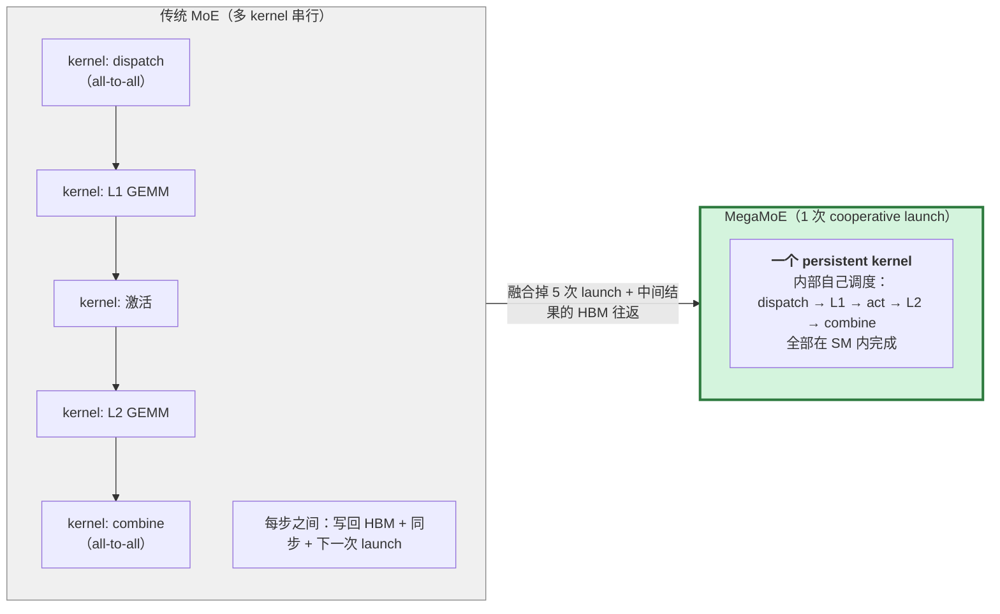
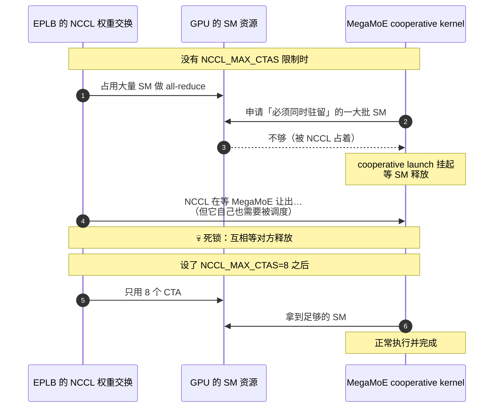
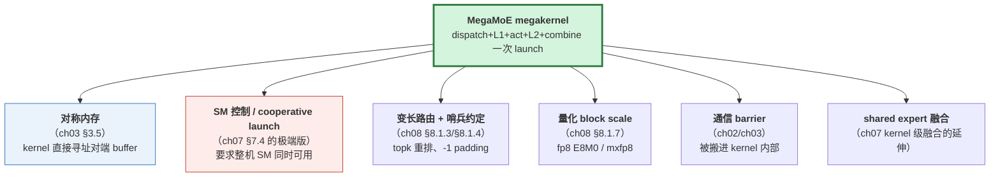

# 附录 F　MegaMoE：把整个 MoE 层压成一个 kernel

> **这是什么**：DeepSeek 在 DeepGEMM 里开源的 **MoE 融合 megakernel** ——
> 把 MoE 层的 **dispatch → L1 GEMM → 激活 → L2 GEMM → combine** 全部塞进**一次 kernel launch**。
> vLLM 已经接入（DeepSeek-V4、Kimi-K3 用得上）。
>
> **为什么这份材料要专门讲它**：它是「AI Infra 通信演进」的**下一个形态**。
> 你在 ch07（通算融合）和 ch08（MoE all-to-all）里学到的所有零件 ——
> 对称内存、SM 仲裁、pre-staged 输入、变长路由 —— **MegaMoE 把它们组装成了一个东西**。
> 面试里能讲清 MegaMoE，说明你不只懂 vLLM 的现状，还知道它往哪走。
>
> ⚠️ **本附录的代码事实来自本仓库 checkout**（vLLM 的 `deep_gemm_mega_moe`、
> `vllm/third_party/deep_gemm/` 的 `mega/` 与 `include/`）。
> **性能数字一律不引用** —— 我没有 Blackwell 机器，没有实测。文中的「为什么快」是
> **从代码结构推出的机制解释**，不是测量结论。

---

## F.0 一句话定位



**收益来源（三条，都是「省」而不是「算得更快」）**：

| 省什么 | 机制 |
|---|---|
| **kernel launch 开销** | 5 次 launch → 1 次（每次 3–10 μs，见 ch01 §1.2） |
| **中间结果的 HBM 往返** | dispatch 出来的 token、L1 的输出、激活的输出——传统做法都要落 HBM 再读回 |
| **全局同步** | 多 kernel 之间必须等整个 grid 结束；megakernel 内部用轻量计数器自己调度 |

**和前文的关系**：
- ch07 §7.1 的第 2 条「把通信融进 kernel」—— **MegaMoE 是这条路的终点形态**；
- ch08 §8.1 的 dispatch/combine —— **MegaMoE 把它们变成了 kernel 内部的远程读写**。

---

## F.1 架构：为什么它需要「对称内存」

### F.1.1 `SymmBuffer`：通信与计算的统一工作区

（`vllm/third_party/deep_gemm/mega/__init__.py`）

```python
class SymmBuffer:
    def __init__(self, group, num_experts, num_max_tokens_per_rank,
                 num_topk, hidden, intermediate_hidden,
                 num_shared_experts=0, mma_type='fp8xfp4', activation='swiglu'):
        ...
        num_bytes, slice_input_buffers = _C.get_symm_buffer_size_for_mega_moe(...)
        allocator = torch if group.size() == 1 else symm_mem
        self.buffer = allocator.empty(num_bytes, dtype=torch.int8, device='cuda')
        self.handle = (
            types.SimpleNamespace(buffer_ptrs=[self.buffer.data_ptr()])
            if group.size() == 1
            else symm_mem.rendezvous(self.buffer, group=group)
        )
```

**三个关键事实**：

1. **用的是 `torch.distributed._symmetric_memory`** —— 和 ch03 §3.5 讲的对称内存**是同一套东西**。
   `symm_mem.rendezvous(buffer, group)` 取到的是**所有 rank 的对端指针**。
2. **`group.size() == 1` 时退化为本地 buffer** ——
   单卡也能跑（只是没有跨 rank 通信），所以代码路径不用分叉太多。
3. **分配一次、按需切片**（`slice_input_buffers`）——
   切出 `x / x_sf / topk_idx / topk_weights / l1_acts / l2_acts / shared_*` 等视图。

**为什么必须用对称内存**（这是本题的**核心面试点**）：

> 因为 megakernel 内部要**直接读写对端 rank 的缓冲区**。
> 如果每个 rank 的 buffer 地址不同、无法互相寻址，
> 就只能回到「发消息 → 网卡搬运 → 收消息」的传统模式 ——
> **而那就是它要消灭的东西**。
>
> **对称内存是「在 kernel 内做通信」的前置条件，不是可选的优化。**

### F.1.2 工作区内部长什么样（从 C++ 布局反推调度设计）

（`vllm/third_party/deep_gemm/include/deep_gemm/layout/mega_moe.cuh`）

```cpp
// NVIDIA L2 cache lines are 128B, and these counters are hot atomics.
static constexpr uint64_t kNumBarrierSignalBytes = 128;
```

**第一行注释就是一条性能工程经验**：把 grid sync / NVLink barrier / 调度计数器
**按 128 字节 L2 cache line 对齐**，避免**伪共享（false sharing）**——
这些计数器是**热原子操作**，落在同一条 cache line 上会互相打爆。

**计数器布局**（同一文件注释）：

```
// Grid sync counters: `kNumBarrierSignalBytes` layout
// [ 0..15]: 4 x uint32_t grid sync counters
// [16..20]: uint32_t NVLink barrier counter
// [20..27]: 2 x int NVLink barrier signals (phase 0 and 1)
// [28..31]: uint32_t L1 schedule task counter
// [32..35]: uint32_t L2 schedule task counter
// [36..39]: uint32_t shared L1 schedule task counter
// [40..43]: uint32_t shared L2 schedule task counter
```

**从这 44 字节能读出的设计**：

| 计数器 | 说明 |
|---|---|
| **grid sync** | megakernel 内部要**全局同步**（不需要退出 kernel） |
| **NVLink barrier**（两个 phase） | 跨 rank 的同步 —— **通信 barrier 被搬进了 kernel** |
| **L1/L2 schedule task 计数器** | 任务的**动态调度**（哪个 block 干哪块活），不是静态 grid 映射 |
| **shared L1/L2 计数器** | **共享专家（shared expert）也有独立的调度** —— 它是被融合进来的 |

**面试价值**：**「一个 megakernel 内部需要自己的 barrier、自己的任务调度器」** ——
这解释了为什么它必须用 **cooperative launch**（§F.2.2），
以及为什么它会和 EPLB 的 NCCL 抢 SM 导致死锁（§F.3）。

**ring buffer 与流水线**：

```cpp
// L1 full token count (ring) / L1 empty block count (ring)
// L2 full block count (ring)   / L2 empty block count (ring)
num_bytes += num_ring_blocks * sizeof(uint32_t);   // ×4 组
```

→ **用「满/空块计数」的 ring buffer 做生产者-消费者流水线**：
dispatch 产出 token 进 ring，L1 消费；L1 产出进 ring，L2 消费……
**每级流水线都能重叠**，而不是「等上一级全做完」。
**这是 megakernel 能把通信和计算重叠起来的机制基础。**

**combine 的元数据只存 12 字节**：

```cpp
struct TokenSrcMetadata {
    uint32_t rank_idx;
    uint32_t token_idx;
    uint32_t topk_idx;
};
```

→ 每个 token 只需要记住「**来自哪个 rank 的哪个 token 的第几个 topk**」，
就能把结果送回去并加权。**这就是 ch08 §8.1.3 讲的「token permute 映射」，
只是它被压到 12 字节、放在对称内存里，让 kernel 直接读。**

### F.1.3 动态 BLOCK_M：megakernel 为什么不固定 tile

```cpp
static constexpr int kNumCandidateBlockMs = 7;
static constexpr int kCandidateBlockM[kNumCandidateBlockMs] = {8, 16, 32, 64, 96, 128, 192};
static constexpr int kMaxCandidateBlockM = 192;
static constexpr int kMinCandidateBlockM = 8;
static constexpr int kLCMCandidateBlockM = 384;
```

**为什么要 7 个候选 BLOCK_M**：MoE 的每个专家收到的 token 数**极度不均**
（ch08 §8.1.5 讲的 straggler）。固定 tile 大小必然浪费：
- 固定大 tile（192）→ 小专家浪费大量 padding；
- 固定小 tile（8）→ 大专家 tile 数爆炸、调度开销高。

→ **运行时按每个专家的实际 token 数挑合适的 BLOCK_M**。
`kLCMCandidateBlockM = 384` 是这些候选值的**最小公倍数**，
用来算「所有候选下最坏的 padding」→ 决定 buffer 容量的上界。

**这个细节的面试价值**：
> **「megakernel 不只是把 kernel 合并，它还需要一套运行时的 tile 调度器」** ——
> 这是它复杂度真正所在，也是为什么这类工作难以复现。

---

## F.2 vLLM 怎么接入它

### F.2.1 三条 MoE backend 路径

（`vllm/config/kernel.py`）

```python
MoEBackend = Literal[
    ..., "deep_gemm", "deep_gemm_mega_moe",
    "flashinfer_moe_ep_mega_deep_gemm", "flashinfer_moe_ep_mega_cutedsl", ...
]

# Backends that run a mega-MoE model path (fused expert module plus
# prepare_megamoe routing): vLLM's native deep_gemm path, which any model
# with a mega-MoE module may use (DeepSeek-V4, Kimi K3), plus the flashinfer
# moe_ep variants.
MEGA_MOE_BACKENDS = frozenset({"deep_gemm_mega_moe"}) | FLASHINFER_MOE_EP_BACKENDS
```

| backend 值 | 实现 | 说明 |
|---|---|---|
| `deep_gemm_mega_moe` | **vLLM 原生**（直接调 DeepGEMM） | 任何有 mega-MoE 模块的模型都能用（DeepSeek-V4、Kimi-K3） |
| `flashinfer_moe_ep_mega_deep_gemm` | FlashInfer `moe_ep` 运行时 + **DeepGEMM megakernel** | EP 框架用 FlashInfer，kernel 仍是 DeepGEMM |
| `flashinfer_moe_ep_mega_cutedsl` | FlashInfer + **CuteDSL megakernel**（`nvfp4_cutedsl`） | 另一套 megakernel 实现 |

**架构约束**（`vllm/utils/flashinfer_moe_ep.py` 注释原文）：

> *"Every mega kernel is Blackwell-only, so the arch is a property of the family"*

**→ MegaMoE 是 Blackwell 专属。** 这不是「优化没做」，而是它的实现依赖 SM100 的特性
（TMA、UTCCP、FP4 MMA —— 见 §F.4 的权重变换）。

### F.2.2 输入必须预量化：`prepare_megamoe` 的 Triton staging

（`vllm/models/deepseek_v4/nvidia/ops/prepare_megamoe.py`）

docstring 原文：

> *"Triton input-staging kernel for DeepSeek V4 MegaMoE.
> **Quantizes hidden states to fp8 with E8M0 group scales and repacks the routing
> top-k tensors into the int64/float32 layout that the DeepGEMM MegaMoE kernels consume.**"*

**它在做什么**（逐条对应代码）：

| 步骤 | 代码位置 | 说明 |
|---|---|---|
| hidden → **fp8** | `scaled.to(tl.float8e4nv)` | e4m3 |
| 按 **32 元素一组**算 amax | `GROUP_K = 32`，`tl.reshape(tl.abs(hidden), [num_groups, GROUP_K])` | 组内缩放 |
| 缩放因子取 **E8M0**（8 位指数，无尾数） | `scale_exp = ((scale_bits >> 23) & 0xFF) + ...`，然后 `(scale_exp << 23)` 转回 float | **E8M0 = 只有指数**，所以用位操作把 float32 的指数位抠出来 |
| **4 个 E8M0 打包进一个 int32** | `tl.sum(scale_exp << (scale_offsets * 8), axis=0)` | 每个 scale 占 1 字节 |
| topk → **int64**，padding 置 `-1` | `ids = tl.where(token_is_padding, -1, ids)` | 哨兵约定，见 ch08 §8.1.3 |
| weights → **float32**，padding 置 `0.0` | `weights = tl.where(token_is_padding, 0.0, weights)` | |
| **可选的 shared expert scale 重排** | `transposed_m = (m_in_block // 128) * 128 + (m_in_block % 32) * 4 + (m_in_block % 128) // 32` | 见下 |

**为什么要有这个 staging kernel**（面试点）：

> **megakernel 内部不做格式转换。** 它期望的输入布局是**固定的、
> 为它的 TMA / MMA 指令优化的**。所以量化、打包、重排必须在**进 kernel 之前**做完。
>
> **这是「融合」的代价**：融合掉的是 kernel 之间的边界，
> 但**代价是把「格式适配」的责任推到了 kernel 外面** ——
> 于是多了一个 staging kernel 和一套新的布局约定。

**那段 shared expert 的转置公式值得单独讲**：注释说

> *"DeepGEMM's SM100 shared-expert TMA loads require the activation scales
> in an MN-major layout whose row permutation depends on the MegaMoE
> scheduler's runtime BLOCK_M."*

→ **它被迫在这里就把行序按 128 对齐重排**，因为 scheduler 的 BLOCK_M 是**运行时**才知道的。
注释还说这个写法和 packed scale 共用同一份寄存器驻留数据，
**"avoiding another kernel and temporary tensor"** ——
**典型的「顺手在同一趟里做完，省一次 kernel + 一份临时张量」。**

### F.2.3 `NCCL_MAX_CTAS=8`：为了防死锁，不是为了性能 ★

（`vllm/distributed/eplb/eplb_utils.py`）

这是**整个附录最值得记的一段**。代码注释原文：

> *"Override `NCCL_MAX_CTAS` to avoid hangs when EPLB's NCCL weight exchange
> contends with MoE backend's cooperative-launch on GPU SMs.*
>
> *DeepGEMM Mega MoE uses **cooperative launch**, which tries to reserve a
> large fraction of the GPU's SMs. **If those SMs are occupied by NCCL, the
> cooperative launch blocks until enough SMs are freed, causing a deadlock.**
> Limiting NCCL occupancy via `NCCL_MAX_CTAS` leaves space for the cooperative
> kernel to launch and complete."*

```python
if (is_data_parallel and is_eplb_enabled
        and is_nccl_based_eplb_communicator and is_mega_moe):
    override_value = 8
    os.environ["NCCL_MAX_CTAS"] = str(override_value)
```

**把这段的逻辑画出来**：



**为什么这是「死锁」而不是「变慢」**（面试重点）：

> **cooperative launch 的语义是「所有 CTA 必须同时驻留才能启动」。**
> 它不是「排队等 GPU 有空」，而是**要么一次全上来，要么一个都不上**。
> 如果 SM 被 NCCL 长期占着，MegaMoE 就**永远启动不了**；
> 而 NCCL 的这次 all-reduce 可能又在等一个后续操作 —— **互等 → 死锁。**
>
> **这是一个「正确性」层面的资源冲突，不是性能调优。**

**和前文的呼应（这是本附录的核心叙事）**：

| 前文 | MegaMoE 里的对应 |
|---|---|
| ch07 §7.4 SM 仲裁：DBO 给通信留 20 个 SM | 这里反过来：**给计算（cooperative kernel）留足 SM，限制通信** |
| ch03 §3.6 `NCCL_MAX_CTAS` | 在这里从「调优参数」变成**「防死锁开关」** |
| ch07 §7.4 「重叠和资源复用天然冲突」 | 极端版本：**强行重叠会死锁** |

> **一句话**：ch07 讲的是「重叠时怎么分配 SM」，
> MegaMoE 讲的是「**当计算 kernel 要求整机 SM 时，通信必须让路**」。
> 同一个资源博弈，走向了另一个极端。

### F.2.4 其他约束（从代码和测试里读出来的）

| 约束 | 来源 | 说明 |
|---|---|---|
| **`hidden_size % 128 == 0`** | `prepare_megamoe.py` 的 `prepare_megamoe_inputs()` 里显式 raise | 128 是 K 方向的分块 |
| **`topk_weights.shape == topk_ids.shape`** | 同上 | 两者一起重排 |
| **`shared_x_sf` 与 `shared_block_m` 必须同时给** | 同上 | |
| **`shared_x_sf` 行数要够** | 同上（`required_rows` 计算） | 按 `shared_block_m` 向上 128 对齐 |
| **必须是 Blackwell** | `vllm/utils/flashinfer_moe_ep.py` 注释：*"Every mega kernel is Blackwell-only"* | 所有 mega kernel |
| **EPLB + NCCL communicator 时要设 `NCCL_MAX_CTAS`** | `vllm/distributed/eplb/eplb_utils.py` 的 `override_envs_for_eplb()` | 否则可能死锁 |
| **capture 必须早于 EPLB** | `tests/models/test_deepseek_v4_mega_moe.py:55`（`test_deep_gemm_mega_moe_capture_precedes_eplb`） | **测试名字本身就在描述一个顺序约束** |
| **共享专家不能重复加** | 同上（`test_..._does_not_double_add_fused_shared_expert`） | 融合 shared expert 时的正确性风险 |

**最后两条特别值得注意**：
**测试的函数名往往比文档更准确地记录了「踩过的坑」。**
`capture_precedes_eplb` 这个测试名说明「MegaMoE 的 capture 必须在 EPLB 之前」是一个
**曾经出过问题的顺序依赖** —— 这类顺序依赖在分布式系统里非常常见（ch05 §5.0 的「三一致」）。

---

## F.3 它依赖的那些「已有零件」

这是本附录最想传达的认知：**MegaMoE 不是一个孤立的新技术，
而是把本材料前面几章讲过的零件组装起来。**



**面试话术（本附录最有价值的一段）**：

> 「理解 MegaMoE 不需要新概念 —— 它是**已有零件的重新组装**：
> 对称内存给了 kernel 寻址对端的能力（ch03），
> SM 控制/cooperative launch 给了它独占计算的权力（ch07 的极端版），
> 变长路由和哨兵约定解决了 token 分发（ch08），
> 量化 block scale 保证了带宽（ch08）。
> **它的新意在于「把这五件事放进同一个 kernel」**，
> 而代价是：需要 staging kernel、需要所有权重预变换、需要防死锁的 SM 让路、
> 以及局限在 Blackwell。
> **所以它不是万能解 —— 它是「当硬件给了足够能力时，
> 把过去只能在 kernel 之间做的事搬进 kernel 内」的一次尝试。**」

---

## F.4 权重也要预处理（一个容易忽略的成本）

（`vllm/third_party/deep_gemm/mega/__init__.py` 的 `transform_weights_for_mega_moe`）

```python
def _interleave_weights(t, gran=8):
    # [gate: 0..7, up: 0..7, gate: 8..15, up: 8..15, ...] instead of [gate | up]
```

**它在做什么**：SwiGLU 需要 `gate` 和 `up` 两个投影。
通常权重存成 `[gate 全部 | up 全部]`，但 megakernel 需要**按 8 个一组交错**。

```python
def _transpose_sf_for_utccp(sf):
    result = (sf.reshape(num_groups, -1, 4, 32, packed_sf_k)
                .transpose(2, 3).reshape(num_groups, mn, packed_sf_k))
```

**`UTCCP`**（`tcgen05` 时代的指令）要求 scale factor 按特定的 `4×32` 块转置布局。

**两个必须记住的点**：

1. **`transform_weights_for_mega_moe` 是加载期一次性工作**，不是每步都做 ——
   所以它是**启动成本**，不是运行时成本。
2. **但它意味着「MegaMoE 不能直接用 HuggingFace 的原始权重」** ——
   必须经过一次布局变换。**这就是为什么它的权重加载器有专门的测试**
   （`test_deepseek_v4_mega_moe_weight_loader_uses_ep_expert_ownership`、
   `test_..._finalizes_native_shared_expert_weights`）。

**面试话术**：
> 「megakernel 这类工作的隐藏成本在**权重布局**上。
> 为了用上特定的 MMA 指令，权重和 scale 都要重排（gate/up 交错、
> scale 按 4×32 转置）。这是加载期的一次性成本，
> 但意味着**不能直接用原始权重，必须经过一层变换** ——
> 因此权重加载器、EP 专家归属、shared expert 的 finalize 都要跟着改。
> **这类「看起来只是换了个 kernel」的优化，实际会扩散到整个加载链路。**」

---

## F.5 怎么发现和验证你手上的环境能不能用

```bash
# 1. 确认是 Blackwell（cc 10.x）
nvidia-smi --query-gpu=name,compute_cap --format=csv
#  需要 10.0 / 10.3 等 SM100 系列

# 2. 确认有没有 mega 后端可用
python -c "
from vllm.config.kernel import MEGA_MOE_BACKENDS, FLASHINFER_MOE_EP_BACKENDS
print('mega backends:', sorted(MEGA_MOE_BACKENDS))
print('flashinfer ep:', sorted(FLASHINFER_MOE_EP_BACKENDS))
"

# 3. 看 DeepGEMM 里有没有编进来 mega 实现
python -c "
import vllm.third_party.deep_gemm as dg
print('has mega module:', hasattr(dg, 'mega'))
"

# 4. 启动时指定后端
vllm serve <DeepSeek-V4 或 Kimi-K3 模型> --moe-backend deep_gemm_mega_moe
```

**排障线索**（按可能性排序）：

| 现象 | 首查 |
|---|---|
| 起不来 / 报 arch 不支持 | 是不是 Blackwell（`compute_cap` 10.x） |
| `hidden_size` 报错 | hidden 是不是 128 的倍数 |
| **hang（不是报错）** | **是不是 EPLB + NCCL 与 cooperative launch 抢 SM** → 看 `NCCL_MAX_CTAS` 有没有被设成 8 |
| 精度不对 / 结果翻倍 | shared expert 有没有被重复加（测试名直接点出了这个坑） |
| capture 相关报错 | capture 与 EPLB 的顺序（`capture_precedes_eplb`） |

---

## F.6 它的局限（面试里主动说，显得客观）

| 局限 | 说明 |
|---|---|
| **Blackwell 专属** | 依赖 SM100 的 TMA / UTCCP / FP4 MMA；不是可移植的优化 |
| **需要 staging kernel** | 融合掉的东西，部分以「前置格式化」的形式回来了 |
| **权重要预变换** | 不能直接用原始权重，加载链路要改 |
| **SM 独占 → 与其它通信冲突** | 与 EPLB/NCCL 的冲突需要靠限制 NCCL 来避免（甚至可能死锁） |
| **复杂度高** | 内部自带 barrier、scheduler、ring buffer、7 个候选 BLOCK_M |
| **与其它优化的兼容性** | 和 DBO（ch07）、CUDA Graph 的交互需要专门的顺序约束 |

**一句总结**：
> **MegaMoE 走的是「用极致的单 kernel 融合换掉所有中间开销」这条路，
> 代价是牺牲可移植性、把复杂度集中到一个 kernel 里、并和别的优化争夺资源。
> 它代表一个方向，但不是所有场景的最优解。**
>
> **判断要不要用它：看你的瓶颈是不是「kernel launch + HBM 往返」，
> 以及你能不能接受 Blackwell 锁定。**

---

## F.7 与 ch07 的对照：两条融合路线的比较

这是本附录最想留下的**思维框架**：

| | **ch07：DBO（双 batch 重叠）** | **附录 F：MegaMoE（单 kernel 融合）** |
|---|---|---|
| 融合层次 | **batch 级**：两个 ubatch 交替 | **算子级**：整个 MoE 层一个 kernel |
| 怎么重叠 | 两个线程 ping-pong，**计算和通信并行** | **不需要重叠** —— 通信变成 kernel 内的内存操作 |
| SM 策略 | 给通信留 20 个 SM（ch07 §7.4） | **计算独占大部分 SM，通信让路** |
| 关键前置 | 异步 prepare/finalize | 对称内存 + cooperative launch |
| 通用性 | 较通用（DeepEP/NIXL 都能用） | **Blackwell 专属** |
| 复杂度落在哪 | 调度器（线程/事件/SM 仲裁） | **kernel 内部**（barrier/scheduler/ring） |

**面试话术**：
> 「MoE 的通信优化有两条路：
> **一条是把通信和计算在时间上错开**（DBO —— 需要异步接口和 SM 仲裁）；
> **另一条是把通信变成根本不存在的通信**（MegaMoE —— 让 kernel 直接读对端内存）。
> 前者更通用，后者更极致但锁定硬件。
> **这两条路在资源上是对立的** —— DBO 要给通信留 SM，
> MegaMoE 要让通信让出 SM。所以它们不能简单叠加。」

---

## F.8 本章自检题

1. MegaMoE 把哪几个阶段融合进了一个 kernel？省掉的是什么（说三条）？
2. 为什么它**必须**用对称内存？如果不用会怎样？
3. `SymmBuffer` 在 `group.size() == 1` 时怎么处理？为什么要这样？
4. 为什么 megakernel 内部需要自己的 grid barrier 和 NVLink barrier？
5. `kNumBarrierSignalBytes = 128` 那行注释在防什么问题？
6. ring buffer 的「满/空块计数」是为了实现什么？
7. `TokenSrcMetadata` 只有 12 字节，三个字段分别是什么？为什么这就够了？
8. 为什么要有 7 个候选 `BLOCK_M`？固定一个会怎样？
9. `prepare_megamoe` 为什么必须存在？megakernel 能不能自己做量化？
10. E8M0 scale 为什么要 4 个打包进一个 int32？
11. **`NCCL_MAX_CTAS=8` 是为了性能还是为了正确性？** 请解释死锁是怎么形成的。
12. 什么是 cooperative launch？它和「排队等 GPU」有什么本质区别？
13. 为什么 MegaMoE 必须限定在 Blackwell？
14. `transform_weights_for_mega_moe` 为什么要交错 gate/up？这是运行时成本还是启动成本？
15. DBO 和 MegaMoE 在 SM 策略上为什么是对立的？
16. 如果面试官问「MegaMoE 是万能解吗」，你怎么答？

---

## F.9 本附录的边界（诚实声明）

| 说明 | 影响 |
|---|---|
| **所有代码事实来自本仓库 checkout**（vLLM 的 `vllm/config/kernel.py`、`vllm/utils/flashinfer_moe_ep.py`、`vllm/distributed/eplb/eplb_utils.py`、`vllm/models/deepseek_v4/nvidia/ops/prepare_megamoe.py`、`vllm/third_party/deep_gemm/mega/` 与 `include/deep_gemm/` 的 mega 相关头文件） | 可核对 |
| **35 条关键事实已脚本化验证**：`python code/check_megamoe_claims.py` → `35/35` | 上游改了会被检出 |
| **没有任何实测数据** | 文中「为什么快」是**从代码结构推出的机制**，不是测量结论。**面试时不要说成实测。** |
| 本机是 RTX 4060（cc 8.9），**不是 Blackwell** | 无法运行验证；所有运行相关结论都来自代码与测试的静态阅读 |
| `deep_gemm` 的 `_C` 扩展在本仓库以预编译 `.so` 形式存在，**没有读它的 C++ 实现** | §F.1.2 的布局结论来自头文件（`.cuh`），不是 `.so` |
| MegaMoE 是**演进中的特性** | 上游可能已变化；请以你手上的代码为准 |

**一个值得记录的细节**：写这份附录时，我把 `eplb_utils.py` 里那段注释
「引号原文」写成了 `"...causing a deadlock."`——**内容没错，但我不确定是否逐字准确**。
`check_megamoe_claims.py` 立刻报了 FAIL，原因是**原文的 "causing a" 和 "deadlock"
被换行分开了**（中间夹着注释符 `#`）。
这暴露的不是「引错了」，而是**「逐字引用源码注释」这件事本身很容易出错** ——
注释会硬换行、会有行首 `#`、会有 unicode 破折号。
**所以本附录的验证脚本会先做规范化（去注释符 + 折行 + 统一破折号）再比对**，
这也是你引用别人的代码注释时该有的习惯。
