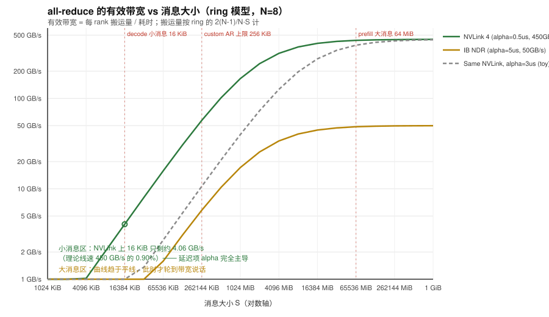
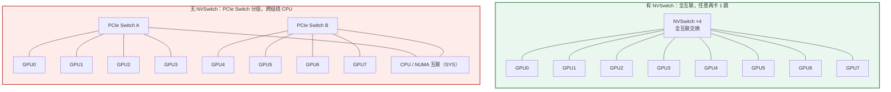

# 第 1 章　基本网络：从一根线到一张 GPU 网络

> 本章目标：建立**带宽、延迟、拓扑**三个直觉，并能做「这个操作要多久」的手算。
> 读完你应该能回答：为什么 TP 不能跨机？为什么 IB 比以太网贵？NCCL 为什么需要知道拓扑？

---

## 1.1 三个必须先分清的量

面试里 90% 的网络题最后都会落到这三个量的换算上。

| 量 | 符号 | 单位 | 直觉 |
|---|---|---|---|
| 带宽（单向吞吐） | BW | GB/s（字节）或 Gb/s（比特） | 「水管多粗」 |
| 延迟（单程/往返） | α（latency） | μs | 「水多久到」 |
| 消息大小 | S | bytes | 「要运多少水」 |

**换算关系（第一个大坑）：**

- `1 byte = 8 bits`。网卡规格写 **400 Gb/s**，那是 **50 GB/s**（`400/8`）。
- `1 GB/s` 的「G」在存储/网络语境通常指 `10^9`，而 `GiB/s` 才是 `2^30`。HPC 论文里常混用。
- vLLM 代码里出现的 `MiB` 是 `2^20`（见 `vllm/distributed/device_communicators/all_reduce_utils.py:31` 附近的
  `CUSTOM_ALL_REDUCE_MAX_SIZES`，用 `MiB` 和 `MiB // 4` 这种写法）。

**传输时间的第一近似模型（α-β 模型）：**

```
T(S) = α + S / BW
```

这个模型当然不精确（真实网络里 α 随拓扑跳数变化，BW 随并发度变化），但它是**面试答题的基本功**：

> 例：跨机 all-reduce 一个 1 MB 的 tensor，IB 延迟 5 μs，带宽 50 GB/s（400 Gb/s HDR/NDR 单口）。
> 单次搬运动作 ≈ `5 μs + 1 MB / 50 GB/s = 5 μs + 20 μs = 25 μs`。
> 而 GPU 算一个 token 的一层可能只有 10 μs —— **这就是为什么 TP 不能跨机**。

**带宽的两种口径（第二个大坑）：**

- **单向带宽（unidirectional）**：一个方向能跑的量。
- **双向/聚合带宽（bidirectional / aggregate）**：两个方向加起来。

NVIDIA 在 NVLink 上的宣传口径经常是「聚合」。例如 H100 的 NVLink 4：**900 GB/s 双向**，
即 **450 GB/s 单向**。做 ring all-reduce 的时间估算时，如果按单向带宽算，用 450；按双向算，用 900。
**答题时一定要说明你用的是哪个口径** —— 说清楚口径本身就是加分项。

---

## 1.2 延迟的数量级（记住这张表，面试常问「大概多少」）

以下为工程常见量级，用于估算，不是精确值（标注「经验值」的地方请按此理解）：

| 路径 | 单向延迟量级 | 备注 |
|---|---|---|
| HBM 访存 | ~0.5–1 μs 级（看容量/访问模式） | 一个 kernel launch 通常比它贵 |
| Kernel launch | ~3–10 μs | 这是 decode 阶段最大的敌人之一 |
| NVLink（同机跨 GPU） | 亚 μs 级 | P2P，不经过 CPU |
| PCIe（同机跨 GPU） | ~1–2 μs 级 | 需要 P2P 支持 |
| IB 交换机一跳 | ~100–200 ns | 交换芯片转发 |
| IB 端到端（HDR/NDR，小消息） | ~2–5 μs | 含 HCA 处理 |
| TCP/IP（内核协议栈） | ~10–30 μs | 大量内存拷贝 + 中断 |
| RDMA over RoCE（小消息） | ~3–8 μs | 比 TCP 快一个量级 |
| 同机 UDS/ZMQ | ~10–50 μs | 进程间控制面常用 |

**为什么 AI Infra 一定要 RDMA**：上表里 TCP 的 10–30 μs 延迟 + CPU 参与（拷贝、中断、上下文切换），
在 decode 阶段（每步总时间可能只有几 ms 甚至几百 μs）会直接把 CPU 打满。RDMA 让网卡直接读走显存/内存，
**零拷贝 + 内核旁路（kernel bypass）**，CPU 只负责下发一次门铃（doorbell）。

### 1.2.1 把「延迟 vs 带宽」画出来

上面那张表是「点」，这张图是「线」—— **有效带宽随消息大小变化**。
这是面试里区分「背过概念」和「算过账」的地方：



**怎么读这张图**（三条曲线都是 ring all-reduce，N=8）：

| 区域 | 现象 | 原因 |
|---|---|---|
| **左侧（≤32 KiB）** | 曲线**陡直上升**，有效带宽极低 | **延迟项 `2(N-1)·α` 主导**，搬数据本身几乎不花时间 |
| **中段（32 KiB – 4 MiB）** | 曲线开始变平 | 延迟项与带宽项量级相当 |
| **右侧（≥16 MiB）** | 趋于水平，接近线速 | 带宽项主导，延迟可忽略 |

**从图里能直接读出的三个结论**：

1. **NVLink 上 16 KiB 的 all-reduce，有效带宽只有 ~4 GB/s**（图里的绿圈），
   约为理论线速 450 GB/s 的 **0.9%**。所以 **decode 阶段根本不是在「传数据」，
   而是在「付延迟」** —— 这就是 vLLM 要自研 custom all-reduce 的根本原因（ch04）。
2. **同样 16 KiB，换成跨机 IB（橙线）要 ~70 μs，是 NVLink 的 10 倍以上**。
   **跨机 TP 不可行不是因为带宽不够，而是因为延迟 × 步数**（§1.8.2 有详细手算）。
3. **两条曲线的「膝盖」位置不同** —— α 越大，曲线整体越靠右下。
   所以「小消息优化」在 NVLink 上收益更集中、也更值得做。

> 📐 这张图由 `make_figures.py` 生成（纯 Python，不依赖 matplotlib），
> `python code/make_figures.py` 可重新生成；改 α / 带宽参数就能画出你自己硬件的版本。
> 用 `check_figures.py` 验证图的合法性。

---

## 1.3 术语地图：从物理层到应用层

不要求背 OSI 七层，但要知道每个词在哪一层，面试时才不会答串。

```
应用层      │ NCCL API (ncclAllReduce) / torch.distributed / MPI
────────────┼──────────────────────────────────────────────────────
通信库层    │ NCCL / RCCL / Gloo / MPI          ← 决定「用什么算法、走什么路」
────────────┼──────────────────────────────────────────────────────
传输层      │ RDMA verbs (ibv_post_send) / TCP / UDP
────────────┼──────────────────────────────────────────────────────
网络层      │ IP / IB 的 LID-GID 寻址、RoCEv2 把 IB 封进 UDP
────────────┼──────────────────────────────────────────────────────
链路层      │ Ethernet / InfiniBand link、PCIe、NVLink
────────────┼──────────────────────────────────────────────────────
物理层      │ 光模块、DAC/AOC 线、SerDes、Switch ASIC
```

**关键认知**：NCCL 是一个**通信库**，不是协议。它向下会同时使用多种传输：
NVLink（P2P）、PCIe（P2P）、InfiniBand verbs、RoCE、甚至 TCP socket（做 bootstrap 和兜底）。

---

## 1.4 机内互联之一：PCIe

### 1.4.1 版本与带宽

| 版本 | 单 lane 速率 | x16 单向带宽（近似） |
|---|---|---|
| PCIe 3.0 | 8 GT/s | ~16 GB/s |
| PCIe 4.0 | 16 GT/s | ~32 GB/s |
| PCIe 5.0 | 32 GT/s | ~64 GB/s |
| PCIe 6.0 | 64 GT/s | ~128 GB/s |

注意：这些是**编码后的有效带宽**近似值。PCIe 3.0/4.0 用 128b/130b 编码，5.0/6.0 用 PAM4 + FLIT。
面试只需要记住「**代际翻倍，x16 大约是 16/32/64/128 GB/s**」。

### 1.4.2 P2P（Peer-to-Peer）—— 一个高频考点

默认情况下，GPU A 要访问 GPU B 的显存，路径是：

```
GPU A → PCIe → CPU/内存（bounce buffer）→ PCIe → GPU B     ← 两次穿越 PCIe，慢
```

开启 **P2P** 后（需要 PCIe 拓扑支持、IOMMU 配置正确、驱动允许）：

```
GPU A → PCIe Switch → GPU B                                ← 一次穿越，快
```

**vLLM 里的实体**：`vllm/distributed/device_communicators/all_reduce_utils.py` 提供了
`gpu_p2p_access_check(rank, i)`，被 `custom_all_reduce.py:246` 附近的逻辑用来在启用自定义
all-reduce 之前**实测 P2P 是否可用**。

```python
# vllm/distributed/device_communicators/custom_all_reduce.py 附近
if not envs.VLLM_SKIP_P2P_CHECK and not _can_p2p(rank, world_size):
    logger.warning("Custom allreduce is disabled because your platform lacks GPU P2P capability...")
```

**为什么重要**：没有 P2P，自定义 all-reduce 直接不可用，只能退回 NCCL（NCCL 自己能处理无 P2P 的情况，
但会走更慢的路径）。这也是很多云主机 / 消费级多卡机器跑 TP 慢的根因。

### 1.4.3 拓扑的坑：PCIe Switch 与 NUMA

一台 8 卡机里，8 张卡不一定两两等距。常见两种：

- **PCIe Switch 组**：每 4 张卡挂在一个 PCIe Switch 下，跨 Switch 要经过 CPU 的 PCIe Root Complex。
  → 跨 Switch 通信带宽会掉，延迟会涨。
- **NUMA 亲和**：GPU 挂在不同 CPU socket 下。GPU 要读 host memory（比如 KV cache offload、
  NCCL 的 host bounce buffer）时，跨 NUMA 访问更慢。

**NCCL 会读这个拓扑**（见 ch03 的 topology detection），自行决定 ring 的节点顺序，把跨 Switch 的边
放在 ring 上相邻位置。**但如果你自己手写通信（比如用 P2P 做 all-reduce），就必须自己处理**。

**实操命令**（记住这两条，面试问「怎么确认拓扑」）：

```bash
nvidia-smi topo -m          # 打印 GPU/NIC 之间的连接矩阵：NV#, PIX, PXB, PHB, SYS, NODE
nvidia-smi topo -m -p       # 附加 PCIe 总线 ID / NUMA 亲和
```

矩阵里每个 cell 的含义（`nvidia-smi topo -m` 输出里的图例）：

| 值 | 含义 | 相对速度 |
|---|---|---|
| `NV#` | 经过 # 条 NVLink 连接 | 最快 |
| `PIX` | 经过单个 PCIe Switch | 快 |
| `PXB` | 经过多个 PCIe Switch | 中 |
| `PHB` | 经过 PCIe Host Bridge | 较慢 |
| `SYS` | 跨 NUMA / CPU 互联（UPI/QPI） | 最慢 |
| `NODE` | 同一 NUMA 节点内 | 慢 |

---

## 1.5 机内互联之二：NVLink 与 NVSwitch

### 1.5.1 为什么需要它

PCIe 5.0 x16 单向 ~64 GB/s，但一张 H100 的 HBM 带宽是 ~3.35 TB/s。
如果做 TP=8，每层都要 all-reduce，**PCIe 会成为绝对瓶颈**。NVLink 就是为此而生的 GPU 专用互联。

| 代际 | 平台 | 每 GPU 双向带宽 | 单向（近似） |
|---|---|---|---|
| NVLink 3 | A100 | 600 GB/s | 300 GB/s |
| NVLink 4 | H100 | 900 GB/s | 450 GB/s |
| NVLink 5 | B200/GB200 | 1800 GB/s | 900 GB/s |

（以上为公开规格的常见口径，NVLink 5 每 GPU 双向 1.8 TB/s。做估算时用单向值。）

### 1.5.2 NVSwitch：从「全互联」到「交换」

- 没有 NVSwitch 时，8 卡两两直连需要大量链路，且拓扑不对称。
- **NVSwitch** 是一颗交换芯片：每个 GPU 连到所有 NVSwitch，任意两卡之间都是 **一跳**，带宽对称。
- DGX H100 里是 4 颗 NVSwitch，8 张 GPU 全互联，**任意两卡 450 GB/s 单向**。

**面试点**：为什么要 NVSwitch？→ 让 GPU 间的**全互联（full bisection bandwidth）** 成为常态，
使得 NCCL 能用最激进的算法（比如全连接的 one-shot all-reduce），也是 vLLM 的
`fully_connected` 判断依据（见 ch04）。

### 1.5.3 MNNVL 与 NVL72

多节点 NVLink（Multi-Node NVLink，MNNVL）把 NVLink 域从「一台机器 8 卡」扩展到「一个机柜 72 卡」
（GB200 NVL72）。对软件来说，72 卡像**一个大 NVLink 域**。

**vLLM 里的实体**（三处，都在 ch04 展开）：

- `vllm/distributed/device_communicators/mnnvl_compat.py`
- `custom_all_reduce.py` 里的 `mnnvl_multicast_ptr` / `_DEFAULT_MNNVL_ALL_GATHER_MAX_SIZES`（`:110`）
- `--all2all-backend flashinfer_nvlink_one_sided|flashinfer_nvlink_two_sided`（见
  `docs/serving/expert_parallel_deployment.md` 的 backend 表）

---

## 1.6 机间互联之一：InfiniBand

### 1.6.1 代际与命名（面试常问「HDR/NDR 是什么」）

| 代际 | 单口速率 | 常见名 |
|---|---|---|
| SDR | 10 Gb/s | |
| DDR | 20 Gb/s | |
| QDR | 40 Gb/s | |
| FDR | 56 Gb/s | |
| EDR | 100 Gb/s | |
| HDR | 200 Gb/s | |
| NDR | 400 Gb/s | 当前主流 |
| XDR | 800 Gb/s | 新一代 |

**换算**：NDR 400 Gb/s = **50 GB/s** 单向。一张 NDR 网卡（HCA）通常有 1 或 2 个口；
双口 ×2 = 100 GB/s 单向。

### 1.6.2 IB 为什么快

IB 的设计要点（和以太网对比）：

| 维度 | InfiniBand | 以太网 |
|---|---|---|
| 定位 | 为 HPC/存储/GPU 集群设计 | 通用 |
| 传输 | 原生 RDMA（verbs） | 原生无 RDMA，靠 RoCE/iWARP 补 |
| 流控 | 基于 credit，**无损（lossless）** | 默认可丢包，靠 PFC/ECN 做无损 |
| 拥塞控制 | 硬件级 | 复杂、软件参与多 |
| 延迟 | 更低更稳 | 抖动更大 |
| 成本 | 高（网卡+交换机+线缆+许可证） | 低 |
| 运维 | 需要 subnet manager（opensm/UFM） | 生态成熟 |

**「无损网络」为什么重要**：GPU 通信是**突发 + 大包**。丢包会导致重传，重传导致延迟抖动，
而 decode 阶段对尾延迟极敏感（p99 TTFT/TPOT 直接决定 SLA）。所以 IB 用 credit-based 流控
**从根本上不丢包**。

### 1.6.3 RoCE：以太网上的 RDMA

RoCEv2 = RDMA 语义封装在 UDP/IP 上，可以在标准以太网跑。代价是必须**手工造出无损**：

- **PFC（Priority Flow Control）**：按优先级暂停链路，防止丢包。配置不当会引发
  **PFC storm / 死锁 / HOL blocking**。
- **ECN + DCQCN**：端到端拥塞控制，给交换机打标记，网卡降速。

**面试点**：「IB 和 RoCE 怎么选？」
→ 预算充足、追求稳定低抖动、集群规模大 → IB；
→ 已有以太网运维体系、成本敏感、规模中等 → RoCE（但要接受调参和排障成本）。

### 1.6.4 GPUDirect RDMA

传统路径：GPU 显存 → CPU 内存 → 网卡。两次拷贝 + CPU 参与。

**GPUDirect RDMA**：网卡通过 PCIe **直接读写 GPU 显存**，不再经过 host memory。

```
GPU HBM ⇄ PCIe/NVLink ⇄ HCA ⇄ 线缆 ⇄ 对端 HCA ⇄ PCIe ⇄ 对端 GPU HBM
```

**vLLM 里的相关实体**：`docs/serving/expert_parallel_deployment.md` 里为了让 DeepEP 走
disaggregated 路径，要求安装 **gdrcopy**：

```bash
tools/install_gdrcopy.sh "${GDRCOPY_OS_VERSION}" "12.8" "x64"
```

`gdrcopy` 提供 CPU 快速访问 GPU 显存的小拷贝原语，是许多 RDMA 库的依赖。

---

## 1.7 GPU 网络的典型拓扑（建立「一台机器里有什么」的图）

**一台 8 卡 GPU 服务器（DGX H100 风格）：**

```
         ┌──── NVSwitch ×4 (全互联) ────┐
   GPU0  GPU1  GPU2  GPU3  GPU4  GPU5  GPU6  GPU7
     │     │     │     │     │     │     │     │
     └─────┴── PCIe Gen5 ─┴─────┴─────┴─────┴─────┘
                        │
                  CPU0        CPU1         ← NUMA 两个 socket
                        │
              ┌─────────┴─────────┐
           HCA0 ... HCA7         ← 8 张 IB 网卡，每张通常"亲和"某几张 GPU
```

**关键事实（面试常问「跨机通信走什么」）**：

1. 同机 GPU ↔ GPU：优先 NVLink（NCCL 会自动探测并用）。
2. 跨机 GPU ↔ GPU：GPU → NVLink/PCIe → HCA → IB → 对端 HCA → GPU。**HCA 是共享资源**，
   8 张 GPU 抢 8 张网卡，或 8 张抢 1 张（这种配置一定慢）。
3. **网卡与 GPU 的亲和性**：HCA 通常挂在某个 PCIe Switch / NUMA 下，离它近的 GPU 通信更快。
   NCCL 会尽量选近的 HCA；选错了会掉带宽。这就是 `NCCL_IB_HCA` 存在的原因。

### 1.7.1 两种「8 卡互联」的对比（决定 TP 能不能用）

这张图是选机器时最该看的一张 —— **同样是 8 卡，能不能做 TP 完全取决于左边的差异**：



| | 左：NVLink + NVSwitch | 右：PCIe only |
|---|---|---|
| 任意两卡 | **1 跳**，带宽对称 | 组内 1 跳；**跨组要绕 CPU**（`SYS`） |
| `nvidia-smi topo -m` | `NV18` 之类 | `PIX` / `PHB` / `SYS` 混着 |
| TP 是否可行 | ✅ 教程所有结论适用 | ⚠️ 慢很多；官方建议**改用 PP** |
| custom all-reduce | ✅ `fully_connected=True` 才会启用 | ❌ 4 卡以上直接禁用（`custom_all_reduce.py:236-242`）|
| 该跑哪些 lab | 套餐 A/B 全套 | 只跑「验证现象」，别和 NVLink 数据对比 |

**这张图直接对应两条代码判据**（ch04 会细讲）：

- `current_platform.is_fully_connected(physical_device_ids)` —— 判断是不是「左图」；
- `if same_node and world_size > 2 and not fully_connected: 禁用 custom AR` ——
  **「右图 + ≥4 卡」直接不给用自定义 all-reduce**，因为收益不如 NCCL。

> 💡 **租机时先跑 `nvidia-smi topo -m` 再决定跑什么实验** ——
> 在「右图」的机器上跑 TP 实验，得到的数字会和教程差好几倍，容易得出错误结论。
> `provision_rented_gpu.py` 会自动帮你判定这一点。

---

## 1.8 手算练习：把「通信量」算清楚（本节是面试核心）

### 1.8.1 例：TP=8 的 LLaMA-70B，decode 一步的通信量

**已知**（数量级，用于估算）：

- hidden size `H = 8192`
- 层数 `L = 80`
- dtype = bf16（2 bytes）
- TP = 8，decode batch = 1（单请求，最坏情况）

**模型结构事实**：vLLM 的 `RowParallelLinear.forward()` 在 TP>1 时做一次 all-reduce
（`vllm/model_executor/layers/linear.py:1768-1769`）；`ColumnParallelLinear` 默认不做通信，
只有 `gather_output=True` 时才 all-gather（`linear.py:606`）。LLaMA 结构里每个 transformer 层有
**2 个 row-parallel 的 all-reduce**（attention 的 o_proj、MLP 的 down_proj）。

**每层每 token 通信量**：

```
S = H × 2 bytes = 8192 × 2 = 16 KiB = 16384 bytes
每层 2 次 all-reduce → 32 KiB / token / layer
80 层 → 2.5 MiB / token
```

**每次 all-reduce 的数据搬运量（ring 算法，见 ch02）**：
NCCL 的 ring all-reduce 每个 rank 发送/接收 `2(N-1)/N × S`。

```
N = 8，单次 all-reduce 每 rank 搬运 ≈ 2 × (7/8) × 16 KiB = 28 KiB
每层 2 次 → 56 KiB；80 层 → 4.375 MiB = 4.59 MB
```

**时间**（用单向 450 GB/s 的 NVLink 4，α 忽略）：

```
T ≈ 4.59 MB / 450 GB/s ≈ 10.2 μs
```

**关键结论（这就是面试要的那句话）**：

> TP=8 时，一个 token 仅仅因为 all-reduce 就要搬 ~4.6 MB、花 ~10 μs。
> 而 decode 一步的**计算**可能只有几十 μs。**通信占比 20–40%，所以 TP 必须待在 NVLink 域内。**

同时注意 *为什么是「每 token」*：decode 阶段每步只处理 1 个 token，**但通信量不随 batch 缩小**
—— 它是 hidden 维度的全量 all-reduce。**batch 越小，通信占比越高，TP 越不划算**。这解释了：

- 高吞吐（大 batch）场景：TP 划算（计算/通信比高）。
- 低延迟（小 batch）场景：TP 代价大，vLLM 才需要 custom all-reduce 把 α 压下去（ch04）。

### 1.8.2 例：换成跨机（IB NDR，50 GB/s 单向）

```
T ≈ α + S/BW。仍以 4.59 MB 计：
T ≈ 5 μs + 4.59 MB / 50 GB/s = 5 μs + 91.8 μs ≈ 97 μs
```

**结论**：跨机做 TP 8 卡 all-reduce，代价是机内的 **~10 倍**。所以：

- **TP 只在机内（NVLink 域内）做**；
- 跨机扩展用 **PP**（只传 activation，点对点，量小）或 **DP/EP**（EP 的 all-to-all 量可控，
  且可和计算重叠）。

这三句话能覆盖一大类系统设计题的答题骨架。

### 1.8.3 例：MoE 的 all-to-all 有多少流量

以 DeepSeek-V3 风格为例：`H = 7168`，每 token 选 `topk = 8` 个专家，bf16。

EP 的 all-to-all（dispatch + combine，见 ch04 的 wire format）本质是：

```
dispatch: 把 token 的 hidden 发给「持有它选中的专家」的 rank   → 每 token 最多 topk × H
combine:  把专家输出收回                                     → 每 token 最多 topk × H
```

**但因为专家分布不均，实际发送量是「本 rank 上 token 的 topk 个目的地的去重后字节数」**。
粗略上界：`S ≈ 2 × topk × H × 2 bytes = 2 × 8 × 7168 × 2 = 229 KiB / token`。

对比 TP 的 2.5 MiB/token（8 层×... 已算过）—— 注意 MoE 的 all-to-all **每层只有 1 次**
（不是 2 次），且**只发 token 的 1 份（topk 个专家的 hidden 是同一份数据发多处，可由硬件多播）**。

**面试点**：为什么 MoE 用 all-to-all 而不是 all-reduce？
→ all-reduce 要把**所有 rank** 的数据都合起来（通信量与 EP size 强相关），
而 all-to-all 只把 token 送到**真正需要它的 rank**（通信量与「专家分布 + topk」相关），
在专家数远大于 rank 数时更省。这也解释了 vLLM 为什么提供
`allgather_reducescatter`（简单、通用）vs `deepep_*`（专门优化）两类后端。

---

## 1.9 本章自检题

1. 400 Gb/s 的 IB 网卡，单向带宽是多少 GB/s？双口呢？
2. `nvidia-smi topo -m` 输出里 `NV4`、`PIX`、`SYS` 分别意味着什么？相对快慢？
3. 为什么 RDMA 比 TCP 延迟低一个数量级？（至少答出 2 个原因）
4. 手算：TP=4，hidden=4096，L=32 层，bf16，单 token 的 all-reduce 总通信量是多少 MiB？
   （答案：`4096×2 = 8 KiB/次`，每层 2 次 → 16 KiB/层，32 层 → 512 KiB = 0.5 MiB）
5. 为什么 RoCE 需要 PFC，而 IB 不需要？PFC 配置不当会导致什么？
6. 一台机器有 8 GPU + 1 张 IB 网卡，跨机 TP=8 会发生什么？如何改进？

**下一章**：[`ch02-collectives.md`](ch02-collectives.md) —— 把「通信量」变成「通信时间」的算法层。
