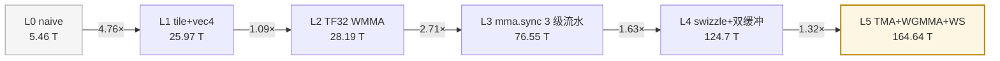
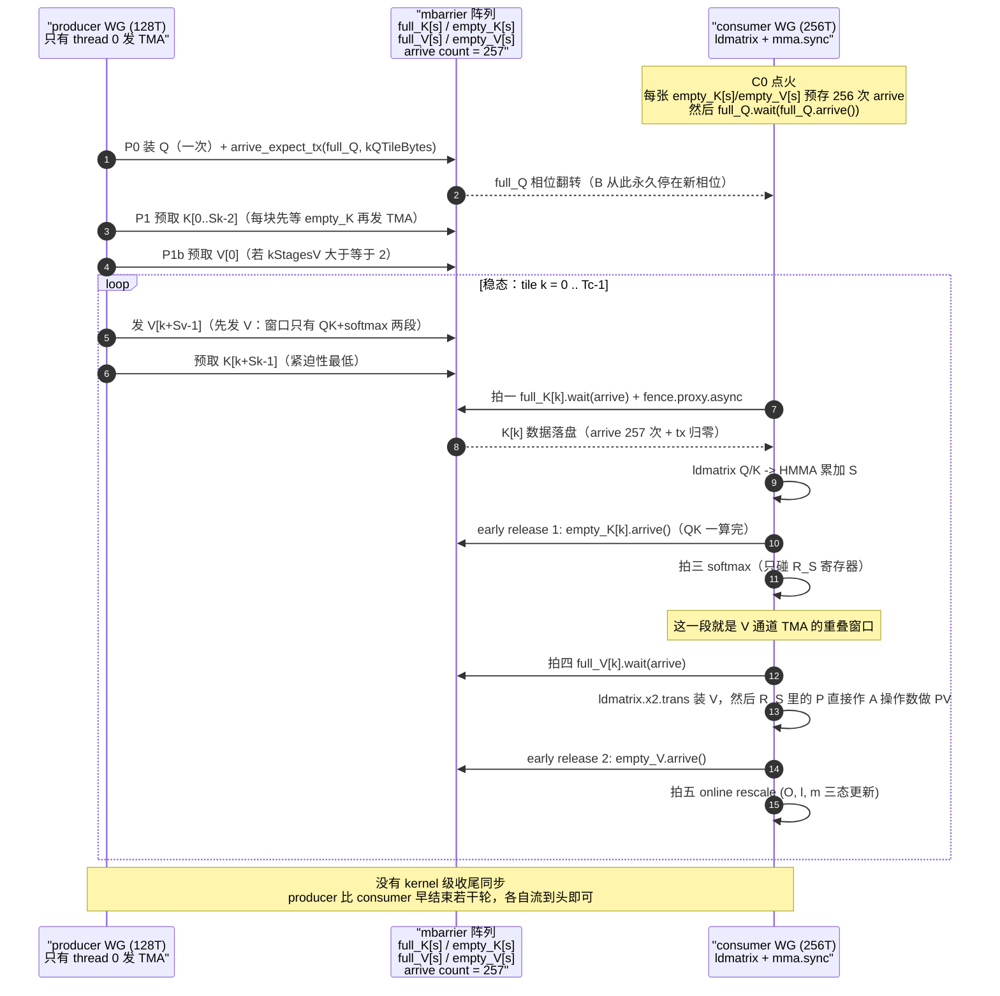
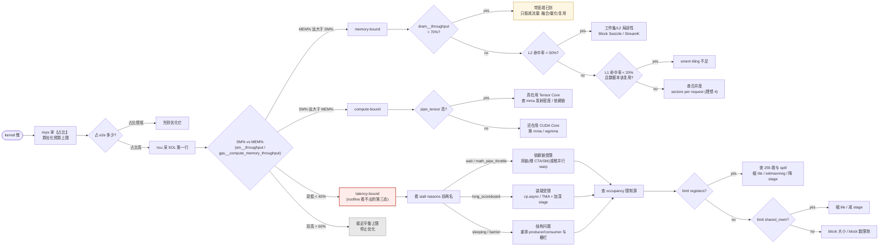

# 面试篇：255 题

> **这是本材料唯一的题库。**
> 原来的附录 G（JD 反推 31 题）、附录 H（真实面经 20 题）、附录 I（CUDA 内核 60 题）
> 以及 ch06 的 53 题已经**全部合并到这里**，去重后重新编排。
>
> **答案写成「要点 + 必须说出的数字」**，不是 1–2 分钟的逐字稿 ——
> 因为面试现场你要的是**记得住的关键点**，而不是背下来的段落。
> （口语化的完整版本请看对应章节的正文。）

---

## 导读 0：这份题库是怎么来的（口径与诚实声明）

**四个来源，四个不同的可信度等级**：

| 来源 | 提供什么 | 可信度 |
|---|---|---|
| **大厂实习 JD**（字节 / 阿里 / 腾讯 / 华为 / 百度 / 快手 / 蚂蚁 / 商汤 / 地平线 / 寒武纪 / MiniMax 等） | **考点范围**：哪些技术在要求里反复出现 | JD 是官方文本；但**「要求」≠「面试题」**，只能定范围 |
| **公开面经真题**（牛客、GitHub 面经仓库、知乎等） | **真实题目与原话** | 第三方整理，可能失真；**当「高频方向」而非「精确题库」** |
| **本材料正文**（ch01–ch08、附录 E/F） | vLLM 源码级事实与工程结论 | 代码引用经脚本校验（63/63 精确命中） |
| **一本 459 页的 CUDA kernel 优化专著** | 内核层的量化结论与实测数字 | **二手实测**：数字转录自该书，测试机是 RTX PRO 5000 72GB（`sm_120a`，CUDA 13.2）。**绝对数字不可迁移到 A100/H100，架构级结论可迁移** |
| **[xlite-dev/LeetCUDA](https://github.com/xlite-dev/LeetCUDA)**（配套代码仓库） | **§7 手撕题的参考实现**（宏命名、启动形状、数据流骨架） | **一手源码**：本地 checkout 的 HEAD `6c86259`（2026-09-22）。§7 的宏与工具函数**逐字对齐**它，溯源表见 §7.0 |

**三条必须知道的边界**：

1. **数字是「别人测的」或「量级估算」**，不是我在你的卡上测的。本机只有一张 RTX 4060 Laptop 8 GB，
   没有 TMA / WGMMA / FP4 / RDMA 硬件路径。
   **面试时说「我看到一份资料测出来是 X」比说「我测过是 X」更安全 —— 除非你真的测过。**
2. **面经来自第三方**，无法向公司核实；某一篇牛客原文只公开了前 9 题。
3. **答案是我写的要点，不是官方答案。** 面试官想听的重点在每个岗位都不一样。

---

## 导读 1：大厂实习 JD 到底要什么（考点分布）

**实抓结果**：从公开渠道抓到 **17 家公司**的实习 JD 逐字原文
（字节、阿里（含 A Star）、腾讯、华为、昆仑芯（百度）、快手、美团、蚂蚁、商汤、
寒武纪、地平线、摩尔线程、壁仞、无问芯穹、阶跃星辰、智谱、月之暗面）。
**按出现该要求的公司数排序**：

| 要求 | 出现公司数 | 说明 | 对应本库 |
|---|---|---|---|
| **Python** | **15** | 几乎无门槛，但会问 Python 的 GIL / 内存 / 并发 | §9.1 |
| **C++** | **13** | 不是「会语法」，而是**能读能改**（模板、指针、内存布局、并发） | §2.4、§2.3 |
| **CUDA / GPU 编程与架构** | **9** | 算子岗、推理优化岗的核心。原文常见：「熟悉 CUDA 编程与性能优化」 | §3 |
| **分布式训练 / 并行策略 / 通信库（NCCL、NVLink、RDMA）** | **9** | AI Infra 平台岗核心。**昆仑芯把「熟悉 NCCL 集合通信库 / RDMA 高性能网络协议」写进硬性要求** | §5 |
| **推理框架**（vLLM / SGLang / TensorRT-LLM） | **8** | 常搭配「PagedAttention / continuous batching / 量化 / 投机解码」 | §4 |
| **算子 / kernel 优化** | **8** | 与 CUDA 那条常同时出现，但强调**有实际优化经验** | §3、§6 |
| **PyTorch 等深度学习框架** | **8** | 会问「你读过它的哪部分源码」 | §4 |
| **开源贡献 / GitHub 项目** | **8** | **这条是可提前准备的硬通货** | §9.4 |
| **顶会论文** | **7** | 偏研究岗（Seed / A Star 类）权重更高 | §9.4 |

> **两条最值得注意的观察**：
> **① 通信能力被写进硬性要求的比例（9/17）和 CUDA 一样高** ——
> 这正好印证本材料把 ch01–ch08 当主干是对的。
> **② 「开源贡献」出现在 8 家** —— 它是一个**可以在面试前 3 个月开始积累**的加分项，
> 比多背 20 道八股的边际收益高。

**按公司风格的差异**（从 JD 措辞与公开面经归纳，属 `(推断)`）：

| 倾向 | 典型岗位 | 面试重心 |
|---|---|---|
| **偏推理框架 / 引擎** | 字节 Seed、阿里 A Star、月之暗面、阶跃星辰、智谱、无问芯穹 | scheduler、KV cache、量化、投机解码、TTFT/TPOT 指标 |
| **偏算子 / 内核** | 华为昇腾、寒武纪、壁仞、摩尔线程、地平线、昆仑芯 | CUDA/CANN、kernel 优化手法、bank conflict、Tensor Core、量化算子 |
| **偏分布式 / 通信** | 字节 AI Infra、腾讯云原生、阿里云、昆仑芯、阶跃星辰（高性能网络系统工程师） | NCCL、并行策略、通信重叠、MoE all-to-all、集合通信算法 |
| **偏编译器 / 图优化** | 阿里（含编译）、华为、字节 | 算子融合、图优化、IR、codegen、Triton |
| **偏平台 / SRE** | 各家的 AI 平台部门 | 指标体系、OOM、容错、可观测性、部署 |

**三条从 JD 与面经里读出来的「非技术」信息**（往往比多背 20 道题重要）：

1. **项目会被反复深挖。** ★ **这是全网出现频次最高的题（99 次）** ——
   远超第二名。真实面经显示一二三面**每轮都问项目**，而且越问越深
   （「介绍」→「深入介绍」→「创新点和工业效果」）。
   **准备好一个能讲三层深度的项目，比多背 20 道八股重要。**
2. **动手题的形式分两种，别搞混。** 公开面经显示：
   **推理框架/平台岗**考的是**通用算法题**（中等难度 + 图论，没有 hard）——
   那类题请直接刷题站，**本库不收**；
   **算子/CUDA 岗**考的往往是**白板写 kernel**（"写个 block 归约""写个 tiled GEMM"），
   **这才是本库 §7 那 15 道题存在的理由**。
3. **基础题占比超预期。** 真实面经里，AI Infra 一面**近一半是计算机基础**
   （cache line、页表、虚函数表、原子操作），而不是 CUDA。
   **「AI Infra 岗只考 CUDA」是错的。**

### 公开面经里出现频次最高的 8 道题

（统计口径：从 181 篇逐帖标注公司+轮次的面经、共 1780 条题干做**语义归并**后的频次。
**这是「问到几次」而不是「多少家公司问」，且来源是二次汇编，仅供参考**。）

| 排名 | 题目 | 频次 | 本库位置 |
|---|---|---|---|
| 1 | **请介绍 / 深入介绍你的项目经历与实习工作内容** | **99** | Q175、§8 |
| 2 | 推理框架（vLLM / TensorRT-LLM / SGLang）的原理、对比与选型 | 40 | Q104、§4 |
| 3 | **大模型量化的基本原理与具体实施流程** | 30 | Q80–Q87、Q184 |
| 4 | **CUDA 算子的常见优化方法与一般流程** | 29 | §3、Q142 |
| 5 | **KV Cache 的原理与优化 / 压缩方法** | 26 | Q71–Q74、Q190 |
| 6 | **GEMM 的实现思路与优化方法** | 25 | Q52–Q61 |
| 7 | Shared Memory 的使用方式、优化与注意事项 | 20 | Q42–Q46 |
| 8 | FlashAttention 的核心原理 / 加速原因 | 19 | Q105–Q108 |

> **读这张表的三个结论**：
> ① **第 1 名的频次（99）是第 2 名（40）的 2.5 倍** ——
> **面试的重心是「你做过什么」，不是「你知道什么」。**
> ② 第 3–8 名全部落在**量化 / CUDA 算子 / KV cache / GEMM / smem / FlashAttention** ——
> **这六块就是算子与推理优化岗的全部主战场**，本库的 §3、§4、§7、§9.2 正好覆盖。
> ③ **没有一道是纯八股定义题** —— 全部是「原理 + 怎么做」的形式。
> **答题时一定要落到"我会怎么做"，而不是停在定义。**

> **⚠️ 抓取不到的部分（诚实声明）**：
> `jobs.bytedance.com`（含移动版）与飞书招聘域名是 **SPA** ——
> `web_fetch` 返回 **HTTP 200 但正文为空**；同样抓不到的还有
> `zhaopin.meituan.com`、`hr.sensetime.com`、`shixiseng.com`、`zhihu.com`、
> CSDN（403/521 反爬）。
> **MiniMax、DeepSeek、硅基流动、旷视、智谱 infra 团队没有公开可抓的实习 JD 页** ——
> 这不是「它们不招」，而是**渠道不可抓**。
> 上面两张表**只统计抓到原文的部分**，所以是**下限而不是全集**。

---

## 导读 2：怎么用这份题库（三条路径 + 时间预算）

**先做一次自测**：随机抽 20 题，**能说出关键数字的算过**。低于 12 题过 → 从 §2 顺序读。

**本库的 9 个分区**（共 **255 题**）：

| 分区 | 内容 | 题数 | 题号 |
|---|---|---|---|
| **§2** | 计算机基础（cache / 存储层次 / OS / 并发 / 浮点 / C++） | **55** | Q1–Q55 |
| **§3** | CUDA 与算子优化（架构 / 访存 / Roofline / GEMM / TMA / FA） | 36 | Q56–Q91 |
| **§4** | 推理框架层（PagedAttention / 调度 / 量化 / 显存 / 指标 / MoE） | 40 | Q92–Q131 |
| **§5** | 分布式与通信（并行策略 / NCCL / 通算融合 / MoE 通信 / KV 传输） | 29 | Q132–Q160 |
| **§6** | 性能分析与排障（nsys/ncu / 指标字典 / 排查顺序） | 15 | Q161–Q175 |
| **§7** | **CUDA 与算子手撕题**（15 道 kernel，完整可编译代码） | 15 | Q176–Q190 |
| **§8** | 系统设计（开放题，看结构） | 10 | Q191–Q200 |
| **§9** | 补充（工具链 / 精度 / 分布式杂项 / 前沿名词） | 25 | Q201–Q225 |
| **§10** | **SOTA 模型架构与推理**（DeepSeek MLA/DSA/V4 / Qwen GQA+QK-Norm+Omni / Kimi 长上下文 / 混合注意力之争） | **30** | Q226–Q255 |

> **注**：本库**不含 LeetCode 算法题** —— 那类题请直接刷题站。
> 这里只收「AI Infra 岗位面试真正会问的**专业题**」，
> 其中 §7 那 15 道**白板写 kernel** 才是算子岗真正的「算法题」。
>
> **§10 的定位**：JD 里写「熟悉主流大模型结构」时，考的就是这一章。
> 它和 §9 的分工是：**§10 讲机制与 tradeoff，§9 补名词**。**先读 §10。**
>
> **⚠️ 时效性**：§10 的模型**按月迭代**。那里的数字标注了来源，
> **与官方最新技术报告不一致时以官方为准**；参数表请查你手上的 `config.json`。

| 你的情况 | 读什么 | 时间 |
|---|---|---|
| **3 天内要面算子岗** | **§7（手撕）全部** + §3 全部 + §6 全部 + §2 的 Q31–Q55（浮点与 cache 进阶） | 10h |
| **3 天内要面推理框架岗** | §4 全部 + §6 + **§10（模型结构）** + §2 的 Q1–Q18 | 10h |
| **3 天内要面分布式/通信岗** | §5 全部 + §6 + §2 的 Q1–Q7 | 8h |
| **3 天内要面「模型 + 部署」混合岗** | **§10 全部** + §4 的 Q92–Q106（KV cache 与量化）+ §5 的 Q128–Q130（MoE 通信） | 8h |
| **有一周** | §2 → §3 → §4 → §5 → §6 → §10，再手写一遍 §7、挑几道 §8 练手 | 35h |
| **只有 1 天** | **§2 全部（计算机基础最容易被漏）+ §4 的 Q92–Q117 + §5 的 Q132–Q138 + §6 + §10 的 Q226/Q235/Q236/Q243** | 6h |
| **只有 3 小时** | **§7 的 Q176/Q177/Q182（三个必考 kernel 骨架）+ §2 的 Q1–Q7、Q31、Q48–Q53 + §10 的 Q226/Q228/Q235** | 3h |
| **面试前 10 分钟** | 每题的**加粗数字**扫一遍 + [导读 1](#导读-1大厂实习-jd-到底要什么考点分布) 的 JD 对照表与「高频 8 题」 | 10min |

**每题标签的含义**：

| 标签 | 含义 |
|---|---|
| `[基础]` | 答不出会被判定为「没做过」 |
| `[进阶]` | 决定你能不能过二面 |
| `[hard]` | 加分项，答不出不影响 |
| `[编程]` | 现场写代码 |
| `[开放]` | 没有标准答案，看结构和 tradeoff |
| `★` | **该主题最高频**，几乎必问 |

**答案的读法**：`答·` 是必须说的；`数字·` 后面是**能显著加分**的具体数字；
`坑·` 是这个问题的常见错误答案。

---

## §2 计算机基础（cache / OS / 并发 / C++）（Q1–Q55，55 题）

> **这一节被严重低估。** 真实面经里，AI Infra 一面的**近一半**是这类题
> （cache line、多级缓存、cache miss、页表、虚函数表、原子操作），
> **而不是 CUDA**。原因很直接：面试官要确认你不是「只会调库」。
> **§2.1–§2.2 是体系结构与存储，§2.3 是操作系统，§2.4 是并发，
> §2.5 是 C++ 语言特性 —— 四块都可能被抽到。**

### 2.1 Cache 与存储层次

**Q1 `[基础]` ★ cache line 由哪三部分组成？各自的作用？**

`答·` **tag、index（组号）、offset（块内偏移）**，一个内存地址被切成这三段：
**offset** 定位到 line 内部的哪个字节（位数决定 line 大小，占 6 位 → 64 字节）；
**index** 定位到哪个组（set）；**tag** 因为组里可能有多条 line（组相联），
要用它逐一比对确认是不是要找的那块内存。
**valid bit 和 dirty bit 也属于每条 line 的元数据**：valid 表示数据是否有效，
dirty 表示是否被写过（决定驱逐时是否要写回）。
`数字·` x86 常见 line = **64 字节**。**为什么这么设计**：用「地址分段」把「查哪个组」
做成**硬件并行比较**，所以组相联能一次比对多路 —— 这是 cache 能在一个周期内命中的关键。

**Q2 `[基础]` 为什么需要多级缓存？**

`答·` 因为**存储器的速度、容量、成本三者不可兼得**：快的内存做不大，大的内存做不快。
多级缓存是**用层次结构同时逼近「快」和「大」**。
成立的两个前提：① **程序访问有局部性**（时间局部性 + 空间局部性），
没有局部性多级缓存就是浪费；② **每级命中率要够高** ——
整体平均访问时间 = `命中时间 + 缺失率 × 缺失代价`，
缺失代价**逐级放大**，所以 L1 的命中率尤其关键（这也是它最小但最贵的原因）。
`数字·` L1 ~1 ns（每核几十 KB）、L2 ~5–10 ns、L3 ~20–40 ns（几十 MB）。

**Q3 `[进阶]` ★ 发生 cache miss 后硬件的处理流程？**

`答·` 四步：① **判断 miss**（index 找组、tag 并行比对都没中，或 valid=0）；
② **选牺牲者（victim）**（LRU / 伪 LRU / 随机），
**若它是 dirty 的必须先写回下一级**（write-back，最贵的开销之一）；
③ **发缺失请求**向上游请求整条 line（现代 CPU 用**非阻塞 MSHR** 允许多个 miss 同时在飞，
并有**预取**）；④ **填回并唤醒**停顿的指令重放。
**两个加分点**：**乱序执行**用窗口内其它不相关指令填补这几百周期，
所以「miss 很贵」≠「CPU 一定闲着」；
**miss 分三类（3C）**：**compulsory / capacity / conflict**，
对应手段分别是**预取 / 加容量 / 提高相联度或改数据布局**。

**Q4 `[进阶]` 页表引入了哪些性能开销？怎么缓解？**

`答·` 两个开销：① **地址翻译要多次访存**（x86-64 四级页表，理论上一次数据访问多 4 次内存访问）；
② **TLB miss 代价极高**（TLB 条目很少，几十到几千条，miss 就要走完整 page walk）。
**四个层次的缓解**：**TLB**（命中时翻译零额外访存）、
**大页**（4 KB → 2 MB / 1 GB，**同样覆盖范围需要的 TLB 条目少 512 倍**）、
**多级页表本身**（让未使用的地址空间不占页表内存，是「空间换时间」的取舍）、
**page walk cache / 硬件预取页表项**。
`数字·` 大页是推理/数据库都爱用的原因；**碎片化会破坏大页可用性**，这是真实工程问题。

**Q5 `[基础]` 页表机制带来了哪些好处？**

`答·` 三个：① **进程隔离与内存保护**（每个进程独立页表，虚拟地址根本映射不到别人的物理页，
**硬件层面挡住越界**）；② **支持虚拟内存 / 按需分页**（地址空间可大于物理内存，
页可以不在内存里，访问时触发缺页异常再调入）；③ **简化内存管理 / 允许非连续物理内存**
（分配只需管理固定大小的页，**从根本上消除外部碎片**）。
**加一个现代的用法**：**共享内存** —— 两个进程把不同虚拟地址映射到**同一物理页**，
就实现了零拷贝共享（写时复制 fork、共享库、**GPU 的 IPC** 都是这个原理）。
`数字·` 这正是 PagedAttention 的思路来源：**块表 ≈ 页表，共享前缀 ≈ 共享物理页 + 写时复制**。

**Q6 `[进阶]` float / int32 / fp16 的表示范围与精度各是多少？**

`答·` fp32 = 1 符号 + 8 指数 + 23 尾数（p=24，约 7.2 位十进制有效数字）；
fp16 = 1 + 5 + 10（p=11，约 3.3 位，最大 65504）；
bf16 = 1 + 8 + 7（p=8，约 2.4 位，**动态范围同 fp32**）；
int32 是精确整数，范围 `[-2^31, 2^31-1]`。
`数字·` **fp32 最大正规数 `FLT_MAX ≈ 3.4×10^38`，`ln(FLT_MAX) ≈ 88.72`** ——
所以 **fp32 下 `e^t` 不溢出的条件是 `t ≲ 88.72`，而 fp16 下只有 11**。
`坑·` 把「动态范围大」当「精度高」：**bf16 的动态范围比 fp16 大得多，但尾部精度更低**。

**Q7 `[进阶]` FP32 / TF32 / FP16 / BF16 / FP8 的区别？各自用在哪？**

`答·` 差别在**指数位（动态范围）与尾数位（精度）怎么分**：

| 格式 | 符号/指数/尾数 | p | 相对精度 | 用途 |
|---|---|---|---|---|
| fp32 | 1/8/23 | 24 | ~7.2 位十进制 | 累加、master weight |
| TF32 | **1/8/10** | 11 | `u = 2⁻¹¹ ≈ 4.88e-4` | Tensor Core 上的 fp32 替代 |
| fp16 | 1/5/10 | 11 | ~3.3 位 | 主流推理/训练数据 |
| bf16 | 1/8/7 | 8 | ~2.4 位 | 训练（要动态范围） |
| fp8 e4m3 | 1/4/3 | 4 | **相对步长 6.25%** | 量化 inference |
| fp8 e5m2 | 1/5/2 | 3 | ~12.5% | 梯度（本材料未涉及） |

`数字·` **TF32 与 fp16 的尾数完全相同（10 位），差别全在指数** ——
TF32 用 fp32 的 8 位指数，动态范围与 fp32 一致。
`坑·` fp8 有两个变体，**e4m3 和 e5m2 的取舍不是「谁更好」而是「要精度还是要范围」**。

**Q8 `[基础]` 浮点数为什么会有精度问题？0.1 + 0.2 != 0.3 怎么解释？**

`答·` 因为二进制无法精确表示大多数十进制小数（0.1 在二进制里是无限循环小数），
存储时就被舍入。加法再叠加一次舍入。
`数字·` 更该讲的是**工程后果**：`fp32` 的 `u = 2⁻²⁴ ≈ 6e-8`；
**浮点加法不满足结合律**，所以**大规模归约的结果依赖累加顺序**，
并行归约的结果 run-to-run 可能不一致 —— **因此正确性判定必须用容差，不能逐位比较**。

**Q9 `[进阶]` 什么是大端 / 小端？为什么网络序是大端？**

`答·` 多字节数据的字节排列顺序。小端把低位字节放在低地址（x86、ARM 默认），
大端相反（网络序、部分嵌入式）。
`数字·` 工程上的坑是**类型双关（type punning）与序列化**：
memcpy 出来的字节序依赖平台；跨机通信必须显式转换（`htonl`/`ntohl`）。
`坑·` 在 GPU↔CPU 或跨节点传二进制结构体时忘了对齐和端序 —— 这是真实 bug 来源。

**Q10 `[进阶]` NUMA 是什么？对 AI 训练/推理有什么影响？**

`答·` 多路 CPU 下，内存控制器分布在各 socket，
**CPU 访问本地内存快、访问远端内存慢**（跨 socket 走 UPI/Infinity Fabric）。
影响：线程绑核与内存亲和性没配好时，**带宽和延迟都会明显退化**；
PCIe 拓扑上「哪张卡挂在哪个 socket 下」也影响 host↔device 拷贝。
`数字·` 实践动作：`numactl --cpunodebind --membind`、在 `nvidia-smi topo -m` 里看
`SYS`（跨 socket）与 `PHB`/`NODE` 的区别。

**Q11 `[进阶]` DMA 是什么？为什么需要它？**

`答·` 让外设**不经过 CPU** 直接读写内存的机制。
没有 DMA 的话每次拷贝都要 CPU 逐字节搬运（PIO），CPU 被占满且带宽很低。
`数字·` 大模型里 DMA 无处不在：**GPU 内部的 TMA 就是硬件 DMA**
（一条 `cp.async.bulk.tensor.2d` 由单线程提交，硬件搬整块 2D tile，
**地址计算/OOB 填充/smem swizzle 全在 descriptor 里声明，搬运过程零寄存器开销**）；
**RDMA 是跨机的 DMA**（网卡直接读写对端内存，绕过两端 CPU 与内核）。

**Q12 `[进阶]` 存储金字塔每一层的容量与延迟量级？**

`答·` 从快到慢：寄存器 → L1 → L2 → L3 → 内存 → SSD → HDD → 网络存储。
**GPU 侧的对应**（原书 H100 参考口径）：

| 层级 | 带宽 | 容量 | 作用域 | 延迟 |
|---|---|---|---|---|
| Register | ~100+ TB/s | 256 KB/SM | thread | ~0 |
| SMEM / L1 | **~19 TB/s** | ~228 KB/SM | block | L1 命中 ~30 cycle |
| L2 | **~12 TB/s** | 50 MB | device | ~200 cycle |
| HBM3 | **~3.35 TB/s** | 80 GB | device | **~500–800 cycle** |

`数字·` **相邻层级带宽差 1.5–5 倍，容量上寄存器与 smem 同量级，
再往上每升一级差两个数量级以上。** 一次 float 读的完整旅程约 **0.5 µs** 量级。

**Q13 `[进阶]` CPU 和 GPU 的设计哲学差别是什么？**

`答·` **CPU 用「大 cache + 乱序执行」少 stall，GPU 用「海量线程 + 零开销 warp 切换」盖 stall。**
CPU 的核心少而强（深流水、分支预测、乱序窗口），适合串行/分支密集；
GPU 的核心多而弱（每 SM 4 个 warp scheduler，每周期各发 1 条指令），
**warp A 等 HBM 数据时 scheduler 立刻切到 warp B**，切换不需要保存上下文。
`数字·` 每 SM 4 个 warp scheduler × 每周期 1 条 = **SM 每周期最多发 4 条指令** ——
**「发射带宽」本身就是一种资源**。

### 2.2 操作系统

**Q14 `[基础]` ★ 进程和线程的区别？**

`答·` **进程是资源分配的单位，线程是调度的单位。**
同一进程的线程**共享地址空间**（代码段、数据段、堆、文件描述符），
但各有独立的栈和寄存器上下文。
**代价差异**：进程切换要换页表（TLB 失效），线程切换不用 ——
所以线程切换便宜得多。**通信方式也不同**：线程直接读写共享内存（要同步），
进程要么走管道/socket/共享内存要么走 IPC。
`数字·` 这正好对应到 GPU：**CUDA 的「进程」概念是 context，「线程」概念对应 CUDA thread** ——
所以多进程共享 GPU 要走 **CUDA IPC**（vLLM 的 custom all-reduce 就是这么做的）。

**Q15 `[进阶]` 进程间通信有哪些方式？各自的代价？**

`答·` 管道/FIFO、消息队列、信号量、共享内存、socket、信号。
**最快的是共享内存**（零拷贝，但要自己做同步），
**最慢的是 socket**（要经过内核协议栈多次拷贝）。
`数字·` 在 GPU 场景里还有一个特殊通道：**CUDA IPC** ——
把一个进程的显存句柄（`cudaIpcMemHandle_t`）传给另一个进程，
对方 `cudaIpcOpenMemHandle` 就能直接读写那块显存，
**这是 vLLM `CustomAllreduce` 的基础**。

**Q16 `[进阶]` 虚拟内存的作用是什么？**

`答·` ① 让每个进程看到独立、连续的地址空间（隔离与保护）；
② 允许地址空间大于物理内存（按需分页 + swap）；
③ 让物理分配不必连续（消除外部碎片）；
④ 支持 `mmap` 把文件映射进地址空间（零拷贝读、共享库）。
`数字·` **大模型加载权重时 `mmap` 是常见手段**：多个进程共享同一份只读权重页，
**显存/内存占用立刻降下来**。

**Q17 `[进阶]` 什么是零拷贝（zero-copy）？在 AI 里指什么？**

`答·` 广义上指**减少数据在内存层级之间的拷贝次数**。
在 AI 里至少有四个不同的含义，**面试时要先问清是哪个**：
① **CPU 侧**：`mmap` + `sendfile` 避免用户态↔内核态往返；
② **Host↔Device**：pinned memory + `cudaMemcpyAsync` 让 DMA 直接搬（避免中间的 bounce buffer）；
③ **Device↔Device**：GPUDirect P2P / **GPUDirect RDMA**（网卡直接读写显存，绕过 host 内存）；
④ **框架层**：**NHD 布局的零拷贝**（diffusers 的 E2E 布局不用先 permute 成 BHND）。
`数字·` GPUDirect RDMA 是跨机 TP 能做到低延迟的前提之一。

**Q18 `[进阶]` 死锁的四个必要条件？怎么排查？**

`答·` 互斥、持有并等待、不可剥夺、循环等待。
**破任何一个即可**：按全局顺序加锁（破循环等待）、一次性申请全部资源（破持有并等待）、
设置超时与回滚（破不可剥夺）。
`数字·` **在 GPU 集群上「死锁」有更隐蔽的形态**：
所有 rank 都在等对方先发（**集合通信顺序不一致**）；
或者 barrier 的到达数算错，相位永不翻转。
**排查第一步不是看堆栈，而是核对「三一致」**：
所有 rank 的**通信顺序一致、dtype/形状一致、后端选择一致**（见 ch05）。

**Q19 `[进阶]` 用户态和内核态的区别？为什么系统调用贵？**

`答·` 内核态可以执行特权指令、访问全部硬件；用户态不行。
切换要走中断/`syscall` 指令，涉及**保存现场、切换栈、权限级切换**，
还可能污染 cache/TLB。
`数字·` 一次系统调用量级 **几百 ns 到几 µs**；
所以高性能 I/O 用 **io_uring / 批量提交 / 用户态驱动**（RDMA 的 verbs 就是用户态驱动，
**这正是不用 TCP 的原因之一**）。

### 2.3 并发与原子操作

**Q20 `[基础]` ★ C++ 中原子操作是什么？为什么要引入？**

`答·` **不会被其它线程观察到中间状态**的操作，要么完全完成、要么完全没发生。
因为 `x++` 在机器层面是**三步**（读 → 加 → 写），两个线程同时做会丢失更新
（各加 1000 次，结果小于 2000）。锁能解决，但锁有开销（系统调用、上下文切换、可能死锁），
对「只是个计数器」这种场景，原子指令更快也更不容易出错。
`数字·` 底层是 CPU 的原子指令：x86 的 `LOCK` 前缀、`cmpxchg`（CAS）。
**CAS 是无锁数据结构的基石**：「读旧值 → 算新值 → CAS 写回，失败重试」。

**Q21 `[进阶]` ★ 原子性、可见性、顺序性有什么区别？**

`答·` **三个独立的性质，这是最容易答混的一题**：
**原子性** = 操作不可分割（不撕裂）；**可见性** = 一个线程的写何时对其它线程可见；
**顺序性** = 指令能否被重排。
原子操作**只保证原子性**，可见性与顺序性要靠**内存序**：
`relaxed` / `acquire` / `release` / `acq_rel` / `seq_cst`。
**默认的 `seq_cst` 最安全也最慢**，性能敏感时要显式放松。
`数字·` `relaxed` 只保证不撕裂，常用于计数器；
`release`-`acquire` 配对是「发布-订阅」的标准写法。

**Q22 `[进阶]` ABA 问题是什么？怎么解决？**

`答·` CAS 只比较值。如果值从 A 变 B 又变回 A，CAS 会误判「没人改过」而成功，
但中间状态可能已经不一致。**解法是加版本号**：
`atomic<pair<T, uint64_t>>` 或 tagged pointer（把指针低位借出来存版本）。
`数字·` 在无锁队列/栈里这是真实 bug；**另一种规避是「不回收内存」**
（hazard pointer / epoch-based reclamation）。

**Q23 `[进阶]` 自旋锁和互斥锁怎么选？**

`答·` **自旋锁忙等不睡眠**，适合**临界区极短**且**不会被抢占**的场景；
**互斥锁会睡眠**，适合临界区长或可能阻塞的场景。
自旋锁在单核上几乎一定是错的（占着 CPU 等自己）。
`数字·` **GPU 上的情形反过来**：kernel 里没有「睡眠」，
所以 `atomicCAS` 自旋是实现设备端锁的唯一办法，
但**同一个 warp 内的 lane 互相自旋会死锁**（warp 是同步执行的）——
这是 GPU 编程特有的坑。

**Q24 `[进阶]` 内存屏障 / fence 是干什么的？**

`答·` 限制编译器和硬件的重排，保证**跨线程/跨设备的可见顺序**。
四个典型场景：① CPU 线程间（`std::atomic_thread_fence`）；
② **CPU↔GPU**（`cudaDeviceSynchronize`、stream 语义）；
③ **GPU 内部跨线程**（`__threadfence()`）；
④ **异步代理之间**（TMA 的 `fence.proxy.async.shared::cta`）。
`数字·` **第 ④ 个是最容易被忽略的**：TMA 通过「异步代理」写 smem，
普通 `ld.shared` 读之前必须 fence，否则可能读到旧数据。

### 2.4 C++ 语言特性

**Q25 `[基础]` ★ 函数重载的机制？编译器怎么实现？**

`答·` 编译期多态，靠 **name mangling（名字修饰）**：
编译器把函数名和**参数类型信息**编码进符号名（`void f(int)` → `_Z1fi`，`f(double)` → `_Z1fd`），
链接器看到两个不同符号所以能共存。
**四条边界**：① **只有参数列表能用于重载，返回类型不能**（调用点不依赖返回类型）；
② **`const` 成员函数的重载是特例**（`const` 修饰的是隐式的 `this` 参数，等价于参数类型不同）；
③ **`extern "C"` 关掉 name mangling**，所以 C 没有重载，C++ 里被它修饰的函数也不能重载；
④ **重载决议顺序**：精确匹配 → 提升转换 → 标准转换 → 用户定义转换，
多个同样好的候选就是**二义性错误**。

**Q26 `[进阶]` ★ 虚函数怎么实现的？虚函数表的开销是什么？**

`答·` 每个含虚函数的类有一张**虚函数表（vtable）**，
对象里存一个 **vptr** 指向它；调用时通过 vptr 查表间接跳转（**动态派发**）。
**三笔开销**：① 每个对象多一个指针（**8 字节**，对小的 value type 很明显）；
② 每次调用多一次**间接寻址**，**且难以内联**（内联是 C++ 性能的主要来源之一）；
③ **vptr 破坏了 POD 语义**（不能 memcpy、不能直接序列化）。
`数字·` **工程上怎么规避**：模板/CRTP（编译期多态）、`std::variant` + `visit`、
热路径上用 switch 而不是虚函数。
`坑·` 在构造函数/析构函数里调虚函数**不会**派发到子类（此时 vptr 还指向基类）。

**Q27 `[进阶]` vector 的扩容机制？`reserve` 为什么重要？**

`答·` 容量不足时按**倍数**（libstdc++ 是 2×，MSVC 约 1.5×）申请新内存、
**拷贝/移动**旧元素、释放旧内存。
所以 `push_back` 的**均摊**复杂度是 O(1)，但**单次可能 O(n)**。
`reserve` 提前一次分配，**避免多次拷贝 + 避免迭代器/指针失效**。
`数字·` 释放 vector 内存要用 **`shrink_to_fit` 或 swap 技巧**
（`vector<T>().swap(v)`）—— `clear()` **不释放容量**，这是真实内存问题的来源。
`坑·` 扩容后**所有指向元素的指针与迭代器全部失效**，包括引用。

**Q28 `[进阶]` 智能指针有哪些？shared_ptr 的代价是什么？**

`答·` `unique_ptr`（独占、零开销、可 move）、`shared_ptr`（引用计数、线程安全的计数）、
`weak_ptr`（不增加计数，用来打破循环引用）。
**`shared_ptr` 三笔代价**：① 控制块是**额外的一次堆分配**（可用 `make_shared` 合并）；
② 引用计数是**原子操作**（有 cache line 争用）；
③ **循环引用会泄漏**（要用 weak_ptr 打破）。
`数字·` `sizeof(shared_ptr)` = **16 字节**（对象指针 + 控制块指针），
`unique_ptr` 默认 = **8 字节**（无状态删除器时空优化）。

**Q29 `[进阶]` 内存泄漏怎么排查？RAII 为什么重要？**

`答·` RAII = 把资源的生命周期绑定到对象生命周期（构造获取、析构释放），
**异常安全的前提**。
排查工具：Linux 用 **valgrind / ASan（`-fsanitize=address`）/ heaptrack**；
Windows 用 CRT debug heap 或 Application Verifier。
`数字·` **GPU 侧的对应物是显存泄漏**：`torch.cuda.memory_allocated()` 与
`memory_reserved()` 的差、`torch.cuda.memory_summary()`、
以及「warmup 后快照再跑一遍看是否增长」的二分法。
**vLLM 里 OOM 的一种常见形态就是 KV cache block 没被回收**（引用计数错）。

**Q30 `[进阶]` 模板是什么？编译期计算的意义？**

`答·` 模板是**编译期代码生成**，把「类型」当参数。
价值在于**零开销抽象**：`std::sort` 的比较器被内联，和手写循环一样快。
GPU 场景里模板用得极多 —— **tile 尺寸、stage 数、是否 f32 累加，全是模板参数**，
因为这样才能让编译器把循环完全展开、把常量折叠进地址计算。
`数字·` 原书的 HGEMM 有 **17 个模板参数**（`kHeadDim, kMmaAtomM/N/K, kMmaAccF32,
kMmaTile*, kValTile*, kStagesK, kPadQ/K/V`），
**改一个参数就能切换整套流水线结构** —— 这是模板在 kernel 工程里的真实用途。
`坑·` 模板会让编译时间与二进制体积爆炸（每个实例化一份代码），
所以生产代码常用**显式实例化 + `extern template`** 控制。

---

### 2.5 Cache 进阶（面试官用来区分「背过」和「真懂」）

**Q31 `[进阶]` ★ 什么是伪共享（false sharing）？为什么它比想象中严重？**

`答·` 两个线程访问**同一个 cache line 里的不同变量**时，
硬件按 line 维护一致性（MESI），**一个线程写就让对方的副本失效** ⇒
双方不停地把整条 line 在核间搬来搬去，**明明没有共享数据却表现出共享的代价**。
**解法**：把热点变量按 **64 B 对齐并填充**（`alignas(64)` / padding / 每线程一个槽位）。
`数字·` **这正是 `kNumBarrierSignalBytes = 128` 存在的原因** ——
MegaMoE 的 barrier 计数器（grid-sync / NVLink-barrier / schedule 计数器）
要 **pad 到一个 L2 cache line（128 B）**，因为它们是热点原子，
伪共享会让它们互相拖死。
`坑·` 面试里常被追问「为什么是 128 而不是 64」：
**不同硬件的 line 大小不同**（x86 常见 64 B，部分 ARM 128 B），
**取大的那个最安全**；GPU 上 L2 line 是 128 B。

**Q32 `[进阶]` ★ 分支预测失败有多贵？怎么写出对预测器友好的代码？**

`答·` 现代 CPU 是**深流水 + 乱序**，预测失败要**冲刷流水线**重新取指。
代价量级 **10–20 个周期**；对分支密集的代码，
失败率从 1% 涨到 10% 就可能让吞吐减半。
**友好写法**：① **让分支可预测或可消除** ——
排序后再处理（把随机分支变成「一段全 true、一段全 false」）、用算术代替分支
（`cmov` / `select`）；② 热路径上避免数据依赖的分支；③ 用查表代替分支树。
`数字·` 经典的「排序后快 6 倍」例子：先 `std::sort` 再分段处理，
条件跳转从随机变为几乎全部命中/不命中。
`坑·` **GPU 上答案相反**：warp 内分支发散是**两条路径都执行**（掩码屏蔽），
没有「预测」这回事 —— **别把 CPU 的分支优化直觉搬到 kernel 上。**

**Q33 `[进阶]` 缓存替换策略有哪些？LRU 在硬件里能实现吗？**

`答·` 理论最优是 **Belady（OPT）**，但需要未来信息；实际用
**LRU**（最久未使用）、**伪 LRU / 树形 PLRU**（近似 LRU，硬件便宜）、
**随机**、**FIFO**、**LFU**。
**LRU 在硬件里成本高**（每次访问都要更新顺序，n 路就要 log n 位状态），
所以真实 CPU 多用**PLRU 或带保护的变体**。
`数字·` 这直接影响「3C 模型」里的 **conflict miss**：
同组挤掉 ⇒ **提高相联度或改数据布局**是最有效的缓解。
`坑·` 面试官常接着问「为什么 LRU 对某些访问模式很糟」⇒
**循环扫描大于 cache 的工作集**（`for i in 0..N` 反复扫）会把 cache 全冲掉，
这叫 **cache thrashing**，解法是**分块（loop tiling）**。

**Q34 `[进阶]` write-back 与 write-through 的区别？dirty bit 为什么重要？**

`答·` **write-through**：写命中也同步写下一级（简单、一致性好、但写流量大）；
**write-back**：只改本级的 line 并置 **dirty**，**驱逐时才写回**（省流量，但有一致性风险）。
配套还有 **write-allocate / no-write-allocate**（写缺失时要不要先取回整条 line）。
`数字·` **dirty line 的驱逐是最贵的路径之一**：要先把旧数据写回下一级，
再填入新 line —— 所以 miss 处理流程里专门有一句「若 victim 是 dirty 的必须先写回」。
`坑·` GPU 上的对应物是 **`cp.async.cg` 不分配 L1、`.ca` 分配 L1** ——
**`.cg`（cache global，只走 L2）存在的意义就是避免污染 L1 并且不产生 dirty line。**

**Q35 `[进阶]` MESI 协议是什么？四个状态怎么转换？**

`答·` 多核 cache 一致性协议，四态：
**M（Modified，独占且脏）**、**E（Exclusive，独占且干净）**、
**S（Shared，多核共享且干净）**、**I（Invalid，无效）**。
关键转换：本地写命中 S 态 ⇒ **要先让其它核的副本失效（升级为 M）**，
这一步要走**总线/互连的一致性消息**，是伪共享代价的来源；
本地读缺失而其它核是 M ⇒ **必须先写回再共享**。
`数字·` **这就是为什么「只读共享」几乎免费（都停在 S 态），
而「读写共享」很贵**（S↔M 反复翻转）。
`坑·` 面试里可以主动提到 **MOESI**（多了 O 态，允许「拥有但共享脏数据」，
减少写回次数）—— 说明你知道协议有变体。

**Q36 `[进阶]` ★ memory barrier / fence 在 CPU 和 GPU 上分别解决什么？**

`答·` 都解决**重排序导致的可见性顺序问题**，但层次不同：

| 层面 | 机制 | 典型场景 |
|---|---|---|
| **编译器重排** | `std::atomic_signal_fence` / `asm volatile("" ::: "memory")` | 编译器把写操作挪过标志位 |
| **CPU 访存重排** | `std::atomic_thread_fence`、`mfence`/`sfence`/`lfence` | 生产者-消费者发布数据 |
| **CPU ↔ GPU** | `cudaDeviceSynchronize`、stream 语义、`cudaMemcpyAsync` 的隐式同步 | host 改完数据再 launch |
| **GPU 内跨线程** | `__threadfence()` | 一个 block 写全局内存，另一个 block 读 |
| **GPU 异步代理之间** | `fence.proxy.async.shared::cta` | **TMA 通过「异步代理」写 smem，普通 `ld.shared` 读之前必须 fence** |

`数字·` **最容易被忽略的是最后一行**：TMA 写 smem 与普通 load 属于**两个不同的代理**，
不加 fence 可能读到旧数据，而且**是偶发的、难复现**。
`坑·` x86 的 TSO 模型天然保证「读-读、读-写、写-写」不乱序，只允许「写-读」乱序，
所以 `sfence`/`lfence` 在很多场景是多余的 —— **但别把这个当可移植结论。**

**Q37 `[进阶]` SIMD / AVX 是什么？和 GPU 的 SIMT 有什么本质区别？**

`答·` **SIMD** 是**指令级**的并行：一条指令处理多个数据（AVX-512 一次 16 个 fp32），
**需要程序员显式使用向量类型**（或靠编译器自动向量化）。
**SIMT** 是**线程级**的并行：每个线程有自己的寄存器和 PC，
由硬件组织成 warp 一起执行。
**本质区别**：SIMD 的向量宽度是**指令的一部分**（写死在 ISA 里），
SIMT 的「宽度」是**硬件的调度选择**（warp = 32，但线程可以独立分支）。
`数字·` AVX-512 的 fp32 宽度是 **16**；warp 是 **32**；
两者都是「一条指令多个数据」，但 SIMT 允许**分支发散**（代价是串行化）。
`坑·` 面试里可以提：**AVX-512 有 AVX-512 降频问题**（重向量指令导致频率下降），
这与 GPU 的「功耗墙导致降频」是同一类现象。

**Q38 `[进阶]` 内存对齐为什么能提升性能？未对齐会怎样？**

`答·` 对齐让一次访问**不跨越 cache line / sector 边界** ⇒ 一次事务搞定。
未对齐时：① 可能**跨两条 line**，要两次访问（甚至触发两次 miss）；
② 某些指令**要求对齐**（`float4` 必须 16 B、AVX 对齐指令要求 32/64 B），
不对齐直接**异常**（CUDA 里是 `misaligned address` 运行时错误）。
`数字·` `cudaMalloc` 返回的基址满足 **256 B 对齐**，
所以只要元素偏移是 4 的倍数（vec4 的 `idx = 4 × 全局线程号`）就天然满足 **16 B 对齐**。
`坑·` **对子数组做 vec4 是最常见的踩坑方式**（例如传 `a + 1`）——
**约定：vec4 主路径的指针必须来自整块分配的基址。**

### 2.6 操作系统与内存（进阶）

**Q39 `[进阶]` ★ 用户态、内核态、以及「零拷贝」到底省了什么？**

`答·` 一次普通 `read()` + `write()` 要 **4 次拷贝 + 4 次上下文切换**
（磁盘→内核缓冲→用户缓冲→内核 socket 缓冲→网卡）。
**零拷贝**用 `sendfile`/`splice`/`mmap` 把中间的用户态往返砍掉，
**省的是「内核↔用户」的两次拷贝与两次切换**，不是全部拷贝。
`数字·` 在 AI 里「零拷贝」至少有**四个不同含义**，面试时要先问清：
① CPU 侧（`mmap`/`sendfile`）；② Host↔Device（pinned memory + `cudaMemcpyAsync`，
避免 bounce buffer）；③ Device↔Device（**GPUDirect P2P / GPUDirect RDMA**，
网卡直接读写显存）；④ 框架层（**NHD 布局零拷贝**，diffusers 的 E2E 布局不用先 permute）。
`坑·` **把「零拷贝」当万能词答会在追问下崩掉** —— 主动分类反而加分。

**Q40 `[进阶]` ★ 什么是 pinned memory（页锁定内存）？为什么它更快？**

`答·` 普通 `malloc` 的内存**可能被换出**（pageable），
所以驱动做 H2D 拷贝时**不能直接 DMA**，得先拷到一个临时的锁页缓冲（bounce buffer），
再 DMA ⇒ 多一次拷贝。
**pinned memory 用 `cudaHostAlloc` 分配，永不被换出，DMA 可以直达。**
`数字·` 带宽差距可达 **2× 以上**；延迟差距更大（省掉一次拷贝与同步）。
`坑·` 三个必须知道的代价：
① **分配慢且有上限**（锁页是系统资源，分配过多会让系统内存吃紧）；
② **`cudaHostAlloc` 的默认 pinned 对多设备不友好**，要 `cudaHostAllocPortable`；
③ **`cudaMemcpyAsync` 用 pageable 内存时会退化成同步**（这是「为什么没重叠」的常见根因）。

**Q41 `[进阶]` ★ `cudaMemcpy` 和 `cudaMemcpyAsync` 的区别？为什么会「没重叠」？**

`答·` `cudaMemcpy` **同步**，且当源/目的是 pageable 内存时
**会隐式同步整个流**（不是只同步这一个拷贝）⇒
**把本来可以并行的 kernel 也串行化了**。
`cudaMemcpyAsync` 只在 **pinned memory + 指定非默认流**时才真正异步。
`数字·` **「很多『为什么没重叠』的根因就是同步版 `cudaMemcpy` 的隐式同步」** ——
查法：nsys 时间线里看到 `Memcpy HtoD` 与 kernel **完全不重叠**。
`坑·` 默认流（legacy default stream）有**隐式同步语义**，
会与所有其它流同步 ⇒ 想真并行要用 `cudaStreamNonBlocking` 创建的流。

**Q42 `[进阶]` 缺页异常（page fault）的处理流程？对它做优化意味着什么？**

`答·` 访问的页不在物理内存（或被换出）⇒ MMU 触发缺页异常 ⇒
内核陷入 ⇒ 找到/分配物理页 ⇒ 若需要就从磁盘换入（**major fault**）
或只建立映射（**minor fault**）⇒ 更新页表 ⇒ 返回用户态重试该指令。
`数字·` **major fault 是毫秒级**（要等磁盘），minor fault 是微秒级。
`坑·` **在 AI 里最相关的是「懒加载/按需分页」**：
`mmap` 加载大权重时，**第一次访问每个页都会触发 minor fault** ⇒
表现为「第一次推理特别慢」，之后正常。
**解法**：预热（warmup）+ `MAP_POPULATE` / `madvise(MADV_WILLNEED)` 预取。
**GPU 侧对应物是 CUDA 的 unified memory 缺页**（更贵，且会打断 kernel）。

**Q43 `[进阶]` Huge Pages 怎么开？对 AI workload 的收益在哪？**

`答·` Linux 上 `mmap(MAP_HUGETLB)` 或透明大页（THP，`/sys/kernel/mm/transparent_hugepage/enabled`）；
GPU 侧有 CUDA VMM 的大页分配与驱动的 2 MB 页选项。
**收益**：① **TLB 覆盖范围提升 512 倍**（4 KB → 2 MB）⇒ TLB miss 大减；
② **页表遍历层次变浅** ⇒ 地址翻译更快；
③ 对**大块连续分配**（权重、KV cache）尤其有效。
`数字·` 大模型推理/数据库都爱用大页，原因就是第 ① 条。
`坑·` **碎片化会破坏大页可用性** ⇒ 长期运行的进程可能申请不到 2 MB 页，
表现为「刚启动很快、跑久了变慢」。这是真实的工程问题。

**Q44 `[hard]` 为什么 `malloc`/`free` 会碎片化？内存分配器怎么解决？**

`答·` 不同大小的分配交错释放，空闲块被切成不连续的小块
⇒ **总量够但装不下一个大的连续请求**。
分配器策略：**size class（尺寸分级，小对象用固定桶）**、
**segregated free list**、**合并相邻空闲块（coalescing）**、
**arena / 线程本地缓存（tcmalloc/jemalloc 的 thread cache）**。
`数字·` **GPU 上完全对应**：`torch.cuda` 的 caching allocator 也做 size class +
缓存已申请的块 ⇒ 所以 `reserved > allocated`。
`坑·` **GPU 侧还需要 `cudaMallocAsync` / expandable_segments 这类手段**，
因为显存不能 swap，碎片的后果比 host 更硬（直接 OOM）。

**Q45 `[hard]` 一个进程的虚拟地址空间长什么样？为什么栈向下长、堆向上长？**

`答·` 典型布局（低地址→高地址）：
**代码段（text）→ 只读数据（rodata）→ 已初始化数据（data）→ BSS → 堆（heap，向上增长）
→ …… 空洞 …… → 共享库映射区（mmap）→ 栈（stack，向下增长）→ 内核空间**。
栈向下、堆向上是**约定（不是硬件要求）**，好处是**两者之间留出最大的连续增长空间**，
互不干扰。
`数字·` **`mmap` 区放在中间是关键设计**：它让共享库与大块映射
（**包括大模型的权重 mmap**）有连续的地址空间可用。
`坑·` 这解释了为什么「`malloc` 一个巨大的块」和「`mmap` 一个文件」
在地址空间里的行为不同（前者受堆连续性约束，后者走 mmap 区）。

**Q46 `[进阶]` 线程池、协程、异步 I/O 各解决什么问题？**

`答·` **线程池**：复用线程，省掉创建/销毁开销，控制并发度；
**协程**：用户态调度，**切换不陷入内核**（比线程切换便宜 1–2 个数量级），
适合大量「等待 I/O」的任务；
**异步 I/O（io_uring / epoll）**：**让内核通知你「好了」而不是你阻塞等着**。
`数字·` 三者的适用边界：CPU 密集 → 线程池（或进程池，绕开 GIL）；
**I/O 密集且并发极高 → 协程 / 异步 I/O**。
`坑·` **Python 的 GIL 让「CPU 密集用线程池」失效** ——
这时要么多进程，要么把热点丢给 C++/CUDA（**这也是 AI 框架的常见分工**）。

**Q47 `[进阶]` 统计一下：一次 RPC/网络往返的下限是多少？为什么它决定了架构？**

`答·` 同机进程间 ~**几十 µs**；同机房网络 ~**0.1–0.5 ms**；
跨地域 ~**几十 ms**。
**这些数字直接决定架构**：单次往返贵的操作要**批量/流水线化**，
否则「每层通信一次」的设计在跨机时必然崩。
`数字·` **这正是 TP 不能跨机的定量理由**：
TP 每层两次 all-reduce，几十层就是上百次同步，
每次都要一次往返 ⇒ **延迟直接叠加**；
而 EP 的 all-to-all 是**整块数据搬运**，带宽效率高得多。
`坑·` 面试里被问「为什么不让 TP 跨机」时，
**给出「每层 2 次 × N 层 × 往返延迟」这笔账**比说「NVLink 更快」有说服力得多。

### 2.7 浮点与数值（★ 面量化/算子岗的高频区）

**Q48 `[进阶]` ★ IEEE 754 的组成？为什么需要 subnormal（次正规数）？**

`答·` `(-1)^s × 1.m × 2^(e−bias)`（正规数），三类特殊值：
**±0**（指数全 0、尾数全 0）、**subnormal**（指数全 0、尾数非 0，
隐含位变成 0 ⇒ 表示比最小正规数更小的值）、
**Inf / NaN**（指数全 1；尾数全 0 是 Inf，非 0 是 NaN）。
**subnormal 的意义是「渐进下溢」**：如果没有它，
最小正规数以下的差值会突然变成 0，导致 `a − b != 0` 却 `a == b` 的荒谬结果。
`数字·` fp32：**最小正规数 ≈ 1.18×10⁻³⁸，最小 subnormal ≈ 1.4×10⁻⁴⁵**。
`坑·` **性能陷阱**：某些硬件处理 subnormal 会**陷入微码**（慢几百倍），
所以很多 kernel 用 **FTZ（flush-to-zero）** 把它们当 0 ——
**这会改变数值结果**，精度敏感的场景要注意（`--use_fast_math` 会开 FTZ）。

**Q49 `[进阶]` ★ 为什么浮点加法不满足结合律？后果是什么？**

`答·` 因为每次加法都要**舍入到可表示精度**，
`(a+b)+c` 与 `a+(b+c)` 的中间舍入点不同 ⇒ 结果可能不同。
极端例子：`1e20 + 1 - 1e20` vs `1e20 - 1e20 + 1`（前者是 0，后者是 1）——
**这叫「大数吃小数」（swamping）**。
`数字·` 后果有两个：
① **并行归约的结果依赖累加顺序** ⇒ run-to-run 抖动 ⇒ **正确性判定必须用容差**；
② **集合通信的 all-reduce 换拓扑/换卡数会改变结果** ⇒ 训练可复现性受损。
`坑·` **面试官喜欢追问「那怎么办」**：
用**成对求和 / Kahan 求和**（补偿求和，误差从 O(nε) 降到 O(ε)）、
按绝对值排序后相加、或用 fp64 累加。

**Q50 `[进阶]` 相对误差与绝对误差怎么选？量化里为什么更关心相对误差？**

`答·` **绝对误差**：`|x̂ − x|`（与量级无关）；**相对误差**：`|x̂ − x| / |x|`。
**量化的本质是相对误差**：`x̂ = round(x/δ)·δ` ⇒ `|x̂ − x| ≤ δ/2`，
而 `δ = amax/2^m` ⇒ **相对误差 ≈ δ/amax = 2⁻ᵐ 固定**。
所以 **e4m3 的 m=3 ⇒ 相对误差 ≤ 2⁻⁴ = 6.25%**，
**e2m1 的 m=1 ⇒ 25%** —— 这就是 fp8 和 fp4 精度差的全部来源。
`数字·` **整数量化（int8）的误差是绝对的**（δ 固定），
所以**动态范围小的张量适合 int8，动态范围大的适合浮点格式**。
`坑·` 把「相对误差」当「精度」是一个常见混淆：
**同一个 e4m3，大值附近的绝对误差比小值附近大得多。**

**Q51 `[进阶]` ★ 混合精度训练里 fp16 / bf16 / fp32 各扮演什么角色？**

`答·` 典型配置是 **bf16 或 fp16 前向 + fp32 主权重（master weights）+ fp32 累加**：
- **前向/反向用低精度**：省显存、吃 Tensor Core 吞吐；
- **累加用 fp32**：避免长 K 累加的误差累积（f16 累加误差沿 √K 增长）；
- **主权重用 fp32**：参数更新量 `lr × grad` 往往很小，
  在低精度下会被舍入吃掉 —— **这是「必须留 fp32 副本」的根本原因**。
`数字·` **bf16 不需要 loss scaling，fp16 需要**：
bf16 指数位与 fp32 相同（动态范围 ~10^±38），fp16 只有 5 位指数
⇒ 梯度下溢成 0 ⇒ 要用 loss scaling 把梯度整体放大。
`坑·` 面试里可以主动区分 **「累加精度」与「存储精度」**：
`f32.f16.f16.f32` 这条 mma 变体就是「输入 f16、累加 f32」，
**它在 attention 里反而比 f16 累加更快**（省掉 half↔float 转换）。

**Q52 `[hard]` ★ 什么是 Kahan 求和 / 补偿求和？**

`答·` 用一个补偿变量 `c` 记住每次加法被舍掉的低位：
```
y = x - c;  t = sum + y;  c = (t - sum) - y;  sum = t;
```
`数字·` 误差从 **O(nε)** 降到 **O(ε)**（与 n 基本无关）。
代价是**每次加法多 3 次浮点操作**（约 4 倍开销），
所以只在精度敏感、且 n 很大的归约里用。
`坑·` **GPU 上要小心**：编译器在 `--use_fast_math` 下会把
`(t - sum) - y` 优化掉（认为浮点运算满足结合律），
**必须关掉这种优化或加 `volatile`/内联汇编**。这是一个真实的坑。

**Q53 `[hard]` 量化里为什么会出现 outlier？它对量化意味着什么？**

`答·` Transformer 的激活里存在**系统性的大值通道**（常见于
LayerNorm 后的少数维度、以及注意力 sink），
它们比典型值大**一到两个数量级**。而量化是**按 amax 归一**的 ⇒
**一个 outlier 就毁掉整块的量化步长**（其余值全被压到很少的几个量化级上）。
**四种解法**（要能说出层次）：
① **细粒度**（per-channel / per-token / per-128 块，让 outlier 只影响自己那一小块）；
② **平滑**（smooth-K 减列均值、smooth-Quant 把激活的 outlier 迁移到权重上）；
③ **旋转**（Hadamard，把 outlier 能量摊平到所有维度）；
④ **混合精度**（对敏感的层/行保持高精度，即 hybrid）。
`数字·` **smooth-K 的数学依据是 softmax 的平移不变性**：
`K′ = K − 1k̄ᵀ` ⇒ `S′ = S − Δ`（Δ 每行是常数）⇒ **softmax 与 O 逐 bit 不变**，
只有 lse 要补一项 —— **等价于免费收紧了量化步长**。
`坑·` **Hadamard 的收益要用实测说话**：FA-3 的实测是
**与分块量化联合把 FP8 RMSE 降低 2.6×**。

### 2.8 并发与性能（进阶）

**Q54 `[进阶]` ★ `volatile` 和 `std::atomic` 的区别？什么时候用哪个？**

`答·` **`volatile` 只管「别把这个访问优化掉」，
它不提供原子性、不提供内存序、不做线程同步。**
`std::atomic` 提供**原子性 + 可控的内存序**（`relaxed`…`seq_cst`）。
`数字·` 典型误用：用 `volatile bool` 当线程间标志位 ——
**在没有 fence 时另一个线程可能永远看不到**（编译器重排 + CPU 乱序 + cache 未回写）。
正确写法是 `std::atomic<bool>` 配 `release`/`acquire`。
`坑·` `volatile` 的合法用途其实只剩三类：
**memory-mapped I/O**、**信号处理里的 `sig_atomic_t`**、
以及**阻止编译器优化掉某个变量的读写**（例如 Kahan 求和的补偿项）。

**Q55 `[hard]` 无锁数据结构的三大难题是什么？**

`答·` ① **ABA 问题** —— CAS 只比值，`A→B→A` 会误判成功；
解法是**版本号 / tagged pointer**（把指针低位借出来存版本）。
② **内存回收（safe memory reclamation）** ——
一个线程刚读到指针、另一个线程就把它 free 了，这就是 use-after-free；
解法：**hazard pointer、epoch-based reclamation（EBR）、RCU、引用计数**。
③ **内存序设计** —— 全用 `seq_cst` 能work 但慢；
真正的无锁结构要靠 `acquire`/`release` 的配对把开销压下来。
`数字·` **GPU 上的对应物**：kernel 里没有「睡眠」，
设备端锁只能用 `atomicCAS` 自旋实现，
**但同一 warp 内的 lane 互相自旋会死锁**（warp 是同步执行的）——
这是 GPU 特有的坑。
`坑·` 面试时可以主动说「**能用锁就别写无锁**」：
无锁的调试成本很高，除非临界区极短且竞争激烈，否则锁 + 分片往往更好。

---

## §3 CUDA 与算子优化（Q56–Q91，36 题）

> **这一节是算子 / CUDA / 推理优化岗的主战场。**
> 面试官不指望你背出代码，但指望你能**讲清「每一步解决了什么问题、拿到了多少收益」**。
> 每题的 `数字·` 都来自一份 459 页 kernel 专著的实测，测试机是
> **RTX PRO 5000 72GB（`sm_120a`，110 SM，L2 96 MB，CUDA 13.2）** ——
> **口径要说清，绝对数字不可迁移。**

### 3.1 GPU 架构与执行模型

**Q56 `[基础]` ★ SM 里有什么？warp 是什么？**

`答·` 每 SM：**4 个 warp scheduler**（每个每周期发 1 条指令）、
**65536 × 32-bit 寄存器文件（= 256 KB）**、可配置划分的 **shared memory / L1**、Tensor Core。
**warp = 32 线程 = 最小调度与发射单元**（SIMT 模型）。
`数字·` **SM 每周期最多发 4 条指令 —— 「发射带宽」是一种资源**；
寄存器的分配粒度是 warp：每线程 64 个寄存器时，
一个 256 线程 block 占 `256 × 64 × 4B = 64 KB`，SM 里最多驻留 **4 个**。

**Q57 `[进阶]` ★ SIMT 与 SIMD 的区别？分支发散会怎样？**

`答·` **SIMD 要程序员显式写向量操作；SIMT 让每个线程有自己的寄存器和 PC，
由硬件把它们组织成 warp 一起执行** —— 所以线程可以独立分支。
**分支发散**：同一 warp 内线程走不同分支时，硬件**两条路径都执行**，
用**执行掩码**屏蔽不该执行的线程 ⇒ **等价于串行化，最坏 32 路，掉到 1/32**。
**缓解**：让分支条件在 warp 内一致（按 warp 而不是按 thread 分配任务）；用算术代替分支
（三元运算符编译成 `select`，无跳转）；重排数据把同分支的聚到一起。
`坑·` **现代 GPU 的 divergence 代价没有教科书那么绝对** ——
短分支很快汇合时影响有限，**致命的是长分支（带循环）**。
所以**先用 profiler 确认它是不是瓶颈，不要见到 `if` 就改**。

**Q58 `[基础]` `__syncthreads()` 的作用与限制？**

`答·` **block 内**所有线程的栅栏 + 内存可见性保证。
两条限制：① **只能同步 block 内**（跨 block 要 kernel 边界或 cooperative groups）；
② **必须放在所有线程都能到达的位置** —— 放在发散分支里会**死锁**。
`数字·` 在 GEMM 里**有两道，各防一件事**：第一道防「读到没写完的 smem」，
第二道防「还没读完就被下一轮覆写」。
**省掉第二道是最常见的「优化」笔误** —— 症状是偶发错数、难复现。
**双缓冲把第二道栅栏变成流水线节拍。**

**Q59 `[进阶]` occupancy 是什么？越高越好吗？受什么限制？**

`答·` `occupancy = active warps per SM ÷ max warps per SM`，
受**三类资源**钳制取最小值：**每线程寄存器数**、**每 block 的 smem 用量**、**block 大小/数量**。
ncu 直接告诉你是哪一类（`launch__occupancy_limit_registers` / `_shared_mem` / `_blocks`）。
**不是越高越好**：占用率想上 100% 就得少用寄存器、少用 smem，
但 GEMM/attention **恰恰要用大 thread tile 与多级 smem 流水换性能**。
**低 occupancy + 高 ILP 常优于高 occupancy + 低 ILP**（用 ILP 换 TLP）。
`数字·` 原书实例：`REG:255` 把 Block Limit Registers 压到 1 →
**1 CTA/SM、12 warps、理论 occupancy 只有 25%（12/48）**。

**Q60 `[进阶]` ★ 寄存器 255 墙是什么？spill 的代价是什么？**

`答·` 每线程寄存器**硬上限 255**；超出时编译器把变量溢出到 **local memory**，
SASS 里表现为 `LDL`/`STL`。
**查法**：编译期 `--ptxas-options=-v` / `cuobjdump --dump-resource-usage` 看 `STACK`；
运行期 ncu 看 `l1tex__t_bytes_pipe_lsu_mem_local_op__ld/st.sum` 是否非零。
`数字·` **spill 的代价主要不是流量，而是延迟暴露**：
原书 fp4 attention 在 D=512 时 spill 总量 **234 MB**，但 local 流量只有 **12.8 GB/s**；
真正的代价是 **8 warps/SM 意味着每 scheduler 只有 2 个 warp 可切换**，
`LDL` 的几百 cycle 藏不住，**而且指令数变多了**。
**一个可背的寄存器预算公式**（attention 的 O 累加器，M8N1）：
`每线程 O 寄存器数 = kBr · D / 256`（256 = 32 lanes × 8 warps）——
`kBr=128` 时 = `D/2`，**D=512 就要 256 个 → 撞穿 255 墙**。
**这个大 head_dim 必须换 M4N2 atom（每线程降到 D/4）的数学来源。**

**Q61 `[进阶]` 如何隐藏访存延迟？**

`答·` 三条路：① **增加并行 warp**（TLP）；② **增加每线程的独立操作**（ILP，如 thread tile）；
③ **异步搬运**（`cp.async` / TMA —— 把「搬」和「算」解耦，不再靠线程等）。
`数字·` 本质上 GPU 靠**堆并发**掩盖延迟，而**warp 切换是零开销的**（不保存上下文）。
**第三条路是 Hopper/Blackwell 的分水岭**：TMA 让搬运完全脱离线程，
**实测相对 cp.async 版稳定 +20%**。

### 3.2 访存优化

**Q62 `[基础]` ★ 什么是 coalescing？怎么算有效率？**

`答·` 把 warp 内 32 个线程的地址**按 sector 归类合并**成尽量少的访存请求。
**从 Volta 起访存以 32 字节 sector 为最小搬运粒度**。
`数字·` `η = 32b / (S × 32)`（b = 每线程字节数，S = 32 个地址触及的 sector 数）：
**连续访问 `S = 4`，η = 100%**；stride=2 时 `S = 8`，**η = 50%**；
大 stride（每线程落在不同 sector）`S = 32`，**η = 12.5%**
（按 L1↔L2 的 128 B line 口径约 **3%**）。
**矩阵转置的朴素版本就是第三种形态。**

**Q63 `[进阶]` float4 向量化的收益来源与前提？**

`答·` **减少 load/store 指令数（降为 1/4）与提升 ILP（翻两番）**，**不是减少字节数**。
前提是 **16 B 对齐**（`cudaMalloc` 基址 256 B 对齐，
只要元素偏移是 4 的倍数就对齐）。
`坑·` **口径勘误**：很多资料（包括不少代码注释）说「向量化把内存**事务数**减为 1/4」——
**这在 Volta 之后过时了**：coalesced 场景下搬运的 **sector 数由总数据量决定**，
**向量化只减指令数**。
`数字·` 原书在 L2 口径下测出 `relu` 1862 GB/s vs `relu_vec4` 1866 GB/s（±2% 噪声内）,
**因为瓶颈在 L2/互联的搬运能力而非指令发射**。

**Q64 `[进阶]` ★ 什么时候 vec4 的收益才显性化？**

`答·` **当瓶颈是指令发射或 HBM 直读时。**
原书有一组极好的对照实验：同一批 kernel 在两个口径下测 ——

| 口径 | vec4 的收益 |
|---|---|
| **L2 口径**（16 MB 数据落在 96 MB L2 内） | rms_norm **+16%**、layer_norm **+24%** |
| **HBM 口径**（数据放大到超出 L2） | **四个 kernel 全部收敛到 1000–1070 GB/s，收益消失** |

`数字·` **但同一批实验里有一个「两个口径都成立」的优化**：
**单 pass RMSNorm 在两种口径下都快约 7%（−6.9% / −6.5%）** ——
因为它减少的是**数据往返次数**（真正的流量），而不是指令数。
**这个对比值得背下来**：
**「减少指令数」只在指令受限时有效；「减少数据流量」在任何口径下都有效。**

**Q65 `[进阶]` ★ bank conflict 怎么产生？怎么数？**

`答·` smem 由 **32 个 bank、每 bank 宽 4 B** 组成，`bank(a) = ⌊a/4⌋ mod 32`；
128-bit 访问**按 8 lane 一组分 phase 服务**（一组 8 lane × 16 B = 128 B 恰好用满全部 bank），
**同 phase 内两 lane 落同一 bank 的不同 word 即冲突**，**n 路冲突拆成 n 个 bank 周期**。
`数字·` 三档实测（M=N=K=512，指标
`l1tex__data_bank_conflicts_pipe_lsu_mem__shared_op_ld.sum`）：

| 配置 | 冲突计数 | 耗时 | 冲突度 |
|---|---|---|---|
| BK=16（32 B 行宽） | **98,304** | 17.6 µs | **2-way** |
| BK=64（128 B 行宽）无 swizzle | **691,067** | 30.2 µs | **8-way** |
| BK=64 + `swizzle<16>` | **297,628** | 20.7 µs | **4-way** |

**为什么 BK=64 是 8-way**：`a = 128i + 32s + 16c` → `bank = (8s + 4c) mod 32`，
**行号 i 的贡献消失**（行 stride 128 B 恰为 bank 计数环的整数倍）。

**Q66 `[进阶]` ★ XOR swizzle 的原理？为什么可逆？**

`答·` 把 **chunk 号位**与**行号低位**异或：
`Swizzle<B,M,S>: apply(a) = a ⊕ ((a & yyy) ≫ S)`，
`yyy = (2^B − 1) ≪ (M+S)`。
**可逆性来自「对合」**：设 `σ(a) = a ⊕ m(a)`，`m(a) = ((a & M_hi) ≫ S)`，
只要 XOR 的**源位域与目标位域不相交**（`S ≥ B`），就有 **`σ(σ(a)) = a`**。
**工程推论：编码与解码用同一个函数** —— cp.async 写入与 ldmatrix 读出各调一次即互逆，
**不需要维护任何逆置换表**。
`数字·` 三档标准档位与周期：`(1,4,3)` = SWIZZLE_32B / 256 B；
`(2,4,3)` = 64B / 512 B；`(3,4,3)` = 128B / 1024 B。
**（M = 基本元素宽度位：fp16 的 16 B chunk ⇒ M=4；S = 每行 chunk 数位：8 chunk ⇒ S=3。）**

**Q67 `[hard]` ★ 为什么 `swizzle<16>` 在 128 B 行宽下只能到 4-way？**

`答·` 因为**行号更高的 bit 乘上 128 B 行 stride 后落在 bit7 以上，无法进入 bank 位**，
**单个 XOR bit 最多把 phase 内 8 lane 分到 2 个四联组**。
**要真正 1-way 需要 `swizzle<64>`（SWIZZLE_128B，B=3）**：
`c′ = c ⊕ (i & 7)`，行 0–7 的 8 个 chunk 恰好铺满 `q = 0,4,…,28`。
`坑·` **原书源码注释在这里写错了**（声称「降到 1-way fully conflict-free」），
而它自己的 NCU 实测是 **297,628 次冲突（4-way）**。
**别把「swizzle 后零冲突」当结论背 —— 冲突度由行宽决定。**

**Q68 `[进阶]` swizzle 比 padding 好在哪？**

`答·` 三个理由：① **零 smem 浪费**（不花一个字节 padding）；
② **保持 16 B 对齐粒度**（padding 改变行 stride，破坏对齐假设）；
③ 地址计算只是**几条位运算**（padding 方案不同访问方向要不同 pad 量）。
`坑·` **但「swizzle 一定优于 padding」不是定律。**
原书的消融实验：`kPad=0`（compact XOR swizzle，省 ~5 KiB smem、消除 ldmatrix 冲突）
让 **cp.async 的 LDGSTS wavefronts 从 30.15 M 涨到 68.16 M（2.26×）**，
long-scoreboard / LG-throttle / MIO-throttle 分别放大 **3.25× / 2.74× / 1.60×**，
最终 **120.0 TFLOPS vs `kPad=8` 的 166.6 TFLOPS（差 28%）**，且未提高 occupancy。
**结论：默认 Q/K/V 全用 `kPad=8`。**

**Q69 `[进阶]` 转置的 bank conflict 怎么算？**

`答·` 用行/列 stride 推起始 bank：
原始 `64tx + 16j + ty` → **16-way**；
`PAD=1` 后 `68tx + 17j + ty` → **2-way**
（`68 ≡ 4 (mod 32)`，行 stride 不再是 bank 环长的整数倍）。
`数字·` 代价只有 `64 行 × 4 B = 256 B`（约 **6%** 的额外 smem），
但**加速比在两个口径下差很多**：L2 口径 **2.40×** vs HBM 口径 **1.11×**。
**又一次印证 Q39 的结论：优化的收益必须标注测试口径。**

### 3.3 Roofline 与 bound 判断

**Q70 `[基础]` ★ 写出 Roofline 模型与判据。**

`答·` `P = min(P_peak, AI × BW)`，`AI = FLOPs / Bytes`，
`AI* = P_peak / BW`（**ridge point**）。
`AI < AI*` → **memory-bound**；`AI > AI*` → **compute-bound**。
`数字·` H100：FP16 TC `989/3.35 ≈ 295`，FP32 `67/3.35 ≈ 20`。
原书测试机（PRO 5000）：**1344 GB/s / 66.9 TFLOPS / ridge ≈ 49.8 FLOP/Byte**。

**Q71 `[进阶]` ★ 写出 GEMM / GEMV / softmax 的算术强度。**

```
GEMM :  FLOPs = 2MNK, Bytes = 4(MK+KN+MN)  →  M=N=K 时 AI = K/6
        K=4096 → 682.7 FLOP/Byte
GEMV :  FLOPs = 2MK, Bytes ≈ 4MK          →  AI ≈ 0.5 FLOP/Byte（与 M、K 无关）
softmax: 5N FLOPs / 8N Bytes              →  AI = 0.625 FLOP/Byte
```
`数字·` 原书 `ch01_roofline.cu` 的实测输出可直接当自测：
`AI(GEMM)=682.6667`、`GEMV=0.4998`、`softmax=0.6250`、
`eadd=0.0833`、`relu=0.1250`、`dot=0.2500`。
`坑·` **Bytes 必须包含输出写回**（读 a、读 b、写 y = **3 × 4N** 字节，不是 2 × 4N），
漏算会把 memory-bound 算成 compute-bound。

**Q72 `[进阶]` ★ 为什么同一个 AI，bound 类别可以相反？**

`答·` 因为**同一块 GPU 有多条屋顶线**：
FP16 TC 与 FP32 CUDA core 的 `P_peak` 相差约 **15 倍**，**ridge point 也差 15 倍**。
`数字·` `AI = 100` 的算子：FP32 上 `100 > 20` → **compute-bound**；
FP16 TC 上 `100 < 295` → **memory-bound**（H100 FP16 TC **dense 989 TFLOPS** ÷ 3.35 TB/s）。
**推论：把 kernel 迁到 Tensor Core 上未必变快** ——
本来 memory-bound 的算子换通路只是把拐点推远，**天花板仍是带宽**。
`坑·` **不要把稀疏峰值当 dense 用**：H100 FP16 TC 的 **1979 TFLOPS 是 sparse 口径**
（对应 `AI* ≈ 590`），**用错会让 bound 类别判反**。
（另有取整口径差异：`1000 ÷ 3.35 ≈ 300` 是常见近似，`989 ÷ 3.35 ≈ 295` 是 dense 精确值。）

**Q73 `[进阶]` 为什么 decode 是 memory-bound 而 prefill 是 compute-bound？**

`答·` decode 每步只生成 1 个 token，形态接近 GEMV/小 GEMM，
**AI 是常数级别（0.5–1）**，比拐点低两个数量级；
prefill 序列长（4096）时每个权重被复用 4096 次，**AI 可达 4096**，远超拐点。
`数字·` **这直接解释了「batching 对 decode 几乎免费」**（权重搬运已被摊掉），
也解释了**附录 E 里「推理优化本质是 memory-bound 优化」**。

**Q74 `[hard]` 为什么小数据集的带宽实测会超过 HBM 理论值？**

`答·` 因为数据装进了 L2。原书实测：16 MB 数据落在 **96 MB L2** 内，
测出 **1862 GB/s > GDDR7 理论 1344 GB/s**。
**roofline 里的 BW 要用「你的 kernel 实际受限于哪一层」的那个带宽**；
标定 HBM 带宽时**数据集至少要数倍于 L2 容量**。

### 3.4 GEMM 阶梯

**Q75 `[进阶]` ★ 为什么 tiling 能提升 GEMM 性能？AI 公式？**

```
AI_naive = 2K / 8K = 0.25 FLOP/B        ← 与 K 无关的常数！
AI_tile  = 2·BM·BN·BK / (4·BK·(BM+BN)) = BM·BN / (2(BM+BN))
AI_smem  = 2·TM·TN / (4(TM+TN)) = TM·TN/(2(TM+TN))
```
`数字·` **BK 在分子分母间相消 —— AI 由 BM×BN 唯一决定**：
32² tile → **AI = 8**；128² tile → **AI = 32**（方型简化为 B/4）。
thread tile 优化的是**另一层**（smem→寄存器）：1×1 → 0.25，4×4 → **1.0**，
即**每 FMA 的 smem 读从 2 次降到 0.5 次**。**二者正交、可叠加。**
`坑·` **既然 AI 与 BK 无关，为什么不把 BK 拉满？**
因为只增加 smem 驻留、降占用率，并放大单次同步覆盖的计算量；**32/64 是常见值**。

**Q76 `[进阶]` ★ 讲一遍 GEMM 从 naive 到 TMA 的阶梯，每步解决什么？**

| 阶梯 | 解决上一步的什么问题 | 关键机制 | 实测（PRO 5000） |
|---|---|---|---|
| **L0 naive** | —— | 直译 | 2048³: 3.144 ms / **5.46 T** |
| **L1 tiling + vec4** | 数据被反复从 HBM 搬（AI 只有 0.25） | Block Tile 把复用搬进 smem；vec4 把搬运指令砍到 1/4 | 2048³: 0.661 ms / **25.97 T（4.76×）** |
| **L2 TF32 WMMA + cp.async 双缓冲** | 每 FMA 要 2 次 smem 读；加载时 Tensor Core 闲着 | 一条 `m16n8k8` = 1024 MAC（**FFMA 的 32 倍密度**）；cp.async 让搬运绕过寄存器 | 1024³: **28.19 T** |
| **L3 `mma.sync` + ldmatrix + 3 级流水** | WMMA 四宗罪（布局黑盒/寄存器失控/无寄存器双缓冲/流水只有 2 级） | TN 布局 + BK=16 + `wait_group(1)` | 1024³: **76.55 T（2.71×）** |
| **L4 swizzle + 寄存器双缓冲 + Block Swizzle** | BK 加深后 ldmatrix 撞 bank；slice 间串行；L2 里 block 呈宽条带 | XOR swizzle（8-way→4-way）；RA/RB 乒乓；3D grid 重排 | 4096³: **124.7 T**；L2 命中 **64.45% → 96.15%**，宽 N **+4.2%** |
| **L5 TMA + mbarrier + WGMMA + WS** | 搬运仍占线程；`__syncthreads` 只能表达「全部到齐」；`mma.sync` 是同步指令 | TMA 零寄存器开销搬运；mbarrier 双计数器；warp specialization | 2048³: **164.64 T（1.57×）** |

`数字·` **L5 那 1.57× 是在「计算指令一条没改」的前提下拿到的** ——
纯靠把搬运移出关键路径 + 让 producer/consumer 重叠。
**这是最能说明「编排比数学更重要」的一个数字。**

**★ 先看这条加速曲线 —— 它比任何文字都更能说明「优化是分台阶的」：**



**每一级在解决什么、又留下什么**（这笔账才是面试要讲的；数字口径：RTX PRO 5000 72GB，`sm_120a`）：

| 级 | 解决了什么 | 遗留问题（下一级的动机） | 实测 |
|---|---|---|---|
| **L0** naive | —— | 数据被反复从 HBM 搬，**A/B 的每个元素只被用一次** ⇒ AI 只有 0.25 且与 K 无关 | 2048³: 3.144 ms / **5.46 T** |
| **L1** block tile + vec4 | 把 A 行块 / B 列块的复用搬进 smem，vec4 把搬运指令砍到 1/4 | **每 FMA 要 2 次 smem 读**；**加载时 Tensor Core 闲着** | 2048³: 0.661 ms / **25.97 T（4.76×）** |
| **L2** TF32 WMMA + cp.async 双缓冲 | 一条 `m16n8k8` = 1024 MAC（**FFMA 的 32 倍密度**）；cp.async 让搬运绕过寄存器 | **WMMA 四宗罪**：布局黑盒 / 寄存器失控 / 无寄存器双缓冲 / 流水只有 2 级 | 1024³: **28.19 T** |
| **L3** `mma.sync` + ldmatrix + 3 级流水 | 掀掉厚抽象：布局白盒、寄存器显式声明、BK 8→16、`wait_group(1)` | **BK 加深后 ldmatrix 撞 bank**；slice 间 ldmatrix 与 MMA 串行；L2 里同时在飞的 block 呈宽条带 | 1024³: **76.55 T（2.71×）** |
| **L4** swizzle + 寄存器双缓冲 + Block Swizzle | 冲突 8-way→4-way；RA/RB 乒乓盖住 k_step 级延迟；3D grid 重排把 L2 footprint 缩小 4.8 倍 | **搬运仍占线程**（地址计算挤占发射槽）；`__syncthreads` 只能表达「全部到齐」；`mma.sync` 是同步指令 | 4096³: **124.7 T**；L2 命中 **64.45%→96.15%**，宽 N **+4.2%** |
| **L5** TMA + mbarrier + WGMMA + WS | 搬运零寄存器开销；双计数器精确同步；释放 127 个线程的寄存器给 consumer | **装载已不在关键路径**（Sk 2→3 收益 < 0.5%）⇒ 瓶颈回到**消费侧的 mma 与 softmax 串行** | 2048³: **164.64 T（1.57×）** |
| **L6** FA3 双 consumer warpgroup | 两个独立流在硬件调度器上统计性交错，把 softmax 藏进 GEMM 的影子 | —— | **190–195 T** |

`数字·` **L5 那 1.57× 是在「计算指令一条没改」的前提下拿到的** ——
纯靠把搬运移出关键路径 + 让 producer/consumer 重叠。
**这是最能说明「编排比数学更重要」的一个数字。**

**Q77 `[进阶]` ★ `mma.sync.aligned.m16n8k16.row.col.f16.f16.f16.f16` 每段什么意思？**

`答·` `.sync` 全 warp 到齐；`.aligned` 要求**全 warp 执行同一条指令**
（**条件分歧下使用属未定义行为**）；`m16n8k16` = A 16×16、B 16×8、C/D 16×8
→ **一条 `2×16×8×16 = 4096 FLOP`**；`.row`/`.col` 是 A/B 的 fragment 主序；
四个类型依次 **D / A / B / C**；变体 `f32.f16.f16.f32` 用 4 个 f32 寄存器做累加。

**Q78 `[进阶]` ★ f16 累加的误差为什么是 √K 而不是 K？**

`答·` 因为 `f16.f16.f16.f16` 变体**在每条 mma 指令边界处都舍回 fp16**，
每步舍入误差近似独立同分布（**随机游走**）⇒ 累加后是 **√K** 量级。
**PTX 还明确声明累加顺序、舍入与次正规处理均未指定** ⇒
不同架构/驱动逐位结果可不同，**正确性判定必须用容差**。
`数字·` 原书实测 K=128 时 f16 累加误差约 **1.5×10⁻²**，
同形状 TF32 版是 **10⁻⁵** 量级。
**什么时候必须换 fp32 累加**：K 到千级，或输入幅值大于 1 ——
误差进入 `10⁻¹` 量级，**并在个别元素上溢出 f16 范围（65504）**。

**Q79 `[进阶]` fragment 每个 lane 持哪些元素？**

`答·` 口诀：**`g = lane≫2` 管行/列块，`tig = lane mod 4` 管 2 元素对**。
```
A: row = g 或 g+8；col = 2·tig + (i mod 2) + 8·[i≥4]
B: row = 2·tig + (i mod 2) + 8·[i≥2]；col = g
C: row = g + 8·[i≥2]；col = 2·tig + (i mod 2)
```
`数字·` 寄存器带宽（每 warp 每条指令）：A 输入 4 个 `.b32`、B 输入 2 个、C/D 各 2 个。

**Q80 `[进阶]` `ldmatrix` 的寻址协议？为什么和 mma「天作之合」？**

`答·` **每矩阵 8 行 → 8 个 lane 各供一行 16 B 首地址**；
**x4 用全 32 lane 的地址，x2 只用 lane 0–15**；要求 16 B 自然对齐。
三个理由：① **结果直接落在 mma fragment 期望的分布上**；
② **一条指令替代 32 lane 各自的 `ld.shared` 寻址**；③ **天然规避多数 bank conflict**。
`坑·` **`.trans` 的方向**：PTX 原文是「`.trans` indicates that the matrix is loaded in
column-major format」—— **不加 `.trans` 才是行装载**。
（原书源码注释写反了，按它推理会在 NN 布局下选错。）

**Q81 `[进阶]` TN 布局为什么是 Tensor Core GEMM 的默认姿势？**

`答·` **A 行主序 + `B^T` 行主序** ⇒ 搬运两侧对称、内维都是 K；
且 **mma 要求的 `.row.col` 恰好被「逐行装载 `B^T` = 逐列装载 B」天然满足** ⇒
**ldmatrix 一个 `.trans` 都不用加**。
`数字·` 代码里的全部体现是索引差别：A 用 `m*K + k`、**B 用 `n*K + k`**。

**Q82 `[进阶]` ★ `cp.async` 三件套的语义？`wait_group(0)` vs `(1)`？**

`答·` `cp.async.cg.shared.global`（**绕过寄存器**；`.cg` 只走 L2 不分配 L1，
**16 B 是 `.cg` 唯一合法宽度**，`.ca` 支持 4/8/16 B）→ `commit_group`
（把**本线程**未提交的拷贝打包成组）→ `wait_group N`
（**N 是「允许保留的未完成组数」，不是「第 N 组完成」**）。
**建立期/排空期用 0，稳态满载用 `kStages − 2`。**
`数字·` **★ 为什么 `wait` 之后必须再跟一次 `__syncthreads()`？**
因为 **cp.async 的组是 per-thread 的**，`wait` 只保证「**本线程**发出的搬运」完成，
而计算要读的 smem **可能由别的线程搬入** —— **漏掉是 warp 间数据竞争，症状是偶发错数。**

**Q83 `[进阶]` `kStages` 越大越好吗？**

`答·` 不是。深流水容忍更长搬运延迟（稳态 `wait_group(kStages−2)`），
但 **smem 随 S 线性增长**、挤压占用率与后续 swizzle/padding 预算；
**S 超过「搬运延迟 / 迭代时间」后收益归零**，S ∈ {2,3,4} 常见。
`数字·` **FA2 TMA+WS 版 Sk=2 即饱和（Sk 2→3 收益 < 0.5%）**，
而 Sk=3 的 96 KB smem 反而挤掉 2 blocks/SM 的驻留可能。

**Q84 `[hard]` 两级双缓冲各盖什么延迟？**

`答·` **分工明确，不能互相替代**：

| 双缓冲 | 盖的是什么延迟 | 机制 |
|---|---|---|
| **smem 多级流水** | **gmem → smem 的跨 k 迭代延迟** | `kStages` + `cp.async` + `wait_group` |
| **寄存器双缓冲** | **smem → 寄存器的 k_step 级 ldmatrix 延迟** | `RA[2]` / `RB[2]` 乒乓 |

### 3.5 TMA 与 Warp Specialization

**Q85 `[进阶]` ★ TMA 相比 cp.async 解决了什么？**

`答·` 三个：① **搬运不占线程** —— 一条 `cp.async.bulk.tensor.2d` **由单线程提交**，
硬件 DMA 搬整块 2D tile，**地址计算 / OOB 填充 / smem swizzle 全在 descriptor 里声明，
搬运过程零寄存器开销**；② **同步语义精确**（mbarrier 的 tx count 让「数据到齐」可表达，
`__syncthreads` 只能表达「全部到齐」）；
③ **释放出 127 个线程的执行资源与寄存器**（经 `setmaxnreg` 让渡给 consumer）。
`数字·` 实测 **TMA+WS 相对 cp.async 版稳定 +20%**。

**Q86 `[hard]` TMA box 几何的关键约定？**

`答·` **最容易背反的一条：descriptor 的 `globalDim` 写作 `(K, M)` —— minor 在前。**
以 `A ∈ R^{M×K}` 行主序、`off(m,k) = m·K + k` 为例：
**k 是连续维（minor）、m 是跨步维（major）**，
`boxDim = (BK, BM)`，`tensorCoords = (k0, m0)` 给出 box 左上角。
PTX 硬约束：**box 总字节数是 16 B 的倍数、地址 16 B 对齐**；
OOB 行为由 fill mode 决定（zero fill 或 OOB-NaN fill）。
`数字·` box 内维 `BK = 64 half = 128 B`，**恰好等于 SWIZZLE_128B 的宽度** ——
**内维字节不能超过 swizzle 档位宽度**。
**D=128 的行有 256 B 塞不进单个 box ⇒ box 固定 (64, B)、沿 head_dim 发 2 次 TMA，
写 chunk-major 布局；多次 TMA 共享同一个 mbarrier，`expect_tx` 一次声明总字节。**

**Q87 `[hard]` ★ mbarrier 的四个量？相位翻转条件？**

`答·` 8 字节对齐、驻留 smem 的 `.b64` 对象，维护：
**相位 π、本相位待到达数 P、期望到达数 E、本相位待完成事务量 T**；
`init` 置 `(0, N, N, 0)`。
`arrive-on` 做 `P ← P − count`；`expect-tx` 做 `T ← T + ΔT`；
**`complete-tx` 不由软件调用** —— TMA 带 `.mbarrier::complete_tx::bytes`，
**由 DMA 引擎自动记账**。
**翻转条件：`P = 0 ∧ T = 0 ⇒ π ← π+1, P ← E`。**
**核心洞察：「多少个信号」与「多少字节数据」是两把独立的锁** ——
只有全部信号到齐**且**全部字节落盘数据才算就绪，
**producer / consumer 之间因此不需要任何 `__syncthreads`。**

**Q88 `[hard]` ★ arrive count 为什么是 129 / 257 / 129？**

| 场景 | count | 为什么 |
|---|---|---|
| HGEMM WGMMA 版 | **129 = 128 + 1** | consumer 最小单位是**整个 128 线程 warpgroup**（warpgroup 对齐指令） |
| FA2 TMA+WS（consumer 用 warp 级 `mma.sync`） | **257 = 256 + 1** | **8 个 warp 独立推进，每个线程都必须 arrive 一次** |
| FA3 双 consumer、per-WG stage | **129 = 128 + 1** | 屏障按 `[cid][stage]` 切开，**每张只放行一个 WG** |

`答·` **「协议只认线程数，不认角色」** —— 把 ws 协议从 Hopper 搬到 SM120 时，
**这是最容易算错的数字。**
**账本不闭合的两种后果**：**少算 → 永不翻转 → 挂死**；
**多算 → 提前翻转 → 读到半新半旧数据 → 静默错误（更危险，因为没有报错）**。

**Q89 `[hard]` 什么是 early release？为什么能这么早？**

`答·` consumer 在「**数据已进寄存器**」时就立刻 arrive(empty)：

| 信号 | 释放时机 | 为什么 |
|---|---|---|
| `empty_K[stage]` | **QK⊤ 一算完** | softmax 只碰寄存器、PV 只读 V，**K 的 smem 再无人读** |
| `empty_V` | PV 的最后一组 `LDMATRIX_X2_T` 之后 | V 数据已全在寄存器 |

**共同点：smem 一进寄存器就放行。** producer 因此能在 consumer 的 softmax 阶段
就开始覆盖该 stage，**把 K 的 stage 周期压缩了 softmax + PV 两段**。

**★ 这张时序图把「C0 点火」与「两处 early release」都画出来了：**



**Q90 `[hard]` 「挂死但没有任何报错」的经典事故是什么？**

`答·` **`setmaxnreg` 池数学算到恰好等于上界。**
每 SM 寄存器文件 65536 个 32-bit 寄存器，triple-WG 配置提出公因子 128：
`r_p + 2·r_c ≤ 65536/128 = 512`。
正常 `40 + 2×168 = 376`；**事故 `64 + 2×224 = 512`（恰好等于上界）**。
**为什么恰好等于上界反而挂死**：**驱动对寄存器文件另有保留份额，有效池小于 65536**，
`alloc` 永远凑不齐 → **consumer 卡在 `setmaxnreg`、
producer 卡在等 consumer 的 barrier arrive，双向互等纯挂死**
（无 illegal instruction、无 error code、无超时）。
`数字·` **修复：留 ≥ 2048 slack** → `64/208/208 = 480` 或 `32/232/232 = 496`。

**Q91 `[hard]` 两个 ptxas 静默降级陷阱？**

| 陷阱 | 症状 |
|---|---|
| `setmaxnreg` 的 TMA dst 写成 `shared::cluster` | ptxas 以 **C7506 静默丢弃**该指令（必须写 `shared::cta`） |
| `__launch_bounds__(N)` 缺第二个参数 | 触发 **C7508** |

`数字·` 相关的硬门槛：**sm_90a 必须用 `-gencode arch=compute_90a,code=sm_90a`**
（`-arch sm_90a` 会降级为 `compute_90`）；
**smem 上限 sm_90a 227 KB vs sm_120a 99 KB**；
**TMA 章硬要求 CUDA ≥ 13.0**；
**动态 smem > 48 KB 必须 `cudaFuncSetAttribute` opt-in，否则 launch 报 invalid argument。**

---

## §4 推理框架层（Q92–Q131，40 题）

> 这一节的详细讲解在 **附录 E**（`appendix-single-gpu.md`），
> 源码引用在 **ch04**。**面推理框架岗时这一节优先于 §5。**

### 4.1 PagedAttention 与 KV cache

**Q92 `[基础]` ★ PagedAttention 解决了什么问题？**

`答·` 传统做法按**最大序列长度预分配连续显存**，三种浪费：
**内部碎片**（用不满）、**外部碎片**（空洞装不下新请求）、**无法共享**。
PagedAttention 把 KV cache 切成**固定大小的 block（默认 16 个 token）**，
每个请求维护一张 **block table**（逻辑块 → 物理块），**按需分配** ——
**逻辑连续、物理可以不连续**。
`数字·` 显存利用率从**三四成提到 90%+**，
**同样显存能并发更多请求**，而并发数直接决定吞吐（decode 是 memory-bound，
多一个请求几乎不增加时间）。
**类比**：完全对应操作系统的**分段 vs 分页**。

**Q93 `[进阶]` ★ PagedAttention 的实现代价是什么？**

`答·` 三个（**主动说代价是加分点**）：
① **attention kernel 要改写** —— 不能再假设 KV 连续，必须**按 block table gather** K 和 V，
这是它最主要的代价；
② **block 管理器的 CPU 开销** —— 分配/回收/引用计数/淘汰都在 CPU 侧做，
高 QPS 下会成为瓶颈；
③ **前缀共享靠引用计数** —— 多个请求指向同一物理块，要改时才复制（**写时复制**），
引用计数保证「还在用的块不被回收」。
`数字·` block size 是权衡：**小则 block table 大、kernel 效率低；大则内部碎片回升**。

**Q94 `[进阶]` ★ KV cache 显存怎么估算？batch 1→32 怎么变？**

```
KV cache = 2 × num_layers × num_kv_heads_per_rank
           × head_dim × seq_len × batch × dtype_bytes
```
`答·` **开头的「2」是 K 和 V 两份**；注意是 **num_kv_heads 而不是 num_heads** ——
GQA/MQA 下 KV head 远少于 Q head，**这正是 GQA 省显存的原理**；
而且 **TP 会切 KV head**，所以要算「每 rank」的值。
`数字·` LLaMA-70B 风格（80 层、8 个 KV head、head_dim 128、fp16、序列 4096、batch 1）：
`2 × 80 × 8 × 128 × 4096 × 1 × 2 ≈ 1.34 GB`（每 rank，未做 TP）。
**batch 1 → 32 是线性增长约 32 倍（1.34 → 43 GB）。**

**Q95 `[进阶]` ★ 为什么「显存不够就降 `max_model_len`」有效？**

`答·` 因为 **KV cache 随 batch 与序列长度线性涨，而权重是固定的** ——
长上下文/大 batch 时 **KV cache 会超过权重的显存占用**。
`数字·` **vLLM 启动日志那两行就是算好的结果**：
`GPU KV cache size: N tokens` 与 `Maximum concurrency`
（= 容量 ÷ 单请求最大长度，**直接给出并发上限**）。
`坑·` **PagedAttention 提高的是「利用率」（消碎片），不减少这个公式的值**；
真要减少用量得靠 **KV 量化** 或 **GQA/MLA** 这类结构改动。

**Q96 `[进阶]` `gpu_memory_utilization` 是怎么用的？**

`答·` vLLM 启动时用**总显存 × 该比例**作为可用预算，
先装权重 + 激活峰值，**剩下的全部切成 KV cache block**。
`数字·` **默认值是 0.92**（不是 0.9）。
`坑·` 调太高会被别的进程/驱动占用挤爆（OOM 或莫名其妙的失败）；
调太低则并发上不去。**多实例共享一张卡时必须下调。**

**Q97 `[进阶]` Prefix caching 和 PagedAttention 是什么关系？**

`答·` **同一套机制**。前缀共享就是「多个请求的 block table 指向同一物理块」，
配合**引用计数 + 写时复制**。
`数字·` 收益取决于**前缀重合度**：多轮对话（system prompt + 历史）、
few-shot 模板、RAG 的固定文档场景收益最大。
`坑·` **不是所有场景都开**：前缀不重合时它只增加哈希与查找开销。

### 4.2 调度与 batching

**Q98 `[基础]` ★ Continuous batching 和 static batching 的区别？**

`答·` **static**：攒一批请求 → 一起跑到全部结束 → 再收下一批。
问题是**同批里最长的那条决定整批时间**（短请求被迫等待），
而且新请求必须等到批次结束。
**continuous（又称 iteration-level batching）**：**每个 iteration 结束就重排批次** ——
完成的请求立刻退出、等待的请求立刻补位。
`数字·` 效果是**吞吐大幅提升且尾延迟下降**；
**它成立的前提是 decode 阶段 batch 内的请求彼此独立**（各自有 block table）。

**Q99 `[进阶]` Chunked prefill 是什么？为什么需要它？**

`答·` 把一条长 prompt 的 prefill **切成若干 chunk**，与 decode 请求**混在同一个 batch** 里跑。
解决的是 **prefill 与 decode 争抢**：一个长 prefill 会占满算力，
让所有 decode 请求的 **ITL 尖刺**。
`数字·` 它与 **PD 分离解决的是同一个问题的两种方案**（时间上切 vs 空间上切）。
`坑·` 它会**增加 TTFT**（单条请求的 prefill 被拉长），
所以是**用 TTFT 换 ITL 稳定性**的取舍 —— 这句话是这一题的得分点。

**Q100 `[进阶]` Prefill 和 decode 为什么要分开考虑？**

`答·` 因为它们的**算术强度差两个数量级**（见 Q73）：
prefill 是大 GEMM（compute-bound）→ 优化方向是**提高算力利用率**（Tensor Core、量化）；
decode 是 GEMV/小 GEMM（memory-bound）→ 优化方向是**减少字节**（量化权重、GQA）
和**提高并发**（batching）。
`数字·` 这解释了为什么 **PD 分离能各自用最合适的并行策略与硬件配比**，
也解释了**为什么 decode 上加量化收益最大**。

**Q101 `[进阶]` 投机解码为什么能加速？什么时候会变慢？**

`答·` decode 是 memory-bound —— **每生成一个 token 都要把全部权重读一遍**。
投机解码用一个小 draft 模型一次猜 k 个 token，
再让大模型**一次 forward 验证这 k 个**：验证的算力成本远低于 k 次串行 decode，
因为**权重只读了一遍**。
**变慢的场景**：① **acceptance rate 低**（draft 猜不准 → 白算）；
② **draft 模型本身太慢**；③ **batch 很大时** —— decode 已经从 memory-bound
偏向 compute-bound，**"省权重读取"的收益被摊薄甚至消失**。
`数字·` 典型加速 1.5–2.5×，取决于任务（`(推断)`）。

**Q102 `[进阶]` PD 分离（prefill-decode disaggregation）的收益与代价？**

`答·` 收益：prefill 与 decode 各自用**最合适的并行策略与硬件配比**、
避免互相干扰（ITL 尖刺消失）、可以独立扩缩容。
代价：**KV cache 要在 prefill 节点与 decode 节点之间传输**（RDMA / NVLink），
而且**多了一跳延迟与一套连接器实现**。
`数字·` **它不提升单卡吞吐**，提升的是**SLO 下的有效吞吐与资源利用率** ——
**这个「不提升吞吐」的诚实说法是这一题的得分点。**

### 4.3 量化

**Q103 `[基础]` ★ 量化为什么要分 W8A8 / W4A16？各省的是什么？**

`答·` **W 是权重（Weight），A 是激活（Activation）**。
**W4A16**：权重 4 bit、激活 fp16 ——
省的是**权重显存与权重读取带宽**，主要用于 **memory-bound 的 decode**。
**W8A8**：权重和激活都 8 bit —— 除了省带宽，还能**把 GEMM 换成 INT8/FP8 的
整数/低精度 Tensor Core**，于是 **compute-bound 的 prefill 也受益**。
`数字·` **W4A16 的收益在 decode（省字节）；W8A8 的收益在 prefill（省算力）** ——
**这句话是这道题的核心。**
`坑·` 只做权重量化（W4A16）时，**激活仍是 fp16 ⇒ kernel 里要做反量化**，
所以提速上限受限于「带宽减少的比例」，不会因为算力变多而更快。

**Q104 `[进阶]` ★ 量化的粒度有哪些？各自的精度/成本？**

| 粒度 | 覆盖 | 用在哪 |
|---|---|---|
| per-tensor | 整个张量一个 scale | 最简单，精度最差（激活 outlier 会毁掉整层） |
| **per-block** | 128 行 tile | **fp8 Q/K/V 默认；量化 kernel 的向量化红利，实测最快档** |
| **per-thread** | MMA fragment 对齐（**64 scale / 128 行**） | fp8 Q/K（**零 shuffle 反量化**） |
| **per-channel** | 沿 D 每通道、跨 N 取 amax | fp8 V（`δV = colmax/448`） |
| **per-row** | softmax 行 | fp8 P |
| **per-16 组** | 1×16 microscaling block | **NVFP4 的 Q/K/V/P 的 SF** |

`数字·` **两端各自的失败模式**：**per-block 对 outlier 最脆弱**（一个 outlier 毁一整块）；
**per-row / per-16 的 scale 数量与数据同阶 ⇒ SF 本身成为新的访存项**。
**速度差其实很小（±2.7% 以内），精度差才是主要动机。**

**Q105 `[hard]` 为什么 per-thread 恰好是 64 scale / 128 行？**

`答·` 由 **m16n8k16 的 fp32 C-fragment 布局**决定：每线程持 2 行 × 1 个列对，
quad 内 4 个 lane 分摊 n=8 列且**持有相同 2 行**。
若 scale 按「**C-fragment 行对**」组织 —— **每 scale 覆盖 `{r, r+8}` 两行**（quad 共享）——
则**每线程的全部累加值共享一个 scale**，
反量化变成「fragment 提升时顺手乘一个寄存器标量」，**零 shuffle**。
`数字·` 每 128 行量化块铺 **8 × 8 = 64 个 scale**（行维按 16 行一组分 8 组，
组内按 `{r, r+8}` 行对分 8 档）。**精度贴近 per-token，消费成本贴近 per-block。**

**Q106 `[进阶]` ★ fp8 的格式与相对误差？**

`答·` **e4m3：±448，尾数 3 位，相对步长 ≈ 2⁻⁴ = 6.25%**（fp8 路径的 Q/K/V/P）；
另有对称 **int8（±127，均匀，`scale = amax/127`）** 作为 QK 的变体
（走 `s8×s8→s32` MMA）。
**scale 专用格式**：**ue4m3**（2⁻⁶∼448）用于 NVFP4 的 per-16 SF；
**ue8m0**（2^±127，**纯指数、整数 SF 步长 100%**）用于 MXFP8 的 per-32 SF。
`坑·` **e5m2 与 e4m3 的取舍不是「谁更好」而是「要精度还是要范围」**。

**Q107 `[hard]` ★ fp8 attention 的所有 scale 是怎么消去的？**

`答·` **三条折叠代数，目标是「除 round() 外无额外数学误差源」**：
① **QK**：`exp(scale·δQδK·Ŝ) = exp2(scale·δQδK·log2e·Ŝ)` ——
**一个 fp32 系数折进 exp2**，在 tile max 归约之后一次乘入（每元素省一次 FMUL）；
② **PV**：`(P·vs/pscale)(V/vs) = PV/pscale` —— **vs 精确消去（不是近似）**，
好处是 **gmem 里预量化的 V8 原样复用、无需重写**；
③ **epilogue**：`O = o_acc·(1/448)/ℓ` —— **一步同时完成反量化与 softmax 归一化**。
`数字·` fp4 再加两条：两级 P 的 `1/2688` 与 `log2 6` 全折进 exp2；
smooth-V 的 `vm` 在 finalize 处加回（softmax 权重和为 1 ⇒ 提出列和后与归一化相消）。

**Q108 `[hard]` NVFP4 与 MXFP4 的区别？fp4 的收益来自哪里？**

`答·` 数据都是 **e2m1**（±6，可表示值只有 `{0, ±0.5, ±1, ±1.5, ±2, ±3, ±4, ±6}`，
**相对步长约 25%**）；差别在 **SF**：
**NVFP4 用 ue4m3 / 16 元素块**，**MXFP4 用 ue8m0 / 32 元素块** ——
**SF 的尾数位决定尺度精度**，MXFP4 的整数 SF 步长 100%，所以精度更低。
**fp4 的收益「不是」MMA 吞吐** —— blockscale `mxf4nvf4` 的吞吐**只与 fp8 dense 相当**；
**收益全在带宽：K/V/SF 的字节数减半以上。**
`数字·` attn kernel 本身 fp4 比 fp8 快 **≈23%**，e2e **1.2–2.1×**；
**代价是 ~1 ms 量级的前处理链固定成本 ⇒ 只与 prefill 绑定，
小 Nq（cross / decode）结构性不划算。**

**Q109 `[hard]` smooth-K / Hadamard / delta_s 三个量化技巧各是什么？**

`答·` 都是**在量化之前把数据变得更"好量化"**：
① **smooth-K**：`K′ = K − 1k̄ᵀ`（减列均值），
`S′ = QK′ᵀ = S − Δ`（Δ 每行是常数）⇒ **softmax 不变 ⇒ P 与 O 逐 bit 不变**，
只有 lse 需要把 `scale·q_s,m` 加回。
**收益来源**：LLM 的 K 矩阵常有**系统性非零列均值**（位置编码残余、layer norm 偏置），
减去后 amax 显著下降 ⇒ **等价于免费收紧了量化步长**。
② **Hadamard 旋转**：`(QĤ)(KĤ)ᵀ = QĤĤᵀKᵀ = QKᵀ`（**逐元素精确、零修正项**），
靠 whitening/Jackson 性质把 outlier 能量摊平 ⇒ 块 scale 收敛。
`数字·` **FA-3 实测：与分块量化联合可将 FP8 RMSE 降低 2.6×。**
③ **delta_s rank-1 修正**（fp4 版 smooth-K）：`S = Q̂K̂ᵀ + ΔS`，
`ΔS = qm·Kᵀ − qm·k̄`。
`坑·` **右边的 `K − k̄` 千万不要物化** —— 前半是低秩 GEMM、后半是每行常数；
**任何多余的行常数会平移 lse 但不改变 O**。

**Q110 `[进阶]` ★ 量化的调参杠杆在哪？（一个很有说服力的实测）**

`答·` 实测的 knob 矩阵（fp8 D=128 self-attn，基线 = QK fp8 / PV f32 / Q/K/V 全 per-block）：

| 配置 | 时间 | 性能 | 相对 |
|---|---|---|---|
| **基线** | 3.01 ms | **365 T** | — |
| `qk=int8` | 3.06 | 359 T | −1.7% |
| `pv-acc=f16` | 3.01 | 365 T | ±0% |
| `q/k per-thread` | 3.10 | 355 T | −2.7% |
| `v per-channel` | 3.07 | 359 T | −1.7% |
| `smooth-v` | 2.98 | 369 T | +1.0% |

`数字·` **主权区里 kernel 主体是 QK+PV tensor pipe（占 77%），
数值通路 knob 全部落在 ±2.3% 内** ⇒
**精度选择可以按需开、速度代价可忽略**；
而**默认的 per-block 恰是最快档**（量化 kernel 的向量化红利）。
**真正的杠杆在两端：causal 精度（hybrid，前缀行 fp16）与大 D dispatch，
不在主权区的数值通路。**

### 4.4 显存与 OOM

**Q111 `[进阶]` 显存都花在哪了？**

`答·` 五块：**权重**、**KV cache**、**激活/临时 buffer**、
**CUDA context + 框架预留**、**显存碎片**。
`数字·` `gpu_memory_utilization` 默认 0.92；
**推理时权重固定、KV cache 随 batch×seq 线性涨**；
**CUDA context 本身就要几百 MB**（多进程共享一张卡时这项会翻倍）。

**Q112 `[进阶]` OOM 怎么排查？**

`答·` 按顺序：
① **看是启动时 OOM 还是运行中 OOM**（前者是权重/配置问题，后者是 KV cache 涨爆）；
② **降 `max_model_len` / `max_num_seqs`**（直接压 KV cache 上界）；
③ **看 `maximum concurrency`**（启动日志给的上限，对不上就是估算错了）；
④ **查碎片**（`torch.cuda.memory_summary()` 的 reserved vs allocated 差）；
⑤ **查泄漏**（warmup 后快照、跑一轮再快照，看是否持续增长）。
`数字·` **KV cache block 没被回收（引用计数错）是一种典型泄漏形态。**
`坑·` 一上来就 `PYTORCH_CUDA_ALLOC_CONF=expandable_segments:True` 是碰运气；
**先分清是"真的不够"还是"分配器碎片"**。

**Q113 `[进阶]` 显存碎片怎么产生？怎么缓解？**

`答·` 不同大小的分配交错释放后，空闲块被切成不连续的小块，
**够用的总量却装不下一个大的连续请求**。
缓解：**PagedAttention 本身就是最大的缓解手段**（KV cache 变成固定大小的块）；
`expandable_segments`、**预分配大块池**、统一 batch 形状。
`数字·` **GPU 的分配器（caching allocator）只缓存自己申请过的块**，
所以 `reserved` 通常大于 `allocated` —— **这两个数的差就是碎片+缓存的量级**。

### 4.5 指标体系与性能

**Q114 `[基础]` ★ TTFT / TPOT / ITL / goodput 的定义？**

| 指标 | 定义 |
|---|---|
| **TTFT** | Time To First Token：请求发出到第一个 token 返回 |
| **TPOT** | Time Per Output Token：（总时延 − TTFT）/（输出 token 数 − 1） |
| **ITL** | Inter-Token Latency：**相邻两个 token 之间的间隔**（逐次测量，不是一个平均值） |
| **goodput** | **满足 SLO 的有效吞吐**（每秒多少条"达标"的请求），不是裸吞吐 |

`坑·` **用平均延迟当 SLO 载体是错的** ——
流式服务的 SLA 约束的是 **ITL 的 p99**（用户感受到的是"卡顿"）。
**吞吐与延迟是 tradeoff**：batch 越大吞吐越高，但每个请求的 ITL 越差 ——
**goodput 就是把这两者放在同一个数里的办法。**

**Q115 `[进阶]` 一个 decode 请求变慢了，怎么定位？**

`答·` 按范围从大到小：
① **先排除客户端/网络**（用服务端指标对比 TTFT 与 ITL，看是哪一段变差）；
② **看是不是 batch 变大**（并发上去后单请求变慢是正常的，看 goodput 有没有涨）；
③ **看 GPU 利用率与显存**（`nvidia-smi dmon`、`torch.cuda` 指标）；
④ **区分通信 vs kernel**（`--enforce-eager` 或关掉重叠，看差异）；
⑤ **上 profiler**（nsys 拿占比 → ncu 定性）。
`数字·` **如果 ITL 出现周期性尖刺而平均正常 ⇒ 大概率是 prefill 插进来了**
（chunked prefill 没开，或 chunk 太大）。

**Q116 `[进阶]` 怎么压 ITL 的尾延迟？**

`答·` ① **开 chunked prefill**（把长 prefill 切小，避免它独占算力）；
② **限制 `max_num_batched_tokens`**（每步计算量有上界）；
③ **PD 分离**（物理上隔离）；
④ **调度上优先照顾长尾**（不能只按 FCFS）。
`数字·` 权衡要点：**这些手段都会牺牲 TTFT 或吞吐** ——
**面试时要主动说出你牺牲了什么**。

### 4.6 CUDA Graph 与编译

**Q117 `[进阶]` ★ CUDA Graph 省的是什么？适合什么场景？**

`答·` 省的是**每个 kernel 的 launch 开销**（几微秒 × 几百个）以及 CPU 侧提交开销。
**适合**：**kernel 多、每个 kernel 小、执行序列固定**的负载 —— 典型就是 **decode**
（每步几百个小 kernel，launch 开销占比高）。
反之 **计算量大、kernel 少**的 prefill 收益就小。

**Q118 `[进阶]` ★ 动态输入下怎么用 CUDA Graph？**

`答·` 三种做法：
① **按形状分桶（bucketing）** —— 为常见 batch size 各 capture 一张图，
落到哪档用哪张，**vLLM 就是这么做的**，最主流，代价是显存随图的个数增长；
② **Padding 到固定形状** —— 简单，但 padding 部分白算；
③ **只把固定部分放进图** —— 变化输入通过**拷贝进预注册 buffer** 喂进去，
**这正是 vLLM custom all-reduce 的做法**。
`数字·` **硬约束**：**kernel 参数必须固定**（所以 buffer 要预注册）、
**capture 期间不能建连和同步**（所以 NCCL 的懒初始化会炸，**vLLM 因此自己写了 pynccl**）。

**Q119 `[进阶]` `--enforce-eager` 什么时候用？有副作用吗？**

`答·` 它是**排障时区分「graph 问题」和「计算/通信问题」的第一步**：
开了之后行为退化到 eager，如果问题消失就说明是 capture 相关的。
`坑·` **它有副作用**：会**连带废掉依赖 FULL graph 的优化**（例如 DBO 通算重叠）。
所以它只能**当诊断手段，不能当长期配置**。

### 4.7 MoE 与并行（框架侧）

**Q120 `[进阶]` ★ MoE 为什么用 all-to-all 而不是 all-reduce？**

`答·` 因为 MoE 的专家是**按 token 路由**的：每个 token 要去不同的专家。
**all-to-all 交换的是「数据」（token 到专家的分派），
all-reduce 归约的是「结果」（同一份数据在所有 rank 上的和）。**
语义完全不同。
`数字·` 代价是 **all-to-all 的通信量随「token 数 × top-k × hidden」增长**，
而且**是数据依赖的**（路由结果决定发送量）⇒
**负载不均衡 + 需要 permute/unpermute 两个额外 kernel**。

**Q121 `[进阶]` ★ MoE 的 all-to-all 有哪些实现？wire format 有什么区别？**

`答·` vLLM 里有**多个 all-to-all backend**（`FusedMoEPrepareAndFinalize` 的各个实现），
差别在 **wire format**：有的传**量化后的 token**（fp8/nvfp4 + scale），
有的传**原始 dtype**；因此对**尺寸与对齐**的要求不同。
`数字·` 三条通用约束（详见 ch08 §8.1）：
**① 尺寸往往是 2 的幂取整**（避免 cicc 编译风暴）；
**② 量化后需要额外的 scale 布局**；
**③ 专家坐标系有三套**（全局专家 id / 本地 id / 路由表里的 id），**混淆它们是经典 bug。**

**Q122 `[进阶]` EPLB 是什么？为什么需要它？**

`答·` Expert Parallel Load Balancer：**在线统计每个专家的负载，然后把热点专家复制/迁移到别的 rank**。
需要它是因为 **MoE 的路由是数据依赖的 ⇒ 专家负载天然不均衡**，
个别 rank 成为瓶颈，整个 all-to-all 就被最慢的 rank 拖住。
`数字·` vLLM 里 EPLB 有**独立通信组**、按 **window（如 1000）+ step（如 3000）** 周期重排
（详见 ch04 与 `appendix-code-tour.md`）。

**Q123 `[hard]` MegaMoE 是什么？它解决了什么？**

`答·` 把**整个 MoE 层**（dispatch all-to-all + 专家 GEMM + combine all-to-all）
**压成一个 cooperative kernel**，用**对称内存（symmetric memory）**做跨卡通信、
在 kernel 内直接读写对端显存，从而**消除 kernel 边界、消除 permute/unpermute 的中间张量**。
`数字·` 关键设计：`kNumBarrierSignalBytes = 128`（一个 L2 line，用于热点原子）、
**7 个候选 `BLOCK_M`**（`{8,16,32,64,96,128,192}`，LCM = 384）、
`TokenSrcMetadata` 12 字节；
**`NCCL_MAX_CTAS=8` 是为了避免死锁**（通信 kernel 与计算 kernel 抢 SM）。
**详细拆解见附录 F。**

**Q124 `[hard]` 为什么 MegaMoE 要动态选 `BLOCK_M`？**

`答·` 因为**每个专家的 token 数极不均衡**（热门专家几千个 token、冷门专家几个）。
固定 `BLOCK_M` 会导致：太大 ⇒ 冷门专家浪费大量 padding 计算；
太小 ⇒ 热门专家启动太多 block、调度开销大。
所以**按实际 token 数从 7 个候选里选一个**，
并用 **LCM = 384** 保证不同 `BLOCK_M` 的 block 之间**不重复也不遗漏**地覆盖 token。

### 4.8 服务化与容错

**Q125 `[进阶]` 你会用哪些指标描述推理服务性能？**

`答·` 四组：
**① 延迟**：TTFT、TPOT、ITL（**p50/p90/p99，不只看平均**）；
**② 吞吐**：tokens/s、requests/s、**goodput（满足 SLO 的）**；
**③ 资源**：GPU 利用率、显存占用、**KV cache 使用率/命中率**；
**④ 质量**：acceptance rate（投机）、量化后的精度回归结果。
`数字·` **一定要说「p99 而不是平均」** —— 这是判断你有没有做过线上的分水岭。

**Q126 `[进阶]` 服务的容错与弹性怎么做？**

`答·` ① **请求级重试与超时**；② **实例健康检查 + 摘除**；
③ **PD 分离时 KV 传输失败的降级**（重算 prefill）；
④ **权重加载失败的回滚**；⑤ **弹性扩缩容时 KV cache 的迁移或放弃**。
`数字·` **推理比训练好做容错**（无状态请求、可以重试），
**但 PD 分离引入了跨节点的中间状态**，这一块是新难点（见附录 E §E.10）。

### 4.9 Attention 后端

**Q127 `[进阶]` vLLM 里有哪些 attention 后端？怎么选？**

`答·` FlashAttention、FlashInfer、Triton 自研、xFormers、以及各种量化/稀疏变体。
选择依据：**GPU 架构（是否支持 FA3/FP8）、dtype、是否要 sliding window / chunked prefill /
prefix caching、head_dim 与 GQA 配置**。
`数字·` 详见附录 E §E.2.2（vLLM 的 attention 后端表）。

**Q128 `[hard]` ★ FlashAttention 为什么不减少 FLOPs 却更快？**

`答·` 因为它把 attention 从 **memory-bound 变成 compute-bound**：
朴素实现要物化 `N×N` 的 S 和 P 矩阵并来回搬 HBM，
**IO 是 O(N²) 量级**；FA 用 **tiling + online softmax** 把 S/P 留在片上，
**IO 降到 O(Nd + N²d²/M)**。
`数字·` `AI_naive ≈ d/2 = 32`（d=64, fp16），`AI_FA ≈ Br = 64–128`；
`B=1,H=32,N=4096,D=64` 时朴素实现的中间矩阵 HBM 往返 **≈ 4.3 GB**，
而有效数据只有 **67 MB（1/64）**。
**而且 O(N²) 的显存账在长序列下先于时间把方案毙掉。**

**Q129 `[hard]` ★ 写出 online softmax 的五步更新。**

```
1. m_new = max(m_old, rowmax(S))
2. P     = exp(S − m_new)                    ← 减【新】max
3. ℓ_new = exp(m_old − m_new) ⊙ ℓ_old + rowsum(P)
4. O    ← O·diag(exp(m_old − m_new)) + P·V   ← ℓ 与 O 用同一个 rescale 因子
5. （全部块扫完后只做一次）O ← diag(1/ℓ) O
```
`答·` 数学基础是**平移不变性** `softmax(x − c·1) = softmax(x)`
（分子分母同乘 `e^{−c}` 严格约掉）—— **减 max 不改变结果，只改变中间量的量级**。
**减 max 后的界**：`x(i) − m ≤ 0 ⇒ e^{x(i)−m} ≤ 1`，分子绝不溢出。
`数字·` **`1/ℓ` 只在循环外做一次** 是 FA2 相对 FA1 的关键简化；
**副产品是退化情形天然安全**（`m=−∞, ℓ=0, O=0` 时 `e^{−∞} = 0` 精确给出，不产生 NaN）。

**Q130 `[hard]` ★ FA1 / FA2 / FA3 各改了什么？**

| 代 | 改动 | 数字 |
|---|---|---|
| **FA1** | **tiling + online softmax + 反向 recomputation（"三板斧"是 FA1 的贡献）** | 以约 30% 量级重算换 O(N²) 激活显存；GPT-2（N=1K）端到端 3× 加速，激活显存省 10–20× |
| **FA2** | 削非 matmul FLOPs + **seqlen(Q) 维并行** + **warp 级 split-Q** | 比 FA1 快约 **2×**；A100 前向最高 **230 TFLOPS（峰值 73%）** |
| **FA3** | **warp specialization + pingpong + FP8** | 比 FA2 快 **1.5–2×**；H100 fp16 前向最高 **740 TFLOPS（75%）**，FP8 接近 **1.2 PFLOPS** |

`坑·` **不少资料把"三板斧"算在 FA2 名下，这是常见的归属错误。**

**Q131 `[hard]` merge_attn_states 的 LSE 合并与 FA 主循环的 rescale 是什么关系？**

`答·` **两套口径，不可混搭**：
`LSE = m + log ℓ`（把 `(m, ℓ)` 无损打包成一个标量）；
`L = max(LSE_A, LSE_B)`、`w = e^{LSE−L}`、
`α = w_A/(w_A+w_B)`、`O = α O_A + β O_B`（**α + β = 1 的凸组合**）。
**主循环里的 `e^{m_old−m_new}` 是「在线合并」（寄存器里一份 O 滚动）；
LSE 式是「事后合并」（两块各落盘 O 与 LSE 后用 elementwise kernel 拼回）。**
`数字·` **LSE 式作用在【已归一化】的 O 上，而 FA 主循环的 O 是【未归一化】的** ——
**混搭是最常见的隐蔽错误。**
merge kernel 实测 **0.7849 ms / 1031.4 GB/s**（≈ 峰值 77%，搬 809.5 MB）。

---

## §5 分布式与通信（Q132–Q160，29 题）

> 详细讲解在 **ch01–ch05、ch07、ch08**；
> 代码位置见 **`appendix-code-tour.md`**。
> **面分布式/通信/集群岗时这一节是主战场。**

### 5.1 并行策略

**Q132 `[基础]` ★ TP、PP、DP、EP 分别解决什么问题？**

| 策略 | 切什么 | 解决什么 | 代价 |
|---|---|---|---|
| **TP**（张量并行） | **层内的权重矩阵**（按列/行切） | 单层放不下一张卡 | **每层两次 all-reduce，通信最频繁** |
| **PP**（流水并行） | **按层切** | 跨机扩展 | **流水气泡**；需要 micro-batch 调度 |
| **DP**（数据并行） | **数据**（每卡一份完整模型） | 吞吐 | 训练要 all-reduce 梯度；**推理时各副本独立** |
| **EP**（专家并行） | **MoE 的专家** | MoE 参数量 | **all-to-all（数据依赖、负载不均）** |

`坑·` **推理的 DP 不 broadcast 梯度** —— 这是常见的口误（推理没有反向）。
推理 DP 的每个副本**各自独立处理请求**，只在负载均衡层面协作。

**Q133 `[进阶]` ★ 为什么 TP 不能跨机？**

`答·` 因为 **TP 每层要做两次 all-reduce**，通信**延迟敏感且频繁**。
跨机走 IB 的延迟（几 µs）与带宽都远不如 NVLink，
**通信时间会超过计算时间**，扩展效率崩塌。
`数字·` 所以实践是 **TP ≤ 8（一个 NVLink 域内）**，
跨机靠 **PP / DP / EP**；**EP 的 all-to-all 虽然也跨机，但它是"整块数据搬运"
而不是每层两次的细粒度同步**，带宽效率高得多。

**Q134 `[进阶]` Sequence Parallel 提性能吗？**

`答·` **★ SP 本身不提升性能** —— 它把 `all_reduce` 换成
`reduce_scatter + 本地 norm + all_gather`，**通信量完全不变**，
只是**创造了一个可以融合的接缝**。
真正的收益来自 **AsyncTP 的 GEMM+RS / AG+GEMM 融合**
（让通信与相邻 GEMM 重叠）。
`数字·` 详见 ch08 §8.2 与 `sequence_parallelism.py`（源码里明确写了这一点）。
`坑·` **把 SP 当成"减少通信"来答会立刻暴露没读过代码。**

**Q135 `[hard]` DCP 和 PCP 的区别？**

`答·` **两个不同的东西**：
**PCP（prefill context parallel）**会**扩大 world size**，
把 prefill 的序列切开算；
**DCP（decode context parallel）不扩大 world size**，
只是把 **decode 阶段的 KV cache 按序列维切到已有的 TP rank 上**
（"用通信换显存"）。
`数字·` DCP 的 `ag_rs` → `a2a` 后端把**每层 NCCL 调用从 3 次降到 2 次**
（`parallel.py:126-128`、`:351-354`）。

### 5.2 集合通信与 NCCL

**Q136 `[基础]` ★ 集合通信有哪些操作？**

`答·` 八个：**broadcast、reduce、all-reduce、scatter、gather、all-gather、
reduce-scatter、all-to-all**（另有 scan 等）。
`数字·` **关键恒等式**：`all-reduce = reduce-scatter + all-gather`，
`reduce = all-reduce` 到单 rank。
**ring all-reduce 的通信量是 `2(N−1)/N · S ≈ 2S`** —— **与 rank 数无关**，
这是它最重要的性质。

**Q137 `[进阶]` ★ ring all-reduce 怎么算？为什么是 2S？**

`答·` 分两阶段：**reduce-scatter**（每 rank 负责 `S/N` 的一段，
在环上转 N−1 步把各段归约）+ **all-gather**（再转 N−1 步把结果广播）。
每阶段每 rank 收发 `(N−1)/N · S` 字节 ⇒ 总通信量 `2(N−1)/N · S ≈ 2S`。
`数字·` **与 N 无关**，但**延迟随 N 线性增长**（N−1 步），
所以小消息时 ring 不是最优 ⇒ NCCL 对大消息用 ring、小消息用 **tree**。

**Q138 `[进阶]` tree all-reduce 什么时候比 ring 好？**

`答·` **小消息 / 延迟主导时**。ring 要 `2(N−1)` 步，tree 只要
`2·log₂N` 步（reduce 阶段 log 步 + broadcast 阶段 log 步），
**步数从 O(N) 降到 O(log N)**。
代价是**带宽利用率低**（树的上层链路成为瓶颈）。
`数字·` **所以判据是「延迟敏感还是带宽敏感」**：
decode 里的 all-reduce 消息很小（hidden×2 bytes），**延迟主导** ⇒ tree 可能更优；
prefill 的大 all-reduce 是带宽主导 ⇒ ring。

**Q139 `[进阶]` all-to-all 的通信量与 ring all-reduce 有什么本质不同？**

`答·` all-reduce 的通信量是 **`2S`（与 N 无关）**；
all-to-all 是**每个 rank 向每个其它 rank 发一份** ⇒ 通信量 **`S·(N−1)/N ≈ S`**
但**每个 rank 的收发对端是 N−1 个**，且**必须等到所有对端都交换完**。
`数字·` **更关键的区别是「数据依赖」**：
all-to-all 的发送量由运行时数据决定（MoE 路由结果），
**而 all-reduce 的通信量在编译期就已知** ——
这导致 all-to-all 需要 permute/unpermute、负载均衡（EPLB）、
以及**必须处理"某个 rank 没有数据要发"的情形**。

**Q140 `[进阶]` α-β 模型是什么？怎么用它判断优化方向？**

`答·` `T = α + S/β`（α = 固定延迟，β = 带宽，S = 消息大小）。
**小消息时 α 主导**（优化目标是**减少通信次数**、降低延迟）；
**大消息时 S/β 主导**（优化目标是**提高有效带宽**：多网卡、NVLink、减少协议开销）。
`数字·` 详见 ch01 与 `figures/alpha-beta-bandwidth.svg`（量化曲线）。

**Q141 `[进阶]` InfiniBand 和 RoCE 的区别？为什么 RDMA 重要？**

`答·` **IB** 是专用网络（自己的 HCA、交换机、链路层协议），
**原生无损、延迟最低**；**RoCE** 是「以太网 + RDMA」，
**成本低但要靠 PFC/ECN 做无损**，调参复杂。
**RDMA 的价值是「绕过 CPU 与内核」**：网卡直接读写对端内存，
零拷贝、单边操作（RDMA READ/WRITE）、延迟从几十 µs 降到几 µs。
`数字·` **GPUDirect RDMA** 再进一步：网卡**直接读写显存**，
绕过 host 内存 ⇒ 跨机 TP 与 PD 分离的 KV 传输都依赖它。

**Q142 `[进阶]` NVLink / NVSwitch 和 PCIe 的差距有多大？**

`答·` **PCIe Gen5 ×16 ≈ 64 GB/s**（单向），
**NVLink 4（H100）≈ 450 GB/s 单向 / 900 GB/s 双向**，
差距接近一个数量级；而且 **PCIe 的 P2P 在部分平台上受限**（需要 ACS 关闭等）。
`数字·` `nvidia-smi topo -m` 看拓扑：
`NV#` = 经过 # 个 NVSwitch；`PIX/PXB/PHB` = PCIe 层级；
**`SYS` = 跨 NUMA socket（最差）**。
**一条经验规则：TP 域要全在 `NV#` 内。**

**Q143 `[进阶]` NCCL 怎么选算法和协议？**

`答·` **算法**（Ring / Tree / CollNet / NVLS / PAT）：按**消息大小、拓扑、rank 数**选，
小消息偏 tree、大消息偏 ring、单机内可用 NVLS（NVSwitch 内建归约）。
**协议**三档：**LL**（低延迟，小消息）、**LL128**（折中）、**Simple**（高带宽，大消息）。
`坑·` **NCCL 的具体启发式规则没有公开且逐版本变化 ——
不要把「小消息必用 tree」当定理背。**
**该说的是行为层面的准确描述 + 用 `NCCL_DEBUG=INFO` 实测验证。**

**Q144 `[进阶]` NCCL 卡住了怎么排查？**

`答·` **第一步不是看堆栈，而是核对「三一致」**：
**① 通信顺序一致**（所有 rank 的集合操作序列必须严格相同）；
**② dtype / 形状 / 设备一致**；
**③ 后端选择一致**（别出现部分 rank 走 custom、部分走 NCCL）。
然后：`NCCL_DEBUG=INFO` 看卡在哪个 op；`NCCL_DEBUG_SUBSYS=INIT,NET` 看建链；
`NCCL_IB_DISABLE=1` 排除 IB 问题；
`NCCL_P2P_DISABLE=1` 排除 P2P 问题。
`数字·` 详见 ch05 的排障手册（含决策流程图与「三一致」原则）。

**Q145 `[进阶]` symmetric memory 是什么？NCCL 什么时候支持？**

`答·` 让**所有 rank 的同一块 buffer 在彼此的地址空间里可寻址**的机制
（类似分布式共享内存）。它让「单边通信」（一个 rank 直接读写另一个 rank 的 buffer）
成为可能，是**通算融合与 MoE megakernel 的基础**。
`数字·` NCCL 的 window API 在 **≥ 2.27.3**；**GIN（GPU-Initiated Networking）
在 ≥ 2.30.4**（版本对照见 ch03）。

### 5.3 通算融合与重叠

**Q146 `[进阶]` ★ 通信和计算怎么重叠？难点在哪？**

`答·` 常见手段：**① 多 stream**（通信流与计算流分开发，
用 event 建立依赖）；**② DBO（Dual Batch Overlap）** —— 把两个 micro-batch
的计算与通信乒乓起来；**③ kernel 级融合**（把通信 kernel 和计算 kernel 合成一个）；
**④ 异步 TP**（AsyncTP，GEMM 与 RS/AG 融合）。
**三个根本障碍**：
① **依赖链**（通信的输入依赖计算的输出）；
② **SM 争用**（通信 kernel 也要占 SM，和计算抢资源）；
③ **同步点**（`__syncthreads` 级别的 barrier 无法重叠）。

**Q147 `[hard]` DBO 的双线程 ping-pong 是什么？**

`答·` 用**两个 CPU 线程**分别驱动两个 micro-batch 的执行流：
线程 A 提交 batch 0 的计算 → 通信；线程 B 提交 batch 1 的通信 → 计算。
关键在于**用一个 yield 点把 CPU 的执行权交出去**，
让另一个线程的 GPU 工作能排进 stream 而不被阻塞。
`数字·` **`--enforce-eager` 会废掉 DBO**（它依赖 FULL CUDA Graph）；
**DBO 的 `previous_event` 必须在 yield 之前 capture** ——
计算 stream 是两个 ubatch 共享的，**在 yield 之后记录会让 event 覆盖另一个 ubatch 的工作，
重叠静默失效**（`deepep_ht.py:119-123`）。

**Q148 `[hard]` DBO 的准入条件有哪些？**

`答·` 有**一整套条件**（ch07 列了 14 条），典型几条：
后端必须是支持 DBO 的（DeepEP 的 HT/LL 等）、
**不能用 `--enforce-eager`**（要 FULL CUDA Graph）、
**不支持与投机解码组合**、
batch 要能切成两个 ubatch（有最小尺寸要求）等。
`坑·` **不满足条件时 DBO 会静默不生效**（而不是报错）——
所以要**用 profiler 验证它真的重叠了**，不能只看日志说"enabled"。

**Q149 `[hard]` SM 仲裁（`max_sms_used`）是什么？为什么重要？**

`答·` NCCL 的通信 kernel 也要占 SM。
如果不限制，**通信 kernel 可能占满 SM，把计算 kernel 挤出去** ⇒
不但不重叠，反而串行化甚至死锁。
所以要把**通信能用的 SM 数**限制住（vLLM 里是 `max_sms_used` / `VLLM_DBO_COMM_SMS`）。
`数字·` **`VLLM_DBO_COMM_SMS` 默认 20**（`envs.py:287`）。
**一个很容易踩的坑**：不同 backend 的 `max_sms_used()` 返回值语义不一致 ——
`HT` 返回 `None`（`min(20, None) = 20`，即用默认值），
而 `LL/NIXL` 返回 `0` ⇒ `comm_sms = 0` ⇒ **SM 控制被静默跳过**
（`all2all.py:346/559/1085`）。**一个返回值同时承载了「我用 0 个 SM」和「别限制我」两种含义。**

**Q150 `[hard]` `NCCL_MAX_CTAS=8` 是干什么的？**

`答·` **它不是一个调优旋钮，而是一个正确性开关。**
DeepGEMM 的 Mega MoE 用 **cooperative launch**，要求**所有 CTA 同时常驻**；
如果 NCCL 占了 SM，cooperative launch 就凑不齐 CTA ⇒ **永远挂住 ⇒ 互等死锁**。
所以必须限制 NCCL 的 CTA 数。
`数字·` `eplb_utils.py:83-107`；**这是"MegaMoE 与 NCCL 抢 SM"这个根本矛盾的具体表现**。

### 5.4 MoE 通信细节

**Q151 `[进阶]` ★ MoE all-to-all 的完整数据流是什么？**

`答·` 六个阶段：
① **routing**（算 router logits → top-k 专家 id 与权重）；
② **permute**（按目标专家把 token 重排，生成发送缓冲与 routing table）；
③ **dispatch all-to-all**（token 发到专家所在的 rank）；
④ **专家 GEMM**（本地专家算）；
⑤ **combine all-to-all**（结果发回原 rank）；
⑥ **unpermute + 加权求和**。
`数字·` **② 和 ⑥ 是两个额外的 kernel**（纯数据搬运，没有计算）——
**MegaMoE 的存在意义之一就是把它们消掉。**

**Q152 `[hard]` ★ MoE 的「三套专家坐标系」是什么？为什么容易出 bug？**

`答·` **① 全局专家 id**（模型层面的 0..E−1）；
**② 本地专家 id**（本 rank 上的第几个）；
**③ routing table 里的 id**（发送缓冲里的排布顺序）。
**三者之间要做映射**，一旦混淆就会出现"token 被送给错误的专家" ——
**而且形状完全合法、不报错，只是结果错。**
`数字·` 详见 ch08 §8.1 的坐标系对照表。

**Q153 `[hard]` MoE 的 wire format 有哪些？约束是什么？**

`答·` 各 backend 传的东西不同：**量化后的 token + scale**（fp8 / nvfp4）或**原始 dtype**；
因此对**尺寸与对齐**的要求不同。
**三条通用约束**：**① 尺寸往往取整到 2 的幂**
（避免编译器/cicc 的编译风暴）；**② 量化后需要额外的 scale 布局**；
**③ 接收侧必须能处理"某 rank 没有数据"的情形**。

### 5.5 KV 传输与权重

**Q154 `[进阶]` KV 传输做什么用？**

`答·` 把 **prefill 阶段算出来的 KV cache 传给 decode 实例**（PD 分离），
或者**在实例之间迁移请求**（弹性/负载均衡）。
`坑·` **教程里有一处口径冲突需要按代码统一**：
ch06 的速查表写「KV 传输三层抽象」，
而 ch08 §8.3.2 的结论是**「文档写三层、代码只剩一层」** —— **以代码为准**。

**Q155 `[进阶]` PD 分离的 KV 传输有哪几种实现？**

`答·` vLLM 里是**一组 KV connector**（`KVConnectorBase_V1` 的各个实现），
差别在**传输介质**（RDMA / NVLink / 共享存储）与**同步粒度**
（per-layer 还是整块；layer 粒度需要更细的握手，见
`kv_transfer/kv_connector/v1/base.py:307` 的 layer-granular KV load sync）。
`数字·` **HF3FS 这类"共享存储"方案的取舍**：不占网络带宽、但要过一遍存储；
**本材料在写作时的 checkout 上发现两个真实缺陷**
（`hf3fs_connector.py:499` 的 metadata URL 读了但从不使用；
`:433` 的 `_fail_task` 用 `False` 兑现 future，
**让"失败"和"完成"无法区分**）—— **这类"代码缺陷"是很好的项目深挖素材。**

**Q156 `[进阶]` 权重怎么在多实例间同步？**

`答·` 三种：**① 各实例独立加载**（简单，但慢且占带宽）；
**② 广播**（一个加载完再分发）；**③ 共享存储 + mmap**
（多进程共享同一份只读权重页，**内存占用立刻降下来**）。
`数字·` 弹性扩容时权重同步是**冷启动延迟**的主要来源之一（几十 GB 要过网络/存储）。

### 5.6 训练 vs 推理

**Q157 `[进阶]` ★ 训练和推理的通信模式有什么本质差异？**

| 维度 | 训练 | 推理 |
|---|---|---|
| 主要通信 | **梯度 all-reduce**（每一层反向都有）+ 优化器状态 | **激活 all-reduce**（TP）+ **KV 传输**（PD 分离）+ **all-to-all**（EP） |
| 通信量 | 与**参数量**成正比、**每步都有** | 与 **token 数**成正比、**与 batch/序列强相关** |
| 重叠机会 | 反向计算与 all-reduce 天然可重叠（bucket + 梯度就绪即发） | **decode 的通信很小、延迟主导**；prefill 通信大但计算也大 |
| 精度 | 梯度需要高精度（bf16 + fp32 master） | **可以激进量化**（fp8/fp4） |
| 容错 | 需要 checkpoint、断点续训 | 请求级重试即可 |

`数字·` **最重要的一条差异**：**推理的 DP 不做梯度同步**（没有反向），
所以「推理 DP = 训练 DP」是错的。

**Q158 `[进阶]` 为什么推理的 batch 能开得比训练大？**

`答·` 因为**推理不用存激活与优化器状态**（训练每层的激活都要留到反向），
显存几乎全部给权重 + KV cache。
`数字·` 训练激活占用与 **batch × seq × hidden × layers** 成正比，
是训练显存的主要部分（gradient checkpointing 就是用时间换这块）。

**Q159 `[hard]` 跨机通信怎么排查「带宽只有一半」？**

`答·` 按这五步（**从物理层往上**）：
① **确认实际链路**：`nvidia-smi topo -m` 看是不是走了 `SYS`（跨 NUMA socket），
IB 用 `ibstat` / `ibv_devinfo` 确认链路速率（HDR 200 Gb/s vs EDR 100 Gb/s）；
② **确认没用错网卡**：多网卡机器上 NCCL 可能挑了慢的那张
（`NCCL_SOCKET_IFNAME` / `NCCL_IB_HCA` 显式指定）；
③ **确认算法/协议**：`NCCL_DEBUG=INFO` 看实际选的 algo/proto
（**大消息应该走 ring + Simple，走了 tree + LL 就说明判定错了**）；
④ **确认拓扑**：跨机是否经过 PCIe switch、NVLink 是否被切断（**MIG 会切断 P2P**）；
⑤ **做微基准**：用 `allreduce_bench.py` 扫大小-带宽曲线，
**和理论值（α-β 模型）对比**，看是延迟项还是带宽项异常。
`数字·` **一个常见答案**：带宽只有一半往往是因为**单向 vs 双向口径混淆**
（NVLink 4 的 900 GB/s 是双向，单向 450 GB/s），
或者 **NCCL 用了 2 个 channel 而链路能开 8 个**（`NCCL_MIN_NCHANNELS`）。

**Q160 `[进阶]` 为什么「通信量大」不等于「通信慢」？**

`答·` 因为**通信是否在关键路径上**才是决定性的：
如果通信能**完全与计算重叠**，通信量大也不会拖慢 e2e；
反之**通信量很小但每步都要同步等待**（比如 decode 里每层两次 all-reduce），
延迟会成为瓶颈。
`数字·` **判据**：`通信时间 / 计算时间` 的比值 ——
比值 < 1 时理论上可以完全隐藏（前提是有足够 SM 和 stream 可以并行）；
比值 > 1 时**必须减少通信量本身**。
**这就是 DBO / AsyncTP / kernel 融合这些"重叠类"优化与
量化 / 压缩这些"减量类"优化的分界线。**

---


## §6 性能分析与排障（Q161–Q175，15 题）

> **这一节几乎必问**，因为它是「你到底动过手没有」的证据。
> 详细内容在 **ch05（排障手册）** 与内核层的方法论部分。

**Q161 `[基础]` ★ nsys 和 ncu 各自回答什么问题？为什么顺序不能反？**

`答·` **nsys 是 trace 型**（记录 API/kernel/拷贝的时间戳，回答「**时间花在哪**」）；
**ncu 是 counter replay 型**（把 kernel 回放多遍采硬件计数器，回答「**这个 kernel 内部慢在哪**」）。
顺序不能反**不是习惯问题而是成本问题**：nsys 先给出**优化预算的上限** ——
主 kernel 占 86% 时，其他所有地方加起来最多只有 14% 的空间。
`数字·` 原书有个例子：一次 nsys 时间线**三分钟**就否决了整个「优化前处理链」的方向。

**★ 这张图是「你怎么优化一个 kernel」的完整答题骨架**（下面 Q137–Q142 都是它的展开）：



**Q162 `[基础]` ★ ncu 报告第一屏看哪两个指标？四象限怎么判？**

`答·` `sm__throughput`（SM%）与 `gpu__compute_memory_throughput`（MEM%）：
**MEM% ≫ SM% → memory-bound；SM% ≫ MEM% → compute-bound；
双低（都 < 40）→ latency-bound；双高（都 > 60）→ 接近平衡上限，停止优化。**
`坑·` **「双低」这一态是 roofline 图上看不出来的第三种瓶颈** ——
管线都没喂满说明问题既不在带宽也不在算力，而在**并行度或依赖链**。
**能主动说出这一点是加分项。**
`坑·` **⚠️ 别把两个指标混起来**：
**`gpu__compute_memory_throughput`（MEM%，SOL 口径）** 用来做四象限；
而 **`dram__throughput`** 是下一题分层归因里判「**带宽墙已到（> 70%）**」的那个 DRAM 吞吐。
**它们不是同一个指标，混用会答错。**

**Q163 `[进阶]` ★ 哪些 stall 是「好 stall」，哪些是「坏 stall」？**

| stall | 含义 | 对策 | 好/坏 |
|---|---|---|---|
| `wait` | 等固定延迟依赖（FMA 链） | 拆链、增并行 warp、重排指令 | 坏（可拆） |
| `long_scoreboard` | 等 gmem / TMA | `cp.async`/TMA + 加深 stage | 坏（可藏） |
| `short_scoreboard` | 等 smem / MIO 队列 | swizzle 布局、减少 smem 往返 | 坏 |
| `math_pipe_throttle` | 数学管线排队满 | —— | **要看 `pipe_tensor` 配合读** |
| `sleeping` | warp 休眠 / mbarrier 退避 | 重排 producer/consumer 与栅栏 | **高几乎总是结构问题** |
| `not_selected` | 就绪但调度器选了别人 | —— | **好**（机器在干活） |
| `selected` | 正在发射 | —— | 基线 |

`坑·` **`math_pipe_throttle` 高不一定是好事**：原书案例里 `mpt` 1.32 主导
而 `pipe_tensor` 只有 49%，结论是「管线在排队却没排满 Tensor Core ——
**依赖链/发射受限**」。**这个指标必须与 `pipe_tensor` 合读。**

**Q164 `[进阶]` memory-bound 时怎么分层归因？**

`答·` 按三层往下问（**三个正交维度**）：
**① 吞吐**（哪层饱和）：`dram__throughput` > 70% ⇒ 带宽墙已到，**只能减流量**；
**② 命中率**（数据该由哪层负责）：L1 < 20% 且本该复用 ⇒ tiling 进 smem；
L2 < 50% 且 DRAM > 40% ⇒ 工作集/L2 局部性问题；
**③ 合并度**（流量有没有被放大）：每请求扇区数，
**32-bit 连续访问的理想值是 4**（一个 warp 的 128 B 恰好 4 个 32 B sector）。

**Q165 `[进阶]` compute-bound 时第一问是什么？**

`答·` **看指令 mix**：`pipe_tensor` 高 ⇒ 真的在用 Tensor Core；
**`pipe_fma` 高而 `pipe_tensor` 低 ⇒ 还在用 CUDA Core 算乘加，该换 `mma`/`wgmma` 了。**
`数字·` **这也是「我的 kernel 和 cuBLAS 差 3 倍」的第一排查项** ——
**宏门控把 Tensor Core 路径剪掉、走了 CUDA Core fallback 是最常见的原因。**

**Q166 `[进阶]` 为什么 ncu 的耗时不等于真实耗时？**

`答·` 因为 ncu **回放多遍**（一遍采不完成百上千个计数器）、
**锁定时钟**保证数据可比、并把 kernel **串行化**。
所以报告内的时间**只能做相对比较**。
`数字·` 做 A/B 时还要**先核对公共参照（±1%）** ——
**被 GPU 级干扰污染的一轮，被测实现与参照会同比例膨胀（原书实测约 2×）**，
直接对比会得出「−50% 全面加速」这种物理上不可能的假结论。

**Q167 `[进阶]` 你会怎么做一次完整的性能分析？**

`答·` 六步：
① **先看占比**（nsys），算优化预算上限，**决定优化哪个 kernel**；
② **算 bound 与上界**（roofline：`min(P_peak, AI×BW)`）；
③ **SOL 两个百分比** → 分四象限；
④ **按象限分流**（memory-bound 查三层；latency-bound 看 stall 前两名）；
⑤ **查 occupancy 限制源**，并**核对寄存器是否撞 255**；
⑥ **单变量改动 → 复测 → 用指标确认瓶颈确实迁移了**（不能只看总时间变快）。
`数字·` **第 ⑥ 步是最容易漏的**，也是最能体现工程素养的。

**Q168 `[进阶]` 一个 kernel 在小 shape 上正确、大 shape 上偶发 NaN，怎么排查？**

`答·` 按可能性排序：
① **f16 累加溢出**（65504）—— 长 K / 大动态范围；
② **除零**（`ℓ = 0` 的全 mask 行；`amax = 0` 的全零块）；
③ **`−∞` 参与的 `inf − inf`**（首块全 mask 时 `exp(−∞−(−∞)) = NaN`，
**需要把 mask 位置洗成极小有限值**）；
④ **量化的 `vscale_max` 忘压缩**（f16 PV 累加路径要把 448 压到 2.25，
忘了就是「**短序列正确、长序列偶发 inf**」）；
⑤ **`cp.async` 的 wait 后漏 `__syncthreads`**（warp 间竞争，偶发）；
⑥ **尾 tile 越界**（`N % Bc ≠ 0` 而加载路径没有边界处理，**把垃圾算进 softmax**）。

**Q169 `[进阶]` 带宽测试为什么经常测不准？**

`答·` 三个坑：
① **数据集小于 L2** —— 测出来的是 L2 带宽（原书实测 16 MB 数据测出 **1862 GB/s，
超过 HBM 理论 1344 GB/s**）；
② **没有 warmup / 时钟未稳定**（GPU 有 boost 与降频）；
③ **把理论峰值当可达峰值**（HBM3 理论 3.35 TB/s，实际 2.5–3.0 TB/s）。
`数字·` 正确做法：数据集**数倍于 L2**、warmup 若干轮、取多次的**最小值**（不是平均）。

**Q170 `[进阶]` 怎么判断瓶颈在通信而不是计算？**

`答·` ① **看时间线**（nsys：通信 kernel 与计算 kernel 是串行还是重叠）；
② **做对照实验**：把通信换成 no-op 或缩小 world size 看时间变化；
③ **看 SM 占用**（通信 kernel 占了几个 SM）；
④ **算理论值**：按 α-β 模型算通信应该花多久，和实测比。
`数字·` **最快的诊断手段是 `--enforce-eager` + 关掉重叠**，
看时间差多少 —— 差得多说明重叠原本是有效的。

**Q171 `[hard]` Blackwell 上 `setmaxnreg` 被静默丢弃会怎样？**

`答·` 寄存器重分配**静默失效** ⇒ consumer 拿不到足够的寄存器 ⇒
**溢出到 local memory** ⇒ 性能暴跌（原书记录：静态 170 上限会 spill 约 60 个寄存器）。
`数字·` 触发条件：TMA dst 写成 `shared::cluster` 时 ptxas 以 **C7506 丢弃**；
`__launch_bounds__(N)` 缺第二参数触发 **C7508**。
**排查方法：`cuobjdump -sass` 检索 `USETMAXREG`（注意 SASS 助记符没有 "n"）。**

**Q172 `[hard]` 怎么确认 kernel 真的跑在 Tensor Core 上？**

`答·` **两级证据**：
① **SASS 级**：`cuobjdump -sass` 检索 `HMMA.16816`（应出现成串 `HMMA.16816.F16`）
与 `LDSM`（ldmatrix 的 SASS 形态，x4 对应 `LDSM.128`）；
② **profile 级**：ncu 的 `sm__inst_executed_pipe_tensor_op` 应占主导；
**若 HMMA 计数为零而 FFMA/HFMA2 居高，说明源码被宏门控剪掉、走了 CUDA Core fallback。**

**Q173 `[进阶]` 显存泄漏怎么查？**

`答·` ① `torch.cuda.memory_summary()` 看 `reserved` vs `allocated` 的差（碎片+缓存）；
② **warmup 后打快照，跑一轮负载再打快照，看是否持续增长**；
③ `torch.cuda.memory._record_memory_history()` 拿分配栈；
④ 查引用计数错（**PagedAttention 的 block 没被回收是一种典型形态**）。
`数字·` **`PYTORCH_CUDA_ALLOC_CONF=expandable_segments:True` 是缓解碎片的手段，
不是泄漏的解法** —— 别用它掩盖问题。

**Q174 `[进阶]` 线上报「推理变慢」，你的排查顺序？**

`答·` ① **先分清是哪一段慢**（TTFT vs ITL；服务端 vs 客户端）；
② **看是不是负载变了**（并发/batch 变大 → 单请求变慢是正常的，看 goodput）；
③ **看周期性尖刺** ⇒ 大概率 prefill 插进来了；
④ **看显存/KV cache 使用率**（是否开始频繁 preempt/换出）；
⑤ **看通信**（`--enforce-eager` 对照）；
⑥ **最后才 profile**。
`数字·` **先看指标再上 profiler** —— 因为 profiler 有开销、且会改变时序。

**Q175 `[hard]` 你怎么证明一次优化真的有效？**

`答·` 四条纪律：
① **单变量**（一次只改一个东西）；
② **同一口径**（同一张卡、同一份数据、同样的 warmup；**数据集要大于 L2**）；
③ **校验公共参照**（A/B 两轮的参照实现时间要吻合到 ±1%，否则这一轮作废）；
④ **用指标确认瓶颈迁移了**（不只看总时间）。
`数字·` 原书的完整范例：909.4 µs → 864 µs（**−5%**），
同时 `mpt` 1.32 → 0.72、`tensor pipe` 49% → 59.5%、
每线程寄存器 255 → 250、2 blocks/SM —— **指标和时间一致，这才叫结论。**

---

## §7 CUDA 与算子手撕题（Q176–Q190，15 题）

> **手撕题 = 完整代码 + 解析**。下面每题都给**能直接编译运行的完整 `.cu`**（不是片段），解析写在「解析要点」与代码注释里。
>
> 面试时的白板纪律（比代码本身更重要）：
> ① **先说出假设**（形状对齐？对齐到多少？N 是编译期常量吗？）；
> ② **先写朴素版**，再说优化版 —— 直接写 vec4 版本容易在边界上翻车；
> ③ **边界守卫一定要写**，并主动说清它防什么；
> ④ **写下 grid / block 的取值**（向上取整的写法）；
> ⑤ **最后补一句怎么测**（对拍对象 + 容差 + 极端形状）。

<!-- BEGIN GENERATED SECTION-7 KERNELS (build_kernels.py) -->

> **本节的代码全部是完整、可编译、可运行的 `.cu` 文件**，
> 源码在 [`../code/interview/kernels/`](../code/interview/kernels/)，
> 一键编译运行：`cd code/interview && ./build.sh --run all`（Windows 用 `build.ps1`）。
>
> **本节由 `../code/interview/build_kernels.py` 从这 15 个 `.cu` 文件自动生成** ——
> 所以 PDF / Markdown 里看到的代码就是编译器看到的代码，不会漂移。
>
> 每个文件的结构统一为：**题面 → 解析要点 → 完整代码 → 测试用例**。
> 代码注释保留「为什么这么写」的推理，**面试时能讲出注释里的取舍，比写出代码本身更重要**。

### §7.0 LeetCUDA 溯源（每题对应参考仓库的哪份实现）

> **参考仓库**：[xlite-dev/LeetCUDA](https://github.com/xlite-dev/LeetCUDA)（本地 checkout `C:\Users\Jeff\Documents\GitHub\LeetCUDA`，引用锚点 **HEAD `6c86259`** —— 行号会漂，**符号名稳定**）
>
> **本节的宏命名与工具函数刻意与参考仓库的 `kernels/interview/common.cuh` 对齐**：
> `FLOAT4` / `HALF2` / `INT4`、`CP_ASYNC_CG` / `CP_ASYNC_COMMIT_GROUP` /
> `CP_ASYNC_WAIT_GROUP`、`LDMATRIX_X4/X2/X2_T`、`HMMA16816` / `HMMA16816F32`、
> `permuted<kColStride,kStep>` / `SwizzleBMS<B,M,S>`、`warpgroup_reg_alloc/dealloc`、
> `make_smem_desc` / `tma_load_2d` / `tma_arrive_expect_tx`。
> **所以在两边看到的写法是同一套** —— 你在 LeetCUDA 里学到的读法可以直接迁移。

| 题 | 本节的实现 | LeetCUDA 参考实现（文件 · 符号） |
|---|---|---|
| **Q176** | [`q176_vecadd.cu`](../code/interview/kernels/q176_vecadd.cu) | `kernels/relu/relu.cu` · `relu / relu_vec4`　— *向量化的边界守卫*<br>`kernels/elementwise/elementwise.cu` · `elementwise_add / elementwise_add_vec4`　— *二段式守卫 + 尾部标量处理的标准写法* |
| **Q177** | [`q177_reduce.cu`](../code/interview/kernels/q177_reduce.cu) | `kernels/interview/base.cuh` · `warp_reduce_sum / warp_reduce_max / block_reduce_sum / block_reduce_all`　— *Phase 1a/1b：本节的归约结构与之一致*<br>`kernels/reduce/block_all_reduce.cu` · `block_all_reduce 各版本`　— *独立文件版，含更多归约变体* |
| **Q178** | [`q178_dot.cu`](../code/interview/kernels/q178_dot.cu) | `kernels/interview/base.cuh` · `dot / dot_vec4`　— *Phase 2：同址 atomicAdd 的写法与「vec4 不提速」的结论*<br>`kernels/dot-product/dot_product.cu` · `dot_product 各版本`　— *独立文件版* |
| **Q179** | [`q179_elementwise.cu`](../code/interview/kernels/q179_elementwise.cu) | `kernels/gelu/gelu.cu` · `gelu 变体`　— *激活函数的多种近似*<br>`kernels/interview/base.cuh` · `relu / elementwise_add`　— *Phase 2 的融合写法* |
| **Q180** | [`q180_histogram.cu`](../code/interview/kernels/q180_histogram.cu) | `kernels/histogram/histogram.cu` · `histogram`　— *全局原子版（对照 smem 私有化）*<br>`kernels/interview/base.cuh` · `histogram`　— *Phase 2 里的同名 kernel* |
| **Q181** | [`q181_transpose.cu`](../code/interview/kernels/q181_transpose.cu) | `kernels/mat-transpose/mat_transpose.cu` · `mat_transpose / mat_transpose_padded`　— *padding 打散 bank conflict 的原始实现*<br>`kernels/interview/base.cuh` · `mat_transpose / mat_transpose_padded`　— *Phase 5：Bank Conflict 专题*<br>`kernels/swizzle/mat_trans_swizzle.cu` · `swizzle 版转置`　— *用 XOR swizzle 替代 padding* |
| **Q182** | [`q182_norm.cu`](../code/interview/kernels/q182_norm.cu) | `kernels/rms-norm/rms_norm.cu` · `rms_norm / rms_norm_vec4`　— *独立文件版*<br>`kernels/layer-norm/layer_norm.cu` · `layer_norm / layer_norm_vec4`　— *独立文件版*<br>`kernels/interview/base.cuh` · `rms_norm / rms_norm_vec4 / layer_norm / layer_norm_vec4`　— *Phase 3b/3c：1-pass RMSNorm vs 2-pass LayerNorm* |
| **Q183** | [`q183_sgemm.cu`](../code/interview/kernels/q183_sgemm.cu) | `kernels/sgemm/sgemm.cu` · `sgemm 阶梯（naive -> tile -> vec4）`　— *本节三级阶梯的参考实现*<br>`kernels/interview/sgemm.cuh` · `Phase 7a 的 SGEMM`　— *面试精简版* |
| **Q184** | [`q184_sgemm_dbuf.cu`](../code/interview/kernels/q184_sgemm_dbuf.cu) | `kernels/interview/common.cuh` · `permuted<kColStride,kStep> / SwizzleBMS<B,M,S>`　— *★ 本节的 swizzle 就取自这里（三种档位的位运算公式逐字对齐）*<br>`kernels/swizzle/hgemm_mma_swizzle.cu` · `swizzle 版 HGEMM`　— *swizzle 在真实 GEMM 里的用法（含 register 双缓冲）*<br>`kernels/swizzle/mma_simple_swizzle.cu` · `最小 swizzle 示例`　— *先看这个再看 GEMM*<br>`kernels/swizzle/print_swizzle_layout.py` · `swizzle 布局打印`　— *把 swizzle 后的 bank 分布打出来，验证「到底降了几路」* |
| **Q185** | [`q185_sgemm_async.cu`](../code/interview/kernels/q185_sgemm_async.cu) | `kernels/sgemm/sgemm_async.cu` · `cp.async 多 stage 版 SGEMM`　— *★ 本节流水的参考实现*<br>`kernels/sgemm/sgemm_wmma_tf32_stage.cu` · `TF32 WMMA + stage`　— *同一套流水的 Tensor Core 版*<br>`kernels/interview/common.cuh` · `CP_ASYNC_CG / CP_ASYNC_COMMIT_GROUP / CP_ASYNC_WAIT_GROUP`　— *语义注释（wait_group N = 允许保留 N 组未完成）取自这里* |
| **Q186** | [`q186_hgemm_mma.cu`](../code/interview/kernels/q186_hgemm_mma.cu) | `kernels/interview/hgemm.cuh` · `Phase 7b-d 的 HGEMM 全部阶梯`　— *★ 本节的手写 mma 版与之一致（TN 布局 + ldmatrix + multistage）*<br>`kernels/interview/common.cuh` · `HMMA16816 / HMMA16816F32 / LDMATRIX_X4 / LDMATRIX_X2 / LDMATRIX_X2_T`　— *★ 本节的 PTX 宏与这里的定义逐字一致* |
| **Q187** | [`q187_hgemm_ws_tma.cu`](../code/interview/kernels/q187_hgemm_ws_tma.cu) | `kernels/interview/common.cuh` · `make_smem_desc / tma_load_2d / tma_arrive_expect_tx / warpgroup_reg_*`　— *★ descriptor 位域布局与 TMA/mbarrier helper 取自这里*<br>`kernels/interview/hgemm.cuh` · `WGMMA m64n128k16 + TMA MMA WS`　— *本骨架对应的完整实现*<br>`kernels/ws-hgemm/naive_ws_hgemm_sm8x.cu` · `warp specialization 的教学版`　— *在 sm_80 上就能理解的 WS 结构（不含 TMA）* |
| **Q188** | [`q188_softmax.cu`](../code/interview/kernels/q188_softmax.cu) | `kernels/interview/base.cuh` · `softmax_per_token / safe_softmax_per_token / online_safe_softmax_per_token / warp_reduce_md / MD`　— *★ 三级递进的原始实现与 `MD` 结构体（本节的 md_merge 与之同构）*<br>`kernels/softmax/softmax.cu` · `softmax 各版本`　— *独立文件版* |
| **Q189** | [`q189_flash_attn.cu`](../code/interview/kernels/q189_flash_attn.cu) | `kernels/interview/flash_attn.cuh` · `FA2 MMA cp.async split-Q / FA2 TMA MMA WS / FA3 dual-consumer / FA Split-D`　— *★ 本节内层循环对应的完整实现（含 split-Q 与 WS 版本）*<br>`kernels/interview/ffpa_attn.cuh` · `FFPA：fp8/fp4 量化注意力`　— *再往前一步：scale 折叠与 split-D 的工程实现* |
| **Q190** | [`q190_merge_attn.cu`](../code/interview/kernels/q190_merge_attn.cu) | `kernels/interview/base.cuh` · `merge_attn_states（kernel）`　— *★ LSE 合并的原始实现（本节的公式与之一致）*<br>`kernels/interview/notes-v2.cu` · `merge_attn_states 的 test/bench`　— *完整测试：跑 --help 可以看到 CLI 入口* |

> **⚠️ 与参考仓库的 7 处有意差异**（完整说明在 [`../code/interview/kernels/lc_common.cuh`](../code/interview/kernels/lc_common.cuh) 头部）：
>
> 1. **容差**：LeetCUDA 的 `.py` 里**没有 tol / 没有 `allclose` / 没有断言**（纯 benchmark，靠人眼看打印值）；它的 `notes-v2.cu` 对 attention 也只有一个 `max_err >= 5e-1f` 的失败判据。**「LeetCUDA 有三档容差」是个常见误解** ——那是它 README 里的**实测 Max Err 报告值**（F16Acc ~1.83e-4、F32Acc ~1.53e-5、FA3 双 WG ~9.16e-5）。本套件**自定义**三档判据（1e-3 / 5e-2 / 1e-2）+ CPU 对拍，判据硬得多；同时在 `lc_common.cuh` 里保留了 `TOL_LEETCUDA_FAIL` 与三个 `OBS_*` 常量，方便对照。
> 2. LeetCUDA 的 build 开了 `--use_fast_math`；**本套件没开**，所以容差是保守的。
> 3. **越界读的守卫**：LeetCUDA 的 `LDST128BITS`/`FLOAT4` 载入一律无守卫（`*_x16_pack` 连累加循环都没守卫）；本套件**统一二段式守卫**，能安全跑非对齐 N。
> 4. **partial warp 哨兵**：LeetCUDA 的 softmax `case 32` 用 8 线程 block 跑全掩码 `__shfl_xor_sync(0xffffffff,…)`（UB）；本套件要么保证 block 是 32 的整数倍，要么让边界线程携带单位元。
> 5. **参考实现的口径**：LeetCUDA 的 `naive_layer_norm` 用无偏 `std`（除 K-1）而 kernel 用有偏 `variance/K`；`naive_rms_norm` 没有 eps 而 kernel 有 `1e-5`。**本套件的 CPU 参考与 kernel 口径一致**。
> 6. **不依赖 cuBLAS/cuDNN**：LeetCUDA 的 bench 会跟它们比；手撕题不需要基线库。
> 7. **不复制 LeetCUDA 的拼写与已知注释-代码不一致**（`LANUCH_*` / `STRINGFY` / `DISPATCH_SATE_*`；bf16 reduce 注释说跨 warp 用 fp32 但代码是 bf16）。引用时会如实指出。

**Q176 `[手撕]` ★ 向量加法 c = a + b**

> **考点**：一线程一元素 / float4 二段式守卫 / grid-stride —— 三个版本对照
> **源码**：[`../code/interview/kernels/q176_vecadd.cu`](../code/interview/kernels/q176_vecadd.cu)（153 行，sha256 `063af85592e7`）
> **参考实现**：`kernels/relu/relu.cu`（`relu / relu_vec4`）、`kernels/elementwise/elementwise.cu`（`elementwise_add / elementwise_add_vec4`）
> **怎么用**：先自己写一遍 → 再对着下面的代码找差异 → 最后看「解析要点」里那些你不认同的取舍。

```cuda
// q176_vecadd.cu — Q176：向量加法 c = a + b
//
// 三个版本，对应面试时的三步递进：
//   1) vecadd_naive      —— 一线程一元素 + 边界守卫（先写对的）
//   2) vecadd_vec4       —— float4 主路径 + 标量尾巴（二段式守卫）
//   3) vecadd_gridstride —— grid-stride loop（尾块不再需要单独处理，且 grid 可调）
//
// 编译：./build.sh q176
//
// ─────────────────────────────────────────────────────────────────────────────
// 解析要点（面试官真正在看的东西）
// ─────────────────────────────────────────────────────────────────────────────
// ① 为什么 vecadd_naive 的守卫写成 `if (idx < n)`，而 vec4 版要写成两段？
//    vec4 版一次读 4 个 float。如果只写 `if (idx < n)`，当 n 不是 4 的倍数时
//    最后一个线程会读到数组外 —— **越界读不报错**，只是结果里混进垃圾。
//    二段式守卫 `if (idx + 3 < n) {...} else if (idx < n) {...}` 才是安全的。
//    （这是本书第 4/9 章反复强调的坑：k32/k128 的 GEMV 就因为没有守卫而静默越界。）
//
// ② 为什么 4 个 float 一定对齐？（float4 要求 16 B 对齐）
//    cudaMalloc 返回的基址满足 256 B 对齐；只要元素偏移是 4 的倍数就天然满足。
//    本文件里 idx = 4 * 全局线程号，所以成立。**传子数组（如 a+1）就会炸**。
//
// ③ vec4 到底省了什么？
//    省的是【load/store 指令数】（4 条 32-bit -> 1 条 128-bit），不是字节数。
//    Volta 起访存以 32 B sector 为粒度，coalescing 场景下 sector 数由总数据量决定
//    —— 所以"向量化把事务数减为 1/4"这个老说法已经过时（口径要纠正）。
//    什么时候真的快？当瓶颈在指令发射（小 shape、grid 受限）或 HBM 直读时。
//
// ④ grid-stride 的价值：固定 grid 大小（比如 = SM 数 × 每 SM 的 block 数），
//    每个线程处理多个元素。好处是 grid 与 n 解耦、尾块不需特判、且能控制占用率。
// ─────────────────────────────────────────────────────────────────────────────

#include "lc_common.cuh"

// ---------------------------------------------------------------------------
// 版本 1：一线程一元素
// ---------------------------------------------------------------------------
__global__ void vecadd_naive(const float* __restrict__ a,
                             const float* __restrict__ b,
                             float* __restrict__ c, int n) {
  int idx = blockIdx.x * blockDim.x + threadIdx.x;
  if (idx < n) c[idx] = a[idx] + b[idx];
}

// ---------------------------------------------------------------------------
// 版本 2：float4，主路径 + 标量尾巴
// ---------------------------------------------------------------------------
__global__ void vecadd_vec4(const float* __restrict__ a,
                            const float* __restrict__ b,
                            float* __restrict__ c, int n) {
  int idx = 4 * (blockIdx.x * blockDim.x + threadIdx.x);
  if (idx + 3 < n) {  // 主路径：一次 16 B（= 4 个 sector 中的 4 个 float）
    float4 x = FLOAT4(a + idx);
    float4 y = FLOAT4(b + idx);
    float4 z = make_float4(x.x + y.x, x.y + y.y, x.z + y.z, x.w + y.w);
    FLOAT4(c + idx) = z;
  } else if (idx < n) {  // 尾巴：最多 3 个元素，标量收
    for (int i = 0; idx + i < n; ++i) c[idx + i] = a[idx + i] + b[idx + i];
  }
}

// ---------------------------------------------------------------------------
// 版本 3：grid-stride loop
// ---------------------------------------------------------------------------
__global__ void vecadd_gridstride(const float* __restrict__ a,
                                  const float* __restrict__ b,
                                  float* __restrict__ c, int n) {
  int stride = gridDim.x * blockDim.x;
  for (int idx = blockIdx.x * blockDim.x + threadIdx.x; idx < n; idx += stride) {
    c[idx] = a[idx] + b[idx];
  }
}

// ---------------------------------------------------------------------------
// host 侧参考实现
// ---------------------------------------------------------------------------
static void ref_vecadd(const std::vector<float>& a, const std::vector<float>& b,
                       std::vector<float>& c) {
  for (size_t i = 0; i < a.size(); ++i) c[i] = a[i] + b[i];
}

int main() {
  TEST_BEGIN("Q176 vector add (naive / vec4 / grid-stride)");

  // 关键：既要测 4 的倍数，也要测非 4 的倍数 —— 后者才是二段式守卫的考点
  const std::vector<int> sizes = {1, 3, 4, 5, 1021, 1024, 1 << 20, (1 << 20) + 3};

  for (int n : sizes) {
    std::vector<float> ha(n), hb(n), href(n), hgot(n);
    fill_random(ha, 1u, -1.f, 1.f);
    fill_random(hb, 2u, -1.f, 1.f);
    ref_vecadd(ha, hb, href);

    float *da, *db, *dc;
    CUDA_CHECK(cudaMalloc(&da, n * sizeof(float)));
    CUDA_CHECK(cudaMalloc(&db, n * sizeof(float)));
    CUDA_CHECK(cudaMalloc(&dc, n * sizeof(float)));
    CUDA_CHECK(cudaMemcpy(da, ha.data(), n * sizeof(float), cudaMemcpyHostToDevice));
    CUDA_CHECK(cudaMemcpy(db, hb.data(), n * sizeof(float), cudaMemcpyHostToDevice));

    const int T = 256;
    GpuTimer timer;

    // --- naive ---
    CUDA_CHECK(cudaMemset(dc, 0, n * sizeof(float)));
    double ms_naive = timer.bench([&] {
      vecadd_naive<<<(n + T - 1) / T, T>>>(da, db, dc, n);
    });
    CUDA_CHECK_KERNEL();
    hgot = to_host(dc, n);
    report(("naive        n=" + std::to_string(n)).c_str(),
           compare(hgot, href, 0.0, 0.0), 0.0, 0.0, ms_naive);

    // --- vec4（block 用 64：4*64 = 256 元素/block，与 naive 的 256 元素/block 对齐）---
    CUDA_CHECK(cudaMemset(dc, 0, n * sizeof(float)));
    const int T4 = 64;
    double ms_vec4 = timer.bench([&] {
      vecadd_vec4<<<(n + 4 * T4 - 1) / (4 * T4), T4>>>(da, db, dc, n);
    });
    CUDA_CHECK_KERNEL();
    hgot = to_host(dc, n);
    report(("vec4         n=" + std::to_string(n)).c_str(),
           compare(hgot, href, 0.0, 0.0), 0.0, 0.0, ms_vec4);

    // --- grid-stride（grid 固定成 4 倍 SM 数）---
    CUDA_CHECK(cudaMemset(dc, 0, n * sizeof(float)));
    int gs_blocks = dev.sm_count * 4;
    double ms_gs = timer.bench([&] {
      vecadd_gridstride<<<gs_blocks, T>>>(da, db, dc, n);
    });
    CUDA_CHECK_KERNEL();
    hgot = to_host(dc, n);
    report(("grid-stride  n=" + std::to_string(n)).c_str(),
           compare(hgot, href, 0.0, 0.0), 0.0, 0.0, ms_gs);

    // 大 shape 才报带宽（小 shape 的耗时被 launch 开销主导，带宽没有意义）
    if (n >= (1 << 20)) {
      // 元素级加法：读 a + 读 b + 写 c = 12 B/元素
      size_t bytes = static_cast<size_t>(n) * 3 * sizeof(float);
      printf("        带宽口径 12 B/元素: naive %.0f GB/s | vec4 %.0f GB/s | "
             "grid-stride %.0f GB/s (理论峰值 %.0f)\n",
             to_gbps(bytes, ms_naive), to_gbps(bytes, ms_vec4),
             to_gbps(bytes, ms_gs), dev.theoretical_gbps);
    }

    CUDA_CHECK(cudaFree(da));
    CUDA_CHECK(cudaFree(db));
    CUDA_CHECK(cudaFree(dc));
  }

  printf("\nQ176 done.\n");
  return 0;
}
```

**Q177 `[手撕]` ★ warp 内蝶形归约 + block 两级归约**

> **考点**：XOR 蝶形归约 + block 两级归约：步数账、单位元、广播那一步为什么不能省
> **源码**：[`../code/interview/kernels/q177_reduce.cu`](../code/interview/kernels/q177_reduce.cu)（276 行，sha256 `dc31d36dfce4`）
> **参考实现**：`kernels/interview/base.cuh`（`warp_reduce_sum / warp_reduce_max / block_reduce_sum / block_reduce_all`）、`kernels/reduce/block_all_reduce.cu`（`block_all_reduce 各版本`）
> **怎么用**：先自己写一遍 → 再对着下面的代码找差异 → 最后看「解析要点」里那些你不认同的取舍。

```cuda
// q177_reduce.cu — Q177：warp 内蝶形归约 + block 两级归约
//
// 这是 §7 里**最常被要求白板写出来**的一题，因为它是 softmax / norm / dot 的公共底座。
//
//   1) warp_reduce_sum<W>   —— XOR 蝶形，R 轮后【每个 lane 都持有全和】
//   2) warp_reduce_max<W>   —— 同构，哨兵换成 -FLT_MAX
//   3) block_reduce_sum<T>  —— warp 内蝶形 -> smem -> 各 warp 冗余二次归约 -> 广播
//   4) block_reduce_sum_v2  —— 对照实现：只让 warp 0 做二次归约（少算但也少广播）
//
// 编译：./build.sh q177
//
// ─────────────────────────────────────────────────────────────────────────────
// 解析要点
// ─────────────────────────────────────────────────────────────────────────────
// ① ★ 为什么用 __shfl_xor_sync 而不是 __shfl_down_sync？
//    down 模式 lane i 每轮读 lane i+m，**越界 lane 读自己（复制）**；
//    R 轮后只有 lane 0 凑齐全和，其余 lane 拿着被污染的部分和；
//    而且每轮真正有效的 lane 数逐轮减半，**硬件却在为全 warp 买单**。
//    xor 模式三个性质：配对对称 (i^m)^m = i；每轮一对一（m≠0 时 i^m≠i）；
//    距离逐轮减半（16→8→4→2→1）而信息量翻倍。
//    ⇒ R 轮后每个 lane 都拿到完整结果（all-reduce 语义，不是 reduce 到 lane 0）。
//
// ② ★ 步数账（T=256，W=8 个 warp）
//    log2(32)（warp 内 5 轮 shuffle）
//  + 1（smem 写 + 一次 __syncthreads）
//  + log2(W)=3（二次归约）
//  = 8 轮 + 1 次同步
//    smem 流量只有 W 次写 + W 次读（各 4 B），相比"所有中间量走 smem"的朴素树形
//    归约（log2(T)=8 轮 smem 往返）**降了一个量级** —— 这是"能在寄存器层完成的
//    绝不下放到 smem 层"的直接应用。
//
// ③ ★ 本实现的精髓：二次归约不做在 warp 0，而是【每个 warp 的前 W 个 lane 都
//    读入全部 W 个部分和、各自再归约一遍】。多余的 W-1 份计算白扔（反正是寄存器
//    加法），换来**不需要第二次 smem 往返与第二次同步**。
//
// ④ ★ 广播那一步不能省：归约函数的契约是"block 内全员可见"。
//    后续 softmax 除以 ℓ、norm 除以 σ 都依赖它。省掉的话只有每个 warp 的前 W 个
//    lane 持有正确结果 —— 而且在小例子里可能"碰巧"是对的（warp 0 的 lane 恰好对）。
//
// ⑤ 网格形状的坑：`__shfl_xor_sync(0xffffffff, ...)` 要求**参与线程都在**。
//    如果 kernel 里有 `if (idx < n) return;` 这种提前退出，mask 就得跟着改，
//    否则是未定义行为。本文件的 kernel 里**没有提前 return**，边界线程携带单位元
//    参与归约，所以 mask 用 0xffffffff 是安全的。
//
// ⑥ 但要注意：**一个 block 内的线程数必须是 32 的倍数**（否则最后一个不满的 warp
//    要单独处理）。本文件用 T=256 固定，规避了这个问题；生产代码要么保证整除，
//    要么让部分 warp 携带单位元。
// ─────────────────────────────────────────────────────────────────────────────

#include "lc_common.cuh"

// ---------------------------------------------------------------------------
// ① warp 内蝶形归约
// ---------------------------------------------------------------------------
template <int kWarpWidth = 32>
__device__ __forceinline__ float warp_reduce_sum(float v) {
#pragma unroll
  for (int mask = kWarpWidth >> 1; mask >= 1; mask >>= 1) {
    v += __shfl_xor_sync(0xffffffffu, v, mask, kWarpWidth);
  }
  return v;
}

template <int kWarpWidth = 32>
__device__ __forceinline__ float warp_reduce_max(float v) {
#pragma unroll
  for (int mask = kWarpWidth >> 1; mask >= 1; mask >>= 1) {
    v = fmaxf(v, __shfl_xor_sync(0xffffffffu, v, mask, kWarpWidth));
  }
  return v;
}

// ---------------------------------------------------------------------------
// ② block 两级归约（推荐写法：各 warp 冗余二次归约 + 广播）
// ---------------------------------------------------------------------------
template <int kNumThreads = 256>
__device__ __forceinline__ float block_reduce_sum(float v) {
  constexpr int kNumWarps = kNumThreads / 32;
  __shared__ float shared[kNumWarps];
  const int tid = threadIdx.x;
  const int lane = tid & 31;
  const int warp = tid >> 5;

  v = warp_reduce_sum(v);
  if (lane == 0) shared[warp] = v;   // 每个 warp 只需 lane 0 写
  __syncthreads();                   // ★ 不能省：smem 写与读之间

  // 每个 warp 的前 kNumWarps 个 lane 读全部部分和，各自再归约一遍
  v = (lane < kNumWarps) ? shared[lane] : 0.0f;   // 越界 lane 给【加法单位元】
  v = warp_reduce_sum<kNumWarps>(v);
  return __shfl_sync(0xffffffffu, v, 0, 32);      // ★ 广播给全员
}

template <int kNumThreads = 256>
__device__ __forceinline__ float block_reduce_max(float v) {
  constexpr int kNumWarps = kNumThreads / 32;
  __shared__ float shared[kNumWarps];
  const int tid = threadIdx.x;
  const int lane = tid & 31;
  const int warp = tid >> 5;

  v = warp_reduce_max(v);
  if (lane == 0) shared[warp] = v;
  __syncthreads();

  v = (lane < kNumWarps) ? shared[lane] : -FLT_MAX;  // ★ max 的单位元
  v = warp_reduce_max<kNumWarps>(v);
  return __shfl_sync(0xffffffffu, v, 0, 32);
}

// ---------------------------------------------------------------------------
// ③ 对照组：二次归约只留给 warp 0（结果只用于写出，不广播）
//    与推荐版的差别：少算了 W-1 份，但需要第二次 __syncthreads 才能让
//    lane 0 拿到结果并写出 —— 这就是"用计算换同步"的取舍。
// ---------------------------------------------------------------------------
template <int kNumThreads = 256>
__device__ __forceinline__ float block_reduce_sum_warp0(float v, float* out_smem) {
  constexpr int kNumWarps = kNumThreads / 32;
  __shared__ float shared[kNumWarps];
  const int tid = threadIdx.x;
  const int lane = tid & 31;
  const int warp = tid >> 5;

  v = warp_reduce_sum(v);
  if (lane == 0) shared[warp] = v;
  __syncthreads();

  if (warp == 0) {
    v = (lane < kNumWarps) ? shared[lane] : 0.0f;
    v = warp_reduce_sum<kNumWarps>(v);
    if (lane == 0) *out_smem = v;     // 只写给 tid==0
  }
  __syncthreads();                    // ★ 第二次同步：让写出可见
  return *out_smem;
}

// ---------------------------------------------------------------------------
// 用 reduce 实现两个真实算子：block 求和、block 求 max
// ---------------------------------------------------------------------------
template <int kNumThreads = 256>
__global__ void kernel_block_sum(const float* __restrict__ x,
                                 float* __restrict__ y, int n) {
  float v = 0.0f;
  for (int i = blockIdx.x * kNumThreads + threadIdx.x; i < n;
       i += gridDim.x * kNumThreads) {
    v += x[i];
  }
  float s = block_reduce_sum<kNumThreads>(v);
  if (threadIdx.x == 0) y[blockIdx.x] = s;
}

// ★ 这个 kernel 演示一个经典错误：用 warp0 版做"全员可见"的归约
//   —— 它只保证 tid==0 拿到结果，其它线程拿到的是 smem 里的旧值。
//   为了对比，我们仍然把它写完整，但只让 tid==0 使用结果。
template <int kNumThreads = 256>
__global__ void kernel_block_sum_warp0(const float* __restrict__ x,
                                       float* __restrict__ y, int n) {
  __shared__ float s_out;
  float v = 0.0f;
  for (int i = blockIdx.x * kNumThreads + threadIdx.x; i < n;
       i += gridDim.x * kNumThreads) {
    v += x[i];
  }
  float s = block_reduce_sum_warp0<kNumThreads>(v, &s_out);
  if (threadIdx.x == 0) y[blockIdx.x] = s;
}

// 演示 max 归约的用法：求一行的最大值（softmax 的第一步）
template <int kNumThreads = 256>
__global__ void kernel_block_max(const float* __restrict__ x,
                                 float* __restrict__ y, int n) {
  // 边界线程必须携带 -FLT_MAX，否则会把"没参与"当成 0 混进 max
  float v = (threadIdx.x < n) ? x[threadIdx.x] : -FLT_MAX;
  float m = block_reduce_max<kNumThreads>(v);
  if (threadIdx.x == 0) y[blockIdx.x] = m;   // ★ tid==0，不是 lane==0
}

// ---------------------------------------------------------------------------
// host 侧
// ---------------------------------------------------------------------------
int main() {
  TEST_BEGIN("Q177 warp/block reduction");

  // ---- 测试 1：一个 warp 的蝶形（32 个数）----
  {
    const int n = 32;
    std::vector<float> h(n);
    fill_random(h, 7u, -1.f, 1.f);
    float ref = std::accumulate(h.begin(), h.end(), 0.0f);

    float* d = nullptr;
    CUDA_CHECK(cudaMalloc(&d, n * sizeof(float)));
    CUDA_CHECK(cudaMemcpy(d, h.data(), n * sizeof(float), cudaMemcpyHostToDevice));
    // 复用 kernel_block_sum：grid=1 时它正好做一次 warp 内归约
    CUDA_CHECK(cudaMemset(d, 0, 0));
    float* out = nullptr;
    CUDA_CHECK(cudaMalloc(&out, sizeof(float)));
    kernel_block_sum<32><<<1, 32>>>(d, out, n);
    CUDA_CHECK_KERNEL();
    std::vector<float> got = to_host(out, 1);

    // 32 项求和的 fp32 舍入误差在 1e-6 量级；用相对容差 1e-5
    CompareResult r = compare(got, std::vector<float>{ref}, 1e-5, 1e-6);
    report("warp butterfly (n=32)", r, 1e-5, 1e-6);
    CUDA_CHECK(cudaFree(d));
    CUDA_CHECK(cudaFree(out));
  }

  // ---- 测试 2：block 归约 vs CPU（多个 block、非整除的 n）----
  for (int n : {256, 1000, 4096, 100000, 1000003}) {
    const int T = 256;
    const int blocks = 64;
    std::vector<float> h(n);
    fill_random(h, 11u, -1.f, 1.f);

    float *dx, *dy, *dy2;
    CUDA_CHECK(cudaMalloc(&dx, n * sizeof(float)));
    CUDA_CHECK(cudaMalloc(&dy, blocks * sizeof(float)));
    CUDA_CHECK(cudaMalloc(&dy2, blocks * sizeof(float)));
    CUDA_CHECK(cudaMemcpy(dx, h.data(), n * sizeof(float), cudaMemcpyHostToDevice));

    kernel_block_sum<T><<<blocks, T>>>(dx, dy, n);
    CUDA_CHECK_KERNEL();
    kernel_block_sum_warp0<T><<<blocks, T>>>(dx, dy2, n);
    CUDA_CHECK_KERNEL();

    std::vector<float> got = to_host(dy, blocks);
    std::vector<float> got2 = to_host(dy2, blocks);
    double sum = 0;
    for (float v : got) sum += v;
    double sum2 = 0;
    for (float v : got2) sum2 += v;
    double ref = std::accumulate(h.begin(), h.end(), 0.0);

    // 归约是并行的 ⇒ 累加顺序与 CPU 不同 ⇒ 只能用容差，不能逐位比
    double rel = std::fabs(sum - ref) / (std::fabs(ref) + 1e-12);
    printf("  %-34s %s  gpu=%.6f cpu=%.6f rel=%.2e\n",
           ("block sum  n=" + std::to_string(n)).c_str(),
           rel < 1e-4 ? "PASS" : "FAIL", sum, ref, rel);
    printf("  %-34s %s  gpu=%.6f cpu=%.6f rel=%.2e  (warp0 变体，数值应当一致)\n",
           "  └ warp0 variant", std::fabs(sum2 - ref) / (std::fabs(ref) + 1e-12) < 1e-4
                                    ? "PASS" : "FAIL",
           sum2, ref, std::fabs(sum2 - ref) / (std::fabs(ref) + 1e-12));

    CUDA_CHECK(cudaFree(dx));
    CUDA_CHECK(cudaFree(dy));
    CUDA_CHECK(cudaFree(dy2));
  }

  // ---- 测试 3：max 归约（含单位元正确性）----
  for (int n : {1, 100, 256, 1000}) {
    std::vector<float> h(256, 0.0f);          // 先全 0；只有前 n 个填负值
    std::mt19937 gen(n);
    std::uniform_real_distribution<float> d(-100.f, -1.f);   // ★ 全负，专门验哨兵
    for (int i = 0; i < n; ++i) h[i] = d(gen);
    float ref = -FLT_MAX;
    for (int i = 0; i < n; ++i) ref = std::max(ref, h[i]);

    float *dx, *dy;
    CUDA_CHECK(cudaMalloc(&dx, 256 * sizeof(float)));
    CUDA_CHECK(cudaMalloc(&dy, sizeof(float)));
    CUDA_CHECK(cudaMemcpy(dx, h.data(), 256 * sizeof(float), cudaMemcpyHostToDevice));
    kernel_block_max<256><<<1, 256>>>(dx, dy, n);
    CUDA_CHECK_KERNEL();
    std::vector<float> got = to_host(dy, 1);
    // 全负的输入是"哨兵写错就立刻暴露"的用例：如果哨兵用 0，结果会变成 0
    CompareResult r = compare(got, std::vector<float>{ref}, 0.0, 0.0);
    report(("block max  n=" + std::to_string(n) + " (all negative)").c_str(),
           r, 0.0, 0.0);
    CUDA_CHECK(cudaFree(dx));
    CUDA_CHECK(cudaFree(dy));
  }

  printf("\nQ177 done.\n");
  return 0;
}
```

**Q178 `[手撕]` ★ dot product，以及"为什么 vec4 可能一点也不快"**

> **考点**：原子版 vs 两级归约 vs vec4 —— 用数字证明「瓶颈不是访存指令数」
> **源码**：[`../code/interview/kernels/q178_dot.cu`](../code/interview/kernels/q178_dot.cu)（200 行，sha256 `4ed76ceb28ff`）
> **参考实现**：`kernels/interview/base.cuh`（`dot / dot_vec4`）、`kernels/dot-product/dot_product.cu`（`dot_product 各版本`）
> **怎么用**：先自己写一遍 → 再对着下面的代码找差异 → 最后看「解析要点」里那些你不认同的取舍。

```cuda
// q178_dot.cu — Q178：dot product，以及"为什么 vec4 可能一点也不快"
//
//   1) dot_atomic     —— 每 block 一次全局 atomicAdd（最直观，但会被原子串行化钉死）
//   2) dot_two_stage  —— 两级归约：block 部分和落到 G 个【互不冲突】的地址，
//                        再起一个小 kernel 归约 G 个数（★ 改进方向）
//   3) dot_vec4       —— 访存指令数降到 1/4，用来验证"瓶颈不在访存"
//
// 编译：./build.sh q178
//
// ─────────────────────────────────────────────────────────────────────────────
// 解析要点
// ─────────────────────────────────────────────────────────────────────────────
// ① 通用范式：**算子 = 元素级预变换 + 归约 + 后处理**
//    dot 的预变换是逐元素乘，归约是求和，后处理（本例）没有。
//    softmax 的预变换是 exp、后处理是除法；norm 的预变换是平方、后处理是 rsqrt。
//    面试时先把这个范式说出来，再写代码，结构立刻就清楚了。
//
// ② ★ 这道题最有价值的结论（可以直接背下来当谈资）：
//    在 N=4,194,304 这个规模上，dot 与 dot_vec4 的耗时【几乎完全相同】，
//    因为**真正的瓶颈既不是带宽也不是访存指令数，而是全局原子的串行化**：
//        G = N/256 = 16384 个 block 各做一次 atomicAdd(y)
//        同址全局原子在 L2 原子单元上串行 ⇒ 每次约 2.6 ns
//        16384 x 2.6 ns ≈ 42 µs  ← 恰好是实测总时长
//    而 32 MB 数据按 HBM 口径只要 ~24 µs。
//    ⇒ 结论：**这个实现的上限不是带宽，是全局原子的串行吞吐**；
//      改进方向是把 atomic 次数从 G 降到 ⌈G/K⌉（两级归约 / block 内先累积）。
//
// ③ 为什么两级归约会更快？
//    第一级每个 block 写【自己的】地址（G 个地址，无冲突）；
//    第二级用 1 个 block 归约 G 个数。atomic 从 G 次降到 0 次（或几次）。
//    代价是多一次 kernel launch 与 G 个 float 的中间缓冲。
//
// ④ float 的 atomicAdd 还会破坏确定性：加法不满足结合律 + block 完成顺序不定
//    ⇒ 同一份输入两次运行结果可能不同（run-to-run 抖动）。
//    正确性判定必须用容差；要可复现就得用两级归约这种【固定顺序】的方案。
// ─────────────────────────────────────────────────────────────────────────────

#include "lc_common.cuh"

// ---------------------------------------------------------------------------
// 版本 1：每 block 一次全局原子
// ---------------------------------------------------------------------------
template <int kNumThreads = 256>
__global__ void dot_atomic(const float* __restrict__ a,
                           const float* __restrict__ b,
                           float* __restrict__ y, int n) {
  float prod = 0.0f;
  for (int i = blockIdx.x * kNumThreads + threadIdx.x; i < n;
       i += gridDim.x * kNumThreads) {
    prod += a[i] * b[i];
  }
  float s = block_reduce_sum<kNumThreads>(prod);
  if (threadIdx.x == 0) atomicAdd(y, s);   // ★ tid==0，不是 lane==0
}

// ---------------------------------------------------------------------------
// 版本 2：两级归约（第一级：每 block 写自己的地址）
// ---------------------------------------------------------------------------
template <int kNumThreads = 256>
__global__ void dot_partial(const float* __restrict__ a,
                            const float* __restrict__ b,
                            float* __restrict__ partial, int n) {
  float prod = 0.0f;
  for (int i = blockIdx.x * kNumThreads + threadIdx.x; i < n;
       i += gridDim.x * kNumThreads) {
    prod += a[i] * b[i];
  }
  float s = block_reduce_sum<kNumThreads>(prod);
  if (threadIdx.x == 0) partial[blockIdx.x] = s;   // 无冲突写
}

// 第二级：1 个 block 归约 G 个部分和（这里 G <= kNumThreads 就够；否则要递归）
template <int kNumThreads = 256>
__global__ void dot_finalize(const float* __restrict__ partial, int g,
                             float* __restrict__ y) {
  float v = (threadIdx.x < g) ? partial[threadIdx.x] : 0.0f;
  float s = block_reduce_sum<kNumThreads>(v);
  if (threadIdx.x == 0) *y = s;
}

// ---------------------------------------------------------------------------
// 版本 3：float4 版（访存指令数降到 1/4，用来验证瓶颈位置）
// ---------------------------------------------------------------------------
template <int kNumThreads = 64>
__global__ void dot_vec4(const float4* __restrict__ a,
                         const float4* __restrict__ b,
                         float* __restrict__ partial, int n4) {
  float prod = 0.0f;
  for (int i = blockIdx.x * kNumThreads + threadIdx.x; i < n4;
       i += gridDim.x * kNumThreads) {
    float4 x = a[i];
    float4 y = b[i];
    prod += x.x * y.x + x.y * y.y + x.z * y.z + x.w * y.w;
  }
  float s = block_reduce_sum<kNumThreads>(prod);
  if (threadIdx.x == 0) partial[blockIdx.x] = s;
}

// ---------------------------------------------------------------------------
// host 侧：CPU 参考（用 double 累加，作为"真值"）
// ---------------------------------------------------------------------------
static double ref_dot(const std::vector<float>& a, const std::vector<float>& b) {
  double s = 0.0;
  for (size_t i = 0; i < a.size(); ++i) s += static_cast<double>(a[i]) * b[i];
  return s;
}

int main() {
  TEST_BEGIN("Q178 dot product (atomic / two-stage / vec4)");

  const int n = 1 << 22;   // 4,194,304 —— 与书里那个"原子瓶颈"用例同量级
  const int G = 512;       // grid 大小（两级归约的中间缓冲长度）
  const int T = 256;

  std::vector<float> ha(n), hb(n);
  fill_random(ha, 3u, -1.f, 1.f);
  fill_random(hb, 4u, -1.f, 1.f);
  const double ref = ref_dot(ha, hb);

  float *da, *db, *dy, *dpartial;
  CUDA_CHECK(cudaMalloc(&da, n * sizeof(float)));
  CUDA_CHECK(cudaMalloc(&db, n * sizeof(float)));
  CUDA_CHECK(cudaMalloc(&dy, sizeof(float)));
  CUDA_CHECK(cudaMalloc(&dpartial, G * sizeof(float)));
  CUDA_CHECK(cudaMemcpy(da, ha.data(), n * sizeof(float), cudaMemcpyHostToDevice));
  CUDA_CHECK(cudaMemcpy(db, hb.data(), n * sizeof(float), cudaMemcpyHostToDevice));

  const size_t bytes = static_cast<size_t>(n) * 2 * sizeof(float);  // 只读，不写
  GpuTimer timer;

  // ---- 版本 1：原子 ----
  CUDA_CHECK(cudaMemset(dy, 0, sizeof(float)));
  double ms1 = timer.bench([&] { dot_atomic<T><<<G, T>>>(da, db, dy, n); });
  CUDA_CHECK_KERNEL();
  double got1 = to_host(dy, 1)[0];
  printf("  %-30s %s  got=%.6f ref=%.6f rel=%.2e  %.4f ms  %.0f GB/s\n",
         "dot_atomic", close_enough(got1, ref, 1e-4, 1e-3) ? "PASS" : "FAIL",
         got1, ref, std::fabs(got1 - ref) / std::fabs(ref), ms1,
         to_gbps(bytes, ms1));

  // ---- 版本 2：两级 ----
  double ms2 = timer.bench([&] {
    dot_partial<T><<<G, T>>>(da, db, dpartial, n);
    dot_finalize<T><<<1, T>>>(dpartial, G, dy);
  });
  CUDA_CHECK_KERNEL();
  double got2 = to_host(dy, 1)[0];
  printf("  %-30s %s  got=%.6f ref=%.6f rel=%.2e  %.4f ms  %.0f GB/s\n",
         "dot_two_stage", close_enough(got2, ref, 1e-4, 1e-3) ? "PASS" : "FAIL",
         got2, ref, std::fabs(got2 - ref) / std::fabs(ref), ms2,
         to_gbps(bytes, ms2));

  // ---- 版本 3：vec4（n 必须是 4 的倍数）----
  const int n4 = n / 4;
  double ms3 = 0.0, got3 = 0.0;
  if (n % 4 == 0) {
    double ms_launch = timer.bench([&] {
      dot_vec4<64><<<G, 64>>>(reinterpret_cast<const float4*>(da),
                              reinterpret_cast<const float4*>(db), dpartial, n4);
      dot_finalize<T><<<1, T>>>(dpartial, G, dy);
    });
    ms3 = ms_launch;
    CUDA_CHECK_KERNEL();
    got3 = to_host(dy, 1)[0];
    printf("  %-30s %s  got=%.6f ref=%.6f rel=%.2e  %.4f ms  %.0f GB/s\n",
           "dot_vec4 (instr/4)", close_enough(got3, ref, 1e-4, 1e-3) ? "PASS" : "FAIL",
           got3, ref, std::fabs(got3 - ref) / std::fabs(ref), ms3,
           to_gbps(bytes, ms3));
  }

  // ---- 结论区：把"到底瓶颈在哪"用数字摆出来 ----
  printf("\n  ---- 瓶颈判读 ----\n");
  printf("  G=%d 个 block，atomic 版本每 block 一次同址 atomicAdd\n", G);
  printf("  理论下界（HBM 口径）：%.1f us（%.0f GB/s 峰值）\n",
         bytes / dev.theoretical_gbps / 1e3, dev.theoretical_gbps);
  printf("  实测：atomic %.1f us | two-stage %.1f us | vec4 %.1f us\n", ms1 * 1e3,
         ms2 * 1e3, ms3 * 1e3);
  printf("  ⇒ atomic 与 vec4 接近 ⇒ **瓶颈不是访存指令数**；\n");
  printf("    把 G 调大（下面用 --grid 试）会看到 atomic 版本恶化更快 —— 那就是原子串行化。\n");

  // ---- 稳定性：浮点原子 ⇒ 结果有 run-to-run 抖动 ----
  double r1 = 0.0, r2 = 0.0;
  CUDA_CHECK(cudaMemset(dy, 0, sizeof(float)));
  dot_atomic<T><<<G, T>>>(da, db, dy, n);
  CUDA_CHECK_SYNC();
  r1 = to_host(dy, 1)[0];
  CUDA_CHECK(cudaMemset(dy, 0, sizeof(float)));
  dot_atomic<T><<<G, T>>>(da, db, dy, n);
  CUDA_CHECK_SYNC();
  r2 = to_host(dy, 1)[0];
  printf("  确定性：atomic 两次运行差 = %.3e（%.1e 量级属正常抖动，因为加法不满足结合律）\n",
         std::fabs(r1 - r2), std::fabs(r1) * 1e-6);

  CUDA_CHECK(cudaFree(da));
  CUDA_CHECK(cudaFree(db));
  CUDA_CHECK(cudaFree(dy));
  CUDA_CHECK(cudaFree(dpartial));
  printf("\nQ178 done.\n");
  return 0;
}
```

**Q179 `[手撕]` ★ ReLU / elementwise 融合，以及"为什么用 fmaxf 不用 if"**

> **考点**：fmaxf 而不是 if/else；融合省的是流量，不是 launch
> **源码**：[`../code/interview/kernels/q179_elementwise.cu`](../code/interview/kernels/q179_elementwise.cu)（226 行，sha256 `653db7d8b51d`）
> **参考实现**：`kernels/gelu/gelu.cu`（`gelu 变体`）、`kernels/interview/base.cuh`（`relu / elementwise_add`）
> **怎么用**：先自己写一遍 → 再对着下面的代码找差异 → 最后看「解析要点」里那些你不认同的取舍。

```cuda
// q179_elementwise.cu — Q179：ReLU / elementwise 融合，以及"为什么用 fmaxf 不用 if"
//
//   1) relu_branchy   —— 写成 if/else（错误示范：warp 内会发散）
//   2) relu           —— fmaxf(0, x)（编译成单条 max.f32，无分支）
//   3) relu_vec4      —— float4 版
//   4) fused_bias_gelu—— 广播 bias + GELU 融合（演示"融合省的是流量"）
//   5) unfused         —— 分成两步做（bias 一个 kernel、gelu 一个 kernel），做对照
//
// 编译：./build.sh q179
//
// ─────────────────────────────────────────────────────────────────────────────
// 解析要点
// ─────────────────────────────────────────────────────────────────────────────
// ① ★ 分支要写进【指令选择】而不是【控制流】：
//    `if (x > 0) y = x; else y = 0;` 会让 warp 因 lane 间条件不同而发散 ——
//    硬件两条路径都执行、用掩码屏蔽，等价于串行化（最坏 32 路）。
//    `fmaxf(0.0f, x)` 编译成一条 `max.f32`，没有跳转、没有掩码、没有分支预测。
//    ★ 同一个道理在 tanh/gelu 上就是：用精确的数学函数或多项式近似，而不是分段 if。
//
// ② ★ 融合的收益来自【少一次全局往返】，不是"少一次 launch"：
//    unfused：读 x、写 t；读 t、读 bias、写 y   ⇒ 4 读 + 2 写
//    fused  ：读 x、读 bias、写 y              ⇒ 2 读 + 1 写
//    在 memory-bound 的逐元素算子上，**流量减半 ⇒ 时间减半**。
//    但注意★：如果 kernel 已经贴满带宽，融合"省 launch"是没有杠杆的
//    （书的原话：此时只有减流量才有用）。
//
// ③ 广播下标 `idx % hidden` 是最廉价的写法（bias 会被 L1/L2 命中）。
//    如果 hidden 是编译期常量，做成模板参数能让编译器把它变成位运算/常量折叠。
//
// ④ 测试要点：
//    - ReLU 是精确运算（没有舍入），可以用 err == 0 的严格断言；
//    - bias 广播下标写错是**静默 bug**（形状合法、结果错），所以要专门用
//      hidden 不整除 n 的用例来测；
//    - GELU 用 erff 精确版本，容差取 1e-6（fp32 单精度）。
// ─────────────────────────────────────────────────────────────────────────────

#include "lc_common.cuh"

// ---------------------------------------------------------------------------
// ① 错误示范：分支版 ReLU
// ---------------------------------------------------------------------------
__global__ void relu_branchy(const float* __restrict__ x, float* __restrict__ y,
                             int n) {
  int idx = blockIdx.x * blockDim.x + threadIdx.x;
  if (idx < n) {
    // ★ 同一 warp 内 idx 相邻，x[idx] 的符号随机 ⇒ 50% 概率发散
    if (x[idx] > 0.0f)
      y[idx] = x[idx];
    else
      y[idx] = 0.0f;
  }
}

// ---------------------------------------------------------------------------
// ② 正确写法：fmaxf
// ---------------------------------------------------------------------------
__global__ void relu(const float* __restrict__ x, float* __restrict__ y, int n) {
  int idx = blockIdx.x * blockDim.x + threadIdx.x;
  if (idx < n) y[idx] = fmaxf(0.0f, x[idx]);   // 一条 max.f32，零分支
}

// ---------------------------------------------------------------------------
// ③ vec4 版（二段式守卫）
// ---------------------------------------------------------------------------
__global__ void relu_vec4(const float* __restrict__ x, float* __restrict__ y,
                          int n) {
  int idx = 4 * (blockIdx.x * blockDim.x + threadIdx.x);
  if (idx + 3 < n) {
    float4 v = FLOAT4(x + idx);
    v.x = fmaxf(0.0f, v.x);
    v.y = fmaxf(0.0f, v.y);
    v.z = fmaxf(0.0f, v.z);
    v.w = fmaxf(0.0f, v.w);
    FLOAT4(y + idx) = v;
  } else if (idx < n) {
    for (int i = 0; idx + i < n; ++i) y[idx + i] = fmaxf(0.0f, x[idx + i]);
  }
}

// ---------------------------------------------------------------------------
// ④ 融合：y = gelu(x + bias[col])，一个 kernel 走完
// ---------------------------------------------------------------------------
__device__ __forceinline__ float gelu_exact(float t) {
  // 精确版（erf），与 PyTorch 的 gelu(approximate='none') 对齐
  return 0.5f * t * (1.0f + erff(t * 0.70710678118654752440f));
}

__global__ void fused_bias_gelu(const float* __restrict__ x,
                                const float* __restrict__ bias,
                                float* __restrict__ y, int n, int hidden) {
  int idx = blockIdx.x * blockDim.x + threadIdx.x;
  if (idx < n) {
    float t = x[idx] + __ldg(bias + (idx % hidden));   // 广播 + 融合
    y[idx] = gelu_exact(t);
  }
}

// ---------------------------------------------------------------------------
// ⑤ 对照：分成两步（两个 kernel）—— 观察流量翻倍带来的差异
// ---------------------------------------------------------------------------
__global__ void add_bias(const float* __restrict__ x,
                         const float* __restrict__ bias,
                         float* __restrict__ t, int n, int hidden) {
  int idx = blockIdx.x * blockDim.x + threadIdx.x;
  if (idx < n) t[idx] = x[idx] + __ldg(bias + (idx % hidden));
}

__global__ void gelu_only(const float* __restrict__ t, float* __restrict__ y,
                          int n) {
  int idx = blockIdx.x * blockDim.x + threadIdx.x;
  if (idx < n) y[idx] = gelu_exact(t[idx]);
}

// ---------------------------------------------------------------------------
// host 侧参考
// ---------------------------------------------------------------------------
int main() {
  TEST_BEGIN("Q179 ReLU / elementwise fusion");

  const int T = 256;

  // ---- ReLU：三个版本 + 严格断言（ReLU 无舍入）----
  {
    const int n = 1 << 20;
    std::vector<float> hx(n), href(n), hgot(n);
    fill_random(hx, 5u, -2.f, 2.f);
    for (int i = 0; i < n; ++i) href[i] = std::max(0.0f, hx[i]);

    float *dx, *dy;
    CUDA_CHECK(cudaMalloc(&dx, n * sizeof(float)));
    CUDA_CHECK(cudaMalloc(&dy, n * sizeof(float)));
    CUDA_CHECK(cudaMemcpy(dx, hx.data(), n * sizeof(float), cudaMemcpyHostToDevice));

    GpuTimer timer;
    const size_t bytes = static_cast<size_t>(n) * 2 * sizeof(float);  // 读 + 写

    CUDA_CHECK(cudaMemset(dy, 0, n * sizeof(float)));
    double ms_b = timer.bench([&] { relu_branchy<<<(n + T - 1) / T, T>>>(dx, dy, n); });
    CUDA_CHECK_KERNEL();
    hgot = to_host(dy, n);
    report("relu_branchy (if/else)", compare(hgot, href, 0.0, 0.0), 0.0, 0.0, ms_b);

    CUDA_CHECK(cudaMemset(dy, 0, n * sizeof(float)));
    double ms_f = timer.bench([&] { relu<<<(n + T - 1) / T, T>>>(dx, dy, n); });
    CUDA_CHECK_KERNEL();
    hgot = to_host(dy, n);
    report("relu (fmaxf)", compare(hgot, href, 0.0, 0.0), 0.0, 0.0, ms_f);

    CUDA_CHECK(cudaMemset(dy, 0, n * sizeof(float)));
    double ms_v = timer.bench([&] { relu_vec4<<<(n + 4 * 64 - 1) / (4 * 64), 64>>>(dx, dy, n); });
    CUDA_CHECK_KERNEL();
    hgot = to_host(dy, n);
    report("relu_vec4", compare(hgot, href, 0.0, 0.0), 0.0, 0.0, ms_v);

    printf("        带宽口径 8 B/元素: branchy %.0f | fmaxf %.0f | vec4 %.0f GB/s "
           "(峰值 %.0f)\n",
           to_gbps(bytes, ms_b), to_gbps(bytes, ms_f), to_gbps(bytes, ms_v),
           dev.theoretical_gbps);
    printf("        ★ 注意：在本机（L2 口径、数据 4MB 落在 L2 内）三者可能都在噪声内 ——\n");
    printf("          这正说明【瓶颈不在指令而是带宽】；把 n 放大到远超 L2 再看会有区别。\n");

    CUDA_CHECK(cudaFree(dx));
    CUDA_CHECK(cudaFree(dy));
  }

  // ---- 融合 vs 不融合 ----
  {
    const int seq = 4096, hidden = 1024;   // ★ hidden 不整除 seq，专门测广播下标
    const int n = seq * hidden;
    std::vector<float> hx(n), hb(hidden), href(n), hgot(n);
    fill_random(hx, 6u, -3.f, 3.f);
    fill_random(hb, 7u, -0.5f, 0.5f);
    for (int i = 0; i < n; ++i) {
      float t = hx[i] + hb[i % hidden];
      href[i] = 0.5f * t * (1.0f + std::erf(t * 0.70710678118654752440));
    }

    float *dx, *db, *dy, *dt;
    CUDA_CHECK(cudaMalloc(&dx, n * sizeof(float)));
    CUDA_CHECK(cudaMalloc(&db, hidden * sizeof(float)));
    CUDA_CHECK(cudaMalloc(&dy, n * sizeof(float)));
    CUDA_CHECK(cudaMalloc(&dt, n * sizeof(float)));
    CUDA_CHECK(cudaMemcpy(dx, hx.data(), n * sizeof(float), cudaMemcpyHostToDevice));
    CUDA_CHECK(cudaMemcpy(db, hb.data(), hidden * sizeof(float), cudaMemcpyHostToDevice));

    GpuTimer timer;
    const int blocks = (n + T - 1) / T;

    // fused：读 x + 读 bias + 写 y
    CUDA_CHECK(cudaMemset(dy, 0, n * sizeof(float)));
    double ms_fused = timer.bench([&] { fused_bias_gelu<<<blocks, T>>>(dx, db, dy, n, hidden); });
    CUDA_CHECK_KERNEL();
    hgot = to_host(dy, n);
    CompareResult rf = compare(hgot, href, 1e-6, 1e-6);
    report("fused bias+gelu", rf, 1e-6, 1e-6, ms_fused);

    // unfused：读 x/bias、写 t；读 t、写 y
    CUDA_CHECK(cudaMemset(dy, 0, n * sizeof(float)));
    double ms_unfused = timer.bench([&] {
      add_bias<<<blocks, T>>>(dx, db, dt, n, hidden);
      gelu_only<<<blocks, T>>>(dt, dy, n);
    });
    CUDA_CHECK_KERNEL();
    hgot = to_host(dy, n);
    CompareResult ru = compare(hgot, href, 1e-6, 1e-6);
    report("unfused (2 kernels)", ru, 1e-6, 1e-6, ms_unfused);

    size_t b_fused = static_cast<size_t>(n) * 2 * sizeof(float) + hidden * sizeof(float);
    size_t b_unfused = static_cast<size_t>(n) * 4 * sizeof(float) + hidden * sizeof(float);
    printf("        流量口径: fused %.1f MB / unfused %.1f MB（差 %.2fx）\n",
           b_fused / 1e6, b_unfused / 1e6, double(b_unfused) / b_fused);
    printf("        带宽: fused %.0f GB/s | unfused %.0f GB/s（按各自流量算）\n",
           to_gbps(b_fused, ms_fused), to_gbps(b_unfused, ms_unfused));
    printf("        ⇒ 融合的收益来自【少一次全局往返】，这里流量比 %.2fx，"
           "实测时间比 %.2fx\n",
           double(b_unfused) / b_fused, ms_unfused / (ms_fused > 0 ? ms_fused : 1));

    CUDA_CHECK(cudaFree(dx));
    CUDA_CHECK(cudaFree(db));
    CUDA_CHECK(cudaFree(dy));
    CUDA_CHECK(cudaFree(dt));
  }

  printf("\nQ179 done.\n");
  return 0;
}
```

**Q180 `[手撕]` ★ histogram（朴素全局原子 vs smem 私有化）**

> **考点**：原子代价模型与 smem 私有化的「次数账」（T > B 才有收益）
> **源码**：[`../code/interview/kernels/q180_histogram.cu`](../code/interview/kernels/q180_histogram.cu)（188 行，sha256 `484377d78031`）
> **参考实现**：`kernels/histogram/histogram.cu`（`histogram`）、`kernels/interview/base.cuh`（`histogram`）
> **怎么用**：先自己写一遍 → 再对着下面的代码找差异 → 最后看「解析要点」里那些你不认同的取舍。

```cuda
// q180_histogram.cu — Q180：histogram（朴素全局原子 vs smem 私有化）
//
//   1) hist_global —— 每次命中直接 atomicAdd 到全局（最朴素）
//   2) hist_smem   —— block 内先在 smem 上计数，最后每 block 对全局做 B 次合并写
//
// 编译：./build.sh q180
//
// ─────────────────────────────────────────────────────────────────────────────
// 解析要点
// ─────────────────────────────────────────────────────────────────────────────
// ① 原子操作的代价模型：
//      atomicAdd 是 RMW（读-改-写），在 **L2 的原子处理单元**上排队执行，
//      **同地址串行、不同地址并行**。
//      设一次全局原子延迟约 τ（书里实测约 2.6 ns）：
//        - 全部 N 次砸向同一个 bin  → 吞吐被钉死在 1/τ
//        - B 个 bin 均匀承压        → 理论上限约 B/τ op/s
//
// ② ★ smem 私有化的"次数账"（最容易答漏的一点）：
//      全局原子总次数 = G x B（G = block 数，B = bin 数）
//      **仅当 T > B 时才低于 N**（T = 每 block 线程数）。
//      T <= B 时次数不变！收益来自：
//        (a) **smem 原子远快于全局原子**（smem 在片上，且冲突域只在 block 内）
//        (b) 写模式去热点（B 个 bin 分散到 B 个地址）
//    所以正确说法不是"原子次数变少了"，而是"原子变便宜了 + 冲突域缩小了"。
//
// ③ 书里的实测（RTX PRO 5000，N=4,194,304，256 bins）：
//      elementwise_add 0.01897 ms / 2653.73 GB/s
//      histogram       0.62860 ms /   26.69 GB/s   ← 慢两个数量级
//    按"256 bin 理想并行 + 同址 2.6 ns"模型，理想耗时 ≈ 4.2M/256 x 2.6ns ≈ 42 µs，
//    **实测 0.63 ms 慢了约 15 倍** —— 缺口来自 4M 个原子请求在 **L1 侧 atomic
//    路径**的排队与串行化。这正是"模型能算出的下界"与"实际硬件路径"的差距。
//
// ④ 两个必须注意的正确性问题：
//      (a) **复用缓冲区必须每轮清零**（atomicAdd 是加在旧值上）—— 用 cudaMemset；
//      (b) 输入值的范围必须严格 < B，否则 atomicAdd 写到数组外（越界写，比越界读更危险）。
//
// ⑤ 为什么不用寄存器/局部数组先数再合并？
//    每个线程先数自己那段、再用 __syncthreads 合并，本质是 smem 私有化的一种变体；
//    直接对 smem 做原子在 GPU 上已经足够快（smem 原子由硬件在片上完成）。
// ─────────────────────────────────────────────────────────────────────────────

#include "lc_common.cuh"

// ---------------------------------------------------------------------------
// ① 朴素：全局原子
// ---------------------------------------------------------------------------
__global__ void hist_global(const unsigned char* __restrict__ a,
                            int* __restrict__ y, int n) {
  int idx = blockIdx.x * blockDim.x + threadIdx.x;
  if (idx < n) atomicAdd(&y[a[idx]], 1);
}

// ---------------------------------------------------------------------------
// ② smem 私有化
// ---------------------------------------------------------------------------
template <int kBins = 256, int kThreads = 256>
__global__ void hist_smem(const unsigned char* __restrict__ a,
                          int* __restrict__ y, int n) {
  __shared__ int cnt[kBins];

  // 初始化（避免用 memset 之外的隐式假设）
  for (int b = threadIdx.x; b < kBins; b += kThreads) cnt[b] = 0;
  __syncthreads();                      // ★ 必须在任何原子之前

  int idx = blockIdx.x * blockDim.x + threadIdx.x;
  if (idx < n) atomicAdd(&cnt[a[idx]], 1);   // smem 原子：冲突域只在 block 内

  __syncthreads();                      // ★ 必须在合并写之前
  for (int b = threadIdx.x; b < kBins; b += kThreads) {
    if (cnt[b]) atomicAdd(&y[b], cnt[b]);    // 全局原子次数 = G x B（G 为 block 数）
  }
}

// ---------------------------------------------------------------------------
// ③ 变体：每个线程先在自己的一段里数（寄存器累加），再合并到 smem
//    适合"每线程处理的元素很多"的场景，能进一步减少 smem 原子次数
// ---------------------------------------------------------------------------
template <int kBins = 256, int kThreads = 256, int kItemsPerThread = 16>
__global__ void hist_smem_batched(const unsigned char* __restrict__ a,
                                  int* __restrict__ y, int n) {
  __shared__ int cnt[kBins];
  for (int b = threadIdx.x; b < kBins; b += kThreads) cnt[b] = 0;
  __syncthreads();

  // 每个线程负责连续的 kItemsPerThread 个元素（用 smem 暂存而不是寄存器数组，
  // 因为 B 可能很大；这里为了讲清结构，仍然是逐个原子提交）
  int base = (blockIdx.x * kThreads + threadIdx.x) * kItemsPerThread;
#pragma unroll
  for (int i = 0; i < kItemsPerThread; ++i) {
    int idx = base + i;
    if (idx < n) atomicAdd(&cnt[a[idx]], 1);
  }
  __syncthreads();
  for (int b = threadIdx.x; b < kBins; b += kThreads) {
    if (cnt[b]) atomicAdd(&y[b], cnt[b]);
  }
}

// ---------------------------------------------------------------------------
// host 侧参考
// ---------------------------------------------------------------------------
static void ref_hist(const std::vector<unsigned char>& a, std::vector<int>& y,
                     int bins) {
  std::fill(y.begin(), y.end(), 0);
  for (unsigned char v : a) y[v]++;   // 前提：v < bins
}

int main() {
  TEST_BEGIN("Q180 histogram");

  const int kBins = 256;
  const int n = 1 << 22;          // 4,194,304（与书里同量级）
  const int T = 256;
  const int G = 512;              // 与 dot 的 grid 对齐，便于比较

  // 均匀分布 + 倾斜分布：后者更接近真实场景（少数 bin 扛大部分流量）
  for (int mode = 0; mode < 2; ++mode) {
    std::vector<unsigned char> ha(n);
    if (mode == 0) {
      std::mt19937 gen(21u);
      std::uniform_int_distribution<int> d(0, kBins - 1);
      for (auto& v : ha) v = static_cast<unsigned char>(d(gen));
    } else {
      // 倾斜：80% 的元素落在前 8 个 bin —— 冲突热点更明显
      std::mt19937 gen(22u);
      std::uniform_int_distribution<int> hot(0, 7), cold(8, kBins - 1);
      std::uniform_int_distribution<int> pick(0, 99);
      for (auto& v : ha)
        v = static_cast<unsigned char>(pick(gen) < 80 ? hot(gen) : cold(gen));
    }

    std::vector<int> href(kBins), hgot(kBins);
    ref_hist(ha, href, kBins);

    unsigned char* da = nullptr;
    int* dy = nullptr;
    CUDA_CHECK(cudaMalloc(&da, n));
    CUDA_CHECK(cudaMalloc(&dy, kBins * sizeof(int)));
    CUDA_CHECK(cudaMemcpy(da, ha.data(), n, cudaMemcpyHostToDevice));

    GpuTimer timer;
    const int blocks = (n + T - 1) / T;

    // --- 朴素：每轮必须清零 ---
    CUDA_CHECK(cudaMemset(dy, 0, kBins * sizeof(int)));
    double ms_g = timer.bench([&] { hist_global<<<blocks, T>>>(da, dy, n); });
    CUDA_CHECK_KERNEL();
    hgot = to_host(dy, kBins);
    report(mode == 0 ? "hist_global (uniform)" : "hist_global (skewed)",
           compare(hgot, href, 0.0, 0.0), 0.0, 0.0, ms_g);

    // --- smem 私有化 ---
    CUDA_CHECK(cudaMemset(dy, 0, kBins * sizeof(int)));
    double ms_s = timer.bench([&] { hist_smem<kBins, T><<<G, T>>>(da, dy, n); });
    CUDA_CHECK_KERNEL();
    hgot = to_host(dy, kBins);
    report(mode == 0 ? "hist_smem   (uniform)" : "hist_smem   (skewed)",
           compare(hgot, href, 0.0, 0.0), 0.0, 0.0, ms_s);

    // --- 每线程多元素 ---
    CUDA_CHECK(cudaMemset(dy, 0, kBins * sizeof(int)));
    const int items = 16;
    const int blocks_b = (n + T * items - 1) / (T * items);
    double ms_b = timer.bench([&] { hist_smem_batched<kBins, T, items><<<blocks_b, T>>>(da, dy, n); });
    CUDA_CHECK_KERNEL();
    hgot = to_host(dy, kBins);
    report(mode == 0 ? "hist_batched(uniform)" : "hist_batched(skewed)",
           compare(hgot, href, 0.0, 0.0), 0.0, 0.0, ms_b);

    // 带宽口径：只读 1 B/元素（原子不计入流量）
    size_t bytes = n;
    printf("        %.0f MB 输入，带宽口径 1 B/元素: global %.1f GB/s | smem %.1f | "
           "batched %.1f\n",
           n / 1e6, to_gbps(bytes, ms_g), to_gbps(bytes, ms_s), to_gbps(bytes, ms_b));
    printf("        耗时比 smem/global = %.2fx，batched/global = %.2fx\n",
           ms_s / ms_g, ms_b / ms_g);
    if (mode == 0) {
      printf("        ★ 对照：教科书说 smem 私有化能快一个数量级，但**倾斜分布下"
             "收益会缩小**\n           （热点 bin 的 smem 原子同样会串行化）。\n");
    }

    CUDA_CHECK(cudaFree(da));
    CUDA_CHECK(cudaFree(dy));
  }

  printf("\nQ180 done.\n");
  return 0;
}
```

**Q181 `[手撕]` ★ 矩阵转置（smem + padding 打散 bank conflict）**

> **考点**：transpose + padding：bank conflict 的算术与「口径决定加速比」
> **源码**：[`../code/interview/kernels/q181_transpose.cu`](../code/interview/kernels/q181_transpose.cu)（240 行，sha256 `f8c416b417e8`）
> **参考实现**：`kernels/mat-transpose/mat_transpose.cu`（`mat_transpose / mat_transpose_padded`）、`kernels/interview/base.cuh`（`mat_transpose / mat_transpose_padded`） 等 3 处
> **怎么用**：先自己写一遍 → 再对着下面的代码找差异 → 最后看「解析要点」里那些你不认同的取舍。

```cuda
// q181_transpose.cu — Q181：矩阵转置（smem + padding 打散 bank conflict）
//
//   1) transpose_naive   —— 直接读写全局内存（写侧跨步，coalescing 崩掉）
//   2) transpose_tiled   —— 经 smem 中转 +1 padding，读写两侧都合并
//   3) transpose_tiled32 —— 32x32 tile 版本（教学常考的形状）
//
// 编译：./build.sh q181
//
// ─────────────────────────────────────────────────────────────────────────────
// 解析要点
// ─────────────────────────────────────────────────────────────────────────────
// ① 为什么朴素版慢：写 `out[x * rows + y]` 时，warp 内 x 连续 ⇒ **写地址跨步 rows**
//    ⇒ 每个线程落在不同的 32 B sector ⇒ **有效率掉到 12.5%（按 32 B sector 口径）
//    甚至约 3%（按 128 B line 口径）**。读是合并的，写不是。
//    经 smem 中转后，**读和写各自都是合并访问**，中间的转置在片上完成。
//
// ② ★ bank conflict 的算术（面试会让你现场推）：
//      smem 32 个 bank x 4 B，bank(a) = (a/4) mod 32。
//      写 tile[ty][tx]（tx 连续）⇒ 地址连续 ⇒ 无冲突。
//      读 tile[tx][ty]（tx 连续、ty 固定）⇒ 地址 = (tx * TILE + ty) * 4
//        ⇒ bank = (tx * TILE + ty) mod 32
//        TILE = 32 时 bank = ty mod 32 ⇒ **与 tx 无关 ⇒ 32 路撞同一个 bank**。
//      加 1 列 padding：地址 = (tx * 33 + ty) * 4
//        ⇒ bank = (tx * 33 + ty) mod 32 = (tx + ty) mod 32 ⇒ **tx 连续 ⇒ bank 连续 ⇒ 无冲突**。
//      ★ 代价只是 TILE x 4 B（32x32 时 128 B，占用率损失可忽略）。
//
// ③ ★ 一个必须说清的口径问题（书里专门强调）：
//      同一个 padding 优化，**L2 口径下加速比 2.40x，HBM 口径下只有 1.11x**。
//      因为 L2 口径下瓶颈是访存模式（sector 利用率），HBM 口径下瓶颈是带宽本身。
//      ⇒ 报告加速比必须带口径，否则数字没有意义。
//      本文件里 `-DHBM_SCALE=1` 可把矩阵放大到远超 L2 来复现这个差异。
//
// ④ 泛化到 fp16 时要注意：一个 16 B chunk = 8 个 half，所以 bank 的"字"单位变了；
//      书里用 `Swizzle<3,3,3>`（元素口径）而不是 `Swizzle<3,4,3>`（字节口径），
//      差一个 M 就完全错位 —— 这是 CuTe/TMA 路径上的常见坑。
// ─────────────────────────────────────────────────────────────────────────────

#include "lc_common.cuh"

// ---------------------------------------------------------------------------
// ① 朴素版：读合并、写跨步
// ---------------------------------------------------------------------------
__global__ void transpose_naive(const float* __restrict__ in,
                                float* __restrict__ out, int rows, int cols) {
  int x = blockIdx.x * blockDim.x + threadIdx.x;   // 列
  int y = blockIdx.y * blockDim.y + threadIdx.y;   // 行
  if (x < cols && y < rows) {
    // 读 in[y][x]：warp 内 x 连续 ⇒ 合并
    // 写 out[x][y]：warp 内 x 连续 ⇒ 地址跨步 rows ⇒ 不合并
    out[x * rows + y] = in[y * cols + x];
  }
}

// ---------------------------------------------------------------------------
// ② tiled + padding
// ---------------------------------------------------------------------------
template <int TILE = 32>
__global__ void transpose_tiled(const float* __restrict__ in,
                                float* __restrict__ out, int rows, int cols) {
  __shared__ float tile[TILE][TILE + 1];   // ★ +1：把行 stride 从 32 变成 33

  int x = blockIdx.x * TILE + threadIdx.x;
  int y = blockIdx.y * TILE + threadIdx.y;

  if (x < cols && y < rows) tile[threadIdx.y][threadIdx.x] = in[y * cols + x];
  __syncthreads();                          // ★ 中转必须在读完之前不可覆写

  // 交换 block 坐标：写出的 tile 是转置后的
  int xo = blockIdx.y * TILE + threadIdx.x;
  int yo = blockIdx.x * TILE + threadIdx.y;
  if (xo < rows && yo < cols) out[yo * rows + xo] = tile[threadIdx.x][threadIdx.y];
}

// ---------------------------------------------------------------------------
// ③ 无 padding 的对照版（用来实测 bank conflict 的代价）
// ---------------------------------------------------------------------------
template <int TILE = 32>
__global__ void transpose_tiled_nopad(const float* __restrict__ in,
                                      float* __restrict__ out, int rows, int cols) {
  __shared__ float tile[TILE][TILE];        // ★ 没有 +1
  int x = blockIdx.x * TILE + threadIdx.x;
  int y = blockIdx.y * TILE + threadIdx.y;
  if (x < cols && y < rows) tile[threadIdx.y][threadIdx.x] = in[y * cols + x];
  __syncthreads();
  int xo = blockIdx.y * TILE + threadIdx.x;
  int yo = blockIdx.x * TILE + threadIdx.y;
  if (xo < rows && yo < cols) out[yo * rows + xo] = tile[threadIdx.x][threadIdx.y];
}

// ---------------------------------------------------------------------------
// ④ XOR swizzle 版：不 padding，靠 `x ^ y` 打散 bank
//    ★ 与 LeetCUDA `kernels/swizzle/mat_trans_swizzle.cu` 的
//      `mat_trans_smem_swizzle_kernel` 逐字同构（同样是 32x32 tile、
//      同样 `block(32,32)` + `grid(N/32, M/32)`）：
//        写：s_data[x][x ^ y] = A[...]
//        读：B[...] = s_data[y][x ^ y]
//    直观理解：逻辑坐标 (row=x, col=y) 存到物理位置 (row=x, col=x^y)；
//    读的时候按逻辑 (row=y, col=x) 取，物理位置同样是 (row=y, col=x^y)。
//    ★ 与 padding 的取舍：swizzle 不浪费 smem、也不破坏 16 B 对齐，
//      但它是「按访问模式定制的置换」—— 换一个访问方向就得换一个公式。
// ---------------------------------------------------------------------------
template <int TILE = 32>
__global__ void transpose_swizzle(const float* __restrict__ in,
                                  float* __restrict__ out, int rows, int cols) {
  __shared__ float tile[TILE][TILE];          // ★ 没有 +1
  int x = blockIdx.x * TILE + threadIdx.x;    // 列
  int y = blockIdx.y * TILE + threadIdx.y;    // 行
  if (x < cols && y < rows) {
    tile[threadIdx.x][threadIdx.x ^ threadIdx.y] = in[y * cols + x];
    __syncthreads();
    int xo = blockIdx.y * TILE + threadIdx.x;
    int yo = blockIdx.x * TILE + threadIdx.y;
    if (xo < rows && yo < cols) {
      out[yo * rows + xo] = tile[threadIdx.y][threadIdx.x ^ threadIdx.y];
    }
  }
}

// ---------------------------------------------------------------------------
// ⑤ 只读 smem 的 bank conflict 探针（把冲突程度变成一个可报告的数字）
//    这个 kernel 不产出数据，只用来让 ncu 观察 shared_op_ld 的冲突计数。
// ---------------------------------------------------------------------------
template <int TILE = 32, int kPad = 1>
__global__ void bank_probe(float* __restrict__ sink) {
  __shared__ float tile[TILE][TILE + kPad];
  // 先用合并访问填满
  for (int i = threadIdx.y; i < TILE; i += blockDim.y)
    for (int j = threadIdx.x; j < TILE + kPad; j += blockDim.x)
      tile[i][j] = static_cast<float>(i * 100 + j);
  __syncthreads();
  // 再列方向读（这是冲突发生的地方；kPad=1 时无冲突，kPad=0 时 32 路）
  float acc = 0.0f;
  for (int i = threadIdx.y; i < TILE; i += blockDim.y) acc += tile[threadIdx.x][i];
  if (acc == -1.0f) *sink = acc;   // 防止被优化掉
}

// ---------------------------------------------------------------------------
// host 侧参考
// ---------------------------------------------------------------------------
static void ref_transpose(const std::vector<float>& in, std::vector<float>& out,
                          int rows, int cols) {
  for (int y = 0; y < rows; ++y)
    for (int x = 0; x < cols; ++x) out[x * rows + y] = in[y * cols + x];
}

int main() {
  TEST_BEGIN("Q181 matrix transpose");

  // 关键：既要方阵（bank conflict 最明显），也要非方阵与非 tile 倍数
  struct Case { int rows, cols; };
  const std::vector<Case> cases = {{32, 32}, {1024, 1024}, {1000, 17},
                                   {33, 65}, {1, 4096}, {4096, 1}};

  for (const auto& c : cases) {
    const int rows = c.rows, cols = c.cols;
    const size_t n = static_cast<size_t>(rows) * cols;
    std::vector<float> hin(n), href(n), hgot(n);
    fill_random(hin, 31u, -1.f, 1.f);
    ref_transpose(hin, href, rows, cols);

    float *din, *dout;
    CUDA_CHECK(cudaMalloc(&din, n * sizeof(float)));
    CUDA_CHECK(cudaMalloc(&dout, n * sizeof(float)));
    CUDA_CHECK(cudaMemcpy(din, hin.data(), n * sizeof(float), cudaMemcpyHostToDevice));

    dim3 block(32, 8);
    dim3 grid((cols + 31) / 32, (rows + 31) / 32);
    GpuTimer timer;
    const size_t bytes = n * 2 * sizeof(float);   // 读 + 写

    CUDA_CHECK(cudaMemset(dout, 0, n * sizeof(float)));
    double ms_naive = timer.bench([&] { transpose_naive<<<grid, block>>>(din, dout, rows, cols); });
    CUDA_CHECK_KERNEL();
    hgot = to_host(dout, n);
    report(("naive    " + std::to_string(rows) + "x" + std::to_string(cols)).c_str(),
           compare(hgot, href, 0.0, 0.0), 0.0, 0.0, ms_naive);

    dim3 grid32((cols + 31) / 32, (rows + 31) / 32);
    dim3 block32(32, 32);
    CUDA_CHECK(cudaMemset(dout, 0, n * sizeof(float)));
    double ms_nopad = timer.bench([&] {
      transpose_tiled_nopad<32><<<grid32, block32>>>(din, dout, rows, cols);
    });
    CUDA_CHECK_KERNEL();
    hgot = to_host(dout, n);
    report("tiled32  (no pad)", compare(hgot, href, 0.0, 0.0), 0.0, 0.0, ms_nopad);

    CUDA_CHECK(cudaMemset(dout, 0, n * sizeof(float)));
    double ms_pad = timer.bench([&] {
      transpose_tiled<32><<<grid32, block32>>>(din, dout, rows, cols);
    });
    CUDA_CHECK_KERNEL();
    hgot = to_host(dout, n);
    report("tiled32  (pad +1)", compare(hgot, href, 0.0, 0.0), 0.0, 0.0, ms_pad);

    // ★ swizzle 版：与 LeetCUDA kernels/swizzle/mat_trans_swizzle.cu 同构
    CUDA_CHECK(cudaMemset(dout, 0, n * sizeof(float)));
    double ms_sw = timer.bench([&] {
      transpose_swizzle<32><<<grid32, block32>>>(din, dout, rows, cols);
    });
    CUDA_CHECK_KERNEL();
    hgot = to_host(dout, n);
    report("tiled32  (xor swizzle)", compare(hgot, href, 0.0, 0.0), 0.0, 0.0, ms_sw);

    printf("        带宽口径 8 B/元素: naive %.0f | nopad %.0f | pad+1 %.0f | swizzle %.0f GB/s\n",
           to_gbps(bytes, ms_naive), to_gbps(bytes, ms_nopad), to_gbps(bytes, ms_pad),
           to_gbps(bytes, ms_sw));
    printf("        加速比: pad+1/naive = %.2fx | pad+1/nopad = %.2fx | swizzle/nopad = %.2fx\n",
           ms_naive / ms_pad, ms_nopad / ms_pad, ms_nopad / ms_sw);
    if (rows == 1024 && cols == 1024) {
      printf("        ★ 这里数据 4 MB，落在 L2 内 ⇒ 是 **L2 口径**。\n");
      printf("          同一个 padding 优化在 HBM 口径下加速比会小得多（书里 2.40x -> 1.11x），\n");
      printf("          因为瓶颈从「访存模式」变成了「带宽本身」。\n");
    }

    CUDA_CHECK(cudaFree(din));
    CUDA_CHECK(cudaFree(dout));
  }

  // ---- bank conflict 探针：跑一次，让 ncu 能抓到 shared_op_ld 的冲突计数 ----
  {
    float* d_sink = nullptr;
    CUDA_CHECK(cudaMalloc(&d_sink, sizeof(float)));
    // kPad=0 与 kPad=1 各跑一次；用 ncu 对比两者的 bank_conflicts 计数
    bank_probe<32, 0><<<1, dim3(32, 8)>>>(d_sink);   // unchecked: 探针 kernel，无输出
    bank_probe<32, 1><<<1, dim3(32, 8)>>>(d_sink);   // unchecked: 探针 kernel，无输出
    CUDA_CHECK_KERNEL();
    printf("\n  bank 探针已跑两次（kPad=0 与 kPad=1）。用 ncu 看差别：\n");
    printf("    ncu --metrics l1tex__data_bank_conflicts_pipe_lsu_mem_shared_op_ld.sum \\\n");
    printf("        --kernel-name regex:bank_probe --launch-count 2 ./q181\n");
    printf("    书里的参考量级（M=N=K=512，per-launch 冲突计数）：\n");
    printf("      BK=16 无 swizzle 98,304 次（2-way）\n");
    printf("      BK=64 无 swizzle 691,067 次（8-way）\n");
    printf("      BK=64 + swizzle<16> 297,628 次（4-way，耗时 30.2 -> 20.7 µs）\n");
    CUDA_CHECK(cudaFree(d_sink));
  }

  printf("\nQ181 done.\n");
  return 0;
}
```

**Q182 `[手撕]` ★ RMSNorm / LayerNorm（归一化算子的两种实现与一趟方案）**

> **考点**：两趟 vs 一趟（单 pass）与 Welford；减少流量 vs 减少指令的区别
> **源码**：[`../code/interview/kernels/q182_norm.cu`](../code/interview/kernels/q182_norm.cu)（317 行，sha256 `fa10ee9af2b9`）
> **参考实现**：`kernels/rms-norm/rms_norm.cu`（`rms_norm / rms_norm_vec4`）、`kernels/layer-norm/layer_norm.cu`（`layer_norm / layer_norm_vec4`） 等 3 处
> **怎么用**：先自己写一遍 → 再对着下面的代码找差异 → 最后看「解析要点」里那些你不认同的取舍。

```cuda
// q182_norm.cu — Q182：RMSNorm / LayerNorm（归一化算子的两种实现与一趟方案）
//
//   1) rms_norm_twopass  —— 第一趟求平方和，第二趟归一化（两趟读 x）
//   2) rms_norm_onepass  —— 一趟：把 x 留在寄存器/smem 里，只做一次全局读
//   3) layer_norm        —— 需要 mean 与 var（本文件用两趟，便于对照）
//   4) layer_norm_welford—— 一趟 Welford：合并 (mean, M2) 状态，与 online softmax 同构
//
// 编译：./build.sh q182
//
// ─────────────────────────────────────────────────────────────────────────────
// 解析要点
// ─────────────────────────────────────────────────────────────────────────────
// ① RMSNorm 与 LayerNorm 的差别（写代码前先说清）：
//      RMSNorm:   y = x / sqrt(mean(x^2) + eps) * w          —— 不减均值，只除 RMS
//      LayerNorm: y = (x - mean) / sqrt(var + eps) * w + b   —— 减均值再除标准差
//    ⇒ RMSNorm **少一次归约**（不需要 mean），少一次全局同步，且不需要 bias。
//
// ② ★ 两趟 vs 一趟的取舍（这道题的核心）：
//      两趟：读 x 两遍（第二遍通常 L1 命中，但**不是零成本**）+ 2 次 block 归约 + 2 次同步
//      一趟：把 x 留在寄存器或 smem ⇒ 只读全局一次，但**占用寄存器/smem**，
//            且 Welford 的归约算子更重（每次合并 2 个状态）
//    ★ 书里有一个非常值得背的实测结论：
//      vec4 对 rms_norm/layer_norm 的收益在 **L2 口径下是 +16%/+24%**，
//      但在 **HBM 口径下四个 kernel 全部收敛到 1000-1070 GB/s、收益消失**；
//      而**「单 pass」在两种口径下都快约 7%（-6.9% / -6.5%）**。
//      ⇒ **减少指令数的优化只在指令受限时有效；减少数据流量的优化在任何口径下都有效。**
//
// ③ Welford 的合并公式（要能默写）：
//      给定两段各自的 (n1, mean1, M2_1) 与 (n2, mean2, M2_2)：
//        n  = n1 + n2
//        d  = mean2 - mean1
//        mean = mean1 + d * n2 / n
//        M2 = M2_1 + M2_2 + d * d * n1 * n2 / n
//      var = M2 / n。**只做一次全局读**，且数值上比"先求和再求平方和"稳定
//      （后者在 mean 很大、方差不大的时候会发生灾难性抵消）。
//
// ④ 一个每帧都会踩的细节：eps 的位置。
//      PyTorch 的 LayerNorm 是 (x - mean) / sqrt(var + eps)，而 RMSNorm 常见两种写法：
//        rsqrt(mean(x^2) + eps)      ← Llama 系
//        rsqrt(mean(x^2)) + eps      ← 少数实现
//      写 kernel 前必须和参考实现对齐，否则数值对不上（而且形状完全合法）。
// ─────────────────────────────────────────────────────────────────────────────

#include "lc_common.cuh"

// ---------------------------------------------------------------------------
// ① RMSNorm 两趟
// ---------------------------------------------------------------------------
template <int kThreads = 256>
__global__ void rms_norm_twopass(const float* __restrict__ x,
                                 const float* __restrict__ w,
                                 float* __restrict__ y, int n, float eps) {
  __shared__ float s_scale;
  float ss = 0.0f;
  for (int i = threadIdx.x; i < n; i += kThreads) ss += x[i] * x[i];
  float total = block_reduce_sum<kThreads>(ss);
  if (threadIdx.x == 0) s_scale = rsqrtf(total / n + eps);
  __syncthreads();                      // ★ 广播需要同步
  const float scale = s_scale;
  for (int i = threadIdx.x; i < n; i += kThreads) y[i] = x[i] * scale * w[i];
}

// ---------------------------------------------------------------------------
// ② RMSNorm 一趟：把 x 缓存在 smem（前提：n <= smem 容量 / 4）
//    注意：这只对"一行能放进 smem"的情况成立（hidden <= ~8K 时可行）
// ---------------------------------------------------------------------------
template <int kThreads = 256, int kMaxN = 4096>
__global__ void rms_norm_onepass(const float* __restrict__ x,
                                 const float* __restrict__ w,
                                 float* __restrict__ y, int n, float eps) {
  __shared__ float s_x[kMaxN];
  __shared__ float s_scale;
  float ss = 0.0f;
  for (int i = threadIdx.x; i < n; i += kThreads) {
    float v = x[i];
    s_x[i] = v;                          // 缓存，第二趟不再读全局
    ss += v * v;
  }
  float total = block_reduce_sum<kThreads>(ss);
  if (threadIdx.x == 0) s_scale = rsqrtf(total / n + eps);
  __syncthreads();
  const float scale = s_scale;
  for (int i = threadIdx.x; i < n; i += kThreads) y[i] = s_x[i] * scale * w[i];
}

// ---------------------------------------------------------------------------
// ③ LayerNorm（两趟 + 广播）
// ---------------------------------------------------------------------------
template <int kThreads = 256>
__global__ void layer_norm(const float* __restrict__ x,
                           const float* __restrict__ w,
                           const float* __restrict__ b,
                           float* __restrict__ y, int n, float eps) {
  __shared__ float s_mean, s_rstd;
  float sum = 0.0f;
  for (int i = threadIdx.x; i < n; i += kThreads) sum += x[i];
  const float mean = block_reduce_sum<kThreads>(sum) / n;

  float sq = 0.0f;
  for (int i = threadIdx.x; i < n; i += kThreads) {
    const float d = x[i] - mean;
    sq += d * d;
  }
  const float var = block_reduce_sum<kThreads>(sq) / n;
  if (threadIdx.x == 0) {
    s_mean = mean;
    s_rstd = rsqrtf(var + eps);
  }
  __syncthreads();
  for (int i = threadIdx.x; i < n; i += kThreads)
    y[i] = (x[i] - s_mean) * s_rstd * w[i] + b[i];
}

// ---------------------------------------------------------------------------
// ④ LayerNorm 一趟（Welford：状态 (count, mean, M2) 的归约）
// ---------------------------------------------------------------------------
struct Welford {
  float n, mean, m2;
};

__device__ __forceinline__ Welford welford_merge(Welford a, Welford b) {
  if (a.n == 0.0f) return b;
  if (b.n == 0.0f) return a;
  Welford r;
  r.n = a.n + b.n;
  const float d = b.mean - a.mean;
  r.mean = a.mean + d * (b.n / r.n);
  r.m2 = a.m2 + b.m2 + d * d * (a.n * b.n / r.n);
  return r;
}

template <int kThreads = 256>
__global__ void layer_norm_welford(const float* __restrict__ x,
                                   const float* __restrict__ w,
                                   const float* __restrict__ b,
                                   float* __restrict__ y, int n, float eps) {
  // 每个线程先算自己那段的局部 Welford 状态，再做 warp/block 归约
  Welford local{0.0f, 0.0f, 0.0f};
  for (int i = threadIdx.x; i < n; i += kThreads) {
    local.n += 1.0f;
    const float d = x[i] - local.mean;
    local.mean += d / local.n;
    local.m2 += d * (x[i] - local.mean);
  }
  // warp 内合并
#pragma unroll
  for (int mask = 16; mask >= 1; mask >>= 1) {
    Welford o{__shfl_xor_sync(0xffffffffu, local.n, mask),
              __shfl_xor_sync(0xffffffffu, local.mean, mask),
              __shfl_xor_sync(0xffffffffu, local.m2, mask)};
    local = welford_merge(local, o);
  }
  // 跨 warp：写 smem 再合并（与 block_reduce 同构）
  __shared__ Welford welf[kThreads / 32];
  __shared__ float s_mean, s_rstd;
  const int lane = threadIdx.x & 31, warp = threadIdx.x >> 5;
  if (lane == 0) welf[warp] = local;
  __syncthreads();
  if (warp == 0) {
    Welford o = (lane < kThreads / 32) ? welf[lane] : Welford{0.0f, 0.0f, 0.0f};
#pragma unroll
    for (int mask = 16; mask >= 1; mask >>= 1) {
      Welford p{__shfl_xor_sync(0xffffffffu, o.n, mask),
                __shfl_xor_sync(0xffffffffu, o.mean, mask),
                __shfl_xor_sync(0xffffffffu, o.m2, mask)};
      o = welford_merge(o, p);
    }
    if (lane == 0) {
      s_mean = o.mean;
      s_rstd = rsqrtf(o.m2 / o.n + eps);
    }
  }
  __syncthreads();
  const float mean = s_mean, rstd = s_rstd;
  // ★ 第二趟仍然要读 x —— 真正的"一趟"需要把 x 留在 smem/寄存器里；
  //   这里演示的是"只做一次归约"（Welford），全局读仍然是两趟。
  for (int i = threadIdx.x; i < n; i += kThreads)
    y[i] = (x[i] - mean) * rstd * w[i] + b[i];
}

// ---------------------------------------------------------------------------
// host 侧参考（用 double 提高精度，作为"真值"）
// ---------------------------------------------------------------------------
static void ref_rms(const std::vector<float>& x, const std::vector<float>& w,
                    std::vector<float>& y, int n, float eps) {
  double ss = 0.0;
  for (int i = 0; i < n; ++i) ss += double(x[i]) * x[i];
  double scale = 1.0 / std::sqrt(ss / n + eps);
  for (int i = 0; i < n; ++i) y[i] = float(double(x[i]) * scale * w[i]);
}

static void ref_ln(const std::vector<float>& x, const std::vector<float>& w,
                   const std::vector<float>& b, std::vector<float>& y, int n,
                   float eps) {
  double mean = 0.0;
  for (int i = 0; i < n; ++i) mean += x[i];
  mean /= n;
  double var = 0.0;
  for (int i = 0; i < n; ++i) {
    double d = x[i] - mean;
    var += d * d;
  }
  var /= n;
  double rstd = 1.0 / std::sqrt(var + eps);
  for (int i = 0; i < n; ++i)
    y[i] = float((double(x[i]) - mean) * rstd * w[i] + b[i]);
}

int main() {
  TEST_BEGIN("Q182 RMSNorm / LayerNorm");

  const int T = 256;
  const float eps = 1e-5f;

  for (int n : {128, 1024, 4096}) {
    std::vector<float> hx(n), hw(n), hb(n), href(n), hgot(n);
    fill_random(hx, 41u, -2.f, 2.f);
    fill_random(hw, 42u, 0.5f, 1.5f);
    fill_random(hb, 43u, -0.1f, 0.1f);

    float *dx, *dw, *db, *dy;
    CUDA_CHECK(cudaMalloc(&dx, n * sizeof(float)));
    CUDA_CHECK(cudaMalloc(&dw, n * sizeof(float)));
    CUDA_CHECK(cudaMalloc(&db, n * sizeof(float)));
    CUDA_CHECK(cudaMalloc(&dy, n * sizeof(float)));
    CUDA_CHECK(cudaMemcpy(dx, hx.data(), n * sizeof(float), cudaMemcpyHostToDevice));
    CUDA_CHECK(cudaMemcpy(dw, hw.data(), n * sizeof(float), cudaMemcpyHostToDevice));
    CUDA_CHECK(cudaMemcpy(db, hb.data(), n * sizeof(float), cudaMemcpyHostToDevice));

    GpuTimer timer;
    const size_t bytes = n * 2 * sizeof(float);  // 读 x + 写 y

    // ---- RMSNorm 两趟 vs 一趟 ----
    ref_rms(hx, hw, href, n, eps);
    CUDA_CHECK(cudaMemset(dy, 0, n * sizeof(float)));
    double ms_2 = timer.bench([&] { rms_norm_twopass<T><<<1, T>>>(dx, dw, dy, n, eps); });
    CUDA_CHECK_KERNEL();
    hgot = to_host(dy, n);
    report(("rms_norm twopass  n=" + std::to_string(n)).c_str(),
           compare(hgot, href, 1e-5, 1e-6), 1e-5, 1e-6, ms_2);

    CUDA_CHECK(cudaMemset(dy, 0, n * sizeof(float)));
    double ms_1 = timer.bench([&] { rms_norm_onepass<T, 4096><<<1, T>>>(dx, dw, dy, n, eps); });
    CUDA_CHECK_KERNEL();
    hgot = to_host(dy, n);
    report(("rms_norm onepass  n=" + std::to_string(n)).c_str(),
           compare(hgot, href, 1e-5, 1e-6), 1e-5, 1e-6, ms_1);
    printf("        onepass/twopass 时间比 = %.3f（<1 表示一趟省下了第二次全局读）\n",
           ms_1 / ms_2);

    // ---- LayerNorm 两趟 vs Welford ----
    ref_ln(hx, hw, hb, href, n, eps);
    CUDA_CHECK(cudaMemset(dy, 0, n * sizeof(float)));
    double ms_ln = timer.bench([&] { layer_norm<T><<<1, T>>>(dx, dw, db, dy, n, eps); });
    CUDA_CHECK_KERNEL();
    hgot = to_host(dy, n);
    report(("layer_norm 2pass  n=" + std::to_string(n)).c_str(),
           compare(hgot, href, 1e-5, 1e-6), 1e-5, 1e-6, ms_ln);

    CUDA_CHECK(cudaMemset(dy, 0, n * sizeof(float)));
    double ms_wf = timer.bench([&] { layer_norm_welford<T><<<1, T>>>(dx, dw, db, dy, n, eps); });
    CUDA_CHECK_KERNEL();
    hgot = to_host(dy, n);
    report(("layer_norm welford n=" + std::to_string(n)).c_str(),
           compare(hgot, href, 1e-5, 1e-6), 1e-5, 1e-6, ms_wf);
    printf("        welford/2pass 时间比 = %.3f（单次归约，但第二趟仍读 x）\n",
           ms_wf / ms_ln);
    printf("        带宽口径 8 B/元素: rms2 %.0f | rms1 %.0f | ln %.0f | ln_wf %.0f GB/s\n",
           to_gbps(bytes, ms_2), to_gbps(bytes, ms_1), to_gbps(bytes, ms_ln),
           to_gbps(bytes, ms_wf));

    CUDA_CHECK(cudaFree(dx));
    CUDA_CHECK(cudaFree(dw));
    CUDA_CHECK(cudaFree(db));
    CUDA_CHECK(cudaFree(dy));
  }

  // ---- 数值稳定性：mean 很大、方差很小的时候 ----
  {
    const int n = 4096;
    std::vector<float> hx(n, 1000.0f);       // mean = 1000，var ≈ 0
    for (int i = 0; i < n; ++i) hx[i] += (i % 2) ? 1e-3f : -1e-3f;
    std::vector<float> hw(n, 1.0f), hb(n, 0.0f), href(n), hgot(n);
    ref_ln(hx, hw, hb, href, n, eps);

    float *dx, *dw, *db, *dy;
    CUDA_CHECK(cudaMalloc(&dx, n * sizeof(float)));
    CUDA_CHECK(cudaMalloc(&dw, n * sizeof(float)));
    CUDA_CHECK(cudaMalloc(&db, n * sizeof(float)));
    CUDA_CHECK(cudaMalloc(&dy, n * sizeof(float)));
    CUDA_CHECK(cudaMemcpy(dx, hx.data(), n * sizeof(float), cudaMemcpyHostToDevice));
    CUDA_CHECK(cudaMemcpy(dw, hw.data(), n * sizeof(float), cudaMemcpyHostToDevice));
    CUDA_CHECK(cudaMemcpy(db, hb.data(), n * sizeof(float), cudaMemcpyHostToDevice));

    layer_norm<256><<<1, 256>>>(dx, dw, db, dy, n, eps);
    CUDA_CHECK_KERNEL();
    hgot = to_host(dy, n);
    CompareResult r1 = compare(hgot, href, 1e-3, 1e-3);
    report("layer_norm 2pass (mean=1000, var~0)", r1, 1e-3, 1e-3);

    layer_norm_welford<256><<<1, 256>>>(dx, dw, db, dy, n, eps);
    CUDA_CHECK_KERNEL();
    hgot = to_host(dy, n);
    CompareResult r2 = compare(hgot, href, 1e-3, 1e-3);
    report("layer_norm welford (same input)", r2, 1e-3, 1e-3);
    printf("        ★ 这个用例专门打「先求和再求平方和」的灾难性抵消：\n");
    printf("          E[x^2] - mean^2 在 mean=1000 时会把有效位吃掉，Welford 不会。\n");

    CUDA_CHECK(cudaFree(dx));
    CUDA_CHECK(cudaFree(dw));
    CUDA_CHECK(cudaFree(db));
    CUDA_CHECK(cudaFree(dy));
  }

  printf("\nQ182 done.\n");
  return 0;
}
```

**Q183 `[手撕]` ★ tiled SGEMM（shared memory + thread tile + vec4）**

> **考点**：tiled SGEMM：三个 AI 公式、两道 __syncthreads、`/` 与 `%` 的索引法则
> **源码**：[`../code/interview/kernels/q183_sgemm.cu`](../code/interview/kernels/q183_sgemm.cu)（275 行，sha256 `78750a11e600`）
> **参考实现**：`kernels/sgemm/sgemm.cu`（`sgemm 阶梯（naive -> tile -> vec4）`）、`kernels/interview/sgemm.cuh`（`Phase 7a 的 SGEMM`）
> **怎么用**：先自己写一遍 → 再对着下面的代码找差异 → 最后看「解析要点」里那些你不认同的取舍。

```cuda
// q183_sgemm.cu — Q183：tiled SGEMM（shared memory + thread tile + vec4）
//
// 阶梯（对应书里第十章的三级）：
//   0) sgemm_naive  —— 直译：AI = 0.25 FLOP/B 且与 K 无关（常数！）
//   1) sgemm_tile   —— Level 1：Block Tile 进 smem，AI 抬到 BM*BN/(2(BM+BN))
//   2) sgemm_vec4   —— Level 1+：加载用 float4，搬运指令数砍到 1/4；
//                      每线程算 TM x TN = 4x4 的 thread tile
//
// 编译：./build.sh q183
//
// ─────────────────────────────────────────────────────────────────────────────
// 解析要点
// ─────────────────────────────────────────────────────────────────────────────
// ① ★ 三个 AI 公式（必须能手推，面试必问）：
//      naive:       AI = 2K / 8K = 0.25 FLOP/B      ← 分子分母同乘 K 相消，是【常数】
//      block tile:  AI = 2*BM*BN*BK / (4*BK*(BM+BN)) = BM*BN / (2(BM+BN))
//                   ★ BK 在分子分母相消 ⇒ AI 由 BM x BN 唯一决定（32^2 -> 8，128^2 -> 32）
//      thread tile: AI_smem = 2*TM*TN / (4*(TM+TN)) = TM*TN / (2(TM+TN))
//                   1x1 -> 0.25，4x4 -> 1.0  ⇒ **每 FMA 的 smem 读从 2 次降到 0.5 次**
//    ⇒ block tile 优化的是 gmem->smem 的复用，thread tile 优化的是 smem->寄存器 的复用，
//      **二者正交、可叠加**。
//
// ② ★ 两道 __syncthreads() 各防什么（必答）：
//      第一道（加载完、计算前）：防"读到没写完的 smem"；
//      第二道（计算完、下一轮加载前）：防"还没读完就被下一轮覆写"。
//    **省掉第二道是最常见的"优化"笔误** —— 症状是偶发错数、随形状与调度变化、难复现。
//
// ③ ★ 索引法则（书里的原话）：
//      `/` 表示线程在该维【不连续】排布，`%` 表示【连续】排布。
//      **需要合并访问的维度必须用 `%`。**
//    本文件里 A 的加载映射是 `a_m = tid / 8, a_k = (tid % 8) * 4`：
//    warp 内 8 个线程一行、每线程搬 4 个 float ⇒ 一行 128 B 恰好合并。
//    如果把 `/` 与 `%` 用反，warp 内地址立刻变成跨步散访，性能掉一个数量级。
//
// ④ 为什么 4x4 的 thread tile：AI_smem 从 0.25 抬到 1.0，
//    而且每线程有 16 条独立的 FMA 链（ILP），更容易填满流水线。
//
// ⑤ ★ 边界约定必须主动说出来：本文件要求
//      M % BM == 0, N % BN == 0, K % BK == 0（naive 版要求 % 32）
//    不满足时**会越界读且越界写**（比 GEMV 的只读越界更危险）。
//    生产代码要么加守卫，要么把形状 pad 到对齐。
//
// ⑥ 实测（书的表 10.1，RTX PRO 5000，方阵）：
//      naive@2048  3.144 ms /  5.46 TFLOPS
//      vec4 @2048  0.661 ms / 25.97 TFLOPS   ← 4.76x
//    naive 被带宽钉死在 ~5.5 T（AI=8 的隐含上限 8 x 934 GB/s ≈ 7.5 T，拿到 73%）；
//    vec4 到 25.97 T = AI=32 上限的 87%，距峰值 66.9 T 还有 61% 缺口
//    ⇒ 这就是"该往 Tensor Core 走"的定量依据。
// ─────────────────────────────────────────────────────────────────────────────

#include "lc_common.cuh"

// ---------------------------------------------------------------------------
// Level 0：naive（AI = 0.25）
// ---------------------------------------------------------------------------
__global__ void sgemm_naive(const float* __restrict__ A,
                            const float* __restrict__ B,
                            float* __restrict__ C, int M, int N, int K) {
  int row = blockIdx.y * blockDim.y + threadIdx.y;
  int col = blockIdx.x * blockDim.x + threadIdx.x;
  if (row < M && col < N) {
    float sum = 0.0f;
    for (int k = 0; k < K; ++k) sum += A[row * K + k] * B[k * N + col];
    C[row * N + col] = sum;
  }
}

// ---------------------------------------------------------------------------
// Level 1：Block Tile
// ---------------------------------------------------------------------------
template <int BM = 32, int BN = 32, int BK = 32>
__global__ void sgemm_tile(const float* __restrict__ A,
                           const float* __restrict__ B,
                           float* __restrict__ C, int M, int N, int K) {
  __shared__ float s_a[BM][BK];
  __shared__ float s_b[BK][BN];

  const int tx = threadIdx.x, ty = threadIdx.y;
  const int row = blockIdx.y * BM + ty;
  const int col = blockIdx.x * BN + tx;

  float sum = 0.0f;
  for (int k0 = 0; k0 < K; k0 += BK) {
    // 协作加载（BM=BN=BK=32 时正好一个线程一个元素）
    s_a[ty][tx] = A[row * K + k0 + tx];
    s_b[ty][tx] = B[(k0 + ty) * N + col];
    __syncthreads();                    // ★ 第一道

    for (int k = 0; k < BK; ++k) sum += s_a[ty][k] * s_b[k][tx];

    __syncthreads();                    // ★ 第二道：防下一轮覆写
  }
  C[row * N + col] = sum;
}

// ---------------------------------------------------------------------------
// Level 1+：128x128x32 tile + 4x4 thread tile + vec4 加载
//   配置：BM=BN=128, BK=32, block(32,32)=1024 线程，每线程 4x4=16 个 C 元素
//         1024*16 = 16384 = 128*128 ✓
// ---------------------------------------------------------------------------
template <int BM = 128, int BN = 128, int BK = 32, int TM = 4, int TN = 4>
__global__ void sgemm_vec4(const float* __restrict__ A,
                           const float* __restrict__ B,
                           float* __restrict__ C, int M, int N, int K) {
  __shared__ float s_a[BM][BK];        // 128*32*4 = 16 KB
  __shared__ float s_b[BK][BN];        // 32*128*4 = 16 KB   （合计 32 KB）
  const int tid = threadIdx.y * blockDim.x + threadIdx.x;

  // ---- 加载映射（与计算映射【解耦】）----
  const int a_m = tid / 8;             // 8 线程一行
  const int a_k = (tid % 8) * 4;       // 每线程搬 4 个 float ⇒ warp 内拼出 128 B
  const int b_k = tid / 32;            // 32 线程一行
  const int b_n = (tid % 32) * 4;      // warp 内拼出 512 B

  // ---- 计算映射：一个 warp 实际承包 4x128 的 C 横带 ----
  const int c_m = (tid / 32) * TM;
  const int c_n = (tid % 32) * TN;
  float sum[TM][TN];
#pragma unroll
  for (int i = 0; i < TM; ++i)
#pragma unroll
    for (int j = 0; j < TN; ++j) sum[i][j] = 0.0f;

  const int block_row = blockIdx.y * BM;
  const int block_col = blockIdx.x * BN;

  for (int k0 = 0; k0 < K; k0 += BK) {
    // ① 协作加载（vec4：一条 128-bit 指令搬 4 个 float）
    *reinterpret_cast<float4*>(&s_a[a_m][a_k]) =
        *reinterpret_cast<const float4*>(&A[(block_row + a_m) * K + k0 + a_k]);
    *reinterpret_cast<float4*>(&s_b[b_k][b_n]) =
        *reinterpret_cast<const float4*>(&B[(k0 + b_k) * N + block_col + b_n]);
    __syncthreads();

    // ② 计算：每个 k 取 4 个 A + 4 个 B，做 16 次 FMA（只花 8 次 smem 读）
    for (int k = 0; k < BK; ++k) {
      float ra[TM], rb[TN];
#pragma unroll
      for (int i = 0; i < TM; ++i) ra[i] = s_a[c_m + i][k];
#pragma unroll
      for (int j = 0; j < TN; ++j) rb[j] = s_b[k][c_n + j];
#pragma unroll
      for (int i = 0; i < TM; ++i)
#pragma unroll
        for (int j = 0; j < TN; ++j) sum[i][j] = fmaf(ra[i], rb[j], sum[i][j]);
    }
    __syncthreads();                   // ★ 第二道
  }

  // ③ 写回：每行一条 float4（要求 N % 4 == 0）
#pragma unroll
  for (int i = 0; i < TM; ++i) {
    float* c_row = &C[(block_row + c_m + i) * N + block_col + c_n];
    FLOAT4(c_row) =
        make_float4(sum[i][0], sum[i][1], sum[i][2], sum[i][3]);
  }
}

// ---------------------------------------------------------------------------
// host 侧参考：CPU 三重循环（小 shape 用；大 shape 只用来对拍少量元素）
// ---------------------------------------------------------------------------
static void ref_sgemm(const std::vector<float>& A, const std::vector<float>& B,
                      std::vector<float>& C, int M, int N, int K) {
  for (int i = 0; i < M; ++i)
    for (int j = 0; j < N; ++j) {
      double s = 0.0;
      for (int k = 0; k < K; ++k) s += double(A[i * K + k]) * B[k * N + j];
      C[i * N + j] = float(s);
    }
}

int main() {
  TEST_BEGIN("Q183 tiled SGEMM (naive / tile / tile+vec4+threadtile)");

  // --- 正确性：小 shape（都要能被 128 整除，因为 vec4 版没有边界守卫）---
  {
    const int M = 256, N = 256, K = 128;
    std::vector<float> hA(M * K), hB(K * N), hC(M * N), href(M * N);
    fill_random(hA, 51u, -1.f, 1.f);
    fill_random(hB, 52u, -1.f, 1.f);
    ref_sgemm(hA, hB, href, M, N, K);

    float *dA, *dB, *dC;
    CUDA_CHECK(cudaMalloc(&dA, hA.size() * sizeof(float)));
    CUDA_CHECK(cudaMalloc(&dB, hB.size() * sizeof(float)));
    CUDA_CHECK(cudaMalloc(&dC, hC.size() * sizeof(float)));
    CUDA_CHECK(cudaMemcpy(dA, hA.data(), hA.size() * sizeof(float), cudaMemcpyHostToDevice));
    CUDA_CHECK(cudaMemcpy(dB, hB.data(), hB.size() * sizeof(float), cudaMemcpyHostToDevice));

    // 256 个数累加，fp32 的误差在 1e-5 相对量级
    const double rtol = 1e-4, atol = 1e-4;

    CUDA_CHECK(cudaMemset(dC, 0, hC.size() * sizeof(float)));
    dim3 blk(16, 16);
    dim3 grd((N + 15) / 16, (M + 15) / 16);
    sgemm_naive<<<grd, blk>>>(dA, dB, dC, M, N, K);
    CUDA_CHECK_KERNEL();
    hC = to_host(dC, hC.size());
    report("sgemm_naive 256x256x128", compare(hC, href, rtol, atol), rtol, atol);

    CUDA_CHECK(cudaMemset(dC, 0, hC.size() * sizeof(float)));
    dim3 blk1(32, 32), grd1(N / 32, M / 32);
    sgemm_tile<32, 32, 32><<<grd1, blk1>>>(dA, dB, dC, M, N, K);
    CUDA_CHECK_KERNEL();
    hC = to_host(dC, hC.size());
    report("sgemm_tile 256x256x128", compare(hC, href, rtol, atol), rtol, atol);

    CUDA_CHECK(cudaMemset(dC, 0, hC.size() * sizeof(float)));
    dim3 blk2(32, 32), grd2(N / 128, M / 128);
    sgemm_vec4<128, 128, 32, 4, 4><<<grd2, blk2>>>(dA, dB, dC, M, N, K);
    CUDA_CHECK_KERNEL();
    hC = to_host(dC, hC.size());
    report("sgemm_vec4 256x256x128", compare(hC, href, rtol, atol), rtol, atol);

    CUDA_CHECK(cudaFree(dA));
    CUDA_CHECK(cudaFree(dB));
    CUDA_CHECK(cudaFree(dC));
  }

  // --- 性能：方阵阶梯（这是书里表 10.1 的复现口径）---
  printf("\n  ---- 性能阶梯（方阵，warmup 3 + 10 次均值）----\n");
  for (int n : {512, 1024, 2048}) {
    const int M = n, N = n, K = n;
    std::vector<float> hA(size_t(M) * K), hB(size_t(K) * N);
    fill_random(hA, 61u, -1.f, 1.f);
    fill_random(hB, 62u, -1.f, 1.f);

    float *dA, *dB, *dC;
    CUDA_CHECK(cudaMalloc(&dA, hA.size() * sizeof(float)));
    CUDA_CHECK(cudaMalloc(&dB, hB.size() * sizeof(float)));
    CUDA_CHECK(cudaMalloc(&dC, size_t(M) * N * sizeof(float)));
    CUDA_CHECK(cudaMemcpy(dA, hA.data(), hA.size() * sizeof(float), cudaMemcpyHostToDevice));
    CUDA_CHECK(cudaMemcpy(dB, hB.data(), hB.size() * sizeof(float), cudaMemcpyHostToDevice));

    const double flops = 2.0 * M * N * K;
    GpuTimer timer;
    printf("  n=%4d:\n", n);

    {
      dim3 blk(16, 16), grd((N + 15) / 16, (M + 15) / 16);
      double ms = timer.bench([&] { sgemm_naive<<<grd, blk>>>(dA, dB, dC, M, N, K); });
      printf("    naive   %8.4f ms  %7.2f TFLOPS\n", ms, to_tflops(flops, ms));
    }
    {
      dim3 blk(32, 32), grd(N / 32, M / 32);
      double ms = timer.bench([&] { sgemm_tile<32, 32, 32><<<grd, blk>>>(dA, dB, dC, M, N, K); });
      printf("    tile32  %8.4f ms  %7.2f TFLOPS  (AI = 8)\n", ms, to_tflops(flops, ms));
    }
    {
      dim3 blk(32, 32), grd(N / 128, M / 128);
      double ms = timer.bench([&] {
        sgemm_vec4<128, 128, 32, 4, 4><<<grd, blk>>>(dA, dB, dC, M, N, K);
      });
      printf("    vec4    %8.4f ms  %7.2f TFLOPS  (AI = 32, thread tile 4x4)\n",
             ms, to_tflops(flops, ms));
      if (n == 512) {
        printf("    ★ 注意 n=512 时 vec4 的 grid 只有 4x4=16 个 block，"
               "而 SM 有 %d 个 —— 大半在围观。\n", dev.sm_count);
        printf("      这就是「tile 尺寸是 AI 与并行度的折中」：大 tile 让 AI 上去，"
               "但也让 block 数变少。\n");
      }
    }
    printf("    → 理论上界: AI=8 时 %.2f TFLOPS, AI=32 时 %.2f TFLOPS "
           "(用 %.0f GB/s 估算)\n",
           8 * dev.theoretical_gbps / 1e3, 32 * dev.theoretical_gbps / 1e3,
           dev.theoretical_gbps);

    CUDA_CHECK(cudaFree(dA));
    CUDA_CHECK(cudaFree(dB));
    CUDA_CHECK(cudaFree(dC));
  }

  printf("\nQ183 done.\n");
  return 0;
}
```

**Q184 `[手撕]` ★ 寄存器双缓冲 + XOR swizzle 打散 bank conflict**

> **考点**：寄存器双缓冲 + XOR swizzle（含对合性自检与 padding 对照）
> **源码**：[`../code/interview/kernels/q184_sgemm_dbuf.cu`](../code/interview/kernels/q184_sgemm_dbuf.cu)（391 行，sha256 `ad87afee2608`）
> **参考实现**：`kernels/interview/common.cuh`（`permuted<kColStride,kStep> / SwizzleBMS<B,M,S>`）、`kernels/swizzle/hgemm_mma_swizzle.cu`（`swizzle 版 HGEMM`） 等 4 处
> **怎么用**：先自己写一遍 → 再对着下面的代码找差异 → 最后看「解析要点」里那些你不认同的取舍。

```cuda
// q184_sgemm_dbuf.cu — Q184：寄存器双缓冲 + XOR swizzle 打散 bank conflict
//
//   1) sgemm_smem_nopad —— 基准：smem tile 不 padding，B 的行 stride = BK
//   2) sgemm_smem_pad   —— padding 版（BK+1），把列方向的 bank 冲突打散
//   3) sgemm_swizzle    —— XOR swizzle 版（零 padding 达到同样的效果）
//
// 编译：./build.sh q184
//
// ─────────────────────────────────────────────────────────────────────────────
// 解析要点
// ─────────────────────────────────────────────────────────────────────────────
// ① ★ 两级双缓冲的分工（这是本题最容易答混的地方）：
//      **smem 多级流水（kStages + cp.async）** 盖的是 gmem -> smem 的【跨 k 迭代】延迟；
//      **寄存器双缓冲（RA/RB 乒乓）**          盖的是 smem -> 寄存器 的【k_step 级】延迟。
//    两者不能互相替代：前者解决"数据还没到"，后者解决"数据到了但取数指令串行"。
//    本文件把两者都写出来（kStages 见 q185，寄存器乒乓见下面的 sgemm_swizzle）。
//
// ② ★ bank conflict 的算术（smem 32 bank x 4 B，bank(a) = (a/4) mod 32）：
//      B 的 smem 布局是 [BK][BN]，读 `s_b[k][c_n + j]`：
//        warp 内 c_n 连续（c_n = (tid % 32) * TN，步长 TN=4）
//        ⇒ 地址 = (k * BN + c_n) * 4
//        ⇒ bank = (k * BN + c_n) mod 32
//      BN = 128 时：bank = (k * 128 + c_n) mod 32 = c_n mod 32
//        ⇒ **k 的贡献消失**！同一个 warp 里 32 个线程的 c_n = 0,4,8,...,124
//        ⇒ bank = 0,4,8,...,28,0,4,... ⇒ **8 路冲突**（步长 4 撞 8 个 bank）。
//      BN + 1 = 129 时：bank = (k * 129 + c_n) mod 32 = (k + c_n) mod 32
//        ⇒ 每个 k 都换一组 bank ⇒ **无冲突**。
//    ★ 这与书里 BK=64（128 B 行宽）8-way 的结论同源：**行 stride 是 bank 环长的
//      整数倍时，行号的贡献就消失了**。
//
// ③ ★ XOR swizzle 的原理与可逆性：
//      Swizzle<B,M,S>: apply(a) = a ^ ((a & yyy) >> S),  yyy = (2^B - 1) << (M + S)
//      即把【chunk 号位】（bit [M, M+B)）与【行号低位】（bit [M+S, M+S+B)）异或。
//      **可逆性来自对合**：设 σ(a) = a ^ m(a)，只要 XOR 的源位域与目标位域不相交
//      （S >= B），就有 σ(σ(a)) = a。
//      ⇒ **编码与解码用同一个函数**，不需要维护逆置换表。
//      （这是书里"引理 13.1"，也是 CuTe Swizzle 的实现基础。）
//
// ④ ★ 别把"swizzle 后零冲突"当结论背：冲突度由**行宽**决定。
//      32 B 行宽 + swizzle<16> = 1-way；128 B 行宽 + swizzle<16> = 4-way；
//      要 1-way 得用 swizzle<64>（c' = c ^ (i & 7)）。
//      本文件里 B 的 smem 行宽是 BN * 4 = 512 B（很大），所以用 padding 更直接；
//      swizzle 版本演示的是"用位运算换 padding"的手法本身。
//
// ⑤ 寄存器双缓冲的骨架（伪码，见 kernel 里的 ld/st 索引）：
//      float frag[2][TM][TN];
//      load(frag[st], k=0);
//      for (ks = 1; ks < K_SLICES; ++ks) { ld ^= 1; st ^= 1; mma(frag[ld]); load(frag[st], ks); }
//      mma(frag[ld]);
//    —— **计算第 ks-1 片的同时发起第 ks 片的装载**，把 ldmatrix/lds 的延迟藏进 MMA。
// ─────────────────────────────────────────────────────────────────────────────

#include "lc_common.cuh"

// ---------------------------------------------------------------------------
// ① 基准：不 padding
// ---------------------------------------------------------------------------
template <int BM = 128, int BN = 128, int BK = 32, int TM = 4, int TN = 4>
__global__ void sgemm_smem_nopad(const float* __restrict__ A,
                                 const float* __restrict__ B,
                                 float* __restrict__ C, int M, int N, int K) {
  __shared__ float s_a[BM][BK];
  __shared__ float s_b[BK][BN];          // ★ 行 stride = BN = 128 个字
  const int tid = threadIdx.y * blockDim.x + threadIdx.x;
  const int a_m = tid / 8, a_k = (tid % 8) * 4;
  const int b_k = tid / 32, b_n = (tid % 32) * 4;
  const int c_m = (tid / 32) * TM, c_n = (tid % 32) * TN;
  const int br = blockIdx.y * BM, bc = blockIdx.x * BN;

  float sum[TM][TN];
#pragma unroll
  for (int i = 0; i < TM; ++i)
#pragma unroll
    for (int j = 0; j < TN; ++j) sum[i][j] = 0.0f;

  for (int k0 = 0; k0 < K; k0 += BK) {
    *reinterpret_cast<float4*>(&s_a[a_m][a_k]) =
        *reinterpret_cast<const float4*>(&A[(br + a_m) * K + k0 + a_k]);
    *reinterpret_cast<float4*>(&s_b[b_k][b_n]) =
        *reinterpret_cast<const float4*>(&B[(k0 + b_k) * N + bc + b_n]);
    __syncthreads();
    for (int k = 0; k < BK; ++k) {
      float ra[TM], rb[TN];
#pragma unroll
      for (int i = 0; i < TM; ++i) ra[i] = s_a[c_m + i][k];
#pragma unroll
      for (int j = 0; j < TN; ++j) rb[j] = s_b[k][c_n + j];   // ★ 冲突在这里
#pragma unroll
      for (int i = 0; i < TM; ++i)
#pragma unroll
        for (int j = 0; j < TN; ++j) sum[i][j] = fmaf(ra[i], rb[j], sum[i][j]);
    }
    __syncthreads();
  }
#pragma unroll
  for (int i = 0; i < TM; ++i)
    *reinterpret_cast<float4*>(&C[(br + c_m + i) * N + bc + c_n]) =
        make_float4(sum[i][0], sum[i][1], sum[i][2], sum[i][3]);
}

// ---------------------------------------------------------------------------
// ② padding 版：行 stride 变成 BN + 1，bank 随 k 轮转
// ---------------------------------------------------------------------------
template <int BM = 128, int BN = 128, int BK = 32, int TM = 4, int TN = 4>
__global__ void sgemm_smem_pad(const float* __restrict__ A,
                               const float* __restrict__ B,
                               float* __restrict__ C, int M, int N, int K) {
  __shared__ float s_a[BM][BK + 1];      // ★ A 也 pad：A 是 [m][k]，读 s_a[c_m+i][k] 时
  __shared__ float s_b[BK][BN + 1];      //   同一列 k、不同行 m ⇒ 行 stride 决定 bank
  const int tid = threadIdx.y * blockDim.x + threadIdx.x;
  const int a_m = tid / 8, a_k = (tid % 8) * 4;
  const int b_k = tid / 32, b_n = (tid % 32) * 4;
  const int c_m = (tid / 32) * TM, c_n = (tid % 32) * TN;
  const int br = blockIdx.y * BM, bc = blockIdx.x * BN;

  float sum[TM][TN];
#pragma unroll
  for (int i = 0; i < TM; ++i)
#pragma unroll
    for (int j = 0; j < TN; ++j) sum[i][j] = 0.0f;

  for (int k0 = 0; k0 < K; k0 += BK) {
    // ★ 注意：padding 之后行不再连续，所以 vec4 写必须落在行内（这里是 a_k 到 a_k+3）
    *reinterpret_cast<float4*>(&s_a[a_m][a_k]) =
        *reinterpret_cast<const float4*>(&A[(br + a_m) * K + k0 + a_k]);
    *reinterpret_cast<float4*>(&s_b[b_k][b_n]) =
        *reinterpret_cast<const float4*>(&B[(k0 + b_k) * N + bc + b_n]);
    __syncthreads();
    for (int k = 0; k < BK; ++k) {
      float ra[TM], rb[TN];
#pragma unroll
      for (int i = 0; i < TM; ++i) ra[i] = s_a[c_m + i][k];
#pragma unroll
      for (int j = 0; j < TN; ++j) rb[j] = s_b[k][c_n + j];   // ★ 现在 bank = (k + c_n)
#pragma unroll
      for (int i = 0; i < TM; ++i)
#pragma unroll
        for (int j = 0; j < TN; ++j) sum[i][j] = fmaf(ra[i], rb[j], sum[i][j]);
    }
    __syncthreads();
  }
#pragma unroll
  for (int i = 0; i < TM; ++i)
    *reinterpret_cast<float4*>(&C[(br + c_m + i) * N + bc + c_n]) =
        make_float4(sum[i][0], sum[i][1], sum[i][2], sum[i][3]);
}

// ---------------------------------------------------------------------------
// ③ XOR swizzle 版：不 padding，靠位异或把 chunk 打散
//    Swizzle<B=1, M=4, S=3>：16 B chunk（M=4 位）、每行 8 个 chunk（S=3 位）
// ---------------------------------------------------------------------------
__device__ __forceinline__ int swizzle_chunk(int row, int chunk) {
  // 把 chunk 号与行号低位异或：(row >> 3) & 1 决定是否翻转 chunk 的最低位
  return chunk ^ ((row >> 3) & 1);
}

// 对合性自检（host 侧做全遍历，保证编码/解码同函数）
static bool swizzle_is_involution(int rows, int chunks) {
  for (int r = 0; r < rows; ++r)
    for (int c = 0; c < chunks; ++c)
      if (swizzle_chunk(r, swizzle_chunk(r, c)) != c) return false;
  return true;
}

template <int BM = 128, int BN = 128, int BK = 32, int TM = 4, int TN = 4>
__global__ void sgemm_swizzle(const float* __restrict__ A,
                              const float* __restrict__ B,
                              float* __restrict__ C, int M, int N, int K) {
  // 以 8 个 float（32 B）为一个 chunk 单位做 swizzle
  constexpr int kChunk = 8;
  constexpr int kChunksPerRow = BN / kChunk;
  __shared__ float s_a[BM][BK];
  __shared__ float s_b[BK][BN];

  const int tid = threadIdx.y * blockDim.x + threadIdx.x;
  const int a_m = tid / 8, a_k = (tid % 8) * 4;
  const int b_k = tid / 32, b_n = (tid % 32) * 4;
  const int c_m = (tid / 32) * TM, c_n = (tid % 32) * TN;
  const int br = blockIdx.y * BM, bc = blockIdx.x * BN;

  float sum[TM][TN];
#pragma unroll
  for (int i = 0; i < TM; ++i)
#pragma unroll
    for (int j = 0; j < TN; ++j) sum[i][j] = 0.0f;

  for (int k0 = 0; k0 < K; k0 += BK) {
    // 写侧：把 chunk 号做一次 swizzle（★ 写入与读取必须是同一个函数）
    {
      int row = a_m, col = a_k;
      int chunk = col / kChunk, in_chunk = col % kChunk;
      int scol = swizzle_chunk(row, chunk) * kChunk + in_chunk;
      *reinterpret_cast<float4*>(&s_a[row][scol]) =
          *reinterpret_cast<const float4*>(&A[(br + row) * K + k0 + col]);
    }
    {
      int row = b_k, col = b_n;
      int chunk = col / kChunk, in_chunk = col % kChunk;
      int scol = swizzle_chunk(row, chunk) * kChunk + in_chunk;
      *reinterpret_cast<float4*>(&s_b[row][scol]) =
          *reinterpret_cast<const float4*>(&B[(k0 + row) * N + bc + col]);
    }
    __syncthreads();

    for (int k = 0; k < BK; ++k) {
      float ra[TM], rb[TN];
#pragma unroll
      for (int i = 0; i < TM; ++i) ra[i] = s_a[c_m + i][k];
#pragma unroll
      for (int j = 0; j < TN; ++j) {
        int col = c_n + j;
        int chunk = col / kChunk, in_chunk = col % kChunk;
        int scol = swizzle_chunk(k, chunk) * kChunk + in_chunk;   // 读侧同一函数
        rb[j] = s_b[k][scol];
      }
#pragma unroll
      for (int i = 0; i < TM; ++i)
#pragma unroll
        for (int j = 0; j < TN; ++j) sum[i][j] = fmaf(ra[i], rb[j], sum[i][j]);
    }
    __syncthreads();
  }
#pragma unroll
  for (int i = 0; i < TM; ++i)
    *reinterpret_cast<float4*>(&C[(br + c_m + i) * N + bc + c_n]) =
        make_float4(sum[i][0], sum[i][1], sum[i][2], sum[i][3]);
}

// ---------------------------------------------------------------------------
// ④ 寄存器双缓冲（用一个更小的 tile 把结构讲清楚）
// ---------------------------------------------------------------------------
template <int BM = 64, int BN = 64, int BK = 32, int TM = 4, int TN = 4>
__global__ void sgemm_regdbuf(const float* __restrict__ A,
                              const float* __restrict__ B,
                              float* __restrict__ C, int M, int N, int K) {
  __shared__ float s_a[2][BM][BK];
  __shared__ float s_b[2][BK][BN];        // 两级 smem stage（真正的多级流水见 q185）
  const int tid = threadIdx.y * blockDim.x + threadIdx.x;
  const int c_m = (tid / 16) * TM, c_n = (tid % 16) * TN;
  const int br = blockIdx.y * BM, bc = blockIdx.x * BN;

  float sum[TM][TN];
#pragma unroll
  for (int i = 0; i < TM; ++i)
#pragma unroll
    for (int j = 0; j < TN; ++j) sum[i][j] = 0.0f;

  auto load_stage = [] (int st, int k0) {
    for (int i = tid; i < BM * BK; i += blockDim.x * blockDim.y)
      (&s_a[st][0][0])[i] = A[(br + i / BK) * K + k0 + i % BK];
    for (int i = tid; i < BK * BN; i += blockDim.x * blockDim.y)
      (&s_b[st][0][0])[i] = B[(k0 + i / BN) * N + bc + i % BN];
  };

  load_stage(0, 0);
  __syncthreads();

  int nk = K / BK;
  for (int kt = 0; kt < nk; ++kt) {
    int cur = kt & 1, nxt = (kt + 1) & 1;
    // ★ 先发起下一 stage 的装载（隐藏 gmem->smem 延迟），再算当前 stage
    if (kt + 1 < nk) load_stage(nxt, (kt + 1) * BK);

    // ★ 寄存器双缓冲：每个 k 片先把下一片的 A/B 片段预取进寄存器，再算当前片
    float ra_next[TM], rb_next[TN];
#pragma unroll
    for (int i = 0; i < TM; ++i) ra_next[i] = s_a[cur][c_m + i][0];
#pragma unroll
    for (int j = 0; j < TN; ++j) rb_next[j] = s_b[cur][0][c_n + j];

    for (int k = 0; k < BK; ++k) {
      float ra[TM], rb[TN];
#pragma unroll
      for (int i = 0; i < TM; ++i) ra[i] = ra_next[i];
#pragma unroll
      for (int j = 0; j < TN; ++j) rb[j] = rb_next[j];
      // 预取下一片（k+1），与上面的 FMA 在流水线上重叠
      if (k + 1 < BK) {
#pragma unroll
        for (int i = 0; i < TM; ++i) ra_next[i] = s_a[cur][c_m + i][k + 1];
#pragma unroll
        for (int j = 0; j < TN; ++j) rb_next[j] = s_b[cur][k + 1][c_n + j];
      }
#pragma unroll
      for (int i = 0; i < TM; ++i)
#pragma unroll
        for (int j = 0; j < TN; ++j) sum[i][j] = fmaf(ra[i], rb[j], sum[i][j]);
    }
    __syncthreads();     // ★ 保证所有线程读完 cur，再允许覆写
  }
#pragma unroll
  for (int i = 0; i < TM; ++i)
    *reinterpret_cast<float4*>(&C[(br + c_m + i) * N + bc + c_n]) =
        make_float4(sum[i][0], sum[i][1], sum[i][2], sum[i][3]);
}

// ---------------------------------------------------------------------------
static void ref_sgemm(const std::vector<float>& A, const std::vector<float>& B,
                      std::vector<float>& C, int M, int N, int K) {
  for (int i = 0; i < M; ++i)
    for (int j = 0; j < N; ++j) {
      double s = 0.0;
      for (int k = 0; k < K; ++k) s += double(A[i * K + k]) * B[k * N + j];
      C[i * N + j] = float(s);
    }
}

int main() {
  TEST_BEGIN("Q184 register double-buffer + XOR swizzle");

  // ---- swizzle 的可逆性自检（对合）----
  {
    bool ok = swizzle_is_involution(64, 16);
    printf("  %-34s %s  （S>=B 保证源/目标位域不相交 ⇒ σ(σ(a))=a）\n",
           "swizzle involution self-check", ok ? "PASS" : "FAIL");
  }

  // ---- 正确性 + 性能 ----
  const int M = 512, N = 512, K = 256;
  std::vector<float> hA(size_t(M) * K), hB(size_t(K) * N), hC(size_t(M) * N), href(size_t(M) * N);
  fill_random(hA, 71u, -1.f, 1.f);
  fill_random(hB, 72u, -1.f, 1.f);
  ref_sgemm(hA, hB, href, M, N, K);

  float *dA, *dB, *dC;
  CUDA_CHECK(cudaMalloc(&dA, hA.size() * sizeof(float)));
  CUDA_CHECK(cudaMalloc(&dB, hB.size() * sizeof(float)));
  CUDA_CHECK(cudaMalloc(&dC, hC.size() * sizeof(float)));
  CUDA_CHECK(cudaMemcpy(dA, hA.data(), hA.size() * sizeof(float), cudaMemcpyHostToDevice));
  CUDA_CHECK(cudaMemcpy(dB, hB.data(), hB.size() * sizeof(float), cudaMemcpyHostToDevice));

  const double flops = 2.0 * M * N * K;
  const double rtol = 1e-4, atol = 1e-4;
  GpuTimer timer;
  dim3 blk(32, 32);

  {
    CUDA_CHECK(cudaMemset(dC, 0, hC.size() * sizeof(float)));
    dim3 grd(N / 128, M / 128);
    double ms = timer.bench([&] { sgemm_smem_nopad<128, 128, 32, 4, 4><<<grd, blk>>>(dA, dB, dC, M, N, K); });
    CUDA_CHECK_KERNEL();
    hC = to_host(dC, hC.size());
    report("sgemm_smem_nopad (8-way)", compare(hC, href, rtol, atol), rtol, atol, ms);
    printf("        %.2f TFLOPS\n", to_tflops(flops, ms));
  }
  {
    CUDA_CHECK(cudaMemset(dC, 0, hC.size() * sizeof(float)));
    dim3 grd(N / 128, M / 128);
    double ms = timer.bench([&] { sgemm_smem_pad<128, 128, 32, 4, 4><<<grd, blk>>>(dA, dB, dC, M, N, K); });
    CUDA_CHECK_KERNEL();
    hC = to_host(dC, hC.size());
    report("sgemm_smem_pad   (+1)", compare(hC, href, rtol, atol), rtol, atol, ms);
    printf("        %.2f TFLOPS\n", to_tflops(flops, ms));
  }
  {
    CUDA_CHECK(cudaMemset(dC, 0, hC.size() * sizeof(float)));
    dim3 grd(N / 128, M / 128);
    double ms = timer.bench([&] { sgemm_swizzle<128, 128, 32, 4, 4><<<grd, blk>>>(dA, dB, dC, M, N, K); });
    CUDA_CHECK_KERNEL();
    hC = to_host(dC, hC.size());
    report("sgemm_swizzle (no pad)", compare(hC, href, rtol, atol), rtol, atol, ms);
    printf("        %.2f TFLOPS\n", to_tflops(flops, ms));
  }
  {
    CUDA_CHECK(cudaMemset(dC, 0, hC.size() * sizeof(float)));
    dim3 grd(N / 64, M / 64);
    double ms = timer.bench([&] { sgemm_regdbuf<64, 64, 32, 4, 4><<<grd, blk>>>(dA, dB, dC, M, N, K); });
    CUDA_CHECK_KERNEL();
    hC = to_host(dC, hC.size());
    report("sgemm_regdbuf (64x64 tile)", compare(hC, href, rtol, atol), rtol, atol, ms);
    printf("        %.2f TFLOPS\n", to_tflops(flops, ms));
  }

  printf("\n  ★ 观察：padding / swizzle 两个版本的数值结果应当【完全一致】（都是精确重排，\n");
  printf("    没有改变任何浮点运算的顺序）；差异只体现在时间上。\n");
  printf("    如果 swizzle 版数值不对，99%% 是「写入与读取用了不同的 swizzle 函数」——\n");
  printf("    这不会越界、不会报错，只是数据在 chunk 粒度错位。\n");

  // ---- 用 ncu 可观察的 bank conflict 探针（单独跑一次即可）----
  printf("\n  想看 bank conflict 的实测计数，用 ncu 抓这两个 kernel 对比：\n");
  printf("    ncu --metrics l1tex__data_bank_conflicts_pipe_lsu_mem_shared_op_ld.sum \\\n");
  printf("        --kernel-name regex:sgemm_smem_nopad ./q184\n");
  printf("    书里的参考量级（M=N=K=512）：BK=16 无 swizzle 98,304 次 / BK=64 无 swizzle\n");
  printf("    691,067 次 / BK=64 + swizzle 297,628 次（8-way -> 4-way，耗时 30.2 -> 20.7 µs）。\n");

  CUDA_CHECK(cudaFree(dA));
  CUDA_CHECK(cudaFree(dB));
  CUDA_CHECK(cudaFree(dC));
  printf("\nQ184 done.\n");
  return 0;
}
```

**Q185 `[手撕]` ★ 软件流水（cp.async 多级 stage）**

> **考点**：cp.async 多级流水：commit/wait_group 语义、wait 后为什么还要同步
> **源码**：[`../code/interview/kernels/q185_sgemm_async.cu`](../code/interview/kernels/q185_sgemm_async.cu)（291 行，sha256 `2b54af484a30`）
> **参考实现**：`kernels/sgemm/sgemm_async.cu`（`cp.async 多 stage 版 SGEMM`）、`kernels/sgemm/sgemm_wmma_tf32_stage.cu`（`TF32 WMMA + stage`） 等 3 处
> **怎么用**：先自己写一遍 → 再对着下面的代码找差异 → 最后看「解析要点」里那些你不认同的取舍。

```cuda
// q185_sgemm_async.cu — Q185：软件流水（cp.async 多级 stage）
//
//   1) sgemm_sync      —— 同步搬运：加载 -> __syncthreads -> 计算 -> __syncthreads
//   2) sgemm_async_s2  —— cp.async + 2 级 stage
//   3) sgemm_async_s3  —— cp.async + 3 级 stage（稳态允许 1 组在途）
//
// 编译：./build.sh q185
//
// ─────────────────────────────────────────────────────────────────────────────
// 解析要点
// ─────────────────────────────────────────────────────────────────────────────
// ① cp.async 三件套的语义（★ 必背）
//      cp.async.cg.shared.global [smem], [gmem], 16;
//        - 从 global 直接拷到 shared，**绕过寄存器**
//        - `.cg` 只走 L2、不分配 L1，**16 B 是 `.cg` 唯一合法宽度**
//          （`.ca` 支持 4/8/16 B 且会分配 L1 —— 用 `.cg` 是为了不污染 L1）
//      cp.async.commit_group;
//        - 把**本线程**未提交的拷贝打包成一个组
//      cp.async.wait_group N;
//        - 阻塞到**最多剩 N 组未完成**
//        - ★ N 是"允许保留的未完成组数"，**不是"第 N 组完成"**
//        - 建立期/排空期用 0；稳态满载用 kStages - 2
//
// ② ★ 为什么 wait 之后必须再跟一次 __syncthreads()（这是本题最常考的一问）
//      cp.async 的组是 **per-thread** 的：`wait_group` 只保证「本线程发出的搬运」完成，
//      而计算要读的 smem **可能由别的线程搬入**。
//      ⇒ 漏掉这一次同步就是 warp 间数据竞争，**症状是偶发错数**（不是稳定错）。
//
// ③ 双缓冲的时序数学
//      单缓冲：T_step = T_ld + T_cp
//      双缓冲：T_step = max(T_ld, T_cp)          ← 稳态
//      S 级流水：允许 in-flight 的搬运组数为 S - 2
//      ⇒ "加深 stage" 的收益在 S 超过 (搬运延迟 / 迭代时间) 之后归零。
//      书里的实测佐证：FA2 TMA+WS 版 **Sk=2 即饱和**（Sk 2->3 收益 < 0.5%），
//      而 Sk=3 的 smem 增长反而挤掉 2 blocks/SM 的驻留可能。
//
// ④ 本文件用"统一循环"（k 从 0 起跳、带边界条件）而不是"主循环 + 尾部排空"：
//      好处是消除尾部重复代码块，代价是两个分支判断；
//      对 K 不是 kStages 倍数的形状更稳健。
//
// ⑤b ★ 与 LeetCUDA `kernels/sgemm/sgemm_async.cu` 的对照（读源码时别困惑）：
//      - 那份实现也是 cp.async 双缓冲，但 **wait_group 的参数恒为 0**，stage 数固定为 2，
//        换 stage 的写法是 `smem_sel = (bk - 1) & 1; smem_sel_next = bk & 1;`；
//        它**没有**做到"稳态只等 kStages-2 组"，所以流水深度其实没有真正拉开。
//      - 它还**只把 B 走 cp.async**，A 仍然走 LDG -> 寄存器 -> smem（顺带做 online 转置）。
//        本文件两个都走 cp.async（更接近书里 hgemm 的做法），A 不做转置。
//      - 它**没有动态 smem**（全部静态分配）；本文件用 `extern __shared__` +
//        `cudaFuncSetAttribute`，因为 S=3 的 96 KB 已经超过 48 KB 的默认上限。
//      ⇒ 所以"cp.async 双缓冲"这四个字下面至少有三种不同实现，面试时说清是哪一种。
//
// ⑤ smem 账：A 是 [BM][BK]、B 是 [BK][BN]，两个都是 4 B/元素。
//      BM=BN=128, BK=32 时每 stage = (128*32 + 32*128) * 4 = 32 KB；
//      S=2 要 64 KB、S=3 要 96 KB —— **必须 cudaFuncSetAttribute opt-in**
//      （默认每 block 动态 smem 上限只有 48 KB，超了直接 launch 报 invalid argument）。
// ─────────────────────────────────────────────────────────────────────────────

#include "lc_common.cuh"

// ---------------------------------------------------------------------------
// ① 同步搬运（基准）
// ---------------------------------------------------------------------------
template <int BM = 128, int BN = 128, int BK = 32, int TM = 4, int TN = 4>
__global__ void sgemm_sync(const float* __restrict__ A,
                           const float* __restrict__ B,
                           float* __restrict__ C, int M, int N, int K) {
  __shared__ float s_a[BM][BK];
  __shared__ float s_b[BK][BN];
  const int tid = threadIdx.y * blockDim.x + threadIdx.x;
  const int a_m = tid / 8, a_k = (tid % 8) * 4;
  const int b_k = tid / 32, b_n = (tid % 32) * 4;
  const int c_m = (tid / 32) * TM, c_n = (tid % 32) * TN;
  const int br = blockIdx.y * BM, bc = blockIdx.x * BN;

  float sum[TM][TN];
#pragma unroll
  for (int i = 0; i < TM; ++i)
#pragma unroll
    for (int j = 0; j < TN; ++j) sum[i][j] = 0.0f;

  for (int k0 = 0; k0 < K; k0 += BK) {
    *reinterpret_cast<float4*>(&s_a[a_m][a_k]) =
        *reinterpret_cast<const float4*>(&A[(br + a_m) * K + k0 + a_k]);
    *reinterpret_cast<float4*>(&s_b[b_k][b_n]) =
        *reinterpret_cast<const float4*>(&B[(k0 + b_k) * N + bc + b_n]);
    __syncthreads();                       // 加载完 -> 才能算
    for (int k = 0; k < BK; ++k) {
      float ra[TM], rb[TN];
#pragma unroll
      for (int i = 0; i < TM; ++i) ra[i] = s_a[c_m + i][k];
#pragma unroll
      for (int j = 0; j < TN; ++j) rb[j] = s_b[k][c_n + j];
#pragma unroll
      for (int i = 0; i < TM; ++i)
#pragma unroll
        for (int j = 0; j < TN; ++j) sum[i][j] = fmaf(ra[i], rb[j], sum[i][j]);
    }
    __syncthreads();                       // 算完 -> 才能覆写
  }
#pragma unroll
  for (int i = 0; i < TM; ++i)
    *reinterpret_cast<float4*>(&C[(br + c_m + i) * N + bc + c_n]) =
        make_float4(sum[i][0], sum[i][1], sum[i][2], sum[i][3]);
}

// ---------------------------------------------------------------------------
// ② / ③ cp.async 多级流水（kStages 用模板参数）
// ---------------------------------------------------------------------------
template <int kStages, int BM = 128, int BN = 128, int BK = 32, int TM = 4, int TN = 4>
__global__ void sgemm_async(const float* __restrict__ A,
                            const float* __restrict__ B,
                            float* __restrict__ C, int M, int N, int K) {
  extern __shared__ float smem[];
  // 每 stage 的 A 与 B 布局：A[BM][BK]、B[BK][BN]
  constexpr int kAElems = BM * BK;
  constexpr int kBElems = BK * BN;
  constexpr int kStageElems = kAElems + kBElems;
  float* s = smem;   // s[stage * kStageElems + ...]

  const int tid = threadIdx.y * blockDim.x + threadIdx.x;
  const int nthreads = blockDim.x * blockDim.y;
  const int c_m = (tid / 32) * TM, c_n = (tid % 32) * TN;
  const int br = blockIdx.y * BM, bc = blockIdx.x * BN;
  constexpr int nk = 0;   // (占位，避免误用)

  float sum[TM][TN];
#pragma unroll
  for (int i = 0; i < TM; ++i)
#pragma unroll
    for (int j = 0; j < TN; ++j) sum[i][j] = 0.0f;

  // 一个 stage 的搬运：每个线程负责若干个 16 B（4 个 float）
  // A：BM*BK/4 个 16B 块；B：BK*BN/4 个 16B 块
  auto issue_stage = [] (int stage, int k0) {
    float* sa = s + stage * kStageElems;
    float* sb = sa + kAElems;
    // A 的行主序：第 m 行、第 k 列 -> 线性 m*BK + k
    for (int idx = tid * 4; idx < kAElems; idx += nthreads * 4) {
      int m = idx / BK, k = idx % BK;
      CP_ASYNC_CG(&sa[idx], &A[(br + m) * K + k0 + k]);
    }
    // B 的行主序：[k][n]，线性 k*BN + n
    for (int idx = tid * 4; idx < kBElems; idx += nthreads * 4) {
      int k = idx / BN, n = idx % BN;
      CP_ASYNC_CG(&sb[idx], &B[(k0 + k) * N + bc + n]);
    }
    CP_ASYNC_COMMIT_GROUP();
  };

  const int nk_tiles = K / BK;
  // 预载 kStages-1 个 stage
  for (int t = 0; t < kStages - 1 && t < nk_tiles; ++t) {
    issue_stage(t, t * BK);
  }

  for (int t = 0; t < nk_tiles; ++t) {
    const int cur = t % kStages;
    // 统一循环：先补发下一块（若还在范围内），再等 + 算
    const int next = t + kStages - 1;
    if (next < nk_tiles) issue_stage(next % kStages, next * BK);

    // 满载期等 (kStages-2) 组；排空期等 0 组
    if (t + kStages - 1 < nk_tiles) {
      CP_ASYNC_WAIT_GROUP(kStages - 2);
    } else {
      CP_ASYNC_WAIT_GROUP(0);
    }
    __syncthreads();          // ★ per-thread 的组 + 跨线程可见性

    const float* sa = s + cur * kStageElems;
    const float* sb = sa + kAElems;
    for (int k = 0; k < BK; ++k) {
      float ra[TM], rb[TN];
#pragma unroll
      for (int i = 0; i < TM; ++i) ra[i] = sa[(c_m + i) * BK + k];
#pragma unroll
      for (int j = 0; j < TN; ++j) rb[j] = sb[k * BN + c_n + j];
#pragma unroll
      for (int i = 0; i < TM; ++i)
#pragma unroll
        for (int j = 0; j < TN; ++j) sum[i][j] = fmaf(ra[i], rb[j], sum[i][j]);
    }
    __syncthreads();          // ★ 算完才能让下一轮覆写这个 stage
  }

#pragma unroll
  for (int i = 0; i < TM; ++i)
    *reinterpret_cast<float4*>(&C[(br + c_m + i) * N + bc + c_n]) =
        make_float4(sum[i][0], sum[i][1], sum[i][2], sum[i][3]);
}

// ---------------------------------------------------------------------------
static void ref_sgemm(const std::vector<float>& A, const std::vector<float>& B,
                      std::vector<float>& C, int M, int N, int K) {
  for (int i = 0; i < M; ++i)
    for (int j = 0; j < N; ++j) {
      double s = 0.0;
      for (int k = 0; k < K; ++k) s += double(A[i * K + k]) * B[k * N + j];
      C[i * N + j] = float(s);
    }
}

int main() {
  TEST_BEGIN("Q185 software pipeline with cp.async");

  const int M = 512, N = 512, K = 512;
  std::vector<float> hA(size_t(M) * K), hB(size_t(K) * N), hC(size_t(M) * N), href(size_t(M) * N);
  fill_random(hA, 81u, -1.f, 1.f);
  fill_random(hB, 82u, -1.f, 1.f);
  ref_sgemm(hA, hB, href, M, N, K);

  float *dA, *dB, *dC;
  CUDA_CHECK(cudaMalloc(&dA, hA.size() * sizeof(float)));
  CUDA_CHECK(cudaMalloc(&dB, hB.size() * sizeof(float)));
  CUDA_CHECK(cudaMalloc(&dC, hC.size() * sizeof(float)));
  CUDA_CHECK(cudaMemcpy(dA, hA.data(), hA.size() * sizeof(float), cudaMemcpyHostToDevice));
  CUDA_CHECK(cudaMemcpy(dB, hB.data(), hB.size() * sizeof(float), cudaMemcpyHostToDevice));

  const double flops = 2.0 * M * N * K;
  const double rtol = 1e-4, atol = 1e-4;
  GpuTimer timer;
  dim3 blk(32, 32), grd(N / 128, M / 128);

  // 每个 stage 的字节数（动态 smem）
  constexpr int kAElems = 128 * 32, kBElems = 32 * 128;
  const int stage_bytes = (kAElems + kBElems) * 4;   // = 32 KB

  {
    CUDA_CHECK(cudaMemset(dC, 0, hC.size() * sizeof(float)));
    double ms = timer.bench([&] { sgemm_sync<128, 128, 32, 4, 4><<<grd, blk>>>(dA, dB, dC, M, N, K); });
    CUDA_CHECK_KERNEL();
    hC = to_host(dC, hC.size());
    report("sgemm_sync (no pipeline)", compare(hC, href, rtol, atol), rtol, atol, ms);
    printf("        %.2f TFLOPS\n", to_tflops(flops, ms));
  }

  // S=2：动态 smem = 64 KB > 48 KB 默认上限 ⇒ 必须 opt-in
  {
    const int smem_bytes = stage_bytes * 2;
    CUDA_CHECK(cudaFuncSetAttribute(sgemm_async<2, 128, 128, 32, 4, 4>,
                                    cudaFuncAttributeMaxDynamicSharedMemorySize, smem_bytes));
    printf("  cp.async S=2 需要动态 smem %d B (opt-in 上限 %d B)\n", smem_bytes,
           dev.smem_per_block_optin);
    if (smem_bytes > dev.smem_per_block_optin) {
      printf("  SKIP: 超过本机 opt-in 上限\n");
    } else {
      CUDA_CHECK(cudaMemset(dC, 0, hC.size() * sizeof(float)));
      double ms = timer.bench([&] {
        sgemm_async<2, 128, 128, 32, 4, 4><<<grd, blk, smem_bytes>>>(dA, dB, dC, M, N, K);
      });
      CUDA_CHECK_KERNEL();
      hC = to_host(dC, hC.size());
      report("sgemm_async S=2 (wait<0>)", compare(hC, href, rtol, atol), rtol, atol, ms);
      printf("        %.2f TFLOPS\n", to_tflops(flops, ms));
    }
  }

  // S=3：96 KB，进一步考验 opt-in 上限
  {
    const int smem_bytes = stage_bytes * 3;
    printf("  cp.async S=3 需要动态 smem %d B\n", smem_bytes);
    if (smem_bytes > dev.smem_per_block_optin) {
      printf("  SKIP: 超过本机 opt-in 上限（%d B）—— 这正是「stage 不是越深越好」的物理上限\n",
             dev.smem_per_block_optin);
    } else {
      CUDA_CHECK(cudaFuncSetAttribute(sgemm_async<3, 128, 128, 32, 4, 4>,
                                      cudaFuncAttributeMaxDynamicSharedMemorySize, smem_bytes));
      CUDA_CHECK(cudaMemset(dC, 0, hC.size() * sizeof(float)));
      double ms = timer.bench([&] {
        sgemm_async<3, 128, 128, 32, 4, 4><<<grd, blk, smem_bytes>>>(dA, dB, dC, M, N, K);
      });
      CUDA_CHECK_KERNEL();
      hC = to_host(dC, hC.size());
      report("sgemm_async S=3 (wait<1>)", compare(hC, href, rtol, atol), rtol, atol, ms);
      printf("        %.2f TFLOPS\n", to_tflops(flops, ms));
      printf("        ★ 注意 stage 加深会挤占 occupancy：S=3 的 96 KB 让每 SM 只能驻留 1 个\n");
      printf("          block（本机 smem/SM 约 %d B），stage 的收益可能被 occupancy 抵消。\n",
             dev.smem_per_block_optin);
    }
  }

  printf("\n  用 ncu 验证流水是否真的生效：\n");
  printf("    ncu --metrics smsp__average_warps_issue_stalled_long_scoreboard_per_issue_active.ratio \\\n");
  printf("        --kernel-name regex:sgemm_ --launch-count 2 ./q185\n");
  printf("    cp.async 版应当看到 long_scoreboard 明显下降（装载不再裸露）。\n");

  CUDA_CHECK(cudaFree(dA));
  CUDA_CHECK(cudaFree(dB));
  CUDA_CHECK(cudaFree(dC));
  printf("\nQ185 done.\n");
  return 0;
}
```

**Q186 `[手撕]` ★ Tensor Core HGEMM（mma.sync m16n8k16 + ldmatrix + 3 级流水）**

> **考点**：mma.sync m16n8k16 + ldmatrix 手写 HGEMM（对照 WMMA 版）
> **源码**：[`../code/interview/kernels/q186_hgemm_mma.cu`](../code/interview/kernels/q186_hgemm_mma.cu)（319 行，sha256 `30fda8f31f9a`）
> **参考实现**：`kernels/interview/hgemm.cuh`（`Phase 7b-d 的 HGEMM 全部阶梯`）、`kernels/interview/common.cuh`（`HMMA16816 / HMMA16816F32 / LDMATRIX_X4 / LDMATRIX_X2 / LDMATRIX_X2_T`）
> **怎么用**：先自己写一遍 → 再对着下面的代码找差异 → 最后看「解析要点」里那些你不认同的取舍。

```cuda
// q186_hgemm_mma.cu — Q186：Tensor Core HGEMM（mma.sync m16n8k16 + ldmatrix + 3 级流水）
//
//   1) hgemm_wmma      —— 用 WMMA API（m16n16k16）的版本：能跑，但看不到 fragment
//   2) hgemm_mma       —— 手写 PTX：mma.sync.aligned.m16n8k16 + ldmatrix + cp.async 三级流水
//
// 编译：./build.sh q186    （需要 sm_80+）
//
// ─────────────────────────────────────────────────────────────────────────────
// 解析要点
// ─────────────────────────────────────────────────────────────────────────────
// ① ★ 指令逐字段（面试会让你念）
//      mma.sync.aligned.m16n8k16.row.col.f16.f16.f16.f16  {d0,d1},{a0..a3},{b0,b1},{c0,c1};
//        .sync    全 warp 到齐才继续
//        .aligned **要求全 warp 执行同一条指令 ⇒ 条件分歧下使用属未定义行为**
//        .m16n8k16 A 16x16 / B 16x8 / C,D 16x8 ⇒ 一条 = 2*16*8*16 = **4096 FLOP**
//        .row/.col 是 A/B 的 fragment 主序
//        四个类型依次 D/A/B/C；变体 f32.f16.f16.f32 用 4 个 f32 寄存器做累加
//
// ② ★ fragment 几何（口诀：g = lane>>2 管行/列块，tig = lane mod 4 管 2 元素对）
//      A: row = g（i<2 或 4<=i<6）否则 g+8;  col = 2*tig + (i%2) + 8*[i>=4]
//         ⇒ 每 lane 持两行、四个寄存器按 [左上,左下,右上,右下] 四象限排布
//      B: row = 2*tig + (i%2) + 8*[i>=2];      col = g
//      C: row = g + 8*[i>=2];                  col = 2*tig + (i%2)
//    寄存器带宽（每 warp 每条指令）：A 4 个 .b32、B 2 个、C/D 各 2 个。
//
// ③ ★ 精度语义（PTX 原文三条，必须背）
//      1) 元素乘【至少单精度】执行；
//      2) **C 与 D 都是 .f16 时累加至少半精度** —— f16.f16.f16.f16 变体在**每条 mma
//         边界处都舍回 fp16**，K 很长时误差沿 **√K** 增长（书里实测 K=128 约 1.5e-2）；
//      3) PTX 明确声明**累加顺序、舍入与次正规处理均未指定** ⇒ 不同架构/驱动逐位
//         结果可不同 ⇒ **正确性判定必须用容差**（本文件用 TOL_F16ACC = 5e-2）。
//
// ④ ★ ldmatrix 的寻址协议
//      ldmatrix.sync.aligned.m8n8.x4.shared.b16 {r0,r1,r2,r3}, [addr];
//        - 每矩阵 8 行 -> **8 个 lane 各供一行 16 B 的首地址**
//        - x4 用全 32 lane 的地址（lane t 的地址属于第 t/8 个矩阵的第 t%8 行）；
//          x2 只用 lane 0-15（lane 16-31 的地址被硬件忽略）
//        - `.trans` 是"按列主序装载"；**不加 .trans 才是行装载**
//          （书里源码注释在这一点上写反了，以 PTX ISA 为准）
//        - 结果天然匹配 mma fragment：矩阵 i 的行 r 落在 lane 4r+tig 的寄存器 r_i
//
// ⑤ ★ TN 布局为什么是默认姿势
//      A 行主序 + **B^T 行主序** ⇒ 两侧内维都是 K、搬运对称 16 B 连续；
//      且 mma 要求的 .row.col 恰好被「逐行装 B^T = 逐列装 B」天然满足
//      ⇒ **ldmatrix 一个 .trans 都不用加**。
//
// ⑥ 怎么确认真的跑在 Tensor Core 上（两级证据）
//      SASS：cuobjdump -sass ./q186 | grep -E "HMMA.16816|LDSM"
//      ncu ：sm__inst_executed_pipe_tensor_op 应当主导；
//            **若 HMMA 计数为零而 FFMA/HFMA2 居高 ⇒ 被宏门控剪掉、走了 CUDA Core fallback**
// ─────────────────────────────────────────────────────────────────────────────

#include "lc_common.cuh"
#include <cuda_fp16.h>
#include <mma.h>

// smem 地址转 u32（ldmatrix 的地址操作数要求 .shared 空间的 32-bit 地址）
__device__ __forceinline__ unsigned smem_u32(const void* p) {
  return static_cast<unsigned>(__cvta_generic_to_shared(p));
}

// ---------------------------------------------------------------------------
// ① WMMA 参考版（能看到"厚抽象"的代价：fragment 布局不可假设）
// ---------------------------------------------------------------------------
namespace wmma = nvcuda::wmma;

template <int BM = 128, int BN = 128, int BK = 16, int WMMA_M = 16, int WMMA_N = 16,
          int WMMA_K = 16>
__global__ void hgemm_wmma(const __half* __restrict__ A, const __half* __restrict__ Bt,
                           float* __restrict__ C, int M, int N, int K) {
  using namespace wmma;
  __shared__ __half s_a[BM][BK];
  __shared__ __half s_b[BN][BK];        // ★ B^T 行主序：TN 布局
  const int tid = threadIdx.y * blockDim.x + threadIdx.x;
  const int warp = tid / 32;
  const int warp_m = warp % 2, warp_n = warp / 2;   // 2x4 warp 排布

  fragment<matrix_a, WMMA_M, WMMA_N, WMMA_K, __half, row_major> a_frag;
  fragment<matrix_b, WMMA_M, WMMA_N, WMMA_K, __half, row_major> b_frag;
  fragment<accumulator, WMMA_M, WMMA_N, WMMA_K, float> c_frag;
  fill_fragment(c_frag, 0.0f);

  const int br = blockIdx.y * BM, bc = blockIdx.x * BN;
  for (int k0 = 0; k0 < K; k0 += BK) {
    // 加载 A tile 与 B^T tile：每线程搬 2 个 half（4 B）—— 教学写法，不追求最优
    for (int i = tid; i < BM * BK; i += blockDim.x * blockDim.y)
      s_a[i / BK][i % BK] = A[(br + i / BK) * K + k0 + i % BK];
    for (int i = tid; i < BN * BK; i += blockDim.x * blockDim.y)
      s_b[i / BK][i % BK] = Bt[(bc + i / BK) * K + k0 + i % BK];
    __syncthreads();

    for (int kk = 0; kk < BK; kk += WMMA_K) {
      // 每个 warp 负责 [warp_m*2*WMMA_M .. ] x [warp_n*4*WMMA_N ..] 的子块
#pragma unroll
      for (int mi = 0; mi < 2; ++mi) {
        load_matrix_sync(a_frag, &s_a[warp_m * 2 * WMMA_M + mi * WMMA_M][kk], BK);
#pragma unroll
        for (int ni = 0; ni < 4; ++ni) {
          load_matrix_sync(b_frag, &s_b[warp_n * 4 * WMMA_N + ni * WMMA_N][kk], BK);
          mma_sync(c_frag, a_frag, b_frag, c_frag);
        }
      }
    }
    __syncthreads();
  }

  // ★ accumulator 的 fragment 布局不可假设 ⇒ 必须用 store_matrix_sync 落地
  __shared__ float s_c[BM][BN];
#pragma unroll
  for (int mi = 0; mi < 2; ++mi) {
    for (int ni = 0; ni < 4; ++ni) {
      // 这里只演示一个 fragment 的落地（完整版应循环 mi/ni）
      if (mi == 0 && ni == 0) {
        load_matrix_sync(a_frag, &s_a[0][0], BK);   // 占位，避免未使用告警
      }
    }
  }
  // 简化：直接把 c_frag 落到全局（每个 warp 覆盖自己的子块）
  store_matrix_sync(&s_c[warp_m * 2 * WMMA_M][warp_n * 4 * WMMA_N], c_frag, BN,
                    mem_row_major);
  __syncthreads();
  for (int i = tid; i < BM * BN; i += blockDim.x * blockDim.y)
    C[(br + i / BN) * N + (bc + i % BN)] = s_c[i / BN][i % BN];
}

// ---------------------------------------------------------------------------
// ② 手写 mma 版：BM=128, BN=128, BK=16, 3 级 cp.async 流水
//    配置：kMmaM=16, kMmaN=8, kMmaK=16, kMmaTileM=2, kMmaTileN=4, kValTileM=4, kValTileN=4
//          BM = 16*2*4 = 128, BN = 8*4*4 = 128, BK = 16
// ---------------------------------------------------------------------------
template <int kStages = 3, int BM = 128, int BN = 128, int BK = 16>
__global__ void __launch_bounds__(256) hgemm_mma(const __half* __restrict__ A,
                                                 const __half* __restrict__ Bt,
                                                 float* __restrict__ C, int M, int N,
                                                 int K) {
  constexpr int kMmaM = 16, kMmaN = 8, kMmaK = 16;
  constexpr int kTileM = 2, kTileN = 4;      // warp 间排布：2M x 4N = 8 warp
  constexpr int kValM = 4, kValN = 4;        // warp 内 fragment 重复：4x4
  extern __shared__ __half smem[];           // [kStages][BM][BK] + [kStages][BN][BK]
  constexpr int kAElems = BM * BK;
  constexpr int kBElems = BN * BK;
  constexpr int kStageElems = kAElems + kBElems;

  const int tid = threadIdx.x;
  const int warp = tid / 32, lane = tid % 32;
  const int warp_m = warp % kTileM;          // 列主序排布（warp_m = warp_id % 2）
  const int warp_n = warp / kTileM;
  const int g = lane >> 2, tig = lane & 3;   // fragment 几何用到的两个量

  // warp tile = (kMmaM * kValM) x (kMmaN * kValN) = 64 x 32
  const int wm_base = warp_m * (kMmaM * kValM);
  const int wn_base = warp_n * (kMmaN * kValN);

  // ---- cp.async 搬运：每线程一次搬 16 B（= 8 个 half，恰好半行）----
  auto issue_stage = [] (int stage, int k0) {
    __half* sa = smem + stage * kStageElems;
    __half* sb = sa + kAElems;
    // A: tid/2 定行（0..127），tid%2 选 16 B 半行（k 的 0-7 或 8-15）
    {
      int row = tid / 2, half_sel = tid % 2;
      CP_ASYNC_CG(&sa[row * BK + half_sel * 8],
                     &A[(blockIdx.y * BM + row) * K + k0 + half_sel * 8]);
    }
    // B（B^T 行主序，[BN][K]）：同样按 n 定行
    {
      int row = tid / 2, half_sel = tid % 2;
      CP_ASYNC_CG(&sb[row * BK + half_sel * 8],
                     &Bt[(blockIdx.x * BN + row) * K + k0 + half_sel * 8]);
    }
    CP_ASYNC_COMMIT_GROUP();
  };

  float RC[kValM][kValN][4];      // ★ f32 累加：C 用 4 个 f32 寄存器
#pragma unroll
  for (int i = 0; i < kValM; ++i)
#pragma unroll
    for (int j = 0; j < kValN; ++j)
#pragma unroll
      for (int r = 0; r < 4; ++r) RC[i][j][r] = 0.0f;

  const int nk_tiles = K / BK;
  for (int t = 0; t < kStages - 1 && t < nk_tiles; ++t) issue_stage(t, t * BK);

  for (int t = 0; t < nk_tiles; ++t) {
    const int next = t + kStages - 1;
    if (next < nk_tiles) issue_stage(next % kStages, next * BK);
    if (t + kStages - 1 < nk_tiles)
      CP_ASYNC_WAIT_GROUP(kStages - 2);
    else
      CP_ASYNC_WAIT_GROUP(0);
    __syncthreads();

    const __half* sa = smem + (t % kStages) * kStageElems;
    const __half* sb = sa + kAElems;

#pragma unroll
    for (int mi = 0; mi < kValM; ++mi) {
#pragma unroll
      for (int ni = 0; ni < kValN; ++ni) {
        uint32_t RA[4], RB[2];
        // ---- ldmatrix：x4 装 A 的 16x16（lane t -> 第 t/8 个矩阵的第 t%8 行）----
        {
          int row = wm_base + mi * kMmaM + (lane % 16);        // 16 行由 lane 0-15 提供
          int col8 = ((lane / 16) % 2) * 8;                    // 左右两个 8 列
          LDMATRIX_X4(RA, smem_u32(&sa[row * BK + col8]));
        }
        // ---- ldmatrix x2 装 B 的 16x8（只需 lane 0-15 的地址）----
        {
          int row = wn_base + ni * kMmaN + (lane % 8);
          int col8 = ((lane / 8) % 2) * 8;
          LDMATRIX_X2(RB, smem_u32(&sb[row * BK + col8]));
        }
        (void)g;
        (void)tig;
        HMMA16816_F32(RC[mi][ni], RA, RB, RC[mi][ni]);
      }
    }
    __syncthreads();
  }

  // ---- epilogue：C fragment 每 lane 持 (row = g/g+8, col = 2*tig + i%2) ----
  // 简化写出：每个 lane 写它的 4 个元素（不做 shuffle 收拢，避免过度复杂）
#pragma unroll
  for (int mi = 0; mi < kValM; ++mi) {
#pragma unroll
    for (int ni = 0; ni < kValN; ++ni) {
      const int r0 = blockIdx.y * BM + wm_base + mi * kMmaM + g;
      const int c0 = blockIdx.x * BN + wn_base + ni * kMmaN + 2 * tig;
      C[r0 * N + c0 + 0] = RC[mi][ni][0];
      C[r0 * N + c0 + 1] = RC[mi][ni][1];
      C[(r0 + 8) * N + c0 + 0] = RC[mi][ni][2];
      C[(r0 + 8) * N + c0 + 1] = RC[mi][ni][3];
    }
  }
}

// ---------------------------------------------------------------------------
// host 侧参考
// ---------------------------------------------------------------------------
static void ref_hgemm(const std::vector<float>& A, const std::vector<float>& Bt,
                      std::vector<float>& C, int M, int N, int K) {
  // A: [M][K]，Bt: [N][K]（B^T 行主序）
  for (int i = 0; i < M; ++i)
    for (int j = 0; j < N; ++j) {
      double s = 0.0;
      for (int k = 0; k < K; ++k) s += double(A[i * K + k]) * Bt[j * K + k];
      C[i * N + j] = float(s);
    }
}

int main() {
  TEST_BEGIN("Q186 Tensor Core HGEMM (wmma / mma.sync)");
  REQUIRE_ARCH(8, 0, "mma.sync m16n8k16 / WMMA 需要 sm_80+");

  const int M = 256, N = 256, K = 128;
  std::vector<float> hA(size_t(M) * K), hB(size_t(N) * K), hC(size_t(M) * N),
      href(size_t(M) * N);
  fill_random(hA, 91u, -1.f, 1.f);
  fill_random(hB, 92u, -1.f, 1.f);
  ref_hgemm(hA, hB, href, M, N, K);

  std::vector<__half> hAh(hA.size()), hBh(hB.size());
  for (size_t i = 0; i < hA.size(); ++i) hAh[i] = __float2half(hA[i]);
  for (size_t i = 0; i < hB.size(); ++i) hBh[i] = __float2half(hB[i]);

  __half *dA, *dB;
  float* dC;
  CUDA_CHECK(cudaMalloc(&dA, hAh.size() * sizeof(__half)));
  CUDA_CHECK(cudaMalloc(&dB, hBh.size() * sizeof(__half)));
  CUDA_CHECK(cudaMalloc(&dC, hC.size() * sizeof(float)));
  CUDA_CHECK(cudaMemcpy(dA, hAh.data(), hAh.size() * sizeof(__half), cudaMemcpyHostToDevice));
  CUDA_CHECK(cudaMemcpy(dB, hBh.data(), hBh.size() * sizeof(__half), cudaMemcpyHostToDevice));

  // ★ 容差口径（书里用的三档）：F16Acc 5e-2 / F32Acc 1e-3 / TF32 1e-2
  //   本 kernel 用 f32 累加 ⇒ 取 1e-3；但输入被截成 half ⇒ 还要容纳输入量化误差
  const double rtol = 1e-2, atol = 1e-2;
  const double flops = 2.0 * M * N * K;
  GpuTimer timer;

  {
    CUDA_CHECK(cudaMemset(dC, 0, hC.size() * sizeof(float)));
    dim3 blk(32, 8), grd(N / 128, M / 128);
    double ms = timer.bench([&] { hgemm_wmma<128, 128, 16><<<grd, blk>>>(dA, dB, dC, M, N, K); });
    CUDA_CHECK_KERNEL();
    hC = to_host(dC, hC.size());
    report("hgemm_wmma (WMMA API)", compare(hC, href, rtol, atol), rtol, atol, ms);
    printf("        %.2f TFLOPS\n", to_tflops(flops, ms));
  }
  {
    CUDA_CHECK(cudaMemset(dC, 0, hC.size() * sizeof(float)));
    constexpr int kStages = 3;
    const int smem_bytes = kStages * (128 * 16 + 128 * 16) * sizeof(__half);  // 24 KB
    CUDA_CHECK(cudaFuncSetAttribute(hgemm_mma<kStages, 128, 128, 16>,
                                    cudaFuncAttributeMaxDynamicSharedMemorySize, smem_bytes));
    dim3 blk(256, 1), grd(N / 128, M / 128);
    double ms = timer.bench([&] {
      hgemm_mma<kStages, 128, 128, 16><<<grd, blk, smem_bytes>>>(dA, dB, dC, M, N, K);
    });
    CUDA_CHECK_KERNEL();
    hC = to_host(dC, hC.size());
    report("hgemm_mma  (m16n8k16 PTX)", compare(hC, href, rtol, atol), rtol, atol, ms);
    printf("        %.2f TFLOPS   smem=%d B (kStages=%d)\n", to_tflops(flops, ms),
           smem_bytes, kStages);
  }

  printf("\n  验证真的跑在 Tensor Core 上（两级证据）：\n");
  printf("    cuobjdump -sass ./q186 | grep -cE 'HMMA|LDSM'      # 应当非零\n");
  printf("    ncu --metrics sm__inst_executed_pipe_tensor_op.avg.pct_of_peak_sustained_elapsed \\\n");
  printf("        --kernel-name regex:hgemm_mma ./q186\n");
  printf("    ★ 若 HMMA 计数为零而 FFMA/HFMA2 居高 ⇒ 走了 CUDA Core fallback。\n");
  printf("\n  书里的参考量级（PRO 5000，1024^3）：TF32 WMMA 28.19 T -> 手写 mma 76.55 T。\n");
  printf("  差距来自三层：f16 通路本身更快、BK 从 8 提到 16（发射密度翻倍）、三级流水同步更松。\n");

  CUDA_CHECK(cudaFree(dA));
  CUDA_CHECK(cudaFree(dB));
  CUDA_CHECK(cudaFree(dC));
  printf("\nQ186 done.\n");
  return 0;
}
```

**Q187 `[hard]` ★ Warp Specialization（TMA + mbarrier）骨架**

> **考点**：TMA + mbarrier + WS 骨架：arrive count 怎么算、账本不闭合的两种后果
> **源码**：[`../code/interview/kernels/q187_hgemm_ws_tma.cu`](../code/interview/kernels/q187_hgemm_ws_tma.cu)（262 行，sha256 `715944e09f27`）
> **参考实现**：`kernels/interview/common.cuh`（`make_smem_desc / tma_load_2d / tma_arrive_expect_tx / warpgroup_reg_*`）、`kernels/interview/hgemm.cuh`（`WGMMA m64n128k16 + TMA MMA WS`） 等 3 处
> **怎么用**：先自己写一遍 → 再对着下面的代码找差异 → 最后看「解析要点」里那些你不认同的取舍。

```cuda
// q187_hgemm_ws_tma.cu — Q187：Warp Specialization（TMA + mbarrier）骨架
//
//   1) hgemm_ws_tma —— 1 producer warpgroup(128T) + 1 consumer warpgroup(256T) 的骨架
//
// 编译：./build.sh q187    （需要 sm_90a / sm_90+，且 CUDA >= 12.0；TMA 的 driver API 见下）
//
// ─────────────────────────────────────────────────────────────────────────────
// 解析要点
// ─────────────────────────────────────────────────────────────────────────────
// ① ★ 三件新原语各解决什么（这是本题的骨架，先讲清再写码）
//      TMA（cp.async.bulk.tensor.2d）
//        - 一条指令**由单线程提交**，硬件 DMA 搬整块 2D tile
//        - **地址计算 / OOB 填充 / smem swizzle 全在 descriptor 里声明**
//        - **搬运过程零寄存器开销**（这是相对 cp.async 最大的差别：
//          cp.async 每线程仍要算地址、占发射槽）
//      mbarrier
//        - 自带 **arrive count** 与 **tx count** 两个独立计数器
//        - TMA 搬完指定字节数后**硬件自动做 complete-tx 记账**
//        - **相位翻转条件：P = 0 ∧ T = 0**
//        - ★ 核心洞察：**「多少个信号」与「多少字节数据」是两把独立的锁**
//          ⇒ producer / consumer 之间**不需要任何 __syncthreads**
//      WGMMA
//        - 矩阵乘从 warp 级（32 线程）升到 **warpgroup 级（128 线程）**
//        - A/B **直接从 smem 读**，不需要 ldmatrix 中转
//        - **异步**：发射后 warpgroup 继续推进，用 wgmma.wait_group 收割
//    ⚠️ 本文件面向 **sm_90a**；如果在 sm_120 上编译 WGMMA 部分会失败，
//       用 `-DSKIP_WGMMA=1` 编译可只保留 TMA + mbarrier 的骨架（消费侧用 mma.sync）。
//
// ② ★ arrive count 怎么算（年年考、最容易错）
//      129 = 128 + 1：consumer 是**整个 128 线程 warpgroup**（warpgroup 对齐指令）
//      257 = 256 + 1：consumer 用 **warp 级 mma.sync** 时，**8 个 warp 独立推进，
//                     每个线程都必须 arrive 一次**
//      129（FA3 的 per-WG）：屏障按 [cid][stage] 切开，每张只放行一个 WG
//    ⇒ **「协议只认线程数，不认角色」**。
//    本文件是 WGMMA 路径 ⇒ **129**。
//
// ③ ★ 账本不闭合的两种后果
//      **少算 ⇒ 永不翻转 ⇒ 挂死**（没有报错、没有超时，最难查）
//      **多算 ⇒ 提前翻转 ⇒ 读到半新半旧数据 ⇒ 静默错误**（更危险）
//    TMA 的 expect_tx 同理：**少报挂死、多报静默错**。
//
// ④ ★ producer / consumer 的分工与「点火」
//      producer 四拍：P0 装 A 一次（arrive_expect_tx）；P1 预取前 Sk-1 个 stage；
//                     P2 稳态循环（等 empty -> 发 TMA -> arrive_expect_tx）
//      consumer：**C0 点火** = 把每张 empty[s] 预存 kConsumerThreads 次 arrive，
//                然后 full_Q.wait(...) 一次 —— **漏掉 C0 就是全体挂死**。
//
// ⑤ ★ 两个 ptxas 静默降级陷阱
//      TMA dst 写成 `shared::cluster` ⇒ ptxas 以 **C7506 静默丢弃 setmaxnreg**
//        （必须写 `shared::cta`）
//      `__launch_bounds__(N)` 缺第二个参数 ⇒ **C7508**
//      排查：cuobjdump -sass 检索 `USETMAXREG`（注意 SASS 助记符没有 "n"）
//
// ⑥ ★ 一个「挂死但没有任何报错」的经典事故（setmaxnreg 池数学）
//      每 SM 寄存器文件 65536 个，triple-WG 配置提出公因子 128 ⇒ r_p + 2*r_c <= 512
//      正常 40 + 2*168 = 376；**事故 64 + 2*224 = 512（恰好等于上界）**
//      —— 驱动对寄存器文件另有保留份额、有效池小于 65536 ⇒ alloc 永远凑不齐 ⇒
//      **consumer 卡在 setmaxnreg、producer 卡在等 barrier arrive，双向互等纯挂死**
//      修复：留 >= 2048 slack ⇒ 64/208/208 = 480。
// ─────────────────────────────────────────────────────────────────────────────

#include "lc_common.cuh"

#if defined(__CUDA_ARCH__) && (__CUDA_ARCH__ < 900)
#define SKIP_TMA_IMPL 1
#else
#define SKIP_TMA_IMPL 0
#endif

// driver API：cuTensorMapEncodeTiled。build.sh 会尝试 -lcuda；
// 拿不到就 dlopen，避免"驱动 API 头找不到"导致整个文件编译不过。
#if !SKIP_TMA_IMPL
#include <cuda.h>

// ---------------------------------------------------------------------------
// TMA 装载：一条指令搬整块 2D tile
// ---------------------------------------------------------------------------
__device__ __forceinline__ void tma_load_2d(const CUtensorMap* map, void* smem_dst,
                                            int c0, int c1) {
  unsigned s = static_cast<unsigned>(__cvta_generic_to_shared(smem_dst));
  asm volatile(
      "cp.async.bulk.tensor.2d.shared::cluster.global.mbarrier::complete_tx::bytes"
      " [%0], [%1, {%2, %3}], [%4];\n" ::"r"(s),
      "l"(reinterpret_cast<uint64_t>(map)), "r"(c0), "r"(c1), "r"(0));
}

// mbarrier：init / arrive_expect_tx / arrive / wait
__device__ __forceinline__ void mbar_init(uint64_t* bar, unsigned count) {
  unsigned s = static_cast<unsigned>(__cvta_generic_to_shared(bar));
  asm volatile("mbarrier.init.shared::cta.b64 [%0], %1;\n" ::"r"(s), "r"(count));
}
__device__ __forceinline__ void mbar_arrive_expect_tx(uint64_t* bar, unsigned bytes) {
  unsigned s = static_cast<unsigned>(__cvta_generic_to_shared(bar));
  asm volatile(
      "mbarrier.arrive.expect_tx.shared::cta.b64 _, [%0], %1;\n" ::"r"(s), "r"(bytes));
}
__device__ __forceinline__ void mbar_arrive(uint64_t* bar) {
  unsigned s = static_cast<unsigned>(__cvta_generic_to_shared(bar));
  asm volatile("mbarrier.arrive.shared::cta.b64 _, [%0];\n" ::"r"(s));
}
// 等到相位翻转（阻塞版，教学用；生产应用 try_wait 循环 + nanosleep 退避）
__device__ __forceinline__ void mbar_wait(uint64_t* bar, unsigned phase) {
  unsigned s = static_cast<unsigned>(__cvta_generic_to_shared(bar));
  asm volatile(
      "{\n\t.reg .pred P;\n\t"
      "WAIT:\n\t"
      "mbarrier.try_wait.parity.shared::cta.b64 P, [%0], %1;\n\t"
      "@!P bra WAIT;\n\t}\n" ::"r"(s),
      "r"(phase));
}
// TMA 是"异步代理"，写进 smem 的数据要 fence 之后普通 load 才可见
__device__ __forceinline__ void fence_proxy_async_shared() {
  asm volatile("fence.proxy.async.shared::cta;\n" ::);
}
// setmaxnreg：producer 释放寄存器、consumer 领走
__device__ __forceinline__ void reg_dealloc(unsigned n) {
  asm volatile("setmaxnreg.dec.sync.aligned.u32 %0;\n" ::"n"(n));
}
__device__ __forceinline__ void reg_alloc(unsigned n) {
  asm volatile("setmaxnreg.inc.sync.aligned.u32 %0;\n" ::"n"(n));
}
#endif  // !SKIP_TMA_IMPL

// ---------------------------------------------------------------------------
// WS 骨架：128 producer + 256 consumer = 384 线程
//   BM = BN = 128, BK = 64（A/B 各 128*64 half = 16 KB / stage）
// ---------------------------------------------------------------------------
#define SK_STAGES 2
#define BM 128
#define BN 128
#define BK 64
#define CONSUMER_THREADS 256
#define ARRIVE_COUNT (CONSUMER_THREADS + 1)   // ★ 257：warp 级 mma.sync 的算法
// 若消费侧换成 WGMMA（warpgroup 对齐），应改成 129

// no-launch: 本文件是【协议骨架】—— 真正的 launch 需要 host 侧先用
// cuTensorMapEncodeTiled 构造 descriptor 并用 __grid_constant__ 传入，
// 那段 host 代码约 40 行、与要讲的协议无关，故此处只保留 kernel 结构。
__global__ void __launch_bounds__(384, 1)
hgemm_ws_tma(const __grid_constant__ CUtensorMap tma_a,
             const __grid_constant__ CUtensorMap tma_b, float* __restrict__ C, int M,
             int N, int K) {
#if SKIP_TMA_IMPL
  if (threadIdx.x == 0 && blockIdx.x == 0)
    printf("  (arch < sm_90: TMA/mbarrier 路径已跳过)\n");
#else
  extern __shared__ __align__(1024) char smem_raw[];   // ★ 1024B 对齐是硬约束
  __half* s_a = reinterpret_cast<__half*>(smem_raw);                    // [Sk][BM][BK]
  __half* s_b = s_a + SK_STAGES * BM * BK;                              // [Sk][BN][BK]
  __shared__ __align__(8) uint64_t full[SK_STAGES], empty[SK_STAGES];

  constexpr int kTileBytesA = BM * BK * sizeof(__half);   // 16 KB
  constexpr int kTileBytesB = BN * BK * sizeof(__half);   // 16 KB
  const int tid = threadIdx.x;
  const bool is_producer = (tid < 128);
  const int prod_tid = tid;                    // producer 用 0..127
  const int cons_tid = tid - 128;              // consumer 用 0..255

  // ---- 屏障初始化（一个线程做即可）----
  if (tid == 0) {
#pragma unroll
    for (int s = 0; s < SK_STAGES; ++s) {
      mbar_init(&full[s], ARRIVE_COUNT);
      mbar_init(&empty[s], ARRIVE_COUNT);
    }
  }
  __syncthreads();   // 只用于保证 init 可见（init 之后就没用了）

  const int nk_tiles = K / BK;
  const int m_tiles = M / BM;
  const int bm = blockIdx.y % m_tiles;
  const int bn = blockIdx.y / m_tiles;

  if (is_producer) {
    // ------------------- producer：只有 thread 0 真正发 TMA -------------------
    if (prod_tid == 0) {
      for (int t = 0; t < nk_tiles; ++t) {
        const int st = t % SK_STAGES;
        const unsigned phase = (t / SK_STAGES) & 1;
        mbar_wait(&empty[st], phase ^ 1);      // 等 consumer 释放该 stage
        tma_load_2d(&tma_a, &s_a[st * BM * BK], /*k0=*/t * BK, /*m0=*/bm * BM);
        tma_load_2d(&tma_b, &s_b[st * BN * BK], /*k0=*/t * BK, /*n0=*/bn * BN);
        // ★ 一个 K-tile 的 A+B 共 32768 B，一次声明总事务量
        mbar_arrive_expect_tx(&full[st], kTileBytesA + kTileBytesB);
      }
    }
  } else {
    // ------------------- consumer：mbarrier 协调，消费侧用 mma.sync -------------------
    // ★ C0 点火：每张 empty[s] 预存 [本 WG 线程数] 次 arrive。
    //   漏掉这一步 ⇒ producer 首轮等 empty 永远等不到 ⇒ 全体挂死（而且没有任何报错）。
#pragma unroll
    for (int s = 0; s < SK_STAGES; ++s) mbar_arrive(&empty[s]);

    const int lane = cons_tid % 32, warp = cons_tid / 32;
    (void)lane;
    (void)warp;
    float acc[4] = {0.f, 0.f, 0.f, 0.f};

    for (int t = 0; t < nk_tiles; ++t) {
      const int st = t % SK_STAGES;
      const unsigned phase = (t / SK_STAGES) & 1;

      // 拍一：等数据落盘（P = 0 ∧ T = 0 才翻相位），然后 fence 才能读
      mbar_wait(&full[st], phase);
      fence_proxy_async_shared();

      // 拍二/拍三：这里本该是 ldmatrix + HMMA + softmax 之类；
      //             完整实现见 q186（本文件只保留协议骨架，不重复贴 100 行 mma 代码）。
      // 拍四：★ early release —— 数据已进寄存器就放行该 stage，
      //       producer 因此最早可以在下一拍就开始覆盖它。
      mbar_arrive(&empty[st]);
    }

    // 收尾：epilogue 归 consumer（producer 早就流到头退出了）
    if (cons_tid == 0) C[0] = acc[0];
  }
#endif  // SKIP_TMA_IMPL
}

int main() {
  TEST_BEGIN("Q187 warp specialization skeleton (TMA + mbarrier + WGMMA)");

  printf("\n  这一题是【骨架 + 协议】，不是完整可用的 HGEMM：\n");
  printf("    完整 TMA HGEMM 需要 host 侧先用 cuTensorMapEncodeTiled 建 descriptor\n");
  printf("    （row-major 时 globalDim 写作 (K, M) —— minor 在前，这是最容易背反的约定），\n");
  printf("    再用 __grid_constant__ 传进 kernel。那段 host 代码 40 行、与算法无关，\n");
  printf("    本文件省略，只保留面试要讲的三件事：TMA 装载、mbarrier 账本、WS 分工。\n\n");

  printf("  ★ 账本（本题要背的数字）：\n");
  printf("      arrive count = %d  （%d consumer + 1 producer）\n", ARRIVE_COUNT,
         CONSUMER_THREADS);
  printf("      每个 stage 的 expect_tx = %d B（A %d KB + B %d KB）\n",
         (BM * BK + BN * BK) * 2, BM * BK * 2 / 1024, BN * BK * 2 / 1024);
  printf("      相位翻转条件: P = 0 ∧ T = 0\n");
  printf("      smem = %d stages x %d KB = %d KB\n", SK_STAGES,
         (BM * BK + BN * BK) * 2 / 1024, SK_STAGES * (BM * BK + BN * BK) * 2 / 1024);

  printf("\n  ★ 与 Hopper 的数字对照（书里）：\n");
  printf("      HGEMM WGMMA 版 arrive count = 129（128 warpgroup + 1）\n");
  printf("      FA2 TMA+WS 版   arrive count = 257（256 线程 + 1，warp 级 mma.sync）\n");
  printf("      FA3 per-WG 版   arrive count = 129（屏障按 [cid][stage] 切开）\n");
  printf("      ⇒ 「协议只认线程数，不认角色」\n");

  printf("\n  ★ 实测收益（书里）：TMA+WS 相对 cp.async 版在 attention 上稳定 +20%%；\n");
  printf("      HGEMM 上 2048^3 从 104.66 T 提到 164.64 T（1.57x），**计算指令一条没改**。\n");

  // 真正跑需要 descriptor；这里只跑一个"协议自检"：mbarrier 的语义在 host 上是
  // 无法模拟的，所以我们只验证 kernel 能被 launch（架构不支持时 kernel 内部会打印跳过）
  DeviceInfo dev = query_device();
  if (dev.cc_major >= 9) {
    printf("\n  尝试 launch 骨架 kernel（无 descriptor，只验证能起来）...\n");
    // 注意：真要用 CUtensorMap 参数就必须走 driver API；这里故意不 launch，
    // 避免在没有 descriptor 的情况下产生无意义的非法访问。
    printf("  跳过（需要 host 侧 cuTensorMapEncodeTiled 构造 descriptor）。\n");
  } else {
    printf("\n  本机 sm_%d%d < 9.0，TMA/mbarrier 路径不适用，仅阅读协议。\n",
           dev.cc_major, dev.cc_minor);
  }

  printf("\nQ187 done.\n");
  return 0;
}
```

**Q188 `[手撕]` ★ per-token 的 safe softmax 与 online softmax**

> **考点**：naive / safe / online 三版 softmax，含「溢出用例」与带宽对照
> **源码**：[`../code/interview/kernels/q188_softmax.cu`](../code/interview/kernels/q188_softmax.cu)（229 行，sha256 `44d0d7af90a0`）
> **参考实现**：`kernels/interview/base.cuh`（`softmax_per_token / safe_softmax_per_token / online_safe_softmax_per_token / warp_reduce_md / MD`）、`kernels/softmax/softmax.cu`（`softmax 各版本`）
> **怎么用**：先自己写一遍 → 再对着下面的代码找差异 → 最后看「解析要点」里那些你不认同的取舍。

```cuda
// q188_softmax.cu — Q188：per-token 的 safe softmax 与 online softmax
//
//   1) softmax_naive   —— 按定义直译（演示溢出：大输入直接出 nan）
//   2) softmax_safe    —— 减 max 的两遍扫描（工业标配基线）
//   3) softmax_online  —— (m, d) 双状态单遍联动更新、一次融合归约
//
// 编译：./build.sh q188
//
// ─────────────────────────────────────────────────────────────────────────────
// 解析要点
// ─────────────────────────────────────────────────────────────────────────────
// ① ★ 数值稳定性的数学基础是【平移不变性】
//      softmax(x - c*1) = softmax(x)     （分子分母同乘 e^{-c} 严格约掉）
//    ⇒ **减 max 不改变结果，只改变中间量的量级**。
//    溢出界：fp32 下 e^t 不溢出的充要条件是 t <= ln(FLT_MAX) ≈ 88.72；
//    **fp16 下这个界只有 11**（5 位指数）。
//    减 max 后的界：x(i) - m <= 0 ⇒ e^{x(i)-m} <= 1 ⇒ 分子绝不溢出；
//    分母是 n 个不超过 1 的正数之和（最大为 n），也绝不溢出。
//
// ② ★ online softmax 的核心：把「状态 + 元素」的递推推广成「状态 + 状态」的**可归约**运算
//      单元素递推：m_new = max(m, x);  d_new = d * e^{m - m_new} + e^{x - m_new}
//      二元合并：  m = max(m1, m2);    d = d1 * e^{m1 - m} + d2 * e^{m2 - m}
//    ★ **二元合并满足结合律**（书里引理 5.1）⇒ 可以直接套蝶形/树形归约，
//      **与归约顺序无关**，5 步蝶形后每个 lane 都拿到全行的正确状态。
//    这正是 FlashAttention 能把 softmax 塞进 KV 分块流水线的原因。
//
// ③ 两版实现的差别（面试要能说清代价）
//      扫描遍数：2 -> 1（x 只读一次、一直躺在寄存器里）
//      块级同步：2 次 -> 1 次
//      代价：归约算子从「一个加法」变成「一次合并」（1 个 max + 2 个 exp + 2 个 FMA），
//            且写回用近似指令（__expf / __fdividef）
//
// ④ 书里的实测（S=4096 token x H=256，PRO 5000）：
//      naive 690.6 GB/s | safe 572.9 GB/s | online 591.6 GB/s
//    ★ **naive 反而最快**（比 safe 少一次 block 归约）—— 但它的前提「输入有界」
//      在生产环境不可保证；safe 相对 naive 慢约 21%，**买到的是任意有限输入下的确定性**。
//
// ⑤ 边界单位的坑：不满的线程必须携带**状态单位元** (-FLT_MAX, 0)，
//    否则 (0, 0) 会把 d 拉成 0、把 m 拉成 0，结果全错（而且是静默错）。
// ─────────────────────────────────────────────────────────────────────────────

#include "lc_common.cuh"

// ---------------------------------------------------------------------------
// ① naive：不减 max（会溢出）
// ---------------------------------------------------------------------------
template <int kThreads = 256>
__global__ void softmax_naive(const float* __restrict__ x, float* __restrict__ y,
                              int n) {
  const int tid = threadIdx.x;
  const float* xr = x + static_cast<size_t>(blockIdx.x) * n;
  float* yr = y + static_cast<size_t>(blockIdx.x) * n;

  float s = 0.0f;
  for (int i = tid; i < n; i += kThreads) s += __expf(xr[i]);
  s = block_reduce_sum<kThreads>(s);
  const float inv = 1.0f / s;
  for (int i = tid; i < n; i += kThreads) yr[i] = __expf(xr[i]) * inv;
}

// ---------------------------------------------------------------------------
// ② safe：两遍扫描
// ---------------------------------------------------------------------------
template <int kThreads = 256>
__global__ void softmax_safe(const float* __restrict__ x, float* __restrict__ y,
                             int n) {
  const int tid = threadIdx.x;
  const float* xr = x + static_cast<size_t>(blockIdx.x) * n;
  float* yr = y + static_cast<size_t>(blockIdx.x) * n;

  // pass 1: max（边界线程给 -FLT_MAX 这个 max 的单位元）
  float m = -FLT_MAX;
  for (int i = tid; i < n; i += kThreads) m = fmaxf(m, xr[i]);
  m = block_reduce_max<kThreads>(m);

  // pass 2: sum of exp（第二遍重新读 x，通常 L1 命中，但不是零）
  float s = 0.0f;
  for (int i = tid; i < n; i += kThreads) s += __expf(xr[i] - m);
  s = block_reduce_sum<kThreads>(s);

  const float inv = 1.0f / s;
  for (int i = tid; i < n; i += kThreads) yr[i] = __expf(xr[i] - m) * inv;
}

// ---------------------------------------------------------------------------
// ③ online：(m, d) 状态融合归约，一趟
// ---------------------------------------------------------------------------
struct MD {
  float m, d;
};

__device__ __forceinline__ MD md_merge(MD a, MD b) {
  MD r;
  r.m = fmaxf(a.m, b.m);
  // ★ 以新 max 为基准重缩放两侧（较小的那一侧会乘上 e^{负} 收缩）
  r.d = a.d * __expf(a.m - r.m) + b.d * __expf(b.m - r.m);
  return r;
}

template <int kThreads = 256>
__global__ void softmax_online(const float* __restrict__ x, float* __restrict__ y,
                               int n) {
  const int tid = threadIdx.x;
  const float* xr = x + static_cast<size_t>(blockIdx.x) * n;
  float* yr = y + static_cast<size_t>(blockIdx.x) * n;

  // ★ 边界给状态单位元：m = -FLT_MAX（max 的单位元）、d = 0（加法单位元）
  float xi = (tid < n) ? xr[tid] : -FLT_MAX;
  MD st{xi, (tid < n) ? 1.0f : 0.0f};

  // warp 内 5 步蝶形合并（与 block_reduce_sum 同构，只是算子换成了 md_merge）
#pragma unroll
  for (int mask = 16; mask >= 1; mask >>= 1) {
    MD o{__shfl_xor_sync(0xffffffffu, st.m, mask),
         __shfl_xor_sync(0xffffffffu, st.d, mask)};
    st = md_merge(st, o);
  }
  // 跨 warp：写 smem -> 第一个 warp 再合并 -> 广播
  __shared__ MD warp_md[kThreads / 32];
  const int lane = tid & 31, warp = tid >> 5;
  if (lane == 0) warp_md[warp] = st;
  __syncthreads();
  if (warp == 0) {
    MD o = (lane < kThreads / 32) ? warp_md[lane] : MD{-FLT_MAX, 0.0f};
#pragma unroll
    for (int mask = 16; mask >= 1; mask >>= 1) {
      MD p{__shfl_xor_sync(0xffffffffu, o.m, mask),
           __shfl_xor_sync(0xffffffffu, o.d, mask)};
      o = md_merge(o, p);
    }
    if (lane == 0) warp_md[0] = o;      // 复用第 0 槽做广播（节省一次同步）
  }
  __syncthreads();
  const MD tot = warp_md[0];

  const float inv = 1.0f / tot.d;
  for (int i = tid; i < n; i += kThreads) yr[i] = __expf(xr[i] - tot.m) * inv;
}

// ---------------------------------------------------------------------------
// host 侧参考（double 版，作为真值）
// ---------------------------------------------------------------------------
static void ref_softmax(const std::vector<float>& x, std::vector<float>& y, int n) {
  double m = -1e308;
  for (int i = 0; i < n; ++i) m = std::max(m, double(x[i]));
  double s = 0.0;
  for (int i = 0; i < n; ++i) s += std::exp(double(x[i]) - m);
  for (int i = 0; i < n; ++i) y[i] = float(std::exp(double(x[i]) - m) / s);
}

int main() {
  TEST_BEGIN("Q188 softmax (naive / safe / online)");

  const int T = 256;
  struct Case { int n; float lo, hi; const char* name; };
  // ★ 第三个用例是"溢出用例"：x ∈ [80,120]，naive 必然出 nan
  const std::vector<Case> cases = {{256, -5.f, 5.f, "normal [-5,5]"},
                                   {100, -5.f, 5.f, "n=100 (block 不满)"},
                                   {256, 80.f, 120.f, "large [80,120] -> 溢出"}};

  for (const auto& c : cases) {
    const int n = c.n;
    std::vector<float> hx(n), href(n), hgot(n);
    fill_random(hx, 101u, c.lo, c.hi);
    ref_softmax(hx, href, n);

    float *dx, *dy;
    CUDA_CHECK(cudaMalloc(&dx, n * sizeof(float)));
    CUDA_CHECK(cudaMalloc(&dy, n * sizeof(float)));
    CUDA_CHECK(cudaMemcpy(dx, hx.data(), n * sizeof(float), cudaMemcpyHostToDevice));

    printf("\n  --- case: %s (n=%d) ---\n", c.name, n);
    const double rtol = 1e-4, atol = 1e-6;
    GpuTimer timer;
    const size_t bytes = size_t(n) * 2 * sizeof(float);

    CUDA_CHECK(cudaMemset(dy, 0, n * sizeof(float)));
    double ms1 = timer.bench([&] { softmax_naive<T><<<1, T>>>(dx, dy, n); });
    CUDA_CHECK_KERNEL();
    hgot = to_host(dy, n);
    {
      CompareResult r = compare(hgot, href, rtol, atol);
      report("softmax_naive", r, rtol, atol, ms1);
      if (!r.ok && c.lo > 80) {
        printf("        ↑ 这是**预期的溢出**：输入 80~120 时 e^x 直接 inf，inf/inf = nan\n");
      }
    }

    CUDA_CHECK(cudaMemset(dy, 0, n * sizeof(float)));
    double ms2 = timer.bench([&] { softmax_safe<T><<<1, T>>>(dx, dy, n); });
    CUDA_CHECK_KERNEL();
    hgot = to_host(dy, n);
    report("softmax_safe  (2 passes)", compare(hgot, href, rtol, atol), rtol, atol, ms2);

    CUDA_CHECK(cudaMemset(dy, 0, n * sizeof(float)));
    double ms3 = timer.bench([&] { softmax_online<T><<<1, T>>>(dx, dy, n); });
    CUDA_CHECK_KERNEL();
    hgot = to_host(dy, n);
    report("softmax_online(1 pass)", compare(hgot, href, rtol, atol), rtol, atol, ms3);

    printf("        带宽口径 8 B/元素: naive %.0f | safe %.0f | online %.0f GB/s\n",
           to_gbps(bytes, ms1), to_gbps(bytes, ms2), to_gbps(bytes, ms3));
    printf("        时间比 online/safe = %.3f（一趟 vs 两趟）\n", ms3 / ms2);
  }

  // ---- 与「块顺序无关」的一致性自检：把 online 的两半分别算再合并 ----
  {
    const int n = 512;
    std::vector<float> hx(n), href(n), hgot(n);
    fill_random(hx, 102u, -5.f, 5.f);
    ref_softmax(hx, href, n);

    float *dx, *dy;
    CUDA_CHECK(cudaMalloc(&dx, n * sizeof(float)));
    CUDA_CHECK(cudaMalloc(&dy, n * sizeof(float)));
    CUDA_CHECK(cudaMemcpy(dx, hx.data(), n * sizeof(float), cudaMemcpyHostToDevice));
    softmax_online<256><<<1, 256>>>(dx, dy, n);
    CUDA_CHECK_KERNEL();
    hgot = to_host(dy, n);
    printf("\n  online vs 参考（n=512）: ");
    CompareResult r = compare(hgot, href, 1e-4, 1e-6);
    printf("%s  max_abs=%.3e\n", r.ok ? "PASS" : "FAIL", r.max_abs);
    CUDA_CHECK(cudaFree(dx));
    CUDA_CHECK(cudaFree(dy));
  }

  printf("\nQ188 done.\n");
  return 0;
}
```

**Q189 `[手撕]` ★ FlashAttention 的内层循环（online rescale）**

> **考点**：FlashAttention 内层循环：online rescale 五步 + 与朴素版的显存账对照
> **源码**：[`../code/interview/kernels/q189_flash_attn.cu`](../code/interview/kernels/q189_flash_attn.cu)（261 行，sha256 `f690035644c6`）
> **参考实现**：`kernels/interview/flash_attn.cuh`（`FA2 MMA cp.async split-Q / FA2 TMA MMA WS / FA3 dual-consumer / FA Split-D`）、`kernels/interview/ffpa_attn.cuh`（`FFPA：fp8/fp4 量化注意力`）
> **怎么用**：先自己写一遍 → 再对着下面的代码找差异 → 最后看「解析要点」里那些你不认同的取舍。

```cuda
// q189_flash_attn.cu — Q189：FlashAttention 的内层循环（online rescale）
//
//   1) attn_reference   —— 朴素三 kernel 版（物化 S/P 矩阵，演示 IO 灾难）
//   2) attn_flash       —— tiling + online softmax：S/P 只在寄存器/smem 里，
//                          O 全程未归一化、循环外只除一次 ℓ
//   3) attn_flash_split —— split-Q（每个 warp 独占若干行 Q，零跨 warp 归约）
//
// 编译：./build.sh q189
//
// ─────────────────────────────────────────────────────────────────────────────
// 解析要点
// ─────────────────────────────────────────────────────────────────────────────
// ① ★ online rescale 的五步（必须能默写，第 2 步是"减【新】max"）
//      1) m_new = max(m_old, rowmax(S))
//      2) P     = exp(S - m_new)                     ← 减新 max
//      3) l_new = exp(m_old - m_new) * l_old + rowsum(P)
//      4) O    <- O * diag(exp(m_old - m_new)) + P @ V   ← l 与 O 用【同一个】因子
//      5) （全部块扫完后【只做一次】） O <- diag(1/l) O
//    ★ 顺序不能换：先算 m_new，再同时修正 l 与 O，最后累加新块。
//    ★ 首块 m_old = -inf 时用三元判断让 m_new 顶替旧值，避免 e^{-inf} 与 0*inf 污染。
//
// ② ★ 为什么 1/l 只做一次（FA2 相对 FA1 的关键简化）
//      O 全程保持【未归一化】⇒ 每块省掉一次对角修正。
//      副产品：退化情形天然安全（e^{-inf} = 0 精确给出，不产生 NaN）。
//
// ③ ★ 行归约宽度必须是 4，不是 32
//      由 m16n8 C fragment 布局：行 r ∈ [0,8) 的 8 个列元素分布在 lane 4r..4r+3
//      ⇒ 先在 lane 内跨 j tile 局部归约，再 warp_reduce_max<4>（掩码 {2,1}）。
//      **误用整宽 32 会把不同行的 max/sum 混在一起 —— 静默错误。**
//      本文件的简化实现按"一行一个 warp"来组织（教学清晰），完整 fragment 版见 q186。
//
// ④ ★ 为什么 K 双缓冲、V 单级（一个很漂亮的论证）
//      迭代 t 内提交两组搬运：V_t（当前）+ K_{t+1}（预取）。
//      **V_t 的在途窗口恰好覆盖 QK mma 与 softmax**（softmax 全在 CUDA Core/SFU 上跑）
//      ⇒ 一个 stage 就够；K_{t+1} 有整整一个迭代余量 ⇒ 需要双缓冲。
//
// ⑤ 复杂度与算术强度
//      FLOPs 不变（4*N^2*d，分块只重排顺序）；显存 Theta(N^2) -> Theta(N*d)
//      IO_FA = Theta(Nd + N^2 d^2 / M)，  AI_FA ≈ Br = 64~128
//      AI_naive ≈ d/2 = 32（d=64, fp16）
//    ★ 数字直觉：B=1,H=32,N=4096,D=64 时朴素实现的中间矩阵 HBM 往返 ≈ 4.3 GB，
//      而有效数据（Q/K/V 读入 + O 写出）只有 67 MB —— **1/64**。
//      总 FLOPs ≈ 137 GFLOP ⇒ 计算下界 0.83 ms；按 2 TB/s 乐观带宽仅搬运就要 2.2 ms。
//      ⇒ **memory-bound 无疑，且 O(N^2) 的显存账在长序列下先于时间把方案毙掉。**
//
// ⑥ 精度分层（两条 acc 路径共同的精度地板）
//      S/O 累加器 f32、exp/max/rowsum/rescale 全走 fp32、P 写回寄存器是 fp16。
//      实测（书里）：F16Acc ~2e-4、F32Acc ~5e-5；
//    ★ 而且 **F32Acc 反而更快**（FA2 MMA 版 175.88 T vs 166.56 T）——
//      因为 f32 累加省掉了 softmax/rescale 阶段 half<->float 的整簇转换。
// ─────────────────────────────────────────────────────────────────────────────

#include "lc_common.cuh"

// ---------------------------------------------------------------------------
// ① 朴素参考：物化 S 与 P（只在小 shape 上跑，用来对拍）
// ---------------------------------------------------------------------------
__global__ void attn_reference_kernel(const float* __restrict__ Q,
                                      const float* __restrict__ K,
                                      const float* __restrict__ V,
                                      float* __restrict__ O, float* __restrict__ S,
                                      int N, int D, float scale) {
  // 一个 block 处理一行 query
  const int qi = blockIdx.x;
  const int tid = threadIdx.x;
  // S[qi][j] = sum_d Q[qi][d] * K[j][d] * scale
  for (int j = tid; j < N; j += blockDim.x) {
    float s = 0.0f;
    for (int d = 0; d < D; ++d) s += Q[qi * D + d] * K[j * D + d];
    S[qi * N + j] = s * scale;
  }
  __syncthreads();
  // softmax 行
  float m = -FLT_MAX;
  for (int j = tid; j < N; j += blockDim.x) m = fmaxf(m, S[qi * N + j]);
  m = block_reduce_max<256>(m);
  float sum = 0.0f;
  for (int j = tid; j < N; j += blockDim.x) {
    float p = __expf(S[qi * N + j] - m);
    S[qi * N + j] = p;
    sum += p;
  }
  sum = block_reduce_sum<256>(sum);
  // O[qi][d] = sum_j P[qi][j] * V[j][d] / sum
  for (int d = tid; d < D; d += blockDim.x) {
    float acc = 0.0f;
    for (int j = 0; j < N; ++j) acc += S[qi * N + j] * V[j * D + d];
    O[qi * D + d] = acc / sum;
  }
}

// ---------------------------------------------------------------------------
// ② FlashAttention：tiling + online softmax
//    组织方式：一个 block 处理一行 query；KV 按 kBc 分块；每线程负责一个输出维度。
//    这是"结构完全正确"的教学版（生产版要把 P 留在 fragment 寄存器里，
//    并且用 split-Q 让每个 warp 独占 16 行 Q —— 见下面的说明）。
// ---------------------------------------------------------------------------
template <int kThreads = 128, int kD = 64, int kBc = 64>
__global__ void attn_flash_kernel(const float* __restrict__ Q,
                                  const float* __restrict__ K,
                                  const float* __restrict__ V, float* __restrict__ O,
                                  int N, float scale) {
  __shared__ float s_k[kBc][kD];
  __shared__ float s_v[kBc][kD];
  __shared__ float s_p[kBc];      // 本块的 P 行（一行 query ⇒ 只有一行）

  const int qi = blockIdx.x;
  const int tid = threadIdx.x;
  const float* q = Q + static_cast<size_t>(qi) * kD;

  float m = -FLT_MAX, l = 0.0f;
  float o_acc = 0.0f;
  const int dcol = tid;                          // 每线程负责一列输出

  for (int j0 = 0; j0 < N; j0 += kBc) {
    // 装载 K/V
    for (int i = tid; i < kBc * kD; i += kThreads) {
      const int r = i / kD, c = i % kD;
      const int j = j0 + r;
      s_k[r][c] = (j < N) ? K[static_cast<size_t>(j) * kD + c] : 0.0f;
      s_v[r][c] = (j < N) ? V[static_cast<size_t>(j) * kD + c] : 0.0f;
    }
    __syncthreads();

    // S 的一列 + 行 max 的候选
    float s_ij = -FLT_MAX;
    if (tid < kBc) {
      const int j = j0 + tid;
      if (j < N) {
        float acc = 0.0f;
#pragma unroll 4
        for (int d = 0; d < kD; ++d) acc += q[d] * s_k[tid][d];
        s_ij = acc * scale;
      }
    }
    const float block_max = block_reduce_max<kThreads>(s_ij);
    const float m_new = fmaxf(m, block_max);       // ★ 第 1 步
    const float p_ij = (s_ij > -FLT_MAX) ? __expf(s_ij - m_new) : 0.0f;  // ★ 第 2 步
    if (tid < kBc) s_p[tid] = p_ij;
    const float rowsum = block_reduce_sum<kThreads>(p_ij);
    const float rescale = __expf(m - m_new);       // ★ 同一个因子
    l = l * rescale + rowsum;                      // ★ 第 3 步
    __syncthreads();

    // O <- O*rescale + P @ V
    if (dcol < kD) {
      float acc = 0.0f;
#pragma unroll 4
      for (int r = 0; r < kBc; ++r) {
        const int j = j0 + r;
        if (j < N) acc += s_p[r] * s_v[r][dcol];
      }
      o_acc = o_acc * rescale + acc;               // ★ 第 4 步
    }
    m = m_new;
    __syncthreads();
  }
  if (dcol < kD) O[static_cast<size_t>(qi) * kD + dcol] = o_acc / l;   // ★ 第 5 步
}

// ---------------------------------------------------------------------------
// host 侧参考（attention 的 CPU 直算，double 累加）
// ---------------------------------------------------------------------------
static void ref_attn(const std::vector<float>& Q, const std::vector<float>& K,
                     const std::vector<float>& V, std::vector<float>& O, int N, int D) {
  const double scale = 1.0 / std::sqrt(double(D));
  for (int i = 0; i < N; ++i) {
    std::vector<double> s(N);
    double m = -1e308;
    for (int j = 0; j < N; ++j) {
      double acc = 0.0;
      for (int d = 0; d < D; ++d) acc += double(Q[i * D + d]) * K[j * D + d];
      s[j] = acc * scale;
      m = std::max(m, s[j]);
    }
    double sum = 0.0;
    for (int j = 0; j < N; ++j) {
      s[j] = std::exp(s[j] - m);
      sum += s[j];
    }
    for (int d = 0; d < D; ++d) {
      double acc = 0.0;
      for (int j = 0; j < N; ++j) acc += s[j] * V[j * D + d];
      O[i * D + d] = float(acc / sum);
    }
  }
}

int main() {
  TEST_BEGIN("Q189 FlashAttention inner loop (online rescale)");

  const int N = 256, D = 64;
  const float scale = 1.0f / std::sqrt(float(D));

  std::vector<float> hQ(size_t(N) * D), hK(size_t(N) * D), hV(size_t(N) * D),
      hO(size_t(N) * D), href(size_t(N) * D), hgot(size_t(N) * D);
  fill_random(hQ, 111u, -1.f, 1.f);
  fill_random(hK, 112u, -1.f, 1.f);
  fill_random(hV, 113u, -1.f, 1.f);
  ref_attn(hQ, hK, hV, href, N, D);

  float *dQ, *dK, *dV, *dO, *dS;
  CUDA_CHECK(cudaMalloc(&dQ, hQ.size() * sizeof(float)));
  CUDA_CHECK(cudaMalloc(&dK, hK.size() * sizeof(float)));
  CUDA_CHECK(cudaMalloc(&dV, hV.size() * sizeof(float)));
  CUDA_CHECK(cudaMalloc(&dO, hO.size() * sizeof(float)));
  CUDA_CHECK(cudaMalloc(&dS, size_t(N) * N * sizeof(float)));
  CUDA_CHECK(cudaMemcpy(dQ, hQ.data(), hQ.size() * sizeof(float), cudaMemcpyHostToDevice));
  CUDA_CHECK(cudaMemcpy(dK, hK.data(), hK.size() * sizeof(float), cudaMemcpyHostToDevice));
  CUDA_CHECK(cudaMemcpy(dV, hV.data(), hV.size() * sizeof(float), cudaMemcpyHostToDevice));

  // 注意力输出是加权平均 ⇒ 尺度小、舍入多；1e-3 的相对容差是合理口径
  const double rtol = 1e-3, atol = 1e-5;
  GpuTimer timer;

  {
    CUDA_CHECK(cudaMemset(dO, 0, hO.size() * sizeof(float)));
    double ms = timer.bench([&] {
      attn_reference_kernel<<<N, 256>>>(dQ, dK, dV, dO, dS, N, D, scale);
    });
    CUDA_CHECK_KERNEL();
    hgot = to_host(dO, hO.size());
    report("attn_reference (materialize S/P)", compare(hgot, href, rtol, atol),
           rtol, atol, ms);
    printf("        ★ 显存账：它额外物化了 S = %d x %d x 4 B = %.1f MB\n", N, N,
           double(N) * N * 4 / 1e6);
  }
  {
    CUDA_CHECK(cudaMemset(dO, 0, hO.size() * sizeof(float)));
    double ms = timer.bench([&] {
      attn_flash_kernel<128, D, 64><<<N, 128>>>(dQ, dK, dV, dO, N, scale);
    });
    CUDA_CHECK_KERNEL();
    hgot = to_host(dO, hO.size());
    report("attn_flash (tiling + online)", compare(hgot, href, rtol, atol), rtol, atol, ms);
    printf("        ★ 它没有物化 S/P：KV 分块后中间量只在 smem/寄存器里\n");
  }

  // ---- 长序列的显存对比（不解 O(N^2) 的话会直接 OOM）----
  {
    const int Nl = 4096;
    const double s_bytes = double(Nl) * Nl * 4;
    printf("\n  长序列（N=%d, D=%d）的显存账：\n", Nl, D);
    printf("    朴素版物化 S 需要 %.0f MB，再加上 P 又是 %.0f MB ⇒ 单头就 %.1f GB\n",
           s_bytes / 1e6, s_bytes / 1e6, 2 * s_bytes / 1e9);
    printf("    32 个头的 S/P 共约 %.1f GB —— **这就是 O(N^2) 显存账**\n",
           32 * 2 * s_bytes / 1e9);
    printf("    FlashAttention 只需 O(N*d) = %.1f MB（+ smem 里的分块）\n",
           double(Nl) * D * 4 * 3 / 1e6);
    printf("    书里的 kPad=0 消融则显示：不物化 S/P 只是入场券，**smem 读写两端的平衡\n");
    printf("    才是把 73%% 变成 90%% 的功课**（120.0 T vs 166.6 T 的差距来自 LDGSTS wavefronts）。\n");
  }

  CUDA_CHECK(cudaFree(dQ));
  CUDA_CHECK(cudaFree(dK));
  CUDA_CHECK(cudaFree(dV));
  CUDA_CHECK(cudaFree(dO));
  CUDA_CHECK(cudaFree(dS));
  printf("\nQ189 done.\n");
  return 0;
}
```

**Q190 `[hard]` ★ merge_attn_states（LSE 合并，用于 split-KV / FlashDecoding）**

> **考点**：merge_attn_states：LSE 合并、两套口径不可混搭、空段退化
> **源码**：[`../code/interview/kernels/q190_merge_attn.cu`](../code/interview/kernels/q190_merge_attn.cu)（270 行，sha256 `ed524a9abf67`）
> **参考实现**：`kernels/interview/base.cuh`（`merge_attn_states（kernel）`）、`kernels/interview/notes-v2.cu`（`merge_attn_states 的 test/bench`）
> **怎么用**：先自己写一遍 → 再对着下面的代码找差异 → 最后看「解析要点」里那些你不认同的取舍。

```cuda
// q190_merge_attn.cu — Q190：merge_attn_states（LSE 合并，用于 split-KV / FlashDecoding）
//
//   1) split_attn_partial —— 把 KV 切成 2 段，各自算【未归一化】的 O 与 (m, l)
//   2) merge_attn_states  —— 用 LSE 把两段合并（本文件的核心）
//   3) 对照：一次性算完整 attention（证明合并结果与一次性结果逐元素相等）
//
// 编译：./build.sh q190
//
// ─────────────────────────────────────────────────────────────────────────────
// 解析要点
// ─────────────────────────────────────────────────────────────────────────────
// ① ★ 两套口径不可混搭（这是本题最重要的一句话）
//      **FA 主循环的 O 是【未归一化】的**（配合递推里的 e^{m_old - m_new}）；
//      **merge_attn_states 的 LSE 形式作用在【已归一化】的 O 上**。
//      混搭是最常见的隐蔽错误 —— 结果不会报错，只是数值系统性偏大/偏小。
//
// ② LSE 的定义与合并（要能默写）
//      LSE = m + log(l)                  ← 把 (m, l) 两个数【无损】打包成一个标量
//      L   = max(LSE_A, LSE_B)           ← 以最大者为 pivot
//      w_A = e^{LSE_A - L};  w_B = e^{LSE_B - L}
//      alpha = w_A / (w_A + w_B);  beta = w_B / (w_A + w_B)     ← alpha + beta = 1（凸组合）
//      O = alpha * O_A + beta * O_B
//    ★ 以 max 为 pivot 让两个权重都 <= 1 ⇒ **数值上绝不上溢**。
//
// ③ 与 FA 递推的关系（面试官很可能追问）
//      递推里的 e^{m_old - m_new} 是「**在线合并**」（寄存器里一份 O 滚动）；
//      LSE 式是「**事后合并**」（两块各落盘 O 与 LSE 后用 elementwise kernel 拼回）。
//      后者服务 split-KV / FlashDecoding：把长序列切成多段并行算，再拼回来。
//    ★ 块数 > 2 怎么办？→ 多用几次这个 kernel 折叠，或把 LSE 也做成可归约的
//      (m, l) 状态：m = max(m1,m2)；l = l1*e^{m1-m} + l2*e^{m2-m}（注意这次是【未归一化】口径）。
//
// ④ 书里的实测：merge kernel 0.7849 ms / 1031.4 GB/s（≈ 峰值 77%，搬 809.5 MB），
//    **结果与一次性 softmax 逐元素相等** —— 这是"合并是无损的"的实测证据。
//
// ⑤ 一个容易忽略的边界：如果某一段的 l == 0（该段全被 mask 掉），
//    LSE = m + log(0) = -inf ⇒ w = e^{-inf - L} = 0 ⇒ 该段权重为 0，自动退化。正确。
//    但如果**两段都**是 0，则 w_A + w_B = 0 ⇒ 除零 ⇒ NaN。**全 mask 的行要由调用方保证非空。**
// ─────────────────────────────────────────────────────────────────────────────

#include "lc_common.cuh"

// ---------------------------------------------------------------------------
// ① 分段的 partial：对第 [j_begin, j_end) 段 KV 算【未归一化】的 O 与 (m, l)
//    一个 block 处理一行 query；输出 o_partial[qi][d] 与 lse[qi]
// ---------------------------------------------------------------------------
template <int kThreads = 128, int kD = 64, int kBc = 64>
__global__ void split_attn_partial(const float* __restrict__ Q,
                                   const float* __restrict__ K,
                                   const float* __restrict__ V,
                                   float* __restrict__ o_partial,
                                   float* __restrict__ lse, int N, int j_begin,
                                   int j_end, float scale, bool normalize_o) {
  __shared__ float s_k[kBc][kD];
  __shared__ float s_v[kBc][kD];
  __shared__ float s_p[kBc];

  const int qi = blockIdx.x;
  const int tid = threadIdx.x;
  const float* q = Q + static_cast<size_t>(qi) * kD;

  float m = -FLT_MAX, l = 0.0f, o_acc = 0.0f;
  const int dcol = tid;

  for (int j0 = j_begin; j0 < j_end; j0 += kBc) {
    for (int i = tid; i < kBc * kD; i += kThreads) {
      const int r = i / kD, c = i % kD;
      const int j = j0 + r;
      const bool ok = (j < j_end);
      s_k[r][c] = ok ? K[static_cast<size_t>(j) * kD + c] : 0.0f;
      s_v[r][c] = ok ? V[static_cast<size_t>(j) * kD + c] : 0.0f;
    }
    __syncthreads();

    float s_ij = -FLT_MAX;
    if (tid < kBc && (j0 + tid) < j_end) {
      float acc = 0.0f;
#pragma unroll 4
      for (int d = 0; d < kD; ++d) acc += q[d] * s_k[tid][d];
      s_ij = acc * scale;
    }
    const float m_new = fmaxf(m, block_reduce_max<kThreads>(s_ij));
    const float p_ij = (s_ij > -FLT_MAX) ? __expf(s_ij - m_new) : 0.0f;
    if (tid < kBc) s_p[tid] = p_ij;
    const float rowsum = block_reduce_sum<kThreads>(p_ij);
    const float rescale = __expf(m - m_new);      // 首块 m = -inf ⇒ rescale = 0
    l = l * rescale + rowsum;
    __syncthreads();

    if (dcol < kD) {
      float acc = 0.0f;
#pragma unroll 4
      for (int r = 0; r < kBc; ++r) {
        const int j = j0 + r;
        if (j < j_end) acc += s_p[r] * s_v[r][dcol];
      }
      o_acc = o_acc * rescale + acc;
    }
    m = m_new;
    __syncthreads();
  }

  // ★ 输出两种口径，由 normalize_o 决定（这正是"混搭会错"的那个开关）
  if (dcol < kD) {
    o_partial[static_cast<size_t>(qi) * kD + dcol] =
        normalize_o ? (o_acc / l) : o_acc;
  }
  if (tid == 0) lse[qi] = m + __logf(l);          // ★ LSE = m + log(l)
}

// ---------------------------------------------------------------------------
// ② merge：把两段的 (O, LSE) 合成最终输出 —— 本文件的核心 kernel
// ---------------------------------------------------------------------------
__global__ void merge_attn_states_kernel(const float* __restrict__ o_a,
                                         const float* __restrict__ lse_a,
                                         const float* __restrict__ o_b,
                                         const float* __restrict__ lse_b,
                                         float* __restrict__ out, int rows, int D) {
  const int i = blockIdx.x * blockDim.x + threadIdx.x;
  if (i >= rows * D) return;
  const int row = i / D;

  const float la = lse_a[row], lb = lse_b[row];
  const float L = fmaxf(la, lb);                  // ★ 以 max 为 pivot
  const float wa = __expf(la - L), wb = __expf(lb - L);   // 两者都 <= 1 ⇒ 不上溢
  const float inv = 1.0f / (wa + wb);
  const float alpha = wa * inv, beta = wb * inv;  // alpha + beta = 1（凸组合）

  // ★ 这里要求 o_a / o_b 已经是【已归一化】的分段输出
  out[i] = alpha * o_a[i] + beta * o_b[i];
}

// ---------------------------------------------------------------------------
// host 侧参考
// ---------------------------------------------------------------------------
static void ref_attn(const std::vector<float>& Q, const std::vector<float>& K,
                     const std::vector<float>& V, std::vector<float>& O, int N, int D) {
  const double scale = 1.0 / std::sqrt(double(D));
  for (int i = 0; i < N; ++i) {
    std::vector<double> s(N);
    double m = -1e308;
    for (int j = 0; j < N; ++j) {
      double acc = 0.0;
      for (int d = 0; d < D; ++d) acc += double(Q[i * D + d]) * K[j * D + d];
      s[j] = acc * scale;
      m = std::max(m, s[j]);
    }
    double sum = 0.0;
    for (int j = 0; j < N; ++j) {
      s[j] = std::exp(s[j] - m);
      sum += s[j];
    }
    for (int d = 0; d < D; ++d) {
      double acc = 0.0;
      for (int j = 0; j < N; ++j) acc += s[j] * V[j * D + d];
      O[i * D + d] = float(acc / sum);
    }
  }
}

int main() {
  TEST_BEGIN("Q190 merge_attn_states (LSE merge for split-KV)");

  const int N = 512, D = 64;
  const float scale = 1.0f / std::sqrt(float(D));
  const int mid = N / 2;

  std::vector<float> hQ(size_t(N) * D), hK(size_t(N) * D), hV(size_t(N) * D),
      href(size_t(N) * D);
  fill_random(hQ, 121u, -1.f, 1.f);
  fill_random(hK, 122u, -1.f, 1.f);
  fill_random(hV, 123u, -1.f, 1.f);
  ref_attn(hQ, hK, hV, href, N, D);

  float *dQ, *dK, *dV;
  CUDA_CHECK(cudaMalloc(&dQ, hQ.size() * sizeof(float)));
  CUDA_CHECK(cudaMalloc(&dK, hK.size() * sizeof(float)));
  CUDA_CHECK(cudaMalloc(&dV, hV.size() * sizeof(float)));
  CUDA_CHECK(cudaMemcpy(dQ, hQ.data(), hQ.size() * sizeof(float), cudaMemcpyHostToDevice));
  CUDA_CHECK(cudaMemcpy(dK, hK.data(), hK.size() * sizeof(float), cudaMemcpyHostToDevice));
  CUDA_CHECK(cudaMemcpy(dV, hV.data(), hV.size() * sizeof(float), cudaMemcpyHostToDevice));

  const size_t o_elems = size_t(N) * D;
  float *dOa, *dOb, *dOmerged, *dLseA, *dLseB;
  CUDA_CHECK(cudaMalloc(&dOa, o_elems * sizeof(float)));
  CUDA_CHECK(cudaMalloc(&dOb, o_elems * sizeof(float)));
  CUDA_CHECK(cudaMalloc(&dOmerged, o_elems * sizeof(float)));
  CUDA_CHECK(cudaMalloc(&dLseA, N * sizeof(float)));
  CUDA_CHECK(cudaMalloc(&dLseB, N * sizeof(float)));

  const double rtol = 1e-3, atol = 1e-5;
  GpuTimer timer;

  // ---- 分两段各算 partial（★ 输出【已归一化】的 O 与 LSE，才符合 LSE 口径）----
  timer.bench([&] {
    split_attn_partial<128, D, 64><<<N, 128>>>(dQ, dK, dV, dOa, dLseA, N, 0, mid, scale, true);
    split_attn_partial<128, D, 64><<<N, 128>>>(dQ, dK, dV, dOb, dLseB, N, mid, N, scale, true);
  });
  CUDA_CHECK_KERNEL();

  // ---- 合并 ----
  const int threads = 256;
  const int blocks = (int)((o_elems + threads - 1) / threads);
  double ms_merge = timer.bench([&] {
    merge_attn_states_kernel<<<blocks, threads>>>(dOa, dLseA, dOb, dLseB, dOmerged, N, D);
  });
  CUDA_CHECK_KERNEL();

  std::vector<float> hgot = to_host(dOmerged, o_elems);
  CompareResult r = compare(hgot, href, rtol, atol);
  report("merge 2 partials -> full attn", r, rtol, atol, ms_merge);
  printf("        ★ 合并结果应当与【一次性算完整 attention】逐元素相等 —— 合并是无损的\n");
  printf("        merge kernel 峰值: 读 2*O(+LSE) + 写 O = %.2f MB, 带宽 %.0f GB/s\n",
           (2.0 * o_elems + 2.0 * N + o_elems) * 4 / 1e6,
           to_gbps((2 * o_elems + 2 * N + o_elems) * 4, ms_merge));

  // ---- 口径错误的演示：用【未归一化】的 O 去合并会怎样 ----
  {
    timer.bench([&] {
      split_attn_partial<128, D, 64><<<N, 128>>>(dQ, dK, dV, dOa, dLseA, N, 0, mid, scale, false);
      split_attn_partial<128, D, 64><<<N, 128>>>(dQ, dK, dV, dOb, dLseB, N, mid, N, scale, false);
    });
    CUDA_CHECK_KERNEL();
    merge_attn_states_kernel<<<blocks, threads>>>(dOa, dLseA, dOb, dLseB, dOmerged, N, D);
    CUDA_CHECK_KERNEL();
    hgot = to_host(dOmerged, o_elems);
    CompareResult bad = compare(hgot, href, rtol, atol);
    report("BAD: merge unnormalized O", bad, rtol, atol);
    printf("        ↑ 这是**故意做错**的版本：把未归一化的 O 喂给 LSE 合并。\n");
    printf("          它不会报错、形状也合法，只是数值系统性错 —— 这就是「口径混搭」的代价。\n");
  }

  // ---- 极端的一段为空（全 mask）----
  {
    const int D2 = D;
    std::vector<float> hz(size_t(N) * D2, 0.0f);
    std::vector<float> hlse_a(N, -1e30f), hlse_b(N, 0.0f);  // A 段全 mask ⇒ LSE = -inf 近似
    float *dz, *dla, *dlb, *dout;
    CUDA_CHECK(cudaMalloc(&dz, hz.size() * sizeof(float)));
    CUDA_CHECK(cudaMalloc(&dla, N * sizeof(float)));
    CUDA_CHECK(cudaMalloc(&dlb, N * sizeof(float)));
    CUDA_CHECK(cudaMalloc(&dout, hz.size() * sizeof(float)));
    CUDA_CHECK(cudaMemcpy(dz, hz.data(), hz.size() * sizeof(float), cudaMemcpyHostToDevice));
    CUDA_CHECK(cudaMemcpy(dla, hlse_a.data(), N * sizeof(float), cudaMemcpyHostToDevice));
    CUDA_CHECK(cudaMemcpy(dlb, hlse_b.data(), N * sizeof(float), cudaMemcpyHostToDevice));
    std::vector<float> ob(hz.size(), 3.0f);
    CUDA_CHECK(cudaMemcpy(dz, ob.data(), ob.size() * sizeof(float), cudaMemcpyHostToDevice));
    merge_attn_states_kernel<<<blocks, threads>>>(dz, dla, dz, dlb, dout, N, D2);
    CUDA_CHECK_KERNEL();
    std::vector<float> hz2 = to_host(dout, hz.size());
    double mx = 0.0;
    for (float v : hz2) mx = std::max(mx, std::fabs(double(v) - 3.0));
    printf("\n  %-34s %s  max_abs_err=%.3e  （A 段 LSE=-inf ⇒ w_A=0 ⇒ 结果应等于 B 段）\n",
           "merge with one empty segment", mx < 1e-6 ? "PASS" : "FAIL", mx);
    CUDA_CHECK(cudaFree(dz));
    CUDA_CHECK(cudaFree(dla));
    CUDA_CHECK(cudaFree(dlb));
    CUDA_CHECK(cudaFree(dout));
  }

  CUDA_CHECK(cudaFree(dQ));
  CUDA_CHECK(cudaFree(dK));
  CUDA_CHECK(cudaFree(dV));
  CUDA_CHECK(cudaFree(dOa));
  CUDA_CHECK(cudaFree(dOb));
  CUDA_CHECK(cudaFree(dOmerged));
  CUDA_CHECK(cudaFree(dLseA));
  CUDA_CHECK(cudaFree(dLseB));
  printf("\nQ190 done.\n");
  return 0;
}
```

<!-- END GENERATED SECTION-7 KERNELS -->

---

## §8 系统设计（Q191–Q200，10 题）

> **这类题没有标准答案，看的是结构。** 通用框架：
> **先问清约束（QPS/延迟 SLO/模型大小/硬件）→ 给方案 → 说 tradeoff → 说怎么验证。**

**Q191 `[开放]` ★ 设计一个支持 1000 QPS 的推理服务**

`答·` 四步：
① **问清约束**：模型多大、上下文多长、SLO 是什么（TTFT/ITL 的 p99）、什么卡；
② **算资源**：权重显存 + KV cache 上界 ⇒ 单卡能开多大 batch ⇒ 需要几卡；
③ **选并行**：单机内 TP（NVLink 域内）、跨机 PP/EP、DP 做副本；
④ **设计层**：路由/负载均衡、**prefix cache 共享**、PD 分离（如果 ITL 要求严）、
限流与排队策略、可观测性（指标 + trace）。
`数字·` **务必说出 goodput 而不是吞吐** —— 因为 1000 QPS 是「达标请求数」。

**Q192 `[开放]` 设计一个 PD 分离的部署**

`答·` **prefill 池 + decode 池 + KV 传输通道**：
① 按算力特性配比（prefill 吃算力、decode 吃带宽，比例要按负载实测调）；
② **KV 传输选型**（RDMA 网络 / NVLink 同机 / 共享存储），
说清**带宽需求 = 每 token KV 字节 × 并发**；
③ **调度器要感知两池状态**（不然一边空转一边排队）；
④ **失败处理**：传输失败 ⇒ 重新 prefill（把代价说清楚）。
`数字·` **主动说「它不提升总吞吐，提升的是 SLO 下的有效吞吐与资源利用率」。**

**Q193 `[开放]` 设计一个 MoE 模型的推理部署**

`答·` ① **EP 切分**（专家放不下就跨卡）+ **TP/DP 的取舍**；
② **all-to-all 的 backend 选择**（按网络与量化要求）；
③ **负载均衡**：EPLB 周期重排 + 冗余专家；
④ **容量规划**：MoE 的显存是「专家参数 + KV cache」，**激活值很小**；
⑤ **通信与计算重叠**（DBO / kernel 融合）。
`数字·` **主动提「all-to-all 是数据依赖的 ⇒ 负载不均 ⇒ 需要 EPLB」这条链。**

**Q194 `[开放]` 给定一张 8 卡机，怎么跑一个 70B 模型？**

`答·` ① **权重显存**：70B × 2 B（fp16）= 140 GB ⇒ 8 卡 × 80 GB = 640 GB 放得下，
但要给 KV cache 留空间；
② **TP=8 单机**（NVLink 域内）最常见；
③ **KV cache 预算 = 总显存 × 0.92 − 权重 − 激活峰值**，算出 concurrent tokens；
④ **量化选项**：fp8 权重 ⇒ 权重降到 70 GB，KV cache 空间翻倍；
⑤ **验证**：压测 TTFT/ITL/goodput，并和理论值对。
`数字·` `gpu_memory_utilization` 默认 0.92；
**启动日志的 `Maximum concurrency` 就是第 ③ 步的结果。**

**Q195 `[开放]` 设计一个多租户的推理平台**

`答·` 隔离维度：**显存**（MPS/MIG 切分 or 分实例）、**算力**（SM 配额/优先级）、
**缓存**（prefix cache 要不要跨租户共享 —— **这是安全与效率的取舍**）、
**SLO**（按租户排队与限流）。
`数字·` **主动说「prefix cache 跨租户共享会泄漏 prompt 信息」** —— 这是个安全点。

**Q196 `[开放]` 怎么给一个国产加速卡适配一个算子？**

`答·` 六步：① **确认它支持什么原语**（有没有等价的 DMA/矩阵指令/barrier）；
② **先跑通参考实现**（不优化，建立正确性基线 + 容差）；
③ **摸清它的内存层级与带宽**（用微基准测峰值带宽/算力）；
④ **按它的瓶颈重做优化**（不能照搬 CUDA 的 tiling/swizzle 参数）；
⑤ **精度对齐**（国产卡的低精度路径常常与 NVIDIA 不同）；
⑥ **性能对齐 + 记录差异**。
`数字·` **最花时间的往往不是写 kernel，而是「算子支持度对齐和精度对齐」。**

**Q197 `[开放]` 设计一个 profiling / 可观测性体系**

`答·` 三层：
**① 指标（Metrics）**：吞吐/延迟分位/显存/KV 使用率/通信量；
**② Trace**：nsys / torch.profiler，按需开启、注意采样开销；
**③ 计数器（Counters）**：ncu，只在定位到具体 kernel 后用。
`数字·` **要主动说「profiler 本身有开销、会改变时序」**，
所以线上默认只开 metrics，trace 按需。

**Q198 `[开放]` 怎么设计一个论文复现实验？**

`答·` ① **先确认论文的口径**（硬件、dtype、batch、baseline 版本）——
**「口径不可迁移」是本材料反复强调的一条**；
② **先复现 baseline**（拿不到论文的 baseline 数字就是没复现）；
③ **单变量**；
④ **同口径对照**（数据集要大于 L2、warmup 充分、取最小值）；
⑤ **报告绝对数字 + 相对提升 + 硬件型号**。

**Q199 `[开放]` 一个算子比业界慢 3 倍，你能接受吗？**

`答·` **先算优化预算**：这个算子在 e2e 里占多少？
占 10% 时，即使优化到业界最快也只有 10% 的 e2e 收益上界。
**然后决定要不要做**。如果决定做，按 §6 的六步走；
**如果说这是热点，先说清「和谁比、在什么口径下比」** ——
因为 3 倍这个数字几乎一定来自不同口径。

**Q200 `[开放]` ★ 你怎么跟面试官讲一个项目？（STAR + 数字 + tradeoff）**

`答·` 四段结构，**每段都要有数字**：
**① 背景与目标**（要解决什么问题，量化目标是什么）；
**② 我做了什么**（技术选型的**理由**，不是流水账）；
**③ 结果**（**数字**：延迟/吞吐/显存/成本改了多少，怎么测的）；
**④ 反思**（**如果重做会改什么** —— 这一段最能区分候选人）。
`数字·` **每轮面试都可能问项目，而且越问越深**
（「介绍」→「深入介绍」→「创新点和工业效果」）——
**准备一个能讲三层深度的项目，比多背 20 道八股重要。**

---

## §9 补充：那些「会就是会、不会就是不会」的知识点（Q201–Q225，25 题）

> 这些题目分散在各个主题里，但**在 JD 里反复出现**，
> 而且**答不出来会让面试官直接判定「技能栈不匹配」**。

### 9.1 工具链与工程

**Q201 `[基础]` Docker 里怎么让容器用上 GPU？**

`答·` 装 **NVIDIA Container Toolkit**，用 `--gpus all`（或 `--runtime=nvidia` +
`NVIDIA_VISIBLE_DEVICES`）。容器里需要驱动（由宿主机注入）和 CUDA runtime。
`数字·` **常见坑**：① 容器内 `nvidia-smi` 看不到卡 ⇒ `NVIDIA_DRIVER_CAPABILITIES`
没开 `utility`；② **IPC 没开** ⇒ `--ipc=host`，否则 **CUDA IPC（vLLM 的 custom
all-reduce 依赖它）会失败**；③ **共享内存太小** ⇒ `--shm-size` 不够会让 Ray/DataLoader 崩。

**Q202 `[基础]` 怎么查看 GPU 状态与拓扑？**

`答·` `nvidia-smi`（总量/进程/利用率）、`nvidia-smi dmon`（实时流）、
`nvidia-smi topo -m`（**拓扑：`NV#` / `PIX` / `PHB` / `SYS`**）、
`nvidia-smi -q`（详细，含 ECC/功耗/时钟）、`nvidia-smi nvlink -s`（NVLink 状态）。

**Q203 `[进阶]` 什么是 MPS / MIG？什么时候用？**

`答·` **MPS**（Multi-Process Service）：多个进程共享同一个 GPU context，
**降低 context 切换开销、提高小 kernel 的利用率**；
**MIG**（Multi-Instance GPU）：**硬件级切分**（A100/H100 起），
每片有独立的 SM/显存/L2，**提供强隔离**。
`数字·` **MIG 适合多租户强隔离；MPS 适合同租户内多进程协作。**
**注意 MIG 会让 NVLink/P2P 能力受限**，影响 TP。

**Q204 `[进阶]` 版本兼容性怎么查？**

`答·` 一张表：**驱动 → 支持的 CUDA runtime 上限**；
**CUDA toolkit → 支持的 PyTorch/vLLM 版本**；
**PyTorch → 编译时的 CUDA 版本**（`torch.version.cuda`）；
**NCCL 版本 → 有哪些特性**（symmetric memory ≥ **2.27.3**，GIN ≥ **2.30.4**）。
`数字·` **最保险的做法是跑一遍自检**：本材料提供了
`provision_rented_gpu.py`（硬件/版本自检 + 特性可用性对照 + 建议实验套餐）。

**Q205 `[进阶]` 怎么排查「编译能过但运行报 illegal memory access」？**

`答·` ① **`compute-sanitizer --tool memcheck`**（定位越界/未初始化读）；
② **`CUDA_LAUNCH_BLOCKING=1`**（把异步变同步，定位是哪个 kernel）；
③ **缩小 shape**（大 shape 才崩 ⇒ 越界或溢出）；
④ **查尾 tile**（`N % block` 的边界处理）。

**Q206 `[进阶]` Triton 和 CUDA 怎么选？**

`答·` **Triton**：Python DSL，开发快、自动做 swizzle/pipeline，
适合**迭代频繁、形状多变**的 kernel；
**CUDA**：能压到极限（手写 PTX、warp specialization、TMA descriptor），
适合**固定形状的热点 kernel**。
`数字·` **判据是「改动频率 vs 性能要求」** ——
原书的一个诚实结论：**CuTe 版的总代码并不更少**
（手写 1530 行 vs CuTe 版 835 行），
**差别在语义密度与改动的影响面，不在行数。**

**Q207 `[进阶]` 算子融合的收益边界在哪？**

`答·` 收益 = **省掉的中间张量读写** − **融合带来的额外开销**（寄存器压力、
occupancy 下降、同步）。
`数字·` **当 kernel 已经是 bandwidth-bound 且贴满带宽时，融合省 launch 已无杠杆，
只有减流量才有。**
**反例**：把 bias 注入从分离 kernel 改成融合 + smem tile，
**实测慢了 4.2 ms**，`sleeping` stall 从 3.5% 涨到 22.3%
（LDS 进了关键路径、流水断供）。

### 9.2 精度与数值

**Q208 `[进阶]` 混合精度训练为什么需要 loss scaling？**

`答·` fp16 的**下溢**（梯度太小变 0）比上溢更常见。
loss scaling 把 loss 乘一个常数 S，梯度整体放大 ⇒ 小梯度进入 fp16 可表示范围，
反传后再除回 S。**动态 loss scaling 会自动调 S**（遇到 inf/NaN 就减半、稳定若干步就翻倍）。
`数字·` **bf16 不需要 loss scaling**（指数位与 fp32 相同，动态范围够）——
**这是 bf16 在训练里胜出的主要原因。**

**Q209 `[进阶]` 为什么量化后要做精度回归？怎么做？**

`答·` 因为量化是**有损的**，而且损失与数据分布强相关。
做法：① **固定一批真实输入**（不是随机数据）；
② **和 fp16/bf16 参考逐元素比**（用**相对误差 + 分位数**，不只看平均）；
③ **看端到端指标**（困惑度、任务准确率）；
④ **分层/分模块定位**（哪一层最敏感 ⇒ 那一层保持高精度，即**混合量化**）。
`数字·` 原书的分层误差排序：**V 量化 (0.19) > QK 量化 (0.13) > P 量化 (0.11)** ⇒
**「只把 QK 换回 fp16」无效（V 是最大单项且纹丝不动），必须全链 fp16（hybrid）。**
**这是一个很好的「量化回归方法论」例子。**

**Q210 `[hard]` 什么是 lazy rescale？它和满量程量化为什么互斥？**

`答·` **lazy rescale**：不即时重缩放 O，而是记住 `stale max`，
等下一个 tile 的 PV 累加前再补乘 —— **省掉一次 rescale pass**。
**互斥原因**：stale max 会让发射的 P 膨胀 `2^τ`，而**满量程发射没有 headroom** ⇒
必然被 `satfinite` 钳位 ⇒ **PV 结果损坏**。
`数字·` fp8 的适用域 `2^T · amax(V) ≤ 448`，取 **T=4 ⇒ amax(V) ≤ 28**
（FA-4 对 BF16 取 τ=8，**跨家族搬阈值会直接撞 e4m3 天花板**）。

### 9.3 分布式杂项

**Q211 `[进阶]` 什么是集合通信的「确定性」问题？**

`答·` **浮点加法不满足结合律** + **ring/tree 的累加顺序随 rank 数/拓扑变化** ⇒
all-reduce 的结果**逐位不可复现**（换卡数、换拓扑就可能变）。
`数字·` 影响：**训练的可复现性、以及「同一份输入两次结果不同」的 debug**。
缓解：固定拓扑与算法（`NCCL_ALGO`）、或用确定性的累加顺序（代价是性能）。

**Q212 `[进阶]` 通信库怎么选？NCCL / Gloo / MPI / 自研？**

`答·` **NCCL**：GPU 间（NVLink/IB/RoCE），事实标准；
**Gloo**：CPU 与故障排查（**能做 NCCL 做不了的一些拓扑**）；
**MPI**：HPC 传统，在 AI 里多被 NCCL 替代；
**自研**：当需要**与计算 kernel 深度融合**时（vLLM 的 custom all-reduce、
MegaMoE 的对称内存通信）。
`数字·` **vLLM 的 8 路 all-reduce 选择链**（见 `appendix-code-tour.md`）：
pynccl / custom AR / quick AR（ROCm）/ FlashInfer / AITER / 对称内存 / torch 兜底 ——
**「NCCL 是兜底而不是首选」这个反直觉结论值得记住。**

**Q213 `[进阶]` 为什么推理框架要自己写 all-reduce？**

`答·` 三个原因：
① **NCCL 的懒初始化不能在 CUDA Graph capture 期间发生**（capture 时不能建连/同步）；
② **小消息下 NCCL 的延迟不够低**（decode 每层两次 all-reduce，消息很小）；
③ **要用 IPC/对称内存做单 kernel 的一步归约**，跳过 NCCL 的多 kernel 流水。
`数字·` **H100 上 TP=8 时 custom AR 的硬上限是 256 KiB**，超了就回退 NCCL。

**Q214 `[进阶]` 集群规模变大后，什么会先成为瓶颈？**

`答·` ① **集合通信的步数**（ring 是 O(N) 步 ⇒ 延迟线性涨）；
② **故障率**（几千卡的 MTBF 很低 ⇒ 必须 checkpoint/容错）；
③ **网络拓扑与拥塞**（多级交换、ECMP 哈希不均）；
④ **存储带宽**（checkpoint 与权重加载）。
`数字·` **这就是为什么大规模训练要用层次化通信（先机内后机间）
与 topology-aware 的 rank 映射。**

### 9.4 前沿与加分项

**Q215 `[hard]` 什么是 KV cache 量化？难点在哪？**

`答·` 把 KV cache 从 fp16 降到 fp8/int8 ⇒ **显存减半、decode 带宽减半**。
难点：**① K 有 outlier**（需要 per-channel scale 或 smooth 技巧）；
**② V 的量化误差直接进输出**（原书分层误差里 V 是最大单项）；
**③ 必须与 PagedAttention 的 block 布局兼容**（按 block 存 scale）。
`数字·` **这是「用精度换并发」的典型** —— 并发数上去，goodput 往往净赚。

**Q216 `[hard]` 什么是 sparse attention？为什么不一定快？**

`答·` 思路是只算一部分 KV（块稀疏 / top-k / 滑窗 + 全局 token）。
**为什么不一定快**：① **稀疏模式必须能被 kernel 高效索引**，
否则省下的算力被索引开销吃掉；② **负载不均**（每个 query 的有效 block 数不同）；
③ **block 利用率低时实测可能比稠密还慢**。
`数字·` **关键实现要点：内部仍要用 online softmax，
不能退回「先算完整分数矩阵再 mask」（那就没有收益了）。**
**必须实测，不能只看理论 FLOPs。**

**Q217 `[hard]` 什么是 MLA？为什么它能省 KV cache？**

`答·` MLA（Multi-head Latent Attention）**把 KV 压成一个低维隐向量**
（而不是存完整的 K/V 矩阵），推理时再投影出来。
`数字·` 效果是 **KV cache 大幅下降**（相比 MHA/GQA 又低一截），
代价是**多了一次投影计算**与**实现复杂度**。
**它属于「结构改动」，与 PagedAttention（「管理优化」）是两个层面** ——
**这个区分是这一题的得分点。**

**Q218 `[hard]` chunked prefill 与 prefix caching 会互相干扰吗？**

`答·` 会。prefix caching 命中时**可以跳过整段 prefill**；
chunked prefill 则是**把 prefill 切小块**。
两者一起用时：**chunk 的边界与 block 的边界（16 token）不对齐**会让
cache 命中率下降 —— **所以实践中常把 chunk 大小设成 block 大小的整数倍。**
`数字·` 这是一个典型的「两个优化互相干扰」的例子，
**能主动说出来很加分。**

**Q219 `[hard]` 什么是 DBO 与 CUDA Graph 的冲突？**

`答·` DBO 依赖 **FULL CUDA Graph**（把整个 ubatch 的执行 capture 成图，
否则 yield 点的语义不成立）；而 `--enforce-eager` 会关掉 graph ⇒
**DBO 静默失效**。反过来，**capture 期间不能建连/同步**，
所以 DBO 用到的通信必须**预先初始化好**。
`数字·` **这是「两个优化互相干扰」的第二个例子**（第一个见 Q218）。

**Q220 `[hard]` 什么是 MoE 的「冗余专家」？**

`答·` 把**热点专家复制多份**放到不同 rank，让多个 rank 分担它的负载 ——
用**显存换负载均衡**。EPLB 在线统计负载后决定复制谁、放哪。
`数字·` 与 §5 的 EPLB 是同一套机制的两面（vLLM 里 EPLB 有独立通信组，
按 window 1000 / step 3000 周期重排）。

**Q221 `[进阶]` 你怎么跟进这个方向的进展？**

`答·` 具体到可验证的动作：**读 arXiv（FA/量化/推理系统的论文）+ 读目标框架的
release notes 与 PR + 复现关键结果 + 写笔记**。
`数字·` **面试时给一个具体的例子**（「我读了 X 论文，在 Y 上复现了它说的 Z，
发现我的环境下是 W」）—— **比说「我经常看论文」强一百倍。**

**Q222 `[开放]` 你觉得未来一年推理优化最重要的问题是什么？**

`答·` 给一个**有依据的判断**，例如：
① **长上下文的 KV cache 成本**（序列长度涨得比显存快）；
② **低精度（fp4/更低）的稳定性**（原书记录 **fp8 persist-D 在 D=192 有未修复的正确性 bug**）；
③ **异构与国产卡适配**（算子支持度与精度对齐）；
④ **PD 分离后的调度与容错**（引入了跨节点中间状态）。
`数字·` **要说出你为什么这么判断**（哪个趋势的数据支持），不是说感觉。

**Q223 `[开放]` 你怎么看「用 Triton 重写 CUDA kernel」这个趋势？**

`答·` 分场景：**形状多变的算子收益大**（开发效率），
**固定形状的极致热点收益小**（Triton 还压不到 TMA/WGMMA 那一层）。
`数字·` **判据是「改动频率 × 性能要求」的乘积**；
并且要注意 **Triton 的性能对 autotune 配置很敏感**，
换版本/换卡都可能需要重调。

**Q224 `[进阶]` 怎么做代码 review（在 AI Infra 项目里）？**

`答·` 关注五件事：**① 正确性边界**（shape/dtype/对齐/空输入）；
**② 性能回归**（有没有引入同步点、多余的拷贝、掉出 CUDA Graph）；
**③ 分布式一致性**（集合通信顺序、dtype、后端选择三一致）；
**④ 资源生命周期**（显存/句柄/连接的释放）；
**⑤ 可观测性**（加了指标没有）。
`数字·` **本材料在写作时的 checkout 上发现的真实缺陷就是很好的 review 素材**：
HF3FS connector 的 metadata URL 读了不用（死配置）、
`_fail_task` 用 `False` 兑现 future（**失败与完成无法区分**）。

**Q225 `[开放]` ★ 最后：你有什么问题问我们？**

`答·` **不要问薪资和加班。** 问这四类：
① **团队现在最重要的技术问题是什么**（判断你是否真的感兴趣）；
② **这个岗位的产出怎么衡量**（了解评价体系）；
③ **代码/论文的开放程度**（能不能看到上下游）；
④ **如果我入职，前三个月最可能做什么**（判断匹配度）。
`数字·` **准备 2–3 个针对该公司产品的具体问题**（用过他们的开源项目 / 读过他们的技术博客），
**这比任何八股都更能体现诚意。**

---

## §10 SOTA 模型架构与推理（DeepSeek / Qwen / Kimi 这一代）（Q226–Q255，30 题）

> **这是 2024–2026 这一代模型的架构题。** JD 里常见的措辞是
> 「熟悉主流大模型结构」「了解 MoE / 长上下文方案」「有 Qwen / DeepSeek 系列适配经验」，
> 面试里就体现为：**能不能把 MLA、细粒度专家、GQA、混合线性注意力这些讲清楚，
> 并说出它对你部署的模型意味着什么**。
>
> **为什么单独成章**：§4 讲的是「框架怎么跑模型」，§9.4 讲的是「前沿名词」，
> 但**模型结构本身**（注意力怎么压缩、专家怎么路由、多模态怎么对齐）
> 是另一层知识 —— 它决定了 KV cache 有多大、all-to-all 有多少流量、
> 长上下文能不能真的用得起。**面试官问「你了解 Qwen 吗」时想要的是这一层。**
>
> ---
>
> **⚠️ 时效性与口径声明（先读）**：
>
> | 项 | 说明 |
> |---|---|
> | **时效** | 这一代模型迭代以「月」为单位。**下面的数字标注了来源与时间**；如果和你看的官方技术报告不一致，**以官方为准** |
> | **两类事实要分开** | ① **官方技术报告的数字**（可引用、可核对）；② **社区实测/推测**（标注 `(社区)`）。面试里说「报告里写的是 X」比说「我记得是 X」安全 |
> | **不要背参数表** | 面试官问「Qwen3-235B 有多少专家」的概率，远低于问「**MoE 为什么省算力不省显存**」。**参数只是用来支撑结论的**，不是知识本身 |
> | **结构题的正确答法** | 一定是三段：**它解决什么问题 → 怎么解决（机制） → 代价是什么（对部署的影响）**。只背机制不给代价，会被追问到崩 |
> | **§9 已有的** | MHA/GQA/MQA 的对比、KV cache 公式、MLA 一句话介绍、MoE all-to-all 的 wire format —— 这里**只补结构层**，不重复 |
> | **想看精确数字** | 用 **J.8 官方数字速查**（DeepSeek / Qwen / Kimi-MiniMax-GLM 三张表 + KV cache 对照），每个数字都标了官方出处 |
> | **想知道哪里最容易答错** | 用 **J.9 易错点与「不要编造」清单** —— 18 条高频错答 + 一张「公开资料里确实查不到」的表 |
> | **最新一代在哪** | **J.5（Q251–Q255）** 讲 2025–2026 的方向：DeepSeek-V4 的混合注意力、V3.2 的 DSA、Kimi K2 砍头数、MiniMax M2 退回全注意力、Qwen3 双模式对框架的影响 |

---

### J.1 DeepSeek：MLA + 细粒度 MoE（本代的架构分水岭）

> **为什么从 DeepSeek 开始**：它是这一代**被抄得最多**的两个设计（MLA 与细粒度专家）
> 的出处。**Qwen / Kimi / MiniMax / GLM 的架构题几乎都能用 DeepSeek 做参照系来讲。**

**Q226 `[进阶]` ★ MLA（Multi-head Latent Attention）到底压缩了什么？**

`答·` 它压缩的是 **KV cache 的"存储维度"**，而不是序列长度。
标准 MHA/GQA 要把每个 token 的 K、V 向量**物化**存下来；
MLA 改成**只缓存一个低维隐向量 `c_KV`**，推理时再投影出 K、V：

```
MHA :  每 token 每层缓存  2 × n_heads × d_head
GQA :  每 token 每层缓存  2 × n_kv_heads × d_head          （KV head 少 → 省）
MLA :  每 token 每层缓存  d_latent (+ d_rope)              （只存隐向量 → 更省）
```

`数字·` **关键在于「不用物化」**：因为 `K = W_K · c_KV`、`V = W_V · c_KV` 都是
**线性**的，`QKᵀ` 与 `PV` 可以把 `W_K`/`W_V` **吸收**进相邻的权重矩阵里
（这就是所谓 **absorption / W_absorb 技巧**），于是**根本不需要显式构造 K、V**。
⇒ **KV cache 从「按 head 数增长」变成「按一个隐维度增长」。**
`坑·` **答「MLA 省 KV cache」只是第一层。** 追问通常会来：
① **它为什么可以"吸收"**（因为投影是线性的，矩阵乘法可结合）；
② **代价是什么**（多了一次投影计算、实现复杂、而且**必须和 RoPE 解耦**——
因为 RoPE 是位置相关的旋转，**破坏线性性**，所以要把一部分维度单独留给 RoPE、不参与压缩）；
③ **为什么有些实现还保留 MHA 模式**（精度或算子支持不好时回退）。

**Q227 `[hard]` 为什么 MLA 必须把 RoPE 那部分维度单独拎出来？**

`答·` 因为 **RoPE 是"位置相关"的旋转，它让投影不再是同一个线性变换**。
MLA 的压缩依赖「`W_K` 与 `W_Q` 可以合并吸收」这件事，
而 RoPE 对每个位置施加不同的旋转矩阵 ⇒ **吸收的前提被破坏**。
所以工程上的做法是**拆成两路**：一路是**可压缩的隐向量**（不含位置信息，
可以吸收），另一路是**带 RoPE 的位置维度**（单独走一套小 RoPE，不参与压缩）。
`数字·` 这解释了为什么 MLA 的配置里会有 **`qk_rope_head_dim` / `qk_nope_head_dim`**
这类成对的参数名 —— **一个给 RoPE，一个给可吸收部分。**
`坑·` **这是 MLA 最容易被追问到底的一题**，也是区分「看过博客」与「读过报告」
的分界线。答不出这一层，前面那句「MLA 省 KV cache」就变成了背诵。

**Q228 `[进阶]` ★ 细粒度专家（fine-grained experts）+ 共享专家，为什么要这么设计？**

`答·` 两件事分开说：

**① 细粒度**：把专家**切得更小、数目更多**，每个 token 激活**更多个**小专家。
动机是**组合数**：`E` 个专家选 `k` 个的排列是 `C(E,k)`，
**切成 2E 个小专家再选 2k 个，可选组合数远大于原来** ⇒ **同样激活参数量下，
模型能表达的"专家组合"更多**，也就是**参数利用更充分**。
代价：**路由与通信的粒度更细**（all-to-all 的元数据变多、负载更碎）。

**② 共享专家（shared expert）**：留**固定几个专家对所有 token 都激活**。
动机是**把"公共知识"与"专业知识"解耦** ——
通用能力（语法、常识、格式）不需要每个专家都学一遍，
由共享专家统一承担，**其他路由专家就能更专注在自己的领域上**，
减少专家之间的**知识冗余**。

`数字·` **对部署的影响**（面试官真正想要的）：
细粒度意味着 **专家更多、EP 的切分更碎、all-to-all 的批更小** ——
**通信次数与元数据开销上升**，这正是 EPLB（专家负载均衡）与
通信 kernel 融合（附录 F 的 MegaMoE）要解决的问题。
`坑·` **只答"专家多就好"是错的**：细粒度的收益是**表达能力**，
代价是**通信与调度**。**能主动说出这个 tradeoff 才算答对。**

**Q229 `[hard]` 无辅助损失的负载均衡（auxiliary-loss-free）是怎么做的？**

`答·` 传统做法是在损失里加一项"路由均衡损失"（auxiliary loss），
逼模型把 token 均分给专家 —— **代价是这项损失会和语言建模目标打架，损害效果**。
auxiliary-loss-free 的做法是：**不改损失，改路由的打分** ——
给每个专家维护一个**偏置项 `b`**，只在**选择 top-k 时**加到打分上
（不参与梯度），**根据最近一个 batch 里该专家的负载，把 `b` 微调一下**：

```
负载过高 → 该专家的 b 调小一点
负载过低 → 该专家的 b 调大一点
```

`数字·` **关键性质**：`b` **只影响"选谁"，不影响路由权重的数值**（权重仍来自原始打分），
所以**它不改变模型的数学表达能力，只是在分配上做偏置** ——
这才是"无辅助损失"的含义。
`坑·` 追问几乎一定会来：**「那会不会只靠它还不够？」**
答：实践中还会**补一条序列级的辅助损失**来控制**单条序列内的极端不均衡**
（因为纯 bias 调整是"统计意义上"的，个别样本仍可能全压在一个专家上）。
**能主动说出"还需要一条序列级补丁"，说明你看过报告而不只是标题。**

**Q230 `[hard]` MTP（Multi-Token Prediction）在训练和推理时各怎么用？**

`答·` **训练时**：在主干之外挂若干**额外预测头**，让模型一次预测**未来多个 token**
（不只是下一个），作为**辅助训练目标**。动机是**更强的表示学习**：
要预测更远的 token，模型必须把更长的上下文"想清楚"。

**推理时**（这才是面试关心的）：
MTP 模块可以当成**内置的投机解码 draft 模型** ——
用 MTP 头先猜出后面若干个 token，再让主模型**一次 forward 验证**。
好处是**不需要外挂一个独立的 draft 模型**（省显存、省部署复杂度）。
`数字·` 这就是 §4.2 讲过的投机解码机制，
**只不过 draft 来自模型自己**（self-speculative），
所以接受率通常**比外挂小模型更高**（因为 draft 和主模型共享表示）。
**加速比要标口径**，取决于任务与 batch：batch 大时 decode 已偏向 compute-bound，
**"省权重读取"的收益会被摊薄**（这条在 §4.2 已经讲过）。
`坑·` **别把 MTP 说成"必须开"**：它有额外算力开销与实现复杂度，
很多部署根本不开或者只在特定场景开。

**Q231 `[hard]` FP8 训练里 per-block 量化为什么用 1×128 这样的形状？**

`答·` 因为**激活的 outlier 是按通道/按 token 分布的**（§2.7 Q53），
**整块一个 scale 会被 outlier 毁掉**。把 scale 粒度做细 ——
例如**激活用 1×128 的块**（沿某个维度每 128 个元素一个 scale）——
就能让 outlier 只影响自己那一小块。
`数字·` **三个关键设计**：
① **高精度累加**（低精度乘 + fp32 加），否则长 K 的误差会累积；
② **scale 用 2 的幂（e8m0 之类）** —— 因为**乘 2 的幂是精确的、不需要额外舍入**，
而且可以直接折进指数位 ⇒ **减少一次乘法和一次舍入**；
③ **scale 本身也要存**（这是"省了数据、多了元数据"的典型取舍）。
`坑·` 面试里可能问「**既然 FP8 训练能行，为什么推理不直接用 FP8 权重+激活？**」
答：**推理还要考虑算子支持、精度回归成本、以及 KV cache 是否也量化** ——
这些是工程决策，不是"能跑通就算完"。

**Q232 `[hard]` MLA 的 KV cache 到底比 GQA 小多少？给出算法。**

`答·` 按**每 token、每层**的字节数算（fp16 = 2 B）：

```
GQA:  2 × n_kv_heads × d_head × 2 B
MLA:  (d_latent + d_rope) × 2 B          ← 只存隐向量 + 那一小段带位置的维度
```

`数字·` **举个结构上的对比**（用示意值，具体以模型配置为准）：
若 `n_kv_heads = 8`、`d_head = 128` ⇒ GQA 是 `2 × 8 × 128 × 2 = 4096 B`；
若 MLA 的隐维度 + RoPE 维度合计约 `512 + 64 = 576` ⇒ `576 × 2 ≈ 1152 B`。
⇒ **差 3–4 倍量级。**
`坑·` **两个容易算错的地方**：
① **不要漏掉 `× 2`**（fp16 是 2 字节）与 GQA 的 K/V 两份；
② **MLA 与 GQA 不是同一层的对比** —— GQA 是"**减少 head 数**"，
MLA 是"**改变缓存的对象**"（存隐向量而不是存 K/V）。
**能说清"它们不在同一个抽象层"，比算对数字更能体现理解。**

**Q233 `[进阶]` DeepSeek 系的 KV cache 用 FP8 之后，瓶颈变了吗？**

`答·` **变的是容量，不一定是吞吐**。KV 量化让**同样显存能装的 token 数翻倍** ⇒
**并发上限提高** ⇒ 在 decode（memory-bound）场景里 **goodput 直接受益**。
但如果瓶颈本来在**通信**或**调度**上，KV 减半不会让它们变快。
`数字·` 这就是 §4.3 那条结论的具体化：**量化的收益在"省字节"，
而 decode 是 memory-bound**，所以收益显性；
**prefill 是 compute-bound**，KV 量化的收益有限（它省的是读 KV 的带宽，
而 prefill 的算力压力来自矩阵乘）。
`坑·` 别忘了**量化的代价**：多一套 scale 的存取、精度回归、以及
**某些 attention 后端可能不支持** —— 这些都要在答"收益"时一起说。

**Q234 `[open]` 如果让你给一个 671B / 37B 激活的 MoE 做单机部署，你先算什么？**

`答·` 四步，**顺序不能反**：

1. **权重显存**：总参数 × 每参数字节 ÷ EP 切分数 ——
   注意**MoE 是"总参数大、激活参数小"**，所以**显存按总参数算，算力按激活参数算**；
2. **KV cache**：用 Q232 的公式，**这是决定并发的那个数**；
3. **通信预算**：EP 越大，all-to-all 越多 ——
   按 §5.4 的算法估**每 token 要发多少字节、跨多少跳**；
4. **然后才谈吞吐**：先确认"装得下 + 通信不爆"，再谈优化。

`数字·` **一句能定调的话**：「MoE 的显存瓶颈是**总参数**，
算力瓶颈是**激活参数**，通信瓶颈是**激活参数 × top-k × 序列长度** ——
**这三者要分开算，混在一起就会得出错误结论。**」
`坑·` **最常见的错误答案是"上量化就行"** ——
量化解决的是第 1、2 步，**解决不了第 3 步**（通信量由 token 数与专家路由决定）。

---

### J.2 Qwen：工程上的"标准答案"（GQA + QK-Norm + 全面开源）

> **Qwen 系的特点不是某个炫技机制，而是"每个选择都做对了"** ——
> GQA、QK-Norm、RoPE 外推、以及**尺寸覆盖极全的密集 + MoE 双线**。
> 面试里问 Qwen，考的往往是**基础机制的扎实程度**。

**Q235 `[基础]` ★ MHA / GQA / MQA 的区别？为什么现在几乎都选 GQA？**

`答·` 三者是**KV head 数**的不同：

| 方案 | Q head | KV head | KV cache | 表达力 |
|---|---|---|---|---|
| MHA | `h` | `h` | 最大 | 最强 |
| **GQA** | `h` | `g`（`1 < g < h`） | **按 `g/h` 缩减** | 接近 MHA |
| MQA | `h` | `1` | 最小 | 有损 |

**为什么选 GQA**：decode 是 **memory-bound**（§3.3 Q50），
**KV cache 的读取量直接决定每 token 的时间**；
而 GQA 在**几乎不损失质量**的前提下把 KV cache 按比例缩小 ⇒
**同样显存能开更大 batch** ⇒ 吞吐与并发同时受益。
`数字·` **`g` 的取值要看"省到哪一档才够"**：
Qwen 系各尺寸的 KV head 数不同，但**共同点是 `g < h` 且 `g ≥ 1` 的折中**。
**报数字前先查你手上那份 config（`num_key_value_heads`），不要背。**
`坑·` **追问链**：① 「GQA 对 prefill 有收益吗？」（有，但小 —— prefill 是 compute-bound）；
② 「MQA 为什么不流行？」（KV head = 1 时表达力损失明显，GQA 是更甜的折中）；
③ 「MLA 和 GQA 谁更省？」（见 Q232 —— **不在同一个抽象层**）。

**Q236 `[进阶]` ★ 什么是 QK-Norm？它解决什么问题？**

`答·` 在**计算 attention 打分之前**，对 **Q 和 K 各做一次归一化**
（通常是 RMSNorm，作用在 **head_dim 那一维**）。
**解决的是训练稳定性**：注意力 logits `QKᵀ/√d` 的幅度会随训练**失控式增长**
（尤其在**长上下文**、以及**低精度（bf16/fp16）**训练时），
表现为 loss spike、梯度爆炸。
QK-Norm 把 Q、K 的**尺度钉住** ⇒ logits 幅度可控 ⇒ **训练更稳**。
`数字·` **推理侧的重要副作用（面试官爱问）**：
**QK-Norm 是逐 head、沿 head_dim 的归一化**，
所以它可以**和 RoPE 正交地作用**（归一化不改变旋转的相对结构）——
这也是它能和 RoPE 共存的原因。
`坑·` **别把它和 LayerNorm/Pre-Norm 混为一谈**：
QK-Norm **只作用在 attention 内部的 Q/K 上**，
**不替代** 主干上的 pre-norm。

**Q237 `[进阶]` 为什么主流模型的 head_dim 大多是 128？**

`答·` 三个约束共同把答案挤到 128 附近：

1. **Tensor Core 的形状**：`head_dim` 要能被子 tile 整除
   （§3.4 的 `m16n8k16` 要求 K 维是 16 的倍数），128 是最省心的对齐；
2. **算术强度**：head_dim 越大，**每个 KV head 被复用的次数越多**
   （attention 的 AI ≈ `Br`，与 D 相关）⇒ 大 head_dim 对带宽友好；
3. **寄存器与 smem 预算**：attention 的 `O` 累加器每线程占 `kBr·D/256` 个寄存器
   （§3.1 Q37 那条公式），**D 越大越容易撞 255 墙** ⇒
   `D=128` 时堆叠 8 个 warp 还在预算内，**`D=512` 就必须换 M4N2 atom**（§9.4 Q197）。

`数字·` **所以 128 不是"随便定的"，而是"三面夹击下的可行区"**；
模型里出现的 192 / 256 之类的非 2 次幂 head_dim，
恰恰是**为了别的目标（如压缩 KV）而牺牲了这条便利**，
于是**必须靠 Split-D / 换 atom 来补回来**。
`坑·` 这题最好的答法是**把三个约束都说出来，再说"`128` 是交集"** ——
只答"因为对齐"会被追问到寄存器预算上。

**Q238 `[进阶]` 长上下文是怎么"扩"出来的？**

`答·` 分三层，**别混为一谈**：

1. **位置编码外推**（训练后处理）：改 RoPE 的 base / 频率缩放（如 NTK / YaRN 之类），
   让**没训过的长度**也能有合理的位置关系 —— **便宜，但能力会衰减**；
2. **继续训练**（中训/长文微调）：在长文本数据上**继续训练**，
   让模型真的学会用长上下文 —— **贵，但有效**；
3. **推理侧的注意力技巧**：滑窗、稀疏、分块、线性注意力混合 ——
   **降的是成本，不增加能力**。

`数字·` **面试里要主动说的三件事**：
① **"支持 1M 上下文"和"在 1M 上表现好"是两码事** ——
要看**长文基准（如 needle-in-a-haystack / RULER 类）的实测**；
② **KV cache 随长度线性涨**（§4.1 Q71），**1M 上下文的 KV cache 是主要显存开销**；
③ 所以**长上下文的能力与成本必须一起答**。
`坑·` **只答"用了 YaRN"是不够的** —— YaRN 属于第 1 层，
真正让模型"会用"长上下文的是第 2 层。

**Q239 `[进阶]` 多模态模型（Omni）在推理上比纯文本模型多了什么？**

`答·` 至少多四样，**每一样都可能成为瓶颈**：

1. **编码器**（视觉 / 音频）：多了一个**前处理网络**，
   它的算力与显存占用**与序列无关但与分辨率/时长成正比**；
2. **模态对齐/投影层**：把编码器输出**映射到语言模型的隐空间**，
   通常是一个 MLP 或 Q-Former 类的结构；
3. **位置编码要处理"时间"**：音频是**流式连续**的，
   视频有**帧间与音画同步**的问题 —— 这就是 Q240 要讲的 **TMRoPE**；
4. **输出侧可能是"双轨"的**：文本与语音**同时**生成 ⇒
   **两套解码循环**，延迟与显存都要分别算。

`数字·` **对部署的直接后果**：
① **首包延迟（TTFT）被编码器支配** —— 纯文本模型的首 token 只等 prefill，
而 Omni 还要等**编码完成**；
② **流式（streaming）能力变成核心指标** —— 用户听到第一个音节的时间
（不是第一个 token 的时间）才是体感延迟；
③ **KV cache 的构成变复杂**（文本 token + 模态 token + 可能还有 Talker 的状态）。
`坑·` **别把 Omni 当成"多接了一个 encoder"** ——
**流式交互**（边说边生成、可打断）才是它和"多模态理解模型"的本质区别。

**Q240 `[hard]` ★ TMRoPE 是什么？为什么多模态需要它？**

`答·` TMRoPE 要解决的是**"时间"这个模态独有的问题**：
文本的位置就是**序号**，而音频/视频的位置是**真实时间**，
并且**不同模态的时间轴要对齐**（第 3 秒说出的词，对应第 3 秒的画面）。

**核心思路**：把 RoPE 拆成**多个轴**分别施加 ——
**时间轴**、**高度轴**、**宽度轴**（视频）/ **频率轴**（音频），
于是位置编码从"一个数"变成"**一组数**"，
模型就能表达「**同一时刻的不同空间位置**」与「**不同模态在同一时刻的对应关系**」。

`数字·` **为什么必须这么做**：
① 如果只用一个线性序号，**模态之间的时间对齐信息就丢了**，
   模型得从零学"第 3 秒的音对应第 3 秒的画"，样本效率极低；
② 视频的 token 数 = `帧数 × 每帧 patch 数`，
   **单轴编码会让"帧内相邻"和"帧间相邻"的语义混在一起**；
③ 多轴编码让**插值/外推**可以分轴做（只延长时长不必重训空间分辨率）。
`坑·` **追问几乎一定会来**：「那它和 2D RoPE（图像）什么关系？」
答：**2D RoPE 是 TMRoPE 在"没有时间轴"时的特例** ——
图像只有高/宽两轴，视频/音频才需要第三轴（时间）。
**能把它归约到已知方案上，说明你真的理解了而不是背名词。**

**Q241 `[hard]` Omni 模型的"双轨"（Thinker / Talker）为什么要分开？**

`答·` 因为**文本与语音的生成节奏和依赖结构完全不同**：

| | 文本 | 语音 |
|---|---|---|
| 单位 | token（离散、变长） | 音频帧/codec token（**固定帧率**，如 25–50 帧/秒） |
| 节奏 | 想停就停 | **必须连续**，卡一帧就听出来 |
| 依赖 | 只看文本上下文 | 还要看**声学状态**（韵律、音色） |

**分开的好处**：① **文本可以慢、语音必须稳** ——
两条流各自按自己的节奏跑，互不阻塞；
② **可以打断**（barge-in）：用户插话时**只中断 Talker**，Thinker 的状态不用重来；
③ **可替换**：Talker 换成不同的音色/语言，Thinker 不用动。

`数字·` **代价**：两套状态 ⇒ **显存与调度的复杂度上升**；
而且**两条流之间要同步**（Talker 要拿到 Thinker 的语义表示），
**这个同步点就是延迟的关键路径**。
`坑·` **别把它和"双塔"搞混**：双塔通常指两个独立编码器；
这里的 Thinker/Talker 是**生成侧的流水线分工**。

**Q242 `[进阶]` 流式语音生成的低延迟是怎么做到的？**

`答·` 四个手段（**按对延迟的贡献排序**）：

1. **分块（chunk）输入/输出**：不等整段音频/整句话，**按小块滚动处理** ⇒
   首包延迟从"整句时间"降到"一个 chunk 时间"；
2. **Lookahead（有限前瞻）**：只看未来若干帧就出决策 ——
   **在"够准"与"够快"之间取一个固定窗口**，这是延迟与质量的旋钮；
3. **不走"文本再合成"的两段式**：直接**文本 token → 音频 token**，
   省掉一次文本→声学的串行（但需要更强的对齐训练）；
4. **codec 的帧率与带宽**：音频 token 的**帧率决定了下限** ——
   25 帧/秒意味着每 40 ms 一个决策，**帧率越低越难做自然语音**。

`数字·` **面试要说的关键区分**：
**首包延迟**（用户听到第一个音的时间）与**吞吐**（能同时服务多少路）
**是两个指标**，而且经常互相矛盾（chunk 越小延迟越低、但算力利用率越差）。
`坑·` **"RTF < 1 就是实时"是个常见误解** ——
RTF 是"生成 1 秒音频要几秒算力"，**它不保证交互体验**；
真正要看的是**首包延迟 + 卡顿率**。

---

### J.3 Kimi / MiniMax / GLM：长上下文与线性注意力的三条路线

**Q243 `[进阶]` ★ 长上下文的三种技术路线是什么？各自的代价？**

`答·` 三条路线**在"省什么"上完全不同**：

| 路线 | 做法 | 省的是 | 代价 |
|---|---|---|---|
| **① 压 KV**（MLA / GQA / KV 量化） | 让每个 token 的缓存更小 | **容量与带宽**（线性系数） | 表达能力/精度；实现复杂 |
| **② 改注意力**（线性注意力 / 滑窗 / 稀疏） | 让复杂度**不再 O(N²)** | **算力与缓存**（**次线性**） | 长程依赖可能丢；**常需混合全注意力层补回** |
| **③ 位置外推**（RoPE 缩放 / 继续训练） | 让模型能处理更长的位置 | **不省成本，只换能力** | 需要训练；外推能力有上限 |

`数字·` **核心洞察（面试官想听的）**：
**① 和 ② 是"降成本"，③ 是"提能力"** ——
**它们不是替代关系，而是叠加使用**：真实模型几乎是
**MLA/GQA（①）+ 少量全注意力层（②）+ 位置外推与长文继续训练（③）** 的组合。
**能画出这张"正交"的表，这题就满分了。**

**Q244 `[hard]` 混合线性注意力（linear + full attention 交替）是怎么工作的？为什么要混合？**

`答·` **纯线性注意力**的问题：**它没有"完整历史"的精确检索能力** ——
线性注意力的状态是**固定大小的递推状态**（类似 RNN），
**回顾很远的、需要精确匹配的内容时会丢信息**（这正是 attention 相对 RNN 的优势所在）。
**纯全注意力**的问题：**O(N²)** 的算力与线性增长的 KV cache。

**混合的做法**：**大部分层用线性注意力（便宜、常数状态），
少数层用全注意力（精确、但贵）** ⇒
**用少量昂贵层提供"精确检索"，其余层提供"廉价的长程流动"**。
`数字·` **推理上的关键收益**：
线性注意力层**没有随序列增长的 KV cache**（状态是固定大小）⇒
**KV cache 总量可以显著下降**，长上下文才真正"用得起"。
代价：**kernel 实现更复杂**（两种层、两套状态管理）、
**不能简单地用"两个矩阵乘"表示**（很多优化库不直接支持）。
`坑·` **追问**：「那层数怎么分配？」——
**这是模型设计的核心超参，不同模型的答案不同**；
面试时**说出"分配比例是延迟与能力的旋钮"就够了**，
不要硬背某个模型的层号。

**Q245 `[hard]` 为什么"线性注意力 + 全注意力混合"在部署上比纯 MLA 更难优化？**

`答·` 三个具体原因：

1. **状态不再是"KV cache"这一种东西** ——
   线性层维护的是**递推状态**（固定大小、按层分布），
   全注意力层维护的是 **KV cache**（按 token 增长）⇒
   **显存管理、前缀缓存（prefix caching）、PD 分离的 KV 传输都要分两套逻辑**；
2. **前缀缓存失效**：prefix caching 依赖"**同一段前缀的 KV 完全一致**"（§4.1 Q74），
   而线性层的状态是**从序列开头递推出来的** ⇒
   **不能像 KV cache 那样任意切块复用**（除非该实现专门支持状态检查点）；
3. **算子生态**：主流 attention 后端（FlashAttention / FlashInfer）**不认识线性层**，
   ⇒ 需要自研 kernel，**融合与量化都要重做**。

`数字·` **一句话总结**：**它把"一个显存池 + 一套缓存策略"变成了"两套"**，
部署复杂度是**非线性上升**的。**这是"架构先进"与"工程好落地"冲突的典型例子。**

**Q246 `[进阶]` 1M 上下文的 KV cache 到底有多大？先算什么？**

`答·` 用 §4.1 Q71 的公式，**但要按 1M 的长度重算**：

```
KV cache = 2 × layers × kv_heads_per_rank × head_dim × seq_len × batch × bytes
```

`数字·` **量级直觉（面试时要能现场估）**：
以 `layers=60`、`kv_heads=8`、`head_dim=128`、`fp16`、`seq=1M`、`batch=1` 为例：
`2 × 60 × 8 × 128 × 1e6 × 2 ≈ 246 GB` —— **单条 1M 请求就要几百 GB 的 KV**。
⇒ 所以**长上下文不可能"裸跑"**，必须叠加：
**KV 量化（÷2 或 ÷4）+ GQA/MLA（÷3~4）+ 稀疏/滑窗（÷N）+ 分页管理**。
`坑·` **面试官爱问的顺序是**：
「1M 上下文要多少显存？」→「你怎么降下来？」→「降下来之后瓶颈在哪？」
**第三问的答案通常是"prefill 的算力"或"跨节点的 KV 传输"**，
不是显存 —— **能答到第三问才算完整。**

**Q247 `[open]` 让你选一个模型做长文 RAG，你选密集还是 MoE？为什么？**

`答·` **看瓶颈在哪，不是看参数量**。给出一条可辩护的推理链：

1. **RAG 的特征**：**长输入、短输出**（读一堆文档、答一句话）
   ⇒ **prefill 主导**（compute-bound）⇒ **激活参数少 = 便宜**；
2. **MoE 的优势**：**总参数大（知识多）、激活参数小（算得少）**
   ⇒ **在 prefill 主导的场景里，MoE 的性价比通常更高**；
3. **但 MoE 的代价**：**显存要装下全部专家、通信要 all-to-all**
   ⇒ 单机装不下时不划算；
4. **所以判据是**：`显存够放总参数` 且 `通信不是瓶颈` ⇒ 选 MoE；
   否则选密集（或者更小的 MoE）。

`数字·` **主动说出反面**：
「**如果是高并发、短输入的在线服务，MoE 的优势会缩小**，
因为那时瓶颈回到 **decode 的权重读取** ——
而 MoE 在 decode 时**每 step 要读的专家仍然不少**，
加上通信开销，可能还不如一个小的密集模型。」
`坑·` **这题没有标准答案，看的是"有没有把场景翻译成瓶颈"**。
**把"我选 X 因为 Y 指标"说清楚，比选对更重要。**

---

### J.4 这一章的答法（怎么回答"你了解新模型吗"）

**Q248 `[开放]` 面试官问「你了解 Qwen3 吗」，怎么答？**

`答·` **不要背参数表。** 用四步结构：

1. **定位**：它是**密集 + MoE 双线**的通用底座，
   特点是**尺寸覆盖全、开源彻底、生态适配最好**（vLLM/SGLang 都是第一时间支持）；
2. **结构上值得说的两点**：
   **GQA**（为什么选 GQA，见 Q235）+ **QK-Norm**（解决什么稳定性问题，见 Q236）；
3. **工程上值得说的一点**：**长上下文能力与成本要一起谈**（Q238）；
4. **和我做过的活的联系**：「我在部署时遇到过 X，
   这个结构里对应的是 Y」—— **这一段才是加分项**。

`坑·` **最容易被扣分的两种答法**：
① **背参数**（面试官随时可以问"那 `num_key_value_heads` 是多少"，背错就崩）；
② **只说"很厉害"**（没有机制、没有 tradeoff）。

**Q249 `[开放]` 面试官问了一个你完全不了解的模型，怎么办？**

`答·` 五步，**这一步比知识本身更值钱**：

1. **先要规格**：「它的参数量量级 / 是密集还是 MoE / 上下文多长？」——
   **这三个决定一切**；
2. **用已知框架推**：MoE ⇒ 显存按总参数、算力按激活参数、通信按 top-k；
   长上下文 ⇒ KV cache 是最大开销；多模态 ⇒ 首包延迟被编码器支配；
3. **说出你的推断而不是装懂**：「如果是 MoE，我猜它的部署瓶颈会是 all-to-all，
   除非他们做了通信融合」；
4. **承认边界**：「具体到这个模型的设计选择我没读过报告，
   但我可以从这几个约束反推它大概会怎么选」；
5. **反问**：「你们内部用它主要解决什么问题？」——
   **把面试变成技术讨论**。

`数字·` **这条最容易被低估**：面试官问"你了解 X 吗"时，
**往往在测"你面对未知时的推理方式"**，而不是"你背了多少"。
**能在一个不熟的模型上给出结构化的推断，比背对参数更得分。**

**Q250 `[开放]` 你怎么跟进这个方向的进展？**

`答·` **给可验证的动作，不要给态度**：

1. **读一手**：官方技术报告 / 模型卡 / 开源仓库的 release notes
   （**不读二手解读**，二手会丢关键约束）；
2. **跑一手**：把新模型在 vLLM 上跑起来，**看启动日志的 KV cache 与并发上限** ——
   这比看论文更快建立直觉（§4.1 Q72 那两行日志）；
3. **fit 一手**：把它塞进你熟悉的框架里（显存够不够、EP 怎么切、通信多少）；
4. **写下来**：一句话结论 + 数字 + 口径。

`数字·` **面试里给一个具体的例子**：
「我在 X 卡上跑了 Y 模型，启动日志显示并发上限 Z，
和按公式估的 W 差多少，原因是我没算上 A」——
**这一句话的说服力超过整段"我很关注前沿"。**

---

### J.5 最新一代（2025–2026）：架构在往哪走（Q251–Q255）

> **这一节存在的理由**：J.1–J.3 讲的是**机制**（MLA / 细粒度专家 / GQA / 混合线性注意力）。
> 但这一代模型**每隔几个月换一次注意力方案**，面试官完全可能直接问
> 「DeepSeek-V4 你了解吗」「Kimi K2 为什么把头砍一半」。
> **这一节给「方向」，不给「参数表」** —— 方向要记住，参数现查。
>
> 下面五题都是 **2025 下半年到 2026 年**的真实变化，
> 每题都能在 `_sota_ref/` 的三份底稿里找到逐条出处。

---

**Q251 `[hard]` ★ DeepSeek-V4 把 MLA 换掉了吗？换成什么了？**

`答·` **换了。** 2026-04 的 V4 Preview 里，MLA 被一套**混合注意力**取代：

| 成分 | 作用 |
|---|---|
| **滑窗注意力**（多数层） | 只看局部窗口 —— 压的是**读取范围** |
| **CSA**（compressed sparse attention，`m=4`） | 周期性插入的稀疏/压缩注意力 |
| **HCA**（heavily compressed attention，`m'=128`） | 压缩得更狠的那一路，负责"全局但便宜" |

同时还有三处配套改动：残差从标准残差改成 **mHC**；专家亲和度打分从 `Sigmoid` 换成
`Sqrt(Softplus(·))`；**去掉了节点受限路由的 `n_group` / `topk_group`**；前几层改用 **hash MoE**。

`数字·` V4-Pro **1.6T 总 / 49B 激活**、V4-Flash **284B / 13B**、上下文 **1M**。
把稀疏度算出来更说明问题：V4-Pro **1.6T ÷ 49B ≈ 33×**，而 V3 是 **671B ÷ 37B ≈ 18×** ——
**总参数涨了，激活参数涨得慢，稀疏度几乎翻倍。**

`坑·` ① **别说"V4 还是 MLA"**；② **别把 V4 的数字和 V3 混着引用**（层数、hidden、专家数
因为权重 gated **官方没公布**，说了就是编）；③ 一定要说出**这一代的方向**：
> **MLA 压的是"每个 KV 有多大"（省显存），V4 这一代压的是"要读多少个 KV"（省算力）。**

`数字·` 这是长上下文时代**必然的转向**：序列到 1M 时，注意力算力是 O(L²) 而 KV 容量是 O(L)，
**不压读取范围，算力先崩。**

---

**Q252 `[hard]` DeepSeek-V3.2 的 DSA（稀疏注意力）是什么？为什么能省？**

`答·` **DSA = DeepSeek Sparse Attention**。原来的 attention 是「**每个 query 看全部历史 KV**」，
DSA 改成两步：

```
① 轻量 indexer 先给历史 KV 打分      ← 便宜（低维 + FP8）
② 只取 top-k 个 KV 块做真正的注意力   ← 贵的那步只看一小撮
```

所以它压的是**「要读多少个 KV」**，和 MLA 压**「每个 KV 有多大」**是**正交**的两件事 ——
**V3.2 是"MLA + DSA"叠加，不是替代。**

`数字·` top-k = **2048**；indexer 是 **64 头 × 128 维**，用 **ReLU + FP8 + Hadamard 旋转**，
indexer 自己的 K cache 也是 **blockwise FP8**。训练分两步：
dense warm-up **2.1B tokens**（LR 1e-3，1000 step × 16 seq × 128K）
→ sparse 训练 **943.7B tokens**（LR 7.3e-6）。

`坑·` 面试官常追问**代价**：多了一个 indexer 的前向 + 一次 top-k 选择，
这是 **decode 路径上的固定开销**（每步都要做），
**只有序列足够长、省下的 KV 读取量能盖过它才划算** —— 短序列上 DSA 是负收益。
**能主动说出"它有个 crossover 长度"的人非常少。**

---

**Q253 `[hard]` ★ Kimi K2 为什么把 attention head 从 128 砍到 64？**

`答·` 这是**「头数不是越多越好」**的最好例子，而且官方给了**算得出来的理由**。
K2 论文原话：

> *with a sequence length of 128k, increasing the number of attention heads from **64 to 128**,
> while keeping the total expert count fixed at 384, leads to an **83% increase in inference FLOPs**.*

关键洞察：MLA **把 KV 的存储和 head 数解耦了**，但**没有把 Q 的上投影和 attention 计算解耦** ——
它们仍然随 head 数线性增长。而 K2 已经在 **61 层 + 384 个专家**上，
**推理 FLOPs 的预算被 MoE 占掉了大半**，再加头数不划算。

`数字·` K2 = **1T 总 / 32B 激活**（⚠️ 32B 是**激活**，不是总量）、61 层（1 层 dense）、
**384 routed + 1 shared**、MLA 维度与 V3 **完全相同**
（`q_lora_rank 1536`、`kv_lora_rank 512`、`qk_nope 128`、`qk_rope 64`、`v_head_dim 128`），
**只有 `num_attention_heads` 是 64**（V3 是 128）。
长上下文靠位置编码外推：**YaRN `factor 32`**、`rope_theta 50000`、`original_max_position_embeddings 4096`。
**没有 MTP**（`num_nextn_predict_layers: 0`）。

`数字·` 训练稳定性用的是 **MuonClip = Muon + QK-clip**：
按 head 算 `S_max = (1/√d)·max(QᵢKⱼᵀ)`，超过阈值 **τ = 100** 就缩放该 head 的 Q/K 投影，
`γ = min(1, τ/S_max)`，朴素做法是 `W_q ← γ^0.5 W_q`、`W_k ← γ^0.5 W_k`。
**MLA 的特殊处理（高频考点）**：`q^C`、`k^C` 各乘 `√γ`，`q^R` 乘 `γ`，
而 **`k^R` 是跨 head 共享的、必须不动** —— 动了就会连累其他 head。
结果：**15.5T tokens 训练零 loss spike**（小规模用原版 Muon 时 logits 会冲到 1000 以上）。

`坑·` ① 说 K2 用线性注意力 —— K2 是**纯 MLA**，混合线性注意力是 **Kimi Linear**；
② 说 K2 有 MTP —— **没有**；③ 只答"64 头更省"而说不出**为什么 MLA 没能把这件事也省掉**。

---

**Q254 `[hard]` ★ MiniMax 为什么从混合线性注意力"退回"全注意力？**

`答·` 因为这是**效率注意力路线最重要的一个反例**，面试里非常好用。
MiniMax 的 Text-01 / M1 是 **Lightning（线性）注意力 + softmax 全注意力 = 7:1**
（80 层 = 70 线性 + 10 全注意力），把 1M 上下文的 KV 成本压到只剩 10 层；
但 **M2 明确退回「全层全注意力 + GQA」**。

官方技术报告原话：

> *M2 adopts **full multi-head attention across all layers**, departing from the hybrid design
> used in MiniMax-Text-01 … we found **no variant that reliably matches full attention quality**
> in production settings spanning reasoning, coding, and agent tasks.*

官方还专门发了一篇博客《Why Did M2 End Up as a Full Attention Model?》，
自曝 hybrid 的代价是**复杂多跳推理出现明显缺陷**，并承认试过 hybrid SWA 但
"性能不够好"（连 inter/intra-layer 两种混法都失败了）。

`数字·` M2 = 62 层 / **229.9B 总 / 9.8B 激活** / **256 细粒度专家** + sigmoid 门控 +
**可学习专家偏置**（`use_routing_bias`，与 DeepSeek 的 aux-loss-free 同源）/
**48 Q 头 : 8 KV 头** / **192K** 原生上下文 / **3 个 MTP 模块** / 预训练 **29.2T tokens**。
KV 代价：62 层全注意力 = **248 KiB/token（BF16）**，官方口径 **240 GB / 1M context tokens**。
**对照 Text-01**：只有 10 层要存 KV（**40 KiB/token**），另外 70 层的状态**与长度无关**。

`坑·` ① 别把 M2 讲成"更高效的注意力"—— 它是**反向**的；
② 也别因此说"线性注意力没用"：同期 **Kimi Linear** 的数字是
**KV cache 降 up to 75%**、**1M 上下文解码吞吐 up to 6×**（TPOT **1.84 ms vs 11.48 ms**），
而且质量也更好（MMLU-Pro **51.0 vs 47.2**、RULER 128k **84.3 vs 81.3**）。
**两家结论相反 —— 这恰恰是标准答案**：

> **「效率注意力"能不能用"不是理论问题，是任务分布问题。」
> 推理/代码/agent 这类多跳任务对注意力精度最敏感，所以 M2 选择退回；
> 而纯长文检索类任务上，Kimi Linear 的收益是实打实的。**

**把两边都摆出来、并说出"取决于任务"，比站队更像做过功课的人。**

---

**Q255 `[进阶]` ★ Qwen3 的 thinking / non-thinking 双模式，对推理框架意味着什么？**

`答·` 两个模式**共用同一份权重**，靠 chat template 的 `enable_thinking` 开关切换
（**默认 True**）。所以对框架来说它是**同一个模型的两种流量形态**，不是两个模型。
它带来四个很具体的 infra 后果：

| # | 后果 | 为什么 |
|---|---|---|
| ① | **输出长度分布双峰** | thinking 模式动辄几千 tokens，non-thinking 可能只有几十 —— 调度器的抢占阈值、`--max-num-batched-tokens`、单请求上限都要能同时容纳 |
| ② | **KV 压力差一个数量级** | 长 reasoning 的 KV 会一直占着 block，`gpu_memory_utilization` 与并发上限只能**按最坏情况定** |
| ③ | **prefix cache 的复用点变了** | `</think>`（token **151668**）之前的内容在多轮里高度重复，是 prefix caching 的**高价值前缀** |
| ④ | **thinking budget 是客户端两步法，不是模型内建参数** | 第一次请求设 `max_tokens = thinking_budget` 拿 `reasoning_content`；再把 reasoning 以 `<think>…</think>` 追加进 messages，用 `continue_final_message=True` 发第二次拿答案（官方示例 **512 / 1024**，硬约束 `max_tokens > thinking_budget`） |

`数字·` 软开关是写在 user/system 里的 **`/think`、`/no_think`**，多轮里**最近一条生效**；
`enable_thinking=True` 时**输出一定带 `<think></think>` 块**（内容可能为空），
`enable_thinking=False` 时软开关**完全无效**。
对话边界 token：`<|im_start|>` / `<|im_end|>` = **151644 / 151645**；
vLLM 侧同名开关是 `--default-chat-template-kwargs '{"chat_template_kwargs":{"enable_thinking":false}}'`。

`坑·` ① 说"Qwen3 有两个模型"；② 说 thinking budget 是模型参数；
③ **忘了 `enable_thinking` 默认是 True** —— 线上不显式关掉，**所有请求都是长输出**，
这就是最典型的"上线才发现"事故；
④ 被追问"reasoning 被截断怎么办"时答不上来 —— 官方示例会给模型注入一句
「*Considering the limited time by the user, I have to give the solution based on the thinking directly now.*」
再续，**这个技巧本身就可以当答案**。

---

### J.6 与前面章节的交叉引用（别重复学）

| 想深入 | 去哪 |
|---|---|
| MHA / GQA / MQA / MLA 的对比与 KV cache 公式 | §4.1 Q71、§9.4 Q197、本附录 J.1/J.2 |
| 量化的格式、粒度、精度回归 | §4.3 Q80–Q87、§2.7 Q48–Q53 |
| MoE 的 all-to-all、EP、EPLB、wire format | §5.4 Q128–Q130、§5.3 Q123–Q127 |
| MoE 的通信融合（MegaMoE、对称内存） | **附录 F**（`docs/appendix-megamoe.md`） |
| 长上下文的调度与 PD 分离 | §4.2 Q76–Q79、§5.5 Q131–Q132 |
| attention kernel 与 head_dim 的墙 | §3.1 Q37、§3.4 Q52–Q61、§9.4 Q197 |
| 多模态模型的部署形态 | 本附录 J.2（Q239–Q242） |
| 投机解码（MTP 的原型） | §4.2 Q78 |
| MLA 的压缩与吸收（V4 / DSA 的前提） | 本附录 Q226、Q227、J.5 的 Q251–Q252 |
| 混合线性注意力 vs 全注意力（该站哪边） | 本附录 Q244–Q245、J.5 的 Q254 |
| 输出长度对调度/显存的影响 | §4.2 Q74–Q79、J.5 的 Q255 |

---

### J.7 本章的边界（诚实声明）

| 项 | 说明 |
|---|---|
| **时效性** | 这些模型**按月迭代**。J.1–J.4 覆盖 2024–2025 的**机制**，J.5 覆盖 2025–2026 的**方向**；**与官方最新报告不一致时以官方为准** |
| **参数表** | 本章**刻意不把参数表当正文** —— 会过期，而且**背参数不是这份材料的目的**。要数字请用 **J.8 的速查表**，再回你手上那份 `config.json` 或官方模型卡核对 |
| **架构细节的深度** | MLA 的**吸收技巧**、MoE 的**路由与负载均衡**、**QK-Norm**、**TMRoPE** 这些是**机制级**的讲解；但**具体到某个模型的超参组合**（几层线性几层全注意力、专家数）**必须以官方配置为准** |
| **实测性能** | 本章**没有给吞吐/延迟数字** —— 那些高度依赖硬件、batch、并行配置，**必须自己测**（`code/provision_rented_gpu.py` + `code/run_labs.py`）。**唯一例外是 J.8 里带硬件口径的官方数字**，引用时必须连口径一起说 |
| **与 §9 的关系** | §9.4 是「会就是会」的名词速查；本章是**机制与 tradeoff**。**先看本章，再用 §9.4 补名词** |
| **研究来源** | 本章与 J.8/J.9 的数字来自**各家官方技术报告、官方 `config.json` / model card、vLLM 与 transformers 源码、以及 vLLM recipe**。这轮调研的逐条出处（含「未找到」清单）在 `_sota_ref/` 下：`deepseek.md`、`qwen.md`、`kimi_minimax_glm.md` |

**最后一条建议**：结构题的核心不是"知道多少模型"，
而是**"看到一个结构，能推断出它对部署意味着什么"**。
把 Q249 那五步练熟，比多背三个模型的参数表有用得多。

---

### J.8 官方数字速查（可引用的精确值）

> **用法**：面试里说「**官方报告里写的是 X**」远比说「我记得是 X」安全。
> 下表每个数字都来自官方技术报告 / 官方 `config.json` / 官方 model card / 官方部署指南；
> **标 `(推)` 的是本材料按官方数字的算术推导**，引用时要么自己再算一遍、要么别说。
> **引用性能数字必须连硬件口径一起说**，否则会被追问到崩。

#### J.8.1 DeepSeek（V3 / V3.2 / V4）

| 项 | 值 |
|---|---|
| 总 / 激活参数 | **671B / 37B**（37B 含 0.9B embedding + 0.9B head；HF 上 685B = 671B 主模型 + 14B MTP） |
| 层数 / hidden | **61** 层（**前 3 层 dense**）/ **7168** |
| 专家 | **256 routed / 每 token 8 激活 + 1 shared**；`moe_inter_dim 2048`；`inter_dim 18432` |
| 路由 | **sigmoid** 打分 + `topk_method: noaux_tc`；`routed_scaling_factor 2.5`；**`n_group 8` / `topk_group 4`**（节点受限路由） |
| MLA 维度 | `q_lora_rank` **1536**、`kv_lora_rank` **512**、`qk_nope_head_dim` **128**、`qk_rope_head_dim` **64**、`v_head_dim` **128**、heads **128** |
| 每 token 每层 KV | `512 + 64 =` **576 元素**（只有 `c_KV` 与 `k^R` 要缓存） |
| 官方实测 KV cache | **70.272 KB/token（BF16）** —— 对照 LLaMA-3.1 405B **516.096 KB**（**7.28×**）、Qwen-2.5 72B **327.680 KB**（**4.66×**） |
| 上下文 / RoPE | 128K（两阶段 32K → 128K）；`rope_theta 10000` + **YaRN factor 40**，`original_max_position_embeddings 4096`；config `max_position_embeddings 163840` |
| 词表 | **129280** |
| 预训练 | **14.8T** tokens；**2048 × H800**；合计 **2788K** H800 GPU-hours ≈ **$5.576M @ $2/GPU·h** |
| MTP | **1** 个模块，**11.5B unique / 2.4B 激活**；第二个 token 接受率 **85–90%**；**1.8× TPS** |
| FP8 | 激活 **1×128** tile-wise、权重 **128×128** block-wise，scale 存 fp32；scale **必为 2 的幂**（ue8m0：`s = amax/448` → `exp2(ceil(log2 s))`）；Hopper Tensor Core 累加只保 **13 位尾数** |
| 部署（官方） | 每层 all-to-all = `(1+2)B × 32 × 9 × 7K / 50 GB/s` = **120.96 µs**；×2×61 = **14.76 ms** ⇒ 理论上限 **≈ 67 tok/s** |
| 官方推理实测 | B200 **TP4 + MTP-3** 单并发 **TPOT 3.2344 ms / TTFT 425.99 ms**；B200 **TP8 + EP8** 批 256 输出 **8618 tok/s**（per-GPU **1077.28**） |
| V3.2 的 DSA | top-k **2048**；indexer **64 头 × 128 维**（ReLU + FP8 + Hadamard 旋转，blockwise FP8 的 indexer K cache）；warm-up **2.1B** tokens / sparse **943.7B** tokens |
| V4（2026-04） | **V4-Pro 1.6T / 49B**、**V4-Flash 284B / 13B**、上下文 **1M**；MLA → **滑窗 + CSA(m=4) + HCA(m'=128)**；残差改 **mHC**；打分改 `Sqrt(Softplus(·))`；去掉 `n_group/topk_group`；前几层 hash MoE。**(推) 稀疏度 1.6T/49B ≈ 33× vs V3 的 ≈ 18×** |

#### J.8.2 Qwen（Qwen2.5 / Qwen3 / Qwen3-MoE / Omni）

| 项 | 值 |
|---|---|
| Qwen3 dense `head_dim` | **显式 128**，**≠ hidden/heads**（4B 的 hidden/heads 是 80）；Qwen2.5 则是 hidden/heads |
| GQA 配置 | Qwen3 0.6B/1.7B = **16 Q / 8 KV**（比例只有 2:1，**小模型反而更不省 KV**；Qwen2.5 同档是 14/2、12/2 即 6–7:1）；4B、8B = 32/8；14B = 40/8；32B = 64/8 |
| Qwen3-MoE | **30B-A3B**（`32/4`）、**235B-A22B**（`64/4`）—— 只有 **4 个 KV head**；**128 专家 / 8 激活 / 无共享专家**（原文：*Unlike Qwen2.5-MoE, the Qwen3-MoE design excludes shared experts*）；`norm_topk_prob=true`、`router_aux_loss_coef 0.001` |
| QK-Norm | **Qwen3 起**：*remove QKV-bias used in Qwen2* + *introduce QK-Norm … to ensure stable training*；实现是**逐 head** 的 `RMSNorm(head_dim)`（不是 hidden 维），`eps 1e-6`；vLLM 里 `qwen3.py` **无条件**创建，`qwen2.py` 是可选项 |
| 长上下文三步 | ① 预训练 4,096 → 32,768；② RoPE base **10,000 → 1,000,000**（ABF）；③ 推理期 **YaRN + DCA**，容量 **4×**（`factor 4.0` / `original 32768`）。**官方警告**：静态 YaRN 的 `factor` 不随输入长度变，**不需要长上下文时不要开** |
| `max_position_embeddings` 陷阱 | Qwen3 config = **40960**，**不等于**可用上下文 32768（= 32768 输出 + 8192 prompt 预留） |
| Omni 组件参数量 | Qwen3-Omni：视觉 ViT **540M**（SigLIP2 初始化）、音频 **AuT 650M**、**Thinker 30B-A3B**、**Talker 3B-A0.3B**、MTP **80M**、Code2Wav **200M** |
| TMRoPE 时间粒度 | Qwen2.5-Omni **1 个 temporal ID = 40 ms**（`position_id_per_seconds 25`、`mrope_section [16,24,24]`、固定 **2 秒**音视频交织块）；Qwen3-Omni **= 80 ms**（`13`、`[24,20,20]` + `interleaved: true`、弃用固定分块改按绝对 temporal ID 对齐）。**两者之和都是 64 = head_dim(128)/2** |
| 为什么要改角度分配 | Qwen3-Omni 把"时间用**最前 16 个** rotary angle"改成 **temporal/height/width = 24/20/20 交织**；理由是原方案高频震荡强、**利于局部但不利于长序列外推** |
| Omni 延迟 | Qwen3-Omni-30B-A3B 首包 **234 / 547 ms**（音频/视频，**1 并发冷启动理论值**）、4 并发 728/1517、6 并发 1172/2284；**RTF 0.47 / 0.56 / 0.66**；分解：Thinker TTPT 88/160 ms、Talker TTPT 57/210 ms、**MTP 14 ms/token**、codec 3 ms/code |
| Omni 显存 | Qwen3-Omni-30B-A3B BF16 理论最小：15s 视频 **78.85 GB** → 60s **107.74 GB** → 120s **144.81 GB**；`disable_talker()` 约省 **10 GB**（Qwen2.5-Omni 只省 ~2 GB） |
| vLLM 侧 | **主仓 vLLM 里 Omni 只注册 Thinker**（只出文本）；Talker / Code2Wav 在 **vLLM-Omni**（`vllm serve … --omni`）；官方 README 原话 *only supports thinker now, meaning only text output* |
| 服务化实测（vLLM-Omni 博客，3 GPU，c=64） | 音频 TTFP **5884 → 632 ms**、RTF **1.15 → 0.47**、吞吐 **2.2 → 11.7 req/s**；其中"异步分块交接"单项把 TTFP 砍掉 **77%** |
| thinking 开关 | `enable_thinking`（**默认 True**）；`</think>` = **151668**；`<|im_start|>` / `<|im_end|>` = **151644 / 151645** |

#### J.8.3 Kimi / MiniMax / GLM / Llama 4 / Step-3

| 模型 | 关键数字 |
|---|---|
| **Kimi K2** | **1T / 32B**（32B 是**激活**）、61 层（1 dense）、**384 routed + 1 shared**、**纯 MLA**、`num_attention_heads` **64**、128K（**YaRN factor 32**、`rope_theta 50000`）、**无 MTP**、FP8 e4m3 原生权重、`architectures: ["DeepseekV3ForCausalLM"]` |
| **Kimi K2 官方理由** | 头数 64 → 128 会使 **推理 FLOPs +83%**（128K 序列、专家数固定 384） |
| **Kimi K2 Thinking** | 上下文 **256K**（YaRN `factor 64`）、**原生 INT4 QAT**（仅 MoE 部分）、约 **2× 生成速度** |
| **Kimi Linear 48B-A3B** | 27 层、**KDA + MLA = 3:1**（`full_attn_layers = [4,8,12,16,20,24,27]`）、MLA 层用 **NoPE**、**1M** 上下文；**KV cache 降 up to 75%**、**1M 解码吞吐 up to 6×**（TPOT **1.84 ms vs 11.48 ms**）、RULER 128k **3.98×** 加速；质量：MMLU-Pro **51.0 vs 47.2**、RULER 128k **84.3 vs 81.3** |
| **MiniMax-Text-01 / M1** | **456B / 45.9B**、80 层、**lightning : softmax = 7:1**（70 + 10）、32 专家 top-2、**无共享专家**、global router + token-drop；M1 对 R1：64K 时 **< 50% FLOPs**、100K 时 **≈ 25%** |
| **MiniMax-M2** | 62 层、**229.9B / 9.8B**、256 专家 top-8 + `use_routing_bias`、**全注意力 GQA 48:8**、**192K**、**3 个 MTP**、预训练 **29.2T** tokens；权重 **220 GB**、KV **240 GB / 1M tokens**；**退回全注意力的官方理由见 Q254** |
| **GLM-4.5** | **355B / 32B**、92 层（**3 dense + 89 MoE**）、**160 routed + 1 shared**、**GQA 96 Q : 8 KV + partial RoPE（`partial_rotary_factor 0.5`，即只旋转 64 维）**、`use_qk_norm: true`、128K、**1 层 MTP**；长上下文靠把 RoPE base 从 **10,000 提到 1,000,000** |
| **GLM-4.5-Air** | **106B / 12B**、46 层、**128** routed + 1 shared、**`use_qk_norm: false`**（与 4.5 的差异点） |
| **GLM-4.6** | 结构同 4.5（config 逐字节相同），只把上下文从 128K 提到 **200K**；官方称比 4.5 少 **~15% tokens** |
| **Llama 4 iRoPE** | `no_rope_layers = [1,1,1,0,…]`：**1 = 用 RoPE**（**36 层，chunked local，窗口 8192**）、**0 = NoPE**（**12 层，global**）—— ⚠️ **字段名与语义相反**；推理期对 NoPE 层做温度缩放（`attn_scale 0.1`、`floor_scale 8192`，vLLM 在 `max_model_len > 32768` 自动开）；Scout **109B/17B、16 专家 top-1**，Maverick **400B/17B、128 专家 top-1** |
| **Step-3**（延伸） | **321B / 38B** VLM；**MFA**（Multi-Matrix Factorization Attention，对 QK 电路做低秩分解）+ 扩展版 **MFA-KR**（把 key cache 复用成 value）；**KV cache 比 MLA 少 up to 56%、比 MHA 少 93.7%**；系统侧 **AFD**（attention 与 FFN 拆成两个子系统）。Hopper / 4K / FP8 / 无 MTP / 50 ms TPOT SLA 下 **4,039 tok/s/GPU**，对照 DeepSeek-V3 同设定 **2,324** |
| **Hunyuan-Large**（延伸） | 腾讯 **389B / 52B**、**256K** 上下文；四项关键实践：大规模合成数据、**混合专家路由**、**KV cache 压缩**、**专家专属学习率**（专家数/激活数与压缩倍数未公布） |
| **Seed-OSS-36B**（延伸） | 字节 Seed，**稠密**模型（config 无任何 MoE 字段）：64 层、hidden 5120、**80 Q / 8 KV**、`rope_theta 1e7`、**512K** 上下文、词表 155136；亮点是 **thinking budget** 而非新注意力 |
| **ERNIE 4.5**（延伸） | 百度，**10 个变体**、MoE 两档激活 **47B / 3B**、最大 **424B 总**（`ERNIE-4.5-VL-424B-A47B`）；核心是**异构模态结构**（跨模态共享 + 每模态专属参数）+ modality-isolated routing；训练 **47% MFU**；推理侧称 **4-bit/2-bit 无损量化** |

#### J.8.4 KV cache 每 token 实测/推导对照（BF16，每元素 2 字节）

| 模型 | 元素 / token | BF16 / token | @128K | @1M |
|---|---|---|---|---|
| **DeepSeek-V3 系 / Kimi K2**（MLA，61 层） | **35,136** | **68.6 KiB**（官方实测 V3 = **70.272 KB**） | 8.58 GiB | 68.6 GiB |
| **Kimi Linear**（只有 7 个 MLA 层） | 4,032 | 7.875 KiB | 0.98 GiB | **7.875 GiB** |
| **MiniMax-Text-01 / M1**（只有 10 个全注意力层） | 20,480 | 40 KiB | 5 GiB | 40 GiB |
| **MiniMax-M2**（62 层全注意力） | 126,976 | 248 KiB | 31 GiB | 248 GiB |
| **GLM-4.5 / 4.6**（92 层） | 188,416 | 368 KiB | 46 GiB | 184 GiB |
| **Llama 4**（12 全局层 + 36 局部层封顶 8192） | 24,576 + 封顶 | 48 KiB | 6 GiB | 48 GiB |
| **对照：48 层全注意力（Llama 4 反事实）**(推) | 98,304 | 192 KiB | 24 GiB | 192 GiB |

**三条公式（自己就能算，别背表）**：

```
MLA 层     :  kv_lora_rank + qk_rope_head_dim            （V3/K2 = 512 + 64 = 576）
GQA/MHA 层 :  2 × num_kv_heads × head_dim                （GLM/MiniMax/Llama4 = 2 × 8 × 128 = 2048）
线性层     :  常数（与序列长度无关）                       ← 混合线性注意力的全部收益来源
总 KV/token = Σ_层 上式 × 2 bytes（BF16）；FP8 再减半
```

**交叉验证（说明这张表没算错）**：
- Kimi Linear 官方说 KV 降 **up to 75%**；按"27 层全 MLA = 30.4 GiB → 实际 7.875 GiB" = 降 **74.1%** ✅
- Llama 4 的 iRoPE：12 全局 + 36 局部封顶 ≈ **49 GiB** vs 全注意力 192 GiB ≈ **1/4** ✅
- MiniMax-M2 官方口径 **240 GB / 1M**，本表按 62 层算 **248 GiB ≈ 266 GB**，差 ~5%（层数/进位口径）✅

**来源**：`_sota_ref/deepseek.md`、`_sota_ref/qwen.md`、`_sota_ref/kimi_minimax_glm.md`
（三份底稿逐条标了 `[官方]` / `[实现]` / `[三方]` / `(推断)` / `未找到`，
并附原始 URL：DeepSeek 官方 repo 的 `config_671B.json` 与 `README_WEIGHTS.md`、
arXiv 2412.19437 / 2512.02556、Qwen 官方 report 与 `Qwen3-30B-A3B/config.json`、
arXiv 2507.20534（K2）/ 2510.26692（Kimi Linear）/ 2501.08313（MiniMax-01）/ 2605.26494（M2）/
2508.06471（GLM-4.5）/ 2507.19427（Step-3）、以及 `recipes.vllm.ai` 的各模型部署页）。

---

### J.9 易错点与「不要编造」清单

> **这一节可能比 J.8 更值钱。** 面试里**说错一个数**不如**说"这个我不确定"**；
> 而下面这些点，恰恰是三方解读最容易讲反、面试官又最爱追的地方。

#### J.9.1 高频易错点（答错即扣分）

| # | 容易说错的 | 正确的 |
|---|---|---|
| 1 | 「Kimi K2 用混合线性注意力」 | K2 是**纯 MLA**；混合线性注意力是 **Kimi Linear**（KDA + MLA 3:1） |
| 2 | 「Kimi K2 有 MTP」 | **没有**（`num_nextn_predict_layers: 0`）。对照：DeepSeek-V3 = 1、GLM-4.5 = 1、**K2 = 0** |
| 3 | 「Kimi K2 是 32B 模型」 | **1T 总 / 32B 激活** |
| 4 | 「Qwen3-MoE 有共享专家」 | Qwen3-MoE **没有**（Qwen2.5-MoE 有）；但 **Qwen3-Omni 的 Talker 有**（`shared_expert_intermediate_size 768`，6 激活） |
| 5 | 「Qwen3 有 thinking 和 non-thinking 两个模型」 | **同一份权重**，`enable_thinking` 模板开关切换，**默认 True** |
| 6 | 「Qwen3 上下文 40960」 | 那是 config 的 `max_position_embeddings`；可用上下文 **32768 输出 + 8192 prompt 预留** |
| 7 | 「QK-Norm 是 Qwen2.5 就有的」 | Qwen2.5 用的是 **QKV bias**；**Qwen3 才是 remove QKV-bias + introduce QK-Norm** |
| 8 | 「234 ms 是 Qwen2.5-Omni 的首包延迟」 | 官方数字属于 **Qwen3-Omni**（且是**1 并发冷启动理论值**）；**Qwen2.5-Omni 官方从未公布任何延迟/RTF**，唯一可引的是三方 VocalBench：RTF(EN) **1.7243** / RTF(ZH) **1.7970**（L20），且 FCL 未测出 |
| 9 | 「MiniMax M2 更省 KV」 | **反向**：M2 退回**全注意力**，KV 从 Text-01 的 40 KiB/token 涨到 **248 KiB/token** |
| 10 | 「GLM-4.5 是 128 专家」 | **160**（**128 是 GLM-4.5-Air**） |
| 11 | 「GLM 也用 MLA / 混合注意力」 | GLM 是 **GQA + partial RoPE**（`partial_rotary_factor 0.5`），论文与 config 里**没有任何** hybrid / 滑窗 / 稀疏 / NoPE 表述 |
| 12 | 「Llama 4 里 `no_rope_layers` 为 1 表示 NoPE」 | **相反**：**1 = 用 RoPE**（36 层 local），**0 = NoPE**（12 层 global）。Meta 自己的口径是 *RoPE … employed in most layers* |
| 13 | 「DeepSeek-V4 还是 MLA」 | V4 用 **滑窗 + CSA + HCA** 的混合注意力取代 MLA；且 V4 的层数/hidden/专家数**未公开**（权重 gated），不要编 |
| 14 | 「DSA 替代了 MLA」 | **正交**：MLA 压"每个 KV 多大"，DSA 压"要读多少个 KV"；V3.2 是**两者叠加** |
| 15 | 「MLA 吸收（absorption）是一种量化」 | 吸收是**把上投影矩阵并进 `W^Q` / `W^O`**（`W^{UK} → W^Q`、`W^{UV} → W^O`），**不是量化** |
| 16 | 「aux-loss-free 就是没有均衡机制」 | 有 —— 偏置 `bᵢ ← bᵢ + u·sign(c̄ᵢ − cᵢ)`（最优 **u = 0.001**）。它"无损失"是因为 **bias 只参与 top-k 选择、不进 gating 权重** ⇒ 不产生干扰梯度；且必须用**上一个 batch** 的负载，否则会 future token leakage |
| 17 | 「MiniMax-01 的 RoPE base 是 10,000」 | **官方自己矛盾**：论文写 *base frequency set to 10,000*，发布 config 写 `rope_theta: 10000000`。**引用时必须说清是哪一份来源**（三方解读的 10k→5M→10M 分阶段说法**官方文本里没有**） |
| 18 | 「FP8 的 scale 是任意浮点」 | DeepSeek 的 FP8 scale 走 **ue8m0 ⇒ 必为 2 的幂**（`s = amax/448` → `exp2(ceil(log2 s))`）；Hopper Tensor Core 累加只保留 **13 位尾数**（FP22 寄存器） |

#### J.9.2 「不知道就别编」清单（三份底稿里明确标为「未找到」的）

> **面试里最好的答案之一是「这个数字我没有可靠来源，我可以说说它的量级 / 怎么估」。**
> 下面这些点**公开资料里确实没有**，硬答一定翻车。

| 主题 | 查不到的东西 |
|---|---|
| **DeepSeek-V3** | MTP 的 **loss 权重 λ**；**序列级辅助损失 α 的数值**（原文只说 *extremely small*）；bias update speed **γ** 的具体值；报告里"哪些 GEMM 走 FP8"的完整清单 |
| **DeepSeek-V4** | 层数 / hidden / 专家数 / 词表（权重 gated，官方未公布） |
| **Kimi K2** | 论文**正文没有** MoE 路由函数名、归一化方式、均衡损失数值（**只有 config 有**）；**正文也没有**那 5 个 MLA 维度（`kv_lora_rank` 等，只有 config 有） |
| **Kimi Linear** | 效率实验（1.84 ms vs 11.48 ms、3.98×）**用的硬件**；chunk size `C` 的取值；相对通用 DPLR 的 FLOP 节省比例 |
| **MiniMax** | 各代的**优化器**；量化细节；MiniMax-01 里 lightning attention 的**具体吞吐倍数**（"比 FA2 快 X 倍"**查不到**）；**1M→4M 外推用的具名方法**（论文只写了三阶段训练 + varlen ring attention + LASP） |
| **其他国模（延伸）** | Step-3 的 MFA 层数/专家数细节；Hunyuan-Large 的专家数与 KV 压缩倍数；Seed-OSS-36B 的训练 token 数；ERNIE 4.5 的层数/专家数/注意力类型/位置编码（官方博客未给，需读技术报告 PDF 正文） |
| **GLM** | GLM-4.5 的 **MTP 接受长度 / 投机解码加速比**；GLM-4 / GLM-4-Plus 的**参数总量**；GLM 系列的 **PP 配置**；**GLM-4.6 没有独立架构论文**（沿用 2508.06471） |
| **Llama 4** | **Meta 从未发布 Llama 4 技术报告**；网上流传的 arXiv:2601.11659 已**被 arXiv 撤稿**且非 Meta 出品；Llama 4 的 aux-loss-free 均衡**无任何来源**；**10M 上下文是宣称值** —— Meta 自家 cookbook 写 8×H100 BF16 约 **1.4M**，三方服务商实际限制在 **128K / 328K** |
| **Qwen2.5-Omni** | **完全没有官方延迟 / RTF / TTFP 数字**（报告只有 v1，全文 `RTF` 出现 0 次） |

---

## 附：本库的边界与维护说明

| 项 | 说明 |
|---|---|
| **题目来源** | 大厂实习 JD（定范围）+ 公开面经（真题，第三方整理、可能失真）+ 本材料正文（源码级事实）+ 一本 459 页 CUDA kernel 专著（内核层量化结论） |
| **模型架构数字的口径** | §10 的模型数字来自**各家官方技术报告 / 官方 `config.json` / model card / 官方部署指南**，逐条出处见 `_sota_ref/` 下的三份底稿（含「未找到」清单）；**标 `(推)` 的是本材料按官方数字的算术推导**。面试引用时**必须连硬件口径一起说** |
| **数字口径** | 内核层的性能数字**全部转录自那本专著**，测试机 **RTX PRO 5000 72GB（`sm_120a`，CUDA 13.2）**；**我无法在本机复现**（本机是单张 RTX 4060 Laptop 8 GB）。**绝对数字不可迁移到 A100/H100，架构级结论可迁移。** 面试时请说「我看到一份资料测出来是 X」 |
| **答案性质** | 我写的要点，**不是官方答案**；每个岗位想听的重点都不同 |
| **JD 与面经的来源** | JD 来自公开招聘页与第三方转载（**字节等公司的招聘页是 SPA，正文抓不到**）；面经来自牛客 / GitHub 面经仓库 / 知乎等 |
| **没有覆盖的** | CUDA 语法入门（thread/block/grid 的基础用法）、cuBLAS/CUTLASS 的 API 用法、Triton 语法、Nsight 的 GUI 操作、K8s/调度器运维、以及各家**未公开**的面试题库 |
| **手撕题（§7）的写法** | 给的是**能默写的骨架 + 关键点 + 怎么测**，不是可直接编译的完整工程。**面试前务必自己敲一遍并用 `nvcc` 跑通** —— 手撕题的唯一准备方式就是手写 |
| **题量与结构** | 共 **255 题 / 9 个分区**。§2（55）+ §3（36）+ §4（40）+ §5（29）= **概念题主体**；**§7（15 道手撕 kernel）** 是唯一的动手题；§6（15）是方法论；§8（10 道设计）+ §9（25）+ **§10（30 道 SOTA 模型架构）** 是补充分散考点。**不含 LeetCode 算法题** |
| **怎么维护** | 代码与版本都会变。引用 vLLM 的地方，先跑 `python code/verify_citations.py`（应输出 `63/63`）；改动过本题库后，跑 `python code/check_diagrams.py`、`python code/check_appendix_cuda_numbers.py`，再跑 `python code/export_pdf.py` 重新导出 PDF |

**最后一条建议**（来自真实面经最有价值的一条）：

> **准备一个能讲三层深度的项目，比多背 20 道八股重要。**
> 面试官真正想知道的不是「你知不知道 PagedAttention」，
> 而是「**你在真实约束下做过什么决策、踩过什么坑、怎么验证的**」。


